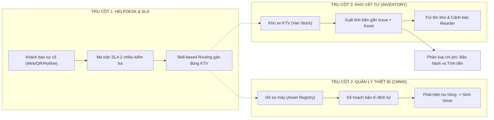
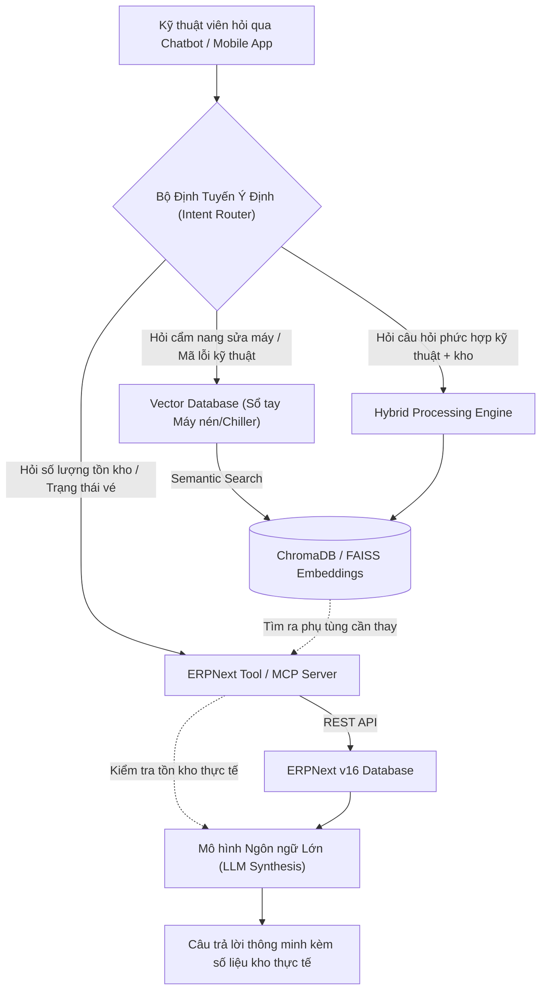

# CẨM NANG TOÀN DIỆN VÀ CHI TIẾT: GIẢI MÃ DỰ ÁN SMART HELPDESK & MAINTENANCE TRÊN NỀN TẢNG ERPNEXT
> **Tài liệu tham chiếu chuẩn mực (Master Reference Guide) từ A đến Z**  
> **Dành cho:** Thành viên dự án, Chuyên viên phân tích nghiệp vụ (BA), Lập trình viên, và Hội đồng đánh giá đồ án Hệ Thống Thông Tin.  
> **Dự án:** Triển khai Hệ thống Smart Helpdesk & Quản trị Bảo trì Công nghiệp (Field Service Management - FSM & MRO)  
> **Nền tảng công nghệ:** ERPNext v16 / Frappe Framework v16  
> **Đơn vị thực hiện:** Nhóm sinh viên DUT.K1N4  

---

## MỤC LỤC CHI TIẾT
1. [Chương 1: Nền tảng Triết lý ERP & Frappe Framework Dành Cho Người Mới Bắt Đầu](#chương-1-nền-tảng-triết-lý-erp--frappe-framework-dành-cho-người-mới-bắt-đầu)
2. [Chương 2: Bức tranh Doanh nghiệp & Danh mục Dữ liệu Chủ (Master Data Ecosystem)](#chương-2-bức-tranh-doanh-nghiệp--danh-mục-dữ-liệu-chủ-master-data-ecosystem)
3. [Chương 3: Ba Trụ Cột Chức Năng Cốt Lõi Của Dự Án (Core Domain Pillars)](#chương-3-ba-trụ-cột-chức-năng-cốt-lõi-của-dự-án-core-domain-pillars)
4. [Chương 4: Phân tích Chi tiết 8 Nỗi Đau Doanh Nghiệp Thực Tế (Comprehensive Pain Points)](#chương-4-phân-tích-chi-tiết-8-nỗi-đau-doanh-nghiệp-thực-tế-comprehensive-pain-points)
5. [Chương 5: Bản Phân Tích Đánh Đổi Kiến Trúc (Architecture Decision Records - ADR & Trade-Offs)](#chương-5-bản-phân-tích-đánh-đổi-kiến-trúc-architecture-decision-records---adr--trade-offs)
6. [Chương 6: Cẩm Nang Thao Tác Giao Diện Desk Từng Bước (Click-by-Click UI Walkthrough)](#chương-6-cẩm-nang-thao-tác-giao-diện-desk-từng-bước-click-by-click-ui-walkthrough)
7. [Chương 7: Đào Sâu Tối Ưu Hóa Kỹ Thuật & Đo Lường KPI Vận Hành (Deep-Dive & KPI Engine)](#chương-7-đào-sâu-tối-ưu-hóa-kỹ-thuật--đo-lường-kpi-vận-hành-deep-dive--kpi-engine)
8. [Chương 8: Thiết Kế Kiến Trúc Mở Rộng Pha Cuối Kỳ (AI Agent RAG & IoT Roadmap)](#chương-8-thiết-kế-kiến-trúc-mở-rộng-pha-cuối-kỳ-ai-agent-rag--iot-roadmap)

---

# CHƯƠNG 1: NỀN TẢNG TRIẾT LÝ ERP & FRAPPE FRAMEWORK DÀNH CHO NGƯỜI MỚI BẮT ĐẦU

## 1.1. Bản chất: Frappe Framework vs. ERPNext là gì?

Để không bị lạc lối giữa hàng nghìn chức năng, bạn cần phân biệt rõ ràng hai khái niệm thường bị đánh đồng:

```
┌────────────────────────────────────────────────────────────────────────────────────────┐
│                                     ERPNEXT v16                                        │
│  (Ứng dụng Quản trị Doanh nghiệp: Kế toán, Kho, Mua hàng, Bán hàng, Tài sản, Support)  │
└───────────────────────────────────────────┬────────────────────────────────────────────┘
                                            │ Chạy trên nền tảng
┌───────────────────────────────────────────▼────────────────────────────────────────────┐
│                                 FRAPPE FRAMEWORK v16                                   │
│ (Khung gầm Full-stack: DocType ORM, Giao diện Desk, Phân quyền, REST API, Client/Server)│
└───────────────────────────────────────────┬────────────────────────────────────────────┘
                                            │ Chạy trên hạ tầng
┌───────────────────────────────────────────▼────────────────────────────────────────────┐
│                          HẠ TẦNG CƠ SỞ DỮ LIỆU & DỊCH VỤ                               │
│            MariaDB 10.6+  |  Redis (Cache/Queue)  |  Python 3.11+  |  NodeJS            │
└────────────────────────────────────────────────────────────────────────────────────────┘
```

1. **Frappe Framework (Nền tảng / Khung gầm - Engine):**
   * Giống như hệ điều hành Android của điện thoại. Nó chưa có nghiệp vụ buôn bán hay sửa máy nào cả.
   * Frappe đảm nhiệm các bài toán kỹ thuật nền tảng:
     * **Cơ chế ORM (Object-Relational Mapping):** Tự động chuyển đổi các bảng CSDL quan hệ thành các đối tượng phần mềm gọi là **DocType**.
     * **Giao diện làm việc (Desk):** Tự động vẽ ra toàn bộ màn hình danh sách, form nhập liệu, biểu đồ, thanh tìm kiếm thông minh `Ctrl + K`.
     * **Bảo mật & Phân quyền:** Phân quyền theo vai trò (Role-based Access Control - RBAC) tới từng trường dữ liệu (Field-level permission).
     * **Tự động hóa:** Cung cấp Client Script (JavaScript chạy trên trình duyệt) và Server Script (Python chạy trên máy chủ).
2. **ERPNext (Ứng dụng Hoạch định Nguồn lực Doanh nghiệp):**
   * Là một phần mềm ERP mã nguồn mở hoàn chỉnh, được xây dựng hoàn toàn bằng Frappe Framework.
   * ERPNext cung cấp sẵn các phân hệ nghiệp vụ chuẩn quốc tế:
     * `Accounting`: Quản lý hệ thống tài khoản, sổ cái tổng hợp (General Ledger), công nợ phải thu/phải trả.
     * `Stock`: Quản lý danh mục vật tư, số dư kho tức thời, phiếu nhập/xuất/chuyển kho, định mức tồn an toàn.
     * `Assets`: Quản lý hồ sơ máy móc thiết bị, vị trí lắp đặt, kế hoạch bảo trì phòng ngừa.
     * `Support`: Tiếp nhận vé yêu cầu hỗ trợ (Ticket/Issue), đo lường cam kết thời gian dịch vụ (SLA).

## 1.2. Tại sao Doanh nghiệp chọn ERPNext thay vì tự lập trình Web App từ đầu?

| Tiêu chí | Tự Code Web App (Custom Development) | Triển khai trên Nền tảng ERPNext |
| :--- | :--- | :--- |
| **Cách tiếp cận** | Xây từng viên gạch trên bãi đất trống (NodeJS/React). | Mua một tòa nhà cao ốc xây sẵn, thiết lập phân vùng sử dụng. |
| **Tính liên kết dữ liệu** | **Dữ liệu phân mảnh (Silo):** Bảng `Tickets` lưu chữ "Đã thay 2 lọc dầu". Kho không hề biết mình bị mất 2 lọc dầu, kế toán không biết 1.300.000đ này đi về đâu. | **Khép kín xuyên suốt (Single Source of Truth):** Khi một phiếu xuất kho sửa chữa được tạo, kho tự trừ hàng, kế toán tự sinh bút toán sổ cái, máy móc tự lưu vết chi phí. |
| **Tính bất biến của sổ sách** | Lập trình viên có thể tùy tiện chạy lệnh `DELETE FROM issues` làm mất dấu vết gian lận. | **Nguyên tắc kế toán khắt khe:** Chứng từ sau khi đã ký duyệt (`Submit - docstatus=1`) là bất biến. Muốn sửa phải làm thủ tục Hủy (`Cancel`) và lưu vết kiểm toán (Audit Trail). |
| **Thời gian triển khai** | Mất từ 6 tháng đến 1 năm chỉ để làm các tính năng CRUD, phân quyền, đăng nhập, xuất PDF. | Có sẵn toàn bộ khung quản trị, tập trung 100% thời gian vào giải quyết bài toán nghiệp vụ của ngành. |

## 1.3. Bảng Thuật Ngữ Nền Tảng Trong Hệ Thống Frappe / ERPNext
* **DocType (Document Type):** Một thực thể dữ liệu trong Frappe. Ví dụ: `Issue` (Sự cố), `Asset` (Tài sản), `Stock Entry` (Phiếu kho). Mỗi DocType tương ứng với một bảng trong CSDL MariaDB (tên bảng có tiền tố `tab`, ví dụ `tabIssue`).
* **Child Table (Bảng con):** Bảng dữ liệu con gắn liền với một DocType cha. Ví dụ: Phiếu kho `Stock Entry` có bảng con `items` (`tabStock Entry Detail`) chứa danh sách từng linh kiện xuất kho.
* **Link Field (Trường liên kết):** Khóa ngoại (Foreign Key) trỏ tới một DocType khác. Ví dụ: trường `custom_asset` trên `Issue` trỏ tới DocType `Asset`.
* **Fetch From:** Cơ chế tự động kéo dữ liệu từ bảng cha sang bảng con. Ví dụ: Khi chọn `custom_asset`, hệ thống tự động kéo `asset_category` của máy đó sang trường `custom_asset_category` trên Issue.
* **DocStatus (Trạng thái vòng đời chứng từ):**
  * `0 = Draft` (Bản nháp): Được phép sửa, xóa thoải mái.
  * `1 = Submitted` (Đã ký duyệt): Đã tác động vào kho và sổ cái, không thể sửa đè.
  * `2 = Cancelled` (Đã hủy): Bị vô hiệu hóa nhưng vẫn lưu vết trong database.

---

# CHƯƠNG 2: BỨC TRANH DOANH NGHIỆP & DANH MỤC DỮ LIỆU CHỦ (MASTER DATA)

Dự án không sử dụng dữ liệu rác, mà được xây dựng trên một hệ sinh thái **Dữ liệu chủ (Master Data)** khép kín và có tính liên kết chặt chẽ:

```
┌────────────────────────────────────────────────────────────────────────────────────────┐
│                        PHÁP NHÂN DOANH NGHIỆP: SMARTHELPDESKBARO (SBN)                 │
│              Tên thương mại: Alpha Industrial Services (AIS) - Khu vực Đà Nẵng         │
└───────────────────────────────────────────┬────────────────────────────────────────────┘
                                            │
         ┌──────────────────────────────────┼──────────────────────────────────┐
         ▼                                  ▼                                  ▼
┌──────────────────┐               ┌──────────────────┐               ┌──────────────────┐
│   3 KHÁCH HÀNG   │               │ 3 KỸ THUẬT VIÊN  │               │ 3 NHÀ CUNG CẤP   │
│   • Tân Á (VIP)  │               │ • Nguyễn Văn An  │               │ • Kim Long (Khí) │
│   • Hải Nam (Std)│               │ • Trần Đình Bình │               │ • Minh Phát (Điện│
│   • Song Long(Std│               │ • Lê Hoàng Cường │               │ • Tiến Đạt (Bơm) │
└────────┬─────────┘               └────────┬─────────┘               └────────┬─────────┘
         │                                  │                                  │
         ▼                                  ▼                                  ▼
┌──────────────────┐               ┌──────────────────┐               ┌──────────────────┐
│    5 THIẾT BỊ    │               │  CÂY KHO 6 TẦNG  │               │   12 PHỤ TÙNG    │
│ • Máy nén Hitachi│               │ • Kho Trung Tâm  │               │ • Lọc dầu, lọc gió│
│ • Máy in Flexo   │               │ • 3 Kho Xe KTV   │               │ • Dầu máy nén    │
│ • Chiller Daikin │               │ • Kho Xe tổng    │               │ • Rơ le, Contactor│
│ • Máy phát Cummins│              │ • Kho thu hồi xác│               │ • Van tiết lưu...│
│ • Tủ điện MSB    │               └──────────────────┘               └──────────────────┘
└──────────────────┘
```

## 2.1. Danh mục 3 Khách Hàng Doanh Nghiệp (B2B Customers)
1. **Công ty CP Bao bì Tân Á (`Cong ty CP Bao bi Tan A`):** Phân hạng hợp đồng **VIP**. Sở hữu dây chuyền in công nghiệp và hệ thống khí nén công suất lớn. Yêu cầu khắt khe: thời gian phản hồi sự cố khẩn cấp dưới 30 phút.
2. **Xí nghiệp Dược Hải Nam (`Xi nghiep Duoc Hai Nam`):** Phân hạng hợp đồng **Standard**. Sở hữu hệ thống điều hòa Chiller phòng sạch và nguồn điện dự phòng.
3. **Công ty Nhựa & Cơ khí Song Long (`Cong ty Nhua & Co khi Song Long`):** Phân hạng hợp đồng **Standard**. Sở hữu trạm tủ điện phân phối tổng MSB và hệ thống máy ép nhựa.

## 2.2. Đội ngũ Kỹ thuật viên & Ma trận Năng lực Chuyên môn (Skill Matrix)
Mỗi kỹ thuật viên là một chuyên gia trong một hoặc nhiều lĩnh vực kỹ thuật cụ thể:

| Kỹ thuật viên | Tài khoản / Mã nhân viên | Chuyên môn kỹ thuật chính | Nhóm thiết bị phụ trách tương ứng |
| :--- | :--- | :--- | :--- |
| **Nguyễn Văn An** | `an.nguyen@smarthelpdesk.local`<br>(HR-EMP-00001) | **Cơ khí chính xác & Hệ thống khí nén** | • Máy nén khí trục vít (`Compressor`)<br>• Dây chuyền in công nghiệp (`Industrial Printing`) |
| **Trần Đình Bình** | `binh.tran@smarthelpdesk.local`<br>(HR-EMP-00002) | **Điện công nghiệp & Tự động hóa** | • Tủ điện phân phối tổng MSB (`Electrical Panel`)<br>• Máy phát điện dự phòng (`Generator`) |
| **Lê Hoàng Cường** | `cuong.le@smarthelpdesk.local`<br>(HR-EMP-00003) | **Nhiệt - Lạnh công nghiệp (HVAC)** | • Hệ thống Chiller giải nhiệt nước (`HVAC & Cooling`)<br>• Hỗ trợ vận hành máy phát điện (`Generator`) |

## 2.3. Danh mục 5 Thiết bị Trọng yếu & 1 Công cụ Đo lường
* `ACC-ASS-2026-00001`: **Máy in công nghiệp Flexo 6 màu** (Mã: `AST-PRN-01`, Vị trí: Xưởng In 1 - Tân Á, Giá trị định giá: 450.000.000đ).
* `ACC-ASS-2026-00002`: **Máy nén khí trục vít Hitachi 75kW** (Mã: `AST-CMP-02`, Vị trí: Phòng Máy Nén Khí - Tân Á, Giá trị: 280.000.000đ).
* `ACC-ASS-2026-00003`: **Hệ thống Chiller Daikin 100RT** (Mã: `AST-CHL-03`, Vị trí: Khu Kỹ Thuật Mái - Hải Nam, Giá trị: 650.000.000đ).
* `ACC-ASS-2026-00004`: **Máy phát điện Cummins 250kVA** (Mã: `AST-GEN-04`, Vị trí: Nhà Xe Trạm Điện - Hải Nam, Giá trị: 350.000.000đ).
* `ACC-ASS-2026-00005`: **Tủ điện tổng MSB 1200A** (Mã: `AST-PNL-05`, Vị trí: Phòng Điện Trung Tâm - Song Long, Giá trị: 180.000.000đ).
* `ACC-ASS-2026-00006`: **Máy đo rung công nghiệp SKF CMAS 100-SL** (Mã: `TOOL-VIB01`, Tài sản nội bộ của AIS dùng để đi kiểm định máy cho khách).

## 2.4. Cấu trúc Cây Kho Phụ Tùng Đa Tầng (Multi-tier Warehouses)
* **Kho Linh kiện Trung tâm - SBN:** Kho tổng tại trụ sở AIS, nơi tiếp nhận hàng từ nhà cung cấp và dự trữ an toàn.
* **Kho Xe Kỹ thuật Di động - SBN:** Kho trung chuyển nhóm xe lưu động.
* **Kho Xe - Nguyen Van An - SBN:** Kho di động trên xe bán tải của KTV An (An chịu trách nhiệm vật chất).
* **Kho Xe - Tran Dinh Binh - SBN:** Kho di động trên xe bán tải của KTV Bình.
* **Kho Xe - Le Hoang Cuong - SBN:** Kho di động trên xe bán tải của KTV Cường.
* **Kho Thu hồi Linh kiện Hỏng - SBN:** Kho phế liệu lưu giữ xác phụ tùng cũ hỏng tháo từ máy khách hàng mang về để kiểm định độc lập.

---

# CHƯƠNG 3: BA TRỤ CỘT CHỨC NĂNG CỐT LÕI CỦA DỰ ÁN (CORE DOMAIN PILLARS)

Hệ thống được thiết kế vững chắc dựa trên 3 trụ cột nghiệp vụ:



---

# CHƯƠNG 4: PHÂN TÍCH CHI TIẾT 8 NỖI ĐAU DOANH NGHIỆP THỰC TẾ (COMPREHENSIVE PAIN POINTS)

| Mã Nỗi Đau | Phân hệ Tác Động | Hiện Trạng Doanh Nghiệp Truyền Thống | Thiệt Hại Thực Tế | Giải Pháp Trong Hệ Thống ERPNext |
| :--- | :--- | :--- | :--- | :--- |
| **PP-01** | Helpdesk & Khách hàng | Khách báo hỏng qua Zalo/Gọi điện, dễ trôi tin nhắn. Dispatcher không kiểm soát được giờ cam kết SLA. | Khách VIP bị dừng máy 2 giờ, thiệt hại 200 triệu đồng. AIS bị phạt vi phạm hợp đồng và mất khách hàng. | **Ma trận SLA 2 chiều:** Phân biệt SLA VIP (30' phản hồi) vs Standard (1h phản hồi). Tự động đếm ngược giờ xử lý. |
| **PP-02** | Helpdesk & Điều phối | Giao việc theo lượt ngẫu nhiên (Round Robin mù). Sự cố cháy tủ điện giao cho thợ cơ khí; sự cố Chiller giao cho thợ điện. | KTV đến nơi không biết sửa, loay hoay mất cả buổi rồi phải gọi người khác đến cứu viện $\rightarrow$ Trễ hạn SLA. | **Skill-based Routing:** 3 quy tắc tự động tra cứu chuyên ngành thiết bị để chuyển thẳng vé đến đúng chuyên gia. |
| **PP-03** | Helpdesk & Kỹ thuật | Máy sửa xong 2-3 ngày sau lại hỏng đúng lỗi cũ (Sự cố tái phát). Công ty không nhận biết được, coi như vé mới. | Không quy được trách nhiệm KTV sửa ẩu lần trước. Không đo lường được tỷ lệ sửa dứt điểm lần đầu (FTFR). | **Trường Callback Reference:** Trường `custom_related_issue` nối ngược vé mới về vé cũ và bật cờ `custom_has_callback = 1`. |
| **PP-04** | Quản lý Thiết bị (CMMS) | Theo dõi lịch bảo trì ngăn ngừa trên file Excel. Nhân viên bận việc đột xuất làm quên lịch định kỳ. | Máy nén khí cạn dầu bôi trơn, kẹt trục vít, cháy động cơ $\rightarrow$ Chi phí sửa chữa đắt gấp 5 lần tiền bảo dưỡng. | **Asset Maintenance Plans:** Tự động sinh lịch bảo trì định kỳ 1 tháng, 3 tháng, 6 tháng và tạo sẵn các bản ghi kiểm tra. |
| **PP-05** | Quản lý Thiết bị (CMMS) | Thiết bị không có hồ sơ bệnh án. Ban giám đốc không biết 1 năm qua máy móc hỏng bao nhiêu lần, tốn bao nhiêu tiền. | Không có căn cứ số liệu để tư vấn cho khách hàng nên tiếp tục sửa chữa hay thay thế máy mới (TCO mờ mịt). | **Liên kết Issue $\leftrightarrow$ Asset:** Mọi phiếu xuất kho và sự cố đều gắn chặt mã máy, cho phép bóc tách chi phí sửa chữa theo từng tài sản. |
| **PP-06** | Kế toán & Pháp lý | Khai báo máy móc của khách hàng vào bảng `Asset` bị phần mềm tự động trích khấu hao hàng tháng vào sổ sách AIS. | Làm sai lệch Bảng cân đối kế toán và Báo cáo tài chính gửi cơ quan thuế $\rightarrow$ Vi phạm luật kế toán Việt Nam. | **Asset Accounting Isolation:** Khóa `calculate_depreciation = 0`, gắn cờ `custom_is_customer_equipment = 1` và gán chủ sở hữu `custom_customer`. |
| **PP-07** | Kho & Vận hành | KTV chạy xe 40km đến nhà máy khách mới biết thiếu linh kiện, lại phải chạy 40km về kho lấy đồ. KTV lấm lem dầu mỡ ngại gõ form máy tính. | Lãng phí gấp đôi chi phí xăng xe, công thợ (Truck-roll cost). KTV không cập nhật kịp thời báo cáo sửa chữa. | **Kho Xe KTV (Van Stock) & Tem QR Code:** KTV luôn có đồ sẵn trên xe. Tem QR dán trên máy giúp quét báo lỗi và bấm nút 1-chạm trên điện thoại. |
| **PP-08** | Kho & Vật tư | KTV mang linh kiện đi sửa, cuối tháng kho bị hụt hàng mà không ai nhận trách nhiệm. Nửa đêm kho hết sạch đồ thay. | Thất thoát hàng chục triệu tiền phụ tùng. Đứt gãy chuỗi cung ứng sửa chữa khẩn cấp. | **Cây kho đa tầng & Reorder Level:** Hàng chuyển lên xe nào KTV xe đó chịu trách nhiệm. Ngưỡng an toàn tự động cảnh báo khi tồn kho chạm đáy. |
| **PP-09** | Kế toán & Tài chính | Xuất 2 cái lọc dầu giá 1.300.000đ, thủ kho xuất bừa. Kế toán không biết ai chịu tiền khoản này. | Nhập nhèm dòng tiền: Công ty bị thất thoát doanh thu hoặc khách hàng bức xúc vì bị đòi tiền trong hạn bảo hành. | **Trường Billing Type:** Bắt buộc phân định trên phiếu xuất kho: `Under Warranty` (AIS chịu chi phí) hay `Billable to Customer` (Xuất hóa đơn thu tiền). |

---

# CHƯƠNG 5: BẢN PHÂN TÍCH ĐÁNH ĐỔI KIẾN TRÚC (ARCHITECTURE DECISION RECORDS - ADR & TRADE-OFFS)

Trong kỹ thuật phần mềm, mọi kiến trúc sư giải pháp đều phải thực hiện phân tích đánh đổi: **Được gì và Mất gì** cho từng quyết định kỹ thuật:

```
┌──────────────────────────────────────────────────────────────────────────────────────────────────┐
│                                 MA TRẬN ĐÁNH ĐỔI KIẾN TRÚC (ADR)                                 │
├──────────────────────────┬─────────────────────────────┬─────────────────────────────────────────┤
│ Quyết định Kỹ thuật      │ Cái ĐƯỢC lớn nhất (Ưu điểm) │ Cái MẤT lớn nhất (Nhược điểm / Đánh đổi)│
├──────────────────────────┼─────────────────────────────┼─────────────────────────────────────────┤
│ 1. Cách ly Kế toán Asset │ Dùng 100% module Bảo trì    │ Tên gọi `Asset` dễ gây nhầm với tài sản │
│    thay vì viết DocType  │ có sẵn của ERPNext          │ sở hữu nội bộ                           │
├──────────────────────────┼─────────────────────────────┼─────────────────────────────────────────┤
│ 2. Skill-based Routing   │ Đúng chuyên môn 100%,       │ Chưa tự động cân bằng tải công việc nếu │
│    thay vì Round Robin   │ cấu hình trực quan no-code  │ xảy ra dồn dập sự cố cùng một ngành     │
├──────────────────────────┼─────────────────────────────┼─────────────────────────────────────────┤
│ 3. Tem QR Code Web Form  │ Chi phí 0đ, không cần tải   │ Bắt buộc phải có kết nối mạng Internet  │
│    thay vì Native App    │ app, ai cũng quét được ngay │ (Online-only)                           │
├──────────────────────────┼─────────────────────────────┼─────────────────────────────────────────┤
│ 4. Mô hình Kho Xe KTV    │ Trách nhiệm vật chất rõ     │ Quy trình bị thêm 1 bước chứng từ       │
│    thay vì xuất Kho tổng │ ràng, tăng tỷ lệ sửa ngay   │ (Chuyển kho xe trước, Xuất máy sau)     │
├──────────────────────────┼─────────────────────────────┼─────────────────────────────────────────┤
│ 5. Cờ Billing Type       │ Xử lý sự cố nhanh nhất,     │ Phụ thuộc vào tính trung thực của người │
│    thay vì tách luồng Bán│ không làm trễ hạn SLA       │ chọn phân loại trên phiếu kho           │
└──────────────────────────┴─────────────────────────────┴─────────────────────────────────────────┘
```

### Chi tiết 5 Quyết Định Kiến Trúc:

#### 1. Quyết định về Quản lý Thiết bị Khách hàng:
* **Lựa chọn:** Dùng DocType `Asset` có sẵn của ERPNext, nhưng triệt tiêu toàn bộ tính năng khấu hao tài chính (`calculate_depreciation = 0`, `custom_is_customer_equipment = 1`, `custom_customer`).
* **Phương án thay thế:** Tự lập trình một DocType mới tên là `Customer Equipment`.
* **Lý do chọn:** Phân hệ `Asset Maintenance` của ERPNext được thiết kế gắn chặt với DocType `Asset`. Nếu tạo DocType mới, chúng ta sẽ phải tự lập trình lại từ đầu toàn bộ các tính năng tạo lịch bảo trì định kỳ, sinh log, phân công đội bảo trì. Bằng cách cách ly tài chính, chúng ta tận dụng 100% sức mạnh có sẵn mà vẫn triệt tiêu hoàn toàn rủi ro sai lệch thuế.

#### 2. Quyết định về Thuật toán Giao việc (Dispatching Engine):
* **Lựa chọn:** Bổ sung trường `custom_asset_category` trên Issue và cấu hình **3 Assignment Rules chuyên ngành riêng biệt** (Cơ khí $\rightarrow$ An, Điện $\rightarrow$ Bình, Lạnh $\rightarrow$ Cường).
* **Phương án thay thế:** Dùng Round Robin chia xoay vòng ngẫu nhiên, hoặc tự viết thuật toán định vị GPS phức tạp.
* **Lý do chọn:** Đối với dịch vụ bảo trì công nghiệp, **đúng chuyên môn (Skill-fit) là yếu tố sống còn**. Giao một việc phức tạp cho một người quá tải nhưng có chuyên môn vẫn tốt hơn nhiều so với giao cho một người rảnh rỗi nhưng không biết gì về điện để làm hỏng thêm máy.

#### 3. Quyết định về Công cụ Thao tác Hiện trường cho KTV:
* **Lựa chọn:** Sinh Tem mã QR Code động dán trên vỏ máy dẫn vào web form điền sẵn dữ liệu, kết hợp bộ nút bấm 1-chạm (`Client Script`) trên giao diện web di động.
* **Phương án thay thế:** Viết một ứng dụng di động riêng (Native App Flutter / React Native) và đẩy lên App Store / Google Play.
* **Lý do chọn:** Rào cản chuyển đổi số lớn nhất tại nhà xưởng là **người dùng ngại cài đặt thêm app**. Một chiếc tem dán sẵn trên vỏ máy nén khí, công nhân hoặc KTV chỉ cần giơ camera điện thoại quét là xong ngay, có tỷ lệ ứng dụng thành công cao gấp nhiều lần so với bắt họ tải ứng dụng 100MB.

#### 4. Quyết định về Kiến trúc Quản trị Vật tư (Van Stock):
* **Lựa chọn:** Thiết lập cây kho đa tầng gồm Kho Trung tâm và các Kho Xe di động của từng KTV. Quy trình 2 chặng: Chặng 1 chuyển hàng lên xe KTV (`Material Transfer`), Chặng 2 xuất hàng từ xe vào máy hỏng (`Material Issue`).
* **Phương án thay thế:** Chỉ dùng 1 Kho trung tâm duy nhất, KTV đi sửa tự lấy đồ rồi xuất thẳng từ kho tổng.
* **Lý do chọn:** Chặn đứng "lỗ hổng đen" thất thoát linh kiện lưu động trên đường. Khi linh kiện đã chuyển lên xe của KTV An, An phải chịu trách nhiệm vật chất. Đồng thời, KTV luôn có sẵn đồ trên xe giúp sửa dứt điểm sự cố ngay lần đầu (FTFR).

#### 5. Quyết định về Phân định Tài chính Chi phí:
* **Lựa chọn:** Bổ sung trường lựa chọn `custom_billing_type` ngay trên phiếu xuất kho `Stock Entry` (`Under Warranty` vs `Billable to Customer`).
* **Phương án thay thế:** Bắt buộc tách làm 2 quy trình: Hàng tính tiền thì phải đợi phòng kinh doanh làm Đơn bán hàng (`Sales Order`), kế toán duyệt rồi mới được mở kho.
* **Lý do chọn:** Nguyên tắc số 1 trong xử lý sự cố khẩn cấp: **Cứu dây chuyền sản xuất của nhà máy trước, thủ tục giấy tờ giải quyết sau.** Nếu bắt khách hàng đợi kế toán duyệt đơn hàng lúc 12h đêm thì sẽ vỡ hoàn toàn cam kết thời gian SLA.

---

# CHƯƠNG 6: CẨM NANG THAO TÁC GIAO DIỆN DESK TỪNG BƯỚC (CLICK-BY-CLICK UI WALKTHROUGH)

Hãy mở trình duyệt web tại địa chỉ: **`http://localhost:8080/desk`** và thực hiện theo 4 tour hướng dẫn sau:

## Tour 1: Quản trị Sự Cố & Kiểm Chứng Động Cơ Phân Bổ Chuyên Môn
1. Trên thanh tìm kiếm ở đỉnh màn hình (hoặc bấm tổ hợp phím **`Ctrl + K`**), gõ: **`Issue List`** $\rightarrow$ Bấm Enter.
2. Mặc định ERPNext chỉ hiện các vé đang mở (`Status = Open`). Hãy nhìn lên thanh lọc phía trên, bấm vào chữ **`Open`** và xóa đi (hoặc bấm nút **`Filter [X]`** bên phải) để hiển thị **toàn bộ 6 sự cố**.
3. **Quan sát cột vòng tròn chữ viết tắt ở mép phải ngoài cùng (Kết quả Skill-based Routing):**
   * Vé `ISS-2026-00004` (Sự cố tủ điện MSB): Có vòng tròn **`TD`** $\rightarrow$ Đã tự động gán cho **Trần Đình Bình** (Chuyên gia Điện công nghiệp).
   * Vé `ISS-2026-00001` (Sự cố máy nén khí Hitachi): Có vòng tròn **`NV`** $\rightarrow$ Đã tự động gán cho **Nguyễn Văn An** (Chuyên gia Cơ khí).
   * Vé `ISS-2026-00003` (Máy in Flexo bị sọc ngang): Có vòng tròn **`NV`** $\rightarrow$ Gán đúng cho **Nguyễn Văn An** (Cơ khí & chế tạo máy in).
   * Vé `ISS-2026-00005` (Hệ thống Chiller đông đá): Có vòng tròn **`LC`** $\rightarrow$ Đã tự động gán cho **Lê Hoàng Cường** (Chuyên gia Nhiệt Lạnh HVAC).
4. **Bấm chuột vào xem chi tiết vé `ISS-2026-00002`:**
   * Góc trên bên phải thanh tiêu đề: Xuất hiện nút màu xanh **`[ Bắt đầu xử lý (Check-in) ]`** $\rightarrow$ KTV bấm vào để lưu vết thời gian có mặt tại xưởng.
   * Nút menu **`[ Tác vụ hiện trường ]`** $\rightarrow$ Chọn **`[ Xuất linh kiện sửa ]`** để mở nhanh phiếu xuất kho.
   * Nút màu xanh lá **`[ Hoàn thành ca (Resolve) ]`** $\rightarrow$ KTV bấm vào để mở popup nghiệm thu, chọn nguyên nhân gốc (`Hardware Failure`) và đóng vé.

## Tour 2: Xem Tem Mã QR Code & Kiểm Tra Cách Ly Kế Toán Trên Máy Móc
1. Bấm **`Ctrl + K`**, gõ: **`Asset List`** $\rightarrow$ Bấm Enter.
2. Danh sách 5 thiết bị công nghiệp của khách hàng hiện ra. Bấm chuột vào máy **`ACC-ASS-2026-00002`** (Máy nén khí Hitachi 75kW).
3. **Quan sát các khu vực dữ liệu quan trọng:**
   * **Ngay đầu trang:** Bạn sẽ thấy **Hình ảnh Tem Mã QR Code** với dòng chữ nổi bật: *"QUÉT ĐỂ BÁO LỖI THIẾT BỊ NÀY"*.
   * **Khu vực thông tin sở hữu:**
     * Trường `Customer / Owner`: Hiển thị rõ ràng là **Công ty CP Bao bì Tân Á**.
     * Trường `Is Customer Equipment`: Được tích chọn cờ màu xanh $\rightarrow$ Khẳng định đây là thiết bị của khách hàng.
   * **Khu vực Khấu hao (Depreciation):** Kéo xuống dưới, ô `Calculate Depreciation` hoàn toàn **không được tích chọn** $\rightarrow$ Chứng minh hệ thống không trích một đồng khấu hao nào vào sổ sách của công ty AIS.

## Tour 3: Kiểm Tra Xuất Kho Phụ Tùng & Cảnh Báo Tồn Kho An Toàn
1. Bấm **`Ctrl + K`**, gõ: **`Stock Entry List`** $\rightarrow$ Bấm Enter.
2. Bấm vào phiếu xuất kho **`MAT-STE-2026-00002`** (Phiếu xuất 2 lọc dầu thay cho máy nén khí):
   * Quan sát trường `Billing Type`: Đang ghi nhận rõ ràng là **`Under Warranty`** (Bảo hành hợp đồng, AIS chịu chi phí).
   * Quan sát trường `Helpdesk Issue`: Liên kết chặt chẽ với vé `ISS-2026-00001`.
   * Quan sát trường `Technician`: Gắn đích danh chuyên viên thực hiện `an.nguyen@smarthelpdesk.local`.
3. Bấm **`Ctrl + K`**, gõ: **`Item List`** $\rightarrow$ Chọn lọc dầu **`PART-FLT-OIL01`**:
   * Kéo xuống bảng tồn kho theo từng kho: Số lượng thực tế tại `Kho Linh kien Trung tam - SBN` còn **2.0 cái**.
   * Trong khi ngưỡng an toàn (`Reorder Level`) cấu hình là **3.0 cái**.
   * Vì $2.0 < 3.0$, hệ thống tự động kích hoạt trạng thái báo động yêu cầu bộ phận thu mua đặt hàng bù đắp ngay lập tức.

## Tour 4: Kiểm Tra Lịch Bảo Trì Định Kỳ & Nhật Ký Phòng Ngừa
1. Bấm **`Ctrl + K`**, gõ: **`Asset Maintenance List`** $\rightarrow$ Bấm Enter.
2. Bạn sẽ thấy 3 kế hoạch bảo trì định kỳ đã được thiết lập cho Máy nén khí, Chiller và Tủ điện.
3. Bấm **`Ctrl + K`**, gõ: **`Asset Maintenance Log List`** $\rightarrow$ Bấm Enter:
   * Bạn sẽ thấy nhật ký bảo trì Chiller `ACC-AML-2026-00004` ghi nhận kết quả kiểm tra định kỳ đã phát hiện van tiết lưu hoạt động sai lệch và tự động dẫn truyền liên kết sang vé sự cố `ISS-2026-00005`.

---

# CHƯƠNG 7: ĐÀO SÂU TỐI ƯU HÓA KỸ THUẬT & ĐO LƯỜNG KPI VẬN HÀNH

Nếu muốn tiếp tục nâng cao chất lượng đề tài để đạt điểm tuyệt đối, hệ thống có thể đào sâu thêm 3 cơ chế:

## 7.1. Động Cơ Cảnh Báo Leo Thang Tiền Vi Phạm SLA (Reactive SLA Escalation)
* **Ý tưởng:** Viết một tiến trình ngầm (Scheduler Event) chạy định kỳ mỗi 15 phút.
* **Cơ chế hoạt động:** Quét toàn bộ các Issue đang mở (`status == 'Open'`). Nếu thời gian trôi qua đã vượt quá 50% thời hạn cam kết phản hồi (`response_by`) mà KTV vẫn chưa bấm nút `[Check-in]`:
  $\rightarrow$ Hệ thống tự động bắn một thông báo cảnh báo màu đỏ trực tiếp lên màn hình của Dispatcher (Điều phối viên) để gọi điện giục KTV, ngăn chặn sự cố bị trễ hạn trước khi nó xảy ra.

## 7.2. Quy Trình Vòng Đời Thu Hồi Xác Linh Kiện Cũ (Core Return Verification)
* **Ý tưởng:** Tránh tình trạng KTV khai khống linh kiện mới để tuồn ra ngoài bán trục lợi.
* **Cơ chế hoạt động:** Khi KTV xuất 2 cái lọc dầu mới từ kho xe ra thay thế, hệ thống tự động sinh một phiếu thu hồi yêu cầu KTV phải nộp 2 cái lọc dầu cũ hỏng về `Kho Thu hoi Linh kien Hong - SBN`. Thủ kho kiểm tra đúng xác linh kiện cũ mới ký duyệt đóng Ticket.

## 7.3. Bộ Chỉ Số Hiệu Suất Cốt Lõi Cần Báo Cáo (KPI Dashboard)
1. **SLA Compliance Rate (Tỷ lệ tuân thủ cam kết dịch vụ):**
   $$\text{SLA Compliance} = \frac{\text{Số vé xử lý đúng hạn (resolution\_date} \leq \text{resolution\_by)}}{\text{Tổng số vé đã đóng}} \times 100\%$$
   *(Mục tiêu chuẩn quốc tế: $\geq 95\%$)*
2. **First-Time Fix Rate - FTFR (Tỷ lệ sửa dứt điểm lần đầu):**
   $$\text{FTFR} = \frac{\text{Số vé hoàn thành không phát sinh ca Callback trong 7 ngày}}{\text{Tổng số vé sửa chữa}} \times 100\%$$
   *(Mục tiêu chuẩn quốc tế: $75\% - 85\%$)*
3. **Cost per Asset (Chi phí bảo trì trên từng máy):**
   $$\text{TCO per Asset} = \sum (\text{Giá trị xuất kho linh kiện}) + \sum (\text{Chi phí nhân công kỹ thuật})$$

---

# CHƯƠNG 8: THIẾT KẾ KIẾN TRÚC MỞ RỘNG PHA CUỐI KỲ (AI AGENT RAG & IOT ROADMAP)

Hệ thống được thiết kế với tính mở rất cao, sẵn sàng tích hợp các công nghệ thông minh trong pha cuối kỳ:



## 8.1. Chatbot Trợ Lý Kỹ Thuật AI Agent (RAG + Function Calling / MCP)
* **Kịch bản thực tế:** KTV Nguyễn Văn An đang đứng trước máy nén khí Hitachi tại xưởng Tân Á. Máy báo lỗi `E-04`. An mở điện thoại hỏi Chatbot:  
  *"Máy nén khí Hitachi đang báo lỗi E-04 thì nguyên nhân là gì, cách sửa ra sao và kho xe của tôi còn đồ thay không?"*
* **Cơ chế hoạt động:**
  1. **Bước 1 (Tra cứu RAG):** AI Agent tra cứu trong Vector Database chứa tài liệu kỹ thuật của Hitachi, tìm ra: *Lỗi E-04 là lỗi quá nhiệt do nghẹt lọc dầu bôi trơn, cần thay thế lọc dầu mã `PART-FLT-OIL01`.*
  2. **Bước 2 (Gọi Tool ERPNext):** AI Agent tự động kích hoạt Tool (giao thức MCP / REST API) truy vấn vào bảng `Bin` của ERPNext: *Kiểm tra tồn kho `PART-FLT-OIL01` tại `Kho Xe - Nguyen Van An - SBN`.*
  3. **Bước 3 (Tổng hợp câu trả lời):** Chatbot phản hồi:  
     *"Lỗi E-04 là do nhiệt độ dầu vượt ngưỡng 105°C vì nghẹt lọc dầu. Bạn cần tháo nắp bên hông máy để thay thế lọc dầu Hitachi. Hiện tại trên xe của bạn đang có sẵn 2 chiếc `PART-FLT-OIL01`. Bạn có muốn tôi tạo sẵn một phiếu xuất kho `Material Issue` không?"*

## 8.2. Cảm Biến IoT / SCADA & Bảo Trì Dự Đoán (Predictive Maintenance)
* Gắn cảm biến nhiệt độ và độ rung trực tiếp lên vòng bi và đầu nén của máy nén khí Hitachi.
* Khi nhiệt độ vượt quá 95°C liên tục trong 3 phút $\rightarrow$ Bộ điều khiển IoT tự động phát tín hiệu qua giao thức MQTT / Webhook gọi thẳng vào REST API của ERPNext:
  $\rightarrow$ **Tự động khởi tạo một Issue mức độ `Urgent`**, áp đặt SLA VIP 30 phút và điều phối ngay cho KTV An trước khi máy bị nổ hoặc bó kẹt trục vít.

## 8.3. Mở Rộng Quy Mô Đa Chi Nhánh (Multi-Site Scaling)
* Mở rộng mạng lưới phục vụ hàng trăm nhà máy từ Bắc vào Nam.
* Mỗi khu vực (Đà Nẵng, Bình Dương, Hải Phòng) được quản lý như một Cost Center (Trung tâm chi phí) độc lập với kho bãi và đội ngũ KTV riêng, nhưng số liệu tài chính vẫn hội tụ về một Tổng công ty AIS duy nhất.

---

*Tài liệu được biên soạn và chuẩn hóa bởi Nhóm dự án Smart Helpdesk & Maintenance — DUT.K1N4.*
