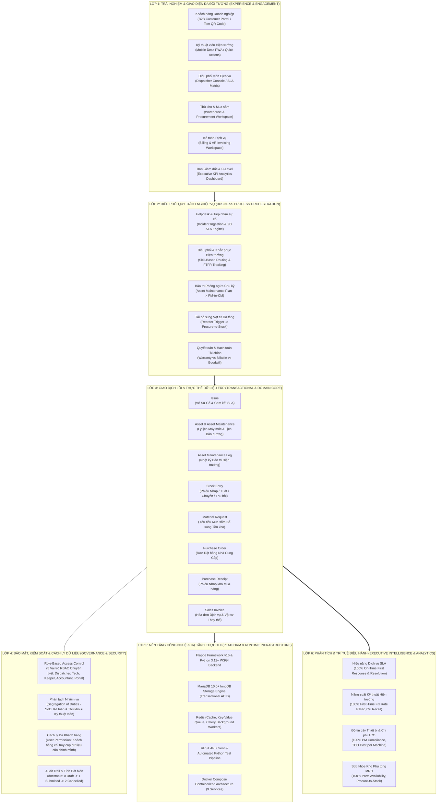
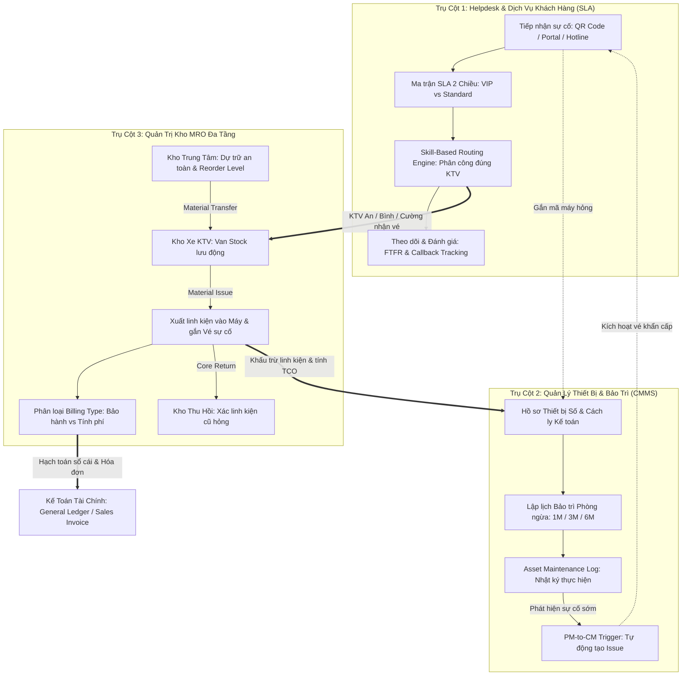
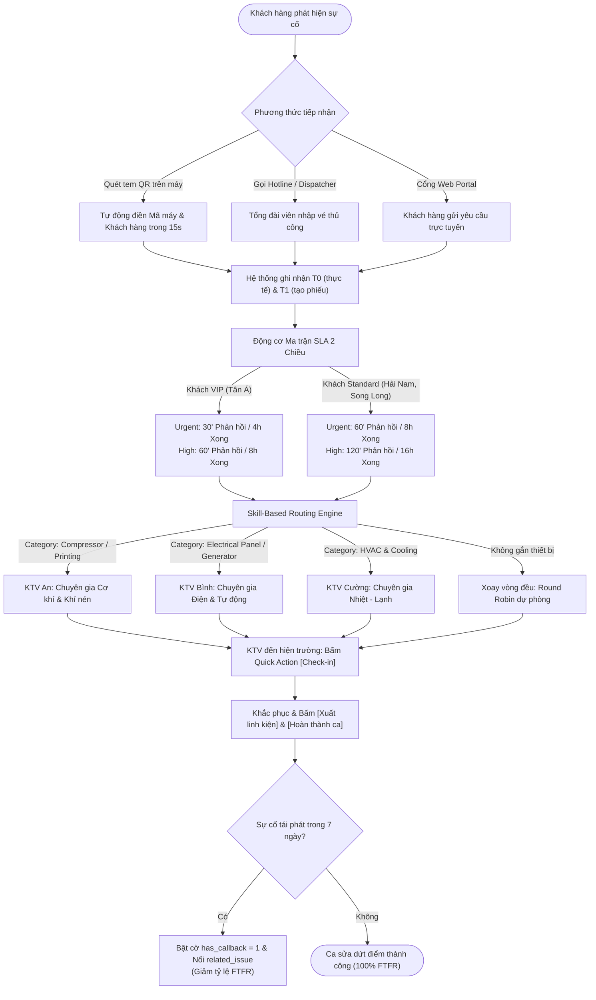
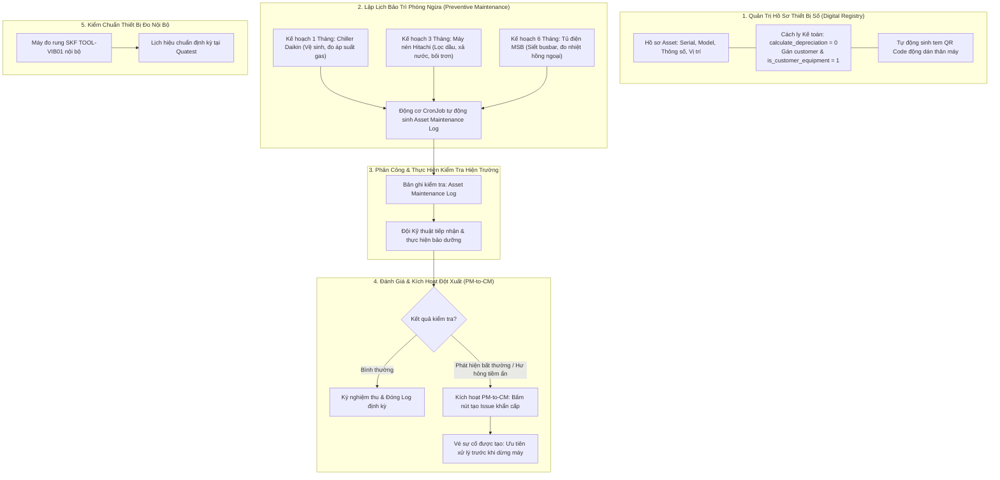
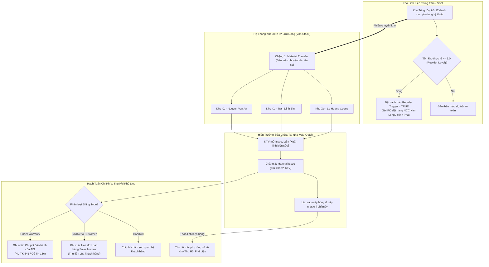
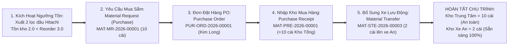
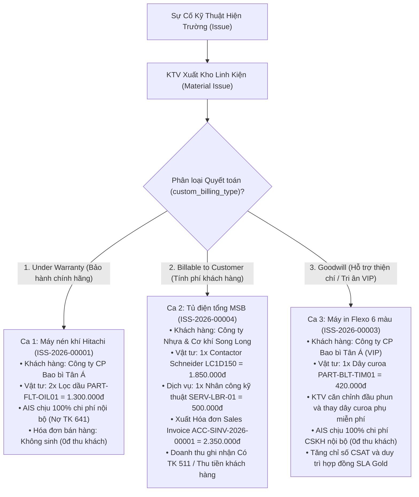
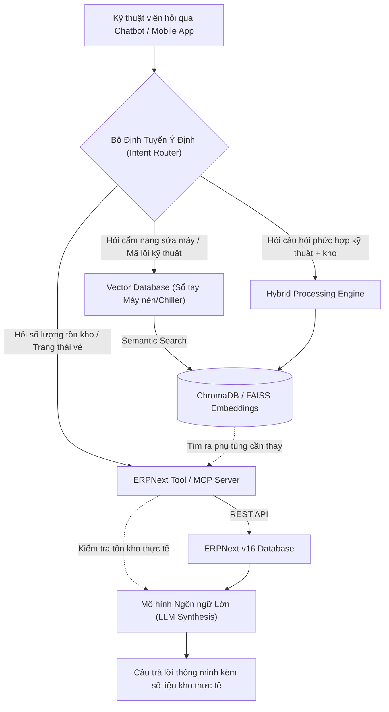

# CẨM NANG TOÀN DIỆN VÀ CHI TIẾT: GIẢI MÃ DỰ ÁN SMART HELPDESK & MAINTENANCE TRÊN NỀN TẢNG ERPNEXT
> **Tài liệu tham chiếu chuẩn mực (Master Reference Guide) từ A đến Z**  
> **Dành cho:** Thành viên dự án, Chuyên viên phân tích nghiệp vụ (BA), Lập trình viên, và Hội đồng đánh giá đồ án Hệ Thống Thông Tin.  
> **Dự án:** Triển khai Hệ thống Smart Helpdesk & Quản trị Bảo trì Công nghiệp (Field Service Management - FSM & MRO)  
> **Nền tảng công nghệ:** ERPNext v16 / Frappe Framework v16  
> **Đơn vị thực hiện:** Nhóm sinh viên DUT.K1N4  

---

## MỤC LỤC CHI TIẾT
1. [Chương 1: Nền tảng Triết lý ERP & Frappe Framework Dành Cho Người Mới Bắt Đầu](#chương-1-nền-tảng-triết-lý-erp--frappe-framework-dành-cho-người-mới-bắt-đầu)
2. [Chương 2: Bức tranh Doanh nghiệp & Danh mục Dữ liệu Chủ (Master Data Ecosystem)](#chương-2-bức-tranh-doanh-nghiệp--danh-mục-dữ-liệu-chủ-master-data-ecosystem)
3. [Chương 3: Năm Trụ Cột Nghiệp Vụ Doanh Nghiệp Cốt Lõi (Core Enterprise Domain Pillars)](#chương-3-năm-trụ-cột-nghiệp-vụ-doanh-nghiệp-cốt-lõi-core-enterprise-domain-pillars)
4. [Chương 4: Phân tích Chi tiết 8 Nỗi Đau Doanh Nghiệp Thực Tế (Comprehensive Pain Points)](#chương-4-phân-tích-chi-tiết-8-nỗi-đau-doanh-nghiệp-thực-tế-comprehensive-pain-points)
5. [Chương 5: Bản Phân Tích Đánh Đổi Kiến Trúc (Architecture Decision Records - ADR & Trade-Offs)](#chương-5-bản-phân-tích-đánh-đổi-kiến-trúc-architecture-decision-records---adr--trade-offs)
6. [Chương 6: Cẩm Nang Thao Tác Giao Diện Desk Từng Bước (Click-by-Click UI Walkthrough)](#chương-6-cẩm-nang-thao-tác-giao-diện-desk-từng-bước-click-by-click-ui-walkthrough)
7. [Chương 7: Đào Sâu Tối Ưu Hóa Kỹ Thuật & Đo Lường KPI Vận Hành (Deep-Dive & KPI Engine)](#chương-7-đào-sâu-tối-ưu-hóa-kỹ-thuật--đo-lường-kpi-vận-hành-deep-dive--kpi-engine)
8. [Chương 8: Thiết Kế Kiến Trúc Mở Rộng Pha Cuối Kỳ (AI Agent RAG & IoT Roadmap)](#chương-8-thiết-kế-kiến-trúc-mở-rộng-pha-cuối-kỳ-ai-agent-rag--iot-roadmap)

---

# CHƯƠNG 1: NỀN TẢNG TRIẾT LÝ ERP & FRAPPE FRAMEWORK DÀNH CHO NGƯỜI MỚI BẮT ĐẦU

## 1.1. Bản chất: Frappe Framework vs. ERPNext là gì?

Để không bị lạc lối giữa hàng nghìn chức năng, bạn cần phân biệt rõ ràng hai khái niệm thường bị đánh đồng:

```
┌────────────────────────────────────────────────────────────────────────────────────────┐
│                                     ERPNEXT v16                                        │
│  (Ứng dụng Quản trị Doanh nghiệp: Kế toán, Kho, Mua hàng, Bán hàng, Tài sản, Support)  │
└───────────────────────────────────────────┬────────────────────────────────────────────┘
                                            │ Chạy trên nền tảng
┌───────────────────────────────────────────▼────────────────────────────────────────────┐
│                                 FRAPPE FRAMEWORK v16                                   │
│ (Khung gầm Full-stack: DocType ORM, Giao diện Desk, Phân quyền, REST API, Client/Server)│
└───────────────────────────────────────────┬────────────────────────────────────────────┘
                                            │ Chạy trên hạ tầng
┌───────────────────────────────────────────▼────────────────────────────────────────────┐
│                          HẠ TẦNG CƠ SỞ DỮ LIỆU & DỊCH VỤ                               │
│            MariaDB 10.6+  |  Redis (Cache/Queue)  |  Python 3.11+  |  NodeJS            │
└────────────────────────────────────────────────────────────────────────────────────────┘
```

1. **Frappe Framework (Nền tảng / Khung gầm - Engine):**
   * Giống như hệ điều hành Android của điện thoại. Nó chưa có nghiệp vụ buôn bán hay sửa máy nào cả.
   * Frappe đảm nhiệm các bài toán kỹ thuật nền tảng:
     * **Cơ chế ORM (Object-Relational Mapping):** Tự động chuyển đổi các bảng CSDL quan hệ thành các đối tượng phần mềm gọi là **DocType**.
     * **Giao diện làm việc (Desk):** Tự động vẽ ra toàn bộ màn hình danh sách, form nhập liệu, biểu đồ, thanh tìm kiếm thông minh `Ctrl + K`.
     * **Bảo mật & Phân quyền:** Phân quyền theo vai trò (Role-based Access Control - RBAC) tới từng trường dữ liệu (Field-level permission).
     * **Tự động hóa:** Cung cấp Client Script (JavaScript chạy trên trình duyệt) và Server Script (Python chạy trên máy chủ).
2. **ERPNext (Ứng dụng Hoạch định Nguồn lực Doanh nghiệp):**
   * Là một phần mềm ERP mã nguồn mở hoàn chỉnh, được xây dựng hoàn toàn bằng Frappe Framework.
   * ERPNext cung cấp sẵn các phân hệ nghiệp vụ chuẩn quốc tế:
     * `Accounting`: Quản lý hệ thống tài khoản, sổ cái tổng hợp (General Ledger), công nợ phải thu/phải trả.
     * `Stock`: Quản lý danh mục vật tư, số dư kho tức thời, phiếu nhập/xuất/chuyển kho, định mức tồn an toàn.
     * `Assets`: Quản lý hồ sơ máy móc thiết bị, vị trí lắp đặt, kế hoạch bảo trì phòng ngừa.
     * `Support`: Tiếp nhận vé yêu cầu hỗ trợ (Ticket/Issue), đo lường cam kết thời gian dịch vụ (SLA).

## 1.2. Tại sao Doanh nghiệp chọn ERPNext thay vì tự lập trình Web App từ đầu?

| Tiêu chí | Tự Code Web App (Custom Development) | Triển khai trên Nền tảng ERPNext |
| :--- | :--- | :--- |
| **Cách tiếp cận** | Xây từng viên gạch trên bãi đất trống (NodeJS/React). | Mua một tòa nhà cao ốc xây sẵn, thiết lập phân vùng sử dụng. |
| **Tính liên kết dữ liệu** | **Dữ liệu phân mảnh (Silo):** Bảng `Tickets` lưu chữ "Đã thay 2 lọc dầu". Kho không hề biết mình bị mất 2 lọc dầu, kế toán không biết 1.300.000đ này đi về đâu. | **Khép kín xuyên suốt (Single Source of Truth):** Khi một phiếu xuất kho sửa chữa được tạo, kho tự trừ hàng, kế toán tự sinh bút toán sổ cái, máy móc tự lưu vết chi phí. |
| **Tính bất biến của sổ sách** | Lập trình viên có thể tùy tiện chạy lệnh `DELETE FROM issues` làm mất dấu vết gian lận. | **Nguyên tắc kế toán khắt khe:** Chứng từ sau khi đã ký duyệt (`Submit - docstatus=1`) là bất biến. Muốn sửa phải làm thủ tục Hủy (`Cancel`) và lưu vết kiểm toán (Audit Trail). |
| **Thời gian triển khai** | Mất từ 6 tháng đến 1 năm chỉ để làm các tính năng CRUD, phân quyền, đăng nhập, xuất PDF. | Có sẵn toàn bộ khung quản trị, tập trung 100% thời gian vào giải quyết bài toán nghiệp vụ của ngành. |

## 1.3. Bảng Thuật Ngữ Nền Tảng Trong Hệ Thống Frappe / ERPNext
* **DocType (Document Type):** Một thực thể dữ liệu trong Frappe. Ví dụ: `Issue` (Sự cố), `Asset` (Tài sản), `Stock Entry` (Phiếu kho). Mỗi DocType tương ứng với một bảng trong CSDL MariaDB (tên bảng có tiền tố `tab`, ví dụ `tabIssue`).
* **Child Table (Bảng con):** Bảng dữ liệu con gắn liền với một DocType cha. Ví dụ: Phiếu kho `Stock Entry` có bảng con `items` (`tabStock Entry Detail`) chứa danh sách từng linh kiện xuất kho.
* **Link Field (Trường liên kết):** Khóa ngoại (Foreign Key) trỏ tới một DocType khác. Ví dụ: trường `custom_asset` trên `Issue` trỏ tới DocType `Asset`.
* **Fetch From:** Cơ chế tự động kéo dữ liệu từ bảng cha sang bảng con. Ví dụ: Khi chọn `custom_asset`, hệ thống tự động kéo `asset_category` của máy đó sang trường `custom_asset_category` trên Issue.
* **DocStatus (Trạng thái vòng đời chứng từ):**
  * `0 = Draft` (Bản nháp): Được phép sửa, xóa thoải mái.
  * `1 = Submitted` (Đã ký duyệt): Đã tác động vào kho và sổ cái, không thể sửa đè.
  * `2 = Cancelled` (Đã hủy): Bị vô hiệu hóa nhưng vẫn lưu vết trong database.

## 1.4. Kiến Trúc Tổng Thể Doanh Nghiệp 6 Lớp (6-Layer Enterprise Architecture)

Để vận hành một hệ thống bảo trì công nghiệp và dịch vụ hiện trường (FSM & MRO) ở quy mô doanh nghiệp thực tế, kiến trúc phần mềm không thể chỉ là vài bảng cơ sở dữ liệu đơn lẻ. Hệ thống Smart Helpdesk & Maintenance được chuẩn hóa theo mô hình **Kiến trúc Doanh nghiệp 6 Lớp (6-Layer Enterprise Architecture)** chuẩn quốc tế:


```mermaid
flowchart TD
    subgraph L1["LỚP 1: TRẢI NGHIỆM & GIAO DIỆN ĐA ĐỐI TƯỢNG (EXPERIENCE & ENGAGEMENT)"]
        U1["Khách hàng Doanh nghiệp<br/>(B2B Customer Portal / Tem QR Code)"]
        U2["Kỹ thuật viên Hiện trường<br/>(Mobile Desk PWA / Quick Actions)"]
        U3["Điều phối viên Dịch vụ<br/>(Dispatcher Console / SLA Matrix)"]
        U4["Thủ kho & Mua sắm<br/>(Warehouse & Procurement Workspace)"]
        U5["Kế toán Dịch vụ<br/>(Billing & AR Invoicing Workspace)"]
        U6["Ban Giám đốc & C-Level<br/>(Executive KPI Analytics Dashboard)"]
    end

    subgraph L2["LỚP 2: ĐIỀU PHỐI QUY TRÌNH NGHIỆP VỤ (BUSINESS PROCESS ORCHESTRATION)"]
        BP1["Helpdesk & Tiếp nhận sự cố<br/>(Incident Ingestion & 2D SLA Engine)"]
        BP2["Điều phối & Khắc phục Hiện trường<br/>(Skill-Based Routing & FTFR Tracking)"]
        BP3["Bảo trì Phòng ngừa Chu kỳ<br/>(Asset Maintenance Plan -> PM-to-CM)"]
        BP4["Tái bổ sung Vật tư Đa tầng<br/>(Reorder Trigger -> Procure-to-Stock)"]
        BP5["Quyết toán & Hạch toán Tài chính<br/>(Warranty vs Billable vs Goodwill)"]
    end

    subgraph L3["LỚP 3: GIAO DỊCH LÕI & THỰC THỂ DỮ LIỆU ERP (TRANSACTIONAL & DOMAIN CORE)"]
        T_ISS["Issue<br/>(Vé Sự Cố & Cam kết SLA)"]
        T_AST["Asset & Asset Maintenance<br/>(Lý lịch Máy móc & Lịch Bảo dưỡng)"]
        T_AML["Asset Maintenance Log<br/>(Nhật ký Bảo trì Hiện trường)"]
        T_STE["Stock Entry<br/>(Phiếu Nhập / Xuất / Chuyển / Thu hồi)"]
        T_MR["Material Request<br/>(Yêu cầu Mua sắm Bổ sung Tồn kho)"]
        T_PO["Purchase Order<br/>(Đơn Đặt hàng Nhà Cung Cấp)"]
        T_PR["Purchase Receipt<br/>(Phiếu Nhập kho Mua hàng)"]
        T_SINV["Sales Invoice<br/>(Hóa đơn Dịch vụ & Vật tư Thay thế)"]
    end

    subgraph L4["LỚP 4: BẢO MẬT, KIỂM SOÁT & CÁCH LY DỮ LIỆU (GOVERNANCE & SECURITY)"]
        SEC1["Role-Based Access Control<br/>(5 Vai trò RBAC Chuyên biệt: Dispatcher, Tech, Keeper, Accountant, Portal)"]
        SEC2["Phân tách Nhiệm vụ<br/>(Segregation of Duties - SoD: Kế toán ≠ Thủ kho ≠ Kỹ thuật viên)"]
        SEC3["Cách ly Đa Khách hàng<br/>(User Permission: Khách hàng chỉ truy cập dữ liệu của chính mình)"]
        SEC4["Audit Trail & Tính Bất biến<br/>(docstatus: 0 Draft -> 1 Submitted -> 2 Cancelled)"]
    end

    subgraph L5["LỚP 5: NỀN TẢNG CÔNG NGHỆ & HẠ TẦNG THỰC THI (PLATFORM & RUNTIME INFRASTRUCTURE)"]
        INF1["Frappe Framework v16 & Python 3.11+ WSGI Backend"]
        INF2["MariaDB 10.6+ InnoDB Storage Engine (Transactional ACID)"]
        INF3["Redis (Cache, Key-Value Queue, Celery Background Workers)"]
        INF4["REST API Client & Automated Python Test Pipeline"]
        INF5["Docker Compose Containerized Architecture (9 Services)"]
    end

    subgraph L6["LỚP 6: PHÂN TÍCH & TRÍ TUỆ ĐIỀU HÀNH (EXECUTIVE INTELLIGENCE & ANALYTICS)"]
        KPI1["Hiệu năng Dịch vụ SLA<br/>(100% On-Time First Response & Resolution)"]
        KPI2["Năng suất Kỹ thuật Hiện trường<br/>(100% First-Time Fix Rate FTFR, 0% Recall)"]
        KPI3["Độ tin cậy Thiết bị & Chi phí TCO<br/>(100% PM Compliance, TCO Cost per Machine)"]
        KPI4["Sức khỏe Kho Phụ tùng MRO<br/>(100% Parts Availability, Procure-to-Stock)"]
    end

    L1 ==> L2
    L2 ==> L3
    L3 --- L4
    L3 ==> L5
    L3 ==> L6
```

### Chi tiết 6 Lớp Chức năng:
1. **Lớp 1 — Trải nghiệm & Giao tiếp Đa Đối tượng (Experience & Interface):** Cung cấp các giao diện chuyên biệt hóa theo đặc thù công việc: Khách hàng quét mã QR hoặc đăng nhập Portal; Kỹ thuật viên dùng giao diện Mobile Desk với các nút Quick Action 1-chạm; Điều phối viên dùng bảng điều khiển Dispatcher Console; Thủ kho, Kế toán và Ban Giám đốc có Workspace riêng.
2. **Lớp 2 — Điều phối Quy trình Nghiệp vụ (Business Process Orchestration):** Kết nối các luồng công việc liên phòng ban: từ tiếp nhận sự cố khẩn cấp, tự động định tuyến kỹ thuật viên theo chuyên môn (Skill-Based Routing), kích hoạt bảo trì phòng ngừa (PM-to-CM), tự động phát hiện thiếu hụt phụ tùng kích hoạt mua sắm, đến phân loại quyết toán tài chính 3 hướng.
3. **Lớp 3 — Giao dịch Lõi & Thực thể Dữ liệu ERP (Transactional & Domain Core):** Trung tâm xử lý dữ liệu với 8 chứng từ giao dịch cốt lõi của ERPNext (`Issue`, `Asset`, `Asset Maintenance Log`, `Stock Entry`, `Material Request`, `Purchase Order`, `Purchase Receipt`, `Sales Invoice`), đảm bảo tính toàn vẹn và nhất quán tuyệt đối của thông tin.
4. **Lớp 4 — Bảo mật, Kiểm soát & Cách ly Dữ liệu (Governance & Security):** Kiểm soát truy cập nghiêm ngặt thông qua ma trận 5 vai trò (RBAC), áp dụng nguyên tắc Phân tách nhiệm vụ (Segregation of Duties - SoD) để phòng chống gian lận, và thiết lập `User Permission` đảm bảo khách hàng này không bao giờ nhìn thấy sự cố hay thiết bị của khách hàng khác.
5. **Lớp 5 — Nền tảng Công nghệ & Hạ tầng Thực thi (Platform & Runtime):** Vận hành trên Frappe Framework v16, MariaDB 10.6 InnoDB, Redis Cache & Queue, được đóng gói hoàn chỉnh bằng Docker Compose với 9 container cô lập, hỗ trợ giao tiếp qua REST API chuẩn hóa.
6. **Lớp 6 — Phân tích & Trí tuệ Điều hành (Executive Intelligence & Analytics):** Khai thác dữ liệu thời gian thực từ Lớp 3 để tổng hợp 4 nhóm chỉ số KPI chiến lược (Service, Technician, Asset, MRO), cung cấp cho Ban Giám đốc cái nhìn toàn cảnh về hiệu quả hoạt động và tài chính dịch vụ.

---

# CHƯƠNG 2: BỨC TRANH DOANH NGHIỆP & DANH MỤC DỮ LIỆU CHỦ (MASTER DATA)

Dự án không sử dụng dữ liệu rác, mà được xây dựng trên một hệ sinh thái **Dữ liệu chủ (Master Data)** khép kín và có tính liên kết chặt chẽ:

```
┌────────────────────────────────────────────────────────────────────────────────────────┐
│                        PHÁP NHÂN DOANH NGHIỆP: SMARTHELPDESKBARO (SBN)                 │
│              Tên thương mại: Alpha Industrial Services (AIS) - Khu vực Đà Nẵng         │
└───────────────────────────────────────────┬────────────────────────────────────────────┘
                                            │
         ┌──────────────────────────────────┼──────────────────────────────────┐
         ▼                                  ▼                                  ▼
┌──────────────────┐               ┌──────────────────┐               ┌──────────────────┐
│   3 KHÁCH HÀNG   │               │ 3 KỸ THUẬT VIÊN  │               │ 3 NHÀ CUNG CẤP   │
│   • Tân Á (VIP)  │               │ • Nguyễn Văn An  │               │ • Kim Long (Khí) │
│   • Hải Nam (Std)│               │ • Trần Đình Bình │               │ • Minh Phát (Điện│
│   • Song Long(Std│               │ • Lê Hoàng Cường │               │ • Tiến Đạt (Bơm) │
└────────┬─────────┘               └────────┬─────────┘               └────────┬─────────┘
         │                                  │                                  │
         ▼                                  ▼                                  ▼
┌──────────────────┐               ┌──────────────────┐               ┌──────────────────┐
│    5 THIẾT BỊ    │               │  CÂY KHO 6 TẦNG  │               │   12 PHỤ TÙNG    │
│ • Máy nén Hitachi│               │ • Kho Trung Tâm  │               │ • Lọc dầu, lọc gió│
│ • Máy in Flexo   │               │ • 3 Kho Xe KTV   │               │ • Dầu máy nén    │
│ • Chiller Daikin │               │ • Kho Xe tổng    │               │ • Rơ le, Contactor│
│ • Máy phát Cummins│              │ • Kho thu hồi xác│               │ • Van tiết lưu...│
│ • Tủ điện MSB    │               └──────────────────┘               └──────────────────┘
└──────────────────┘
```

## 2.1. Danh mục 3 Khách Hàng Doanh Nghiệp (B2B Customers)
1. **Công ty CP Bao bì Tân Á (`Cong ty CP Bao bi Tan A`):** Phân hạng hợp đồng **VIP**. Sở hữu dây chuyền in công nghiệp và hệ thống khí nén công suất lớn. Yêu cầu khắt khe: thời gian phản hồi sự cố khẩn cấp dưới 30 phút.
2. **Xí nghiệp Dược Hải Nam (`Xi nghiep Duoc Hai Nam`):** Phân hạng hợp đồng **Standard**. Sở hữu hệ thống điều hòa Chiller phòng sạch và nguồn điện dự phòng.
3. **Công ty Nhựa & Cơ khí Song Long (`Cong ty Nhua & Co khi Song Long`):** Phân hạng hợp đồng **Standard**. Sở hữu trạm tủ điện phân phối tổng MSB và hệ thống máy ép nhựa.

## 2.2. Đội ngũ Kỹ thuật viên & Ma trận Năng lực Chuyên môn (Skill Matrix)
Mỗi kỹ thuật viên là một chuyên gia trong một hoặc nhiều lĩnh vực kỹ thuật cụ thể:

| Kỹ thuật viên | Tài khoản / Mã nhân viên | Chuyên môn kỹ thuật chính | Nhóm thiết bị phụ trách tương ứng |
| :--- | :--- | :--- | :--- |
| **Nguyễn Văn An** | `an.nguyen@smarthelpdesk.local`<br>(HR-EMP-00001) | **Cơ khí chính xác & Hệ thống khí nén** | • Máy nén khí trục vít (`Compressor`)<br>• Dây chuyền in công nghiệp (`Industrial Printing`) |
| **Trần Đình Bình** | `binh.tran@smarthelpdesk.local`<br>(HR-EMP-00002) | **Điện công nghiệp & Tự động hóa** | • Tủ điện phân phối tổng MSB (`Electrical Panel`)<br>• Máy phát điện dự phòng (`Generator`) |
| **Lê Hoàng Cường** | `cuong.le@smarthelpdesk.local`<br>(HR-EMP-00003) | **Nhiệt - Lạnh công nghiệp (HVAC)** | • Hệ thống Chiller giải nhiệt nước (`HVAC & Cooling`)<br>• Hỗ trợ vận hành máy phát điện (`Generator`) |

## 2.3. Danh mục 5 Thiết bị Trọng yếu & 1 Công cụ Đo lường
* `ACC-ASS-2026-00001`: **Máy in công nghiệp Flexo 6 màu** (Mã: `AST-PRN-01`, Vị trí: Xưởng In 1 - Tân Á, Giá trị định giá: 450.000.000đ).
* `ACC-ASS-2026-00002`: **Máy nén khí trục vít Hitachi 75kW** (Mã: `AST-CMP-02`, Vị trí: Phòng Máy Nén Khí - Tân Á, Giá trị: 280.000.000đ).
* `ACC-ASS-2026-00003`: **Hệ thống Chiller Daikin 100RT** (Mã: `AST-CHL-03`, Vị trí: Khu Kỹ Thuật Mái - Hải Nam, Giá trị: 650.000.000đ).
* `ACC-ASS-2026-00004`: **Máy phát điện Cummins 250kVA** (Mã: `AST-GEN-04`, Vị trí: Nhà Xe Trạm Điện - Hải Nam, Giá trị: 350.000.000đ).
* `ACC-ASS-2026-00005`: **Tủ điện tổng MSB 1200A** (Mã: `AST-PNL-05`, Vị trí: Phòng Điện Trung Tâm - Song Long, Giá trị: 180.000.000đ).
* `ACC-ASS-2026-00006`: **Máy đo rung công nghiệp SKF CMAS 100-SL** (Mã: `TOOL-VIB01`, Tài sản nội bộ của AIS dùng để đi kiểm định máy cho khách).

## 2.4. Cấu trúc Cây Kho Phụ Tùng Đa Tầng (Multi-tier Warehouses)
* **Kho Linh kiện Trung tâm - SBN:** Kho tổng tại trụ sở AIS, nơi tiếp nhận hàng từ nhà cung cấp và dự trữ an toàn.
* **Kho Xe Kỹ thuật Di động - SBN:** Kho trung chuyển nhóm xe lưu động.
* **Kho Xe - Nguyen Van An - SBN:** Kho di động trên xe bán tải của KTV An (An chịu trách nhiệm vật chất).
* **Kho Xe - Tran Dinh Binh - SBN:** Kho di động trên xe bán tải của KTV Bình.
* **Kho Xe - Le Hoang Cuong - SBN:** Kho di động trên xe bán tải của KTV Cường.
* **Kho Thu hồi Linh kiện Hỏng - SBN:** Kho phế liệu lưu giữ xác phụ tùng cũ hỏng tháo từ máy khách hàng mang về để kiểm định độc lập.

## 2.5. Ma Trận Phân Quyền Vai Trò & Phân Tách Nhiệm Vụ (Enterprise RBAC & Segregation of Duties - SoD)

Trong môi trường doanh nghiệp công nghiệp thực tế, một lỗ hổng nghiêm trọng của các phần mềm nghiệp vụ tự phát là việc thiếu cơ chế **Phân tách Nhiệm vụ (Segregation of Duties - SoD)**, dẫn tới nguy cơ thông đồng gian lận giữa kỹ thuật viên và thủ kho, hoặc thất thoát tài chính khi kỹ thuật viên tự định giá và thu tiền của khách hàng. Hệ thống Smart Helpdesk & Maintenance thiết lập 5 vai trò nghiệp vụ (Persona Roles) độc lập với phân quyền chi tiết tới từng chứng từ:

### Danh Sách 5 Vai Trò Nghiệp Vụ (Persona Roles) & Tài Khoản Mẫu:
1. **AIS Dispatcher (`dispatcher@smarthelpdesk.local`):** Chuyên viên tổng đài và điều phối dịch vụ. Tiếp nhận cuộc gọi/sự cố, đánh giá mức độ khẩn cấp, chỉ định kỹ thuật viên hoặc để hệ thống tự động điều phối theo chuyên môn, giám sát đồng hồ đếm ngược SLA.
2. **AIS Field Technician (`an.nguyen@smarthelpdesk.local`, `binh.tran`, `cuong.le`):** Kỹ thuật viên hiện trường. Nhận thông báo vé, đến nhà máy khách hàng bấm Check-in, lập phiếu xuất kho vật tư sửa chữa trên xe (`Material Issue`), và bấm hoàn thành ca.
3. **AIS Warehouse Keeper (`warehouse@smarthelpdesk.local`):** Thủ kho trung tâm. Chịu trách nhiệm duyệt các phiếu điều chuyển vật tư lên xe bán tải (`Material Transfer`), tiếp nhận hàng mua mới từ nhà cung cấp (`Purchase Receipt`), kiểm soát định mức an toàn.
4. **AIS Billing Accountant (`accountant@smarthelpdesk.local`):** Kế toán dịch vụ & công nợ. Chịu trách nhiệm kiểm tra các ca sửa chữa ngoài bảo hành (`Billable to Customer`), lập và phát hành Hóa đơn dịch vụ (`Sales Invoice`) bao gồm tiền phụ tùng và công thợ.
5. **AIS Customer Portal (`customer.tana@smarthelpdesk.local`):** Người phụ trách bảo trì phía khách hàng (ví dụ: Nhà máy Bao bì Tân Á). Có tài khoản cổng thông tin để gửi yêu cầu hỗ trợ, theo dõi tiến độ xử lý và nghiệm thu biên bản trực tuyến.

### Bảng Ma Trận Phân Quyền Chứng Từ (Custom DocPerm Matrix):

| Phân hệ / Chứng từ (DocType) | AIS Customer Portal | AIS Dispatcher | AIS Field Technician | AIS Warehouse Keeper | AIS Billing Accountant |
| :--- | :---: | :---: | :---: | :---: | :---: |
| **Issue (Vé sự cố)** | Xem / Tạo riêng | Xem / Sửa / Tạo | Xem / Cập nhật ca | Xem | Xem |
| **Stock Entry (Phiếu kho)** | ❌ Không quyền | Xem | Tạo / Ký xuất sửa | Xem / Sửa / Tạo / Ký | Xem |
| **Material Request (Yêu cầu mua sắm)** | ❌ Không quyền | ❌ Không quyền | ❌ Không quyền | Tạo / Ký đề xuất | Xem |
| **Purchase Order (Đơn mua hàng PO)** | ❌ Không quyền | ❌ Không quyền | ❌ Không quyền | Xem / Tạo | Xem |
| **Purchase Receipt (Phiếu nhập kho)** | ❌ Không quyền | ❌ Không quyền | ❌ Không quyền | Tạo / Ký nhập hàng | Xem |
| **Sales Invoice (Hóa đơn dịch vụ)** | ❌ Không quyền | ❌ Không quyền | ❌ Không quyền | ❌ Không quyền | Xem / Sửa / Tạo / Ký |

### Cơ Chế Bảo Vệ & Cách Ly Dữ Liệu:
* **Nguyên tắc Phân tách Nhiệm vụ (SoD):**
  * Kỹ thuật viên hiện trường **tuyệt đối không được cấp quyền** tạo Đơn mua hàng (`Purchase Order`) hay xuất Hóa đơn (`Sales Invoice`), triệt tiêu hoàn toàn khả năng kê khống giá phụ tùng hoặc tự ý thu tiền khách hàng.
  * Thủ kho **chỉ phụ trách dòng vật chất** (`Stock Entry`, `Purchase Receipt`), không được quyền can thiệp vào dòng tiền hay xóa sửa vé sự cố của khách hàng.
  * Kế toán **chỉ phụ trách dòng tiền** (`Sales Invoice`), không thể tự ý tạo phiếu xuất kho để tuồn hàng ra ngoài.
* **Cách ly Đa Khách Hàng Bằng Frappe `User Permission`:**
  * Tài khoản `customer.tana@smarthelpdesk.local` được gắn ràng buộc dữ liệu: `Customer = "Cong ty CP Bao bi Tan A"`.
  * Khi đăng nhập vào hệ thống, toàn bộ danh sách Ticket, Thiết bị hay Nhật ký bảo trì của các công ty khác (Dược Hải Nam, Nhựa Song Long) đều bị che giấu 100% ở tầng cơ sở dữ liệu (ORM Query Filter), bảo vệ bí mật kinh doanh tuyệt đối cho từng khách hàng.

---

# CHƯƠNG 3: NĂM TRỤ CỘT NGHIỆP VỤ DOANH NGHIỆP CỐT LÕI (CORE ENTERPRISE DOMAIN PILLARS)

Một hệ thống quản lý dịch vụ bảo trì công nghiệp hoàn chỉnh không thể chỉ dừng lại ở việc "sửa máy", mà bắt buộc phải vận hành như một cỗ máy hợp nhất gồm **5 Trụ cột Chức năng cốt lõi**: **Helpdesk & Quản trị SLA** $\leftrightarrow$ **Quản lý Thiết bị & Lập lịch Bảo dưỡng (CMMS)** $\leftrightarrow$ **Quản trị Kho Vật tư Đa tầng (MRO Inventory)** $\leftrightarrow$ **Chu trình Mua sắm & Tái bổ sung Khép kín (Procure-to-Stock)** $\leftrightarrow$ **Điểm chạm Tài chính & Hạch toán Doanh thu/Chi phí (Finance Touchpoints)**.


```mermaid
flowchart TD
    subgraph P1["Trụ Cột 1: Helpdesk & Dịch Vụ Khách Hàng (SLA)"]
        A1["Tiếp nhận sự cố: QR Code / Portal / Hotline"] --> A2["Ma trận SLA 2 Chiều: VIP vs Standard"]
        A2 --> A3["Skill-Based Routing Engine: Phân công đúng KTV"]
        A3 --> A4["Theo dõi & Đánh giá: FTFR & Callback Tracking"]
    end

    subgraph P2["Trụ Cột 2: Quản Lý Thiết Bị & Bảo Trì (CMMS)"]
        B1["Hồ sơ Thiết bị Số & Cách ly Kế toán"] --> B2["Lập lịch Bảo trì Phòng ngừa: 1M / 3M / 6M"]
        B2 --> B3["Asset Maintenance Log: Nhật ký thực hiện"]
        B3 --"Phát hiện sự cố sớm"--> B4["PM-to-CM Trigger: Tự động tạo Issue"]
    end

    subgraph P3["Trụ Cột 3: Quản Trị Kho MRO Đa Tầng"]
        C1["Kho Trung Tâm: Dự trữ an toàn & Reorder Level"] -->|Material Transfer| C2["Kho Xe KTV: Van Stock lưu động"]
        C2 -->|Material Issue| C3["Xuất linh kiện vào Máy & gắn Vé sự cố"]
        C3 --> C4["Phân loại Billing Type: Bảo hành vs Tính phí"]
        C3 -->|Core Return| C5["Kho Thu Hồi: Xác linh kiện cũ hỏng"]
    end

    %% Tương tác liên trụ cột
    A1 -.->|"Gắn mã máy hỏng"| B1
    B4 -.->|"Kích hoạt vé khẩn cấp"| A1
    A3 ==>|"KTV An / Bình / Cường nhận vé"| C2
    C3 ==>|"Khấu trừ linh kiện & tính TCO"| B1
    C4 ==>|"Hạch toán sổ cái & Hóa đơn"| ACC["Kế Toán Tài Chính: General Ledger / Sales Invoice"]
```

Dưới đây là đặc tả chi tiết từng trụ cột, cơ chế vận hành nội tại và cách thức chúng tương tác hữu cơ với nhau:

---

## 3.1. TRỤ CỘT 1: HELPDESK & QUẢN TRỊ CAM KẾT DỊCH VỤ (SERVICE DESK & SLA MANAGEMENT)

Trụ cột Helpdesk đóng vai trò là **"cửa ngõ tiếp nhận và điều phối duy nhất"** giữa khách hàng nhà máy và công ty AIS. Đây không đơn thuần là một hòm thư tiếp nhận sự cố, mà là một **động cơ kiểm soát cam kết dịch vụ theo chuẩn công nghiệp**:


```mermaid
flowchart TD
    Start(["Khách hàng phát hiện sự cố"]) --> Scan{"Phương thức tiếp nhận"}
    
    Scan -->|"Quét tem QR trên máy"| QR["Tự động điền Mã máy & Khách hàng trong 15s"]
    Scan -->|"Gọi Hotline / Dispatcher"| Hotline["Tổng đài viên nhập vé thủ công"]
    Scan -->|"Cổng Web Portal"| Portal["Khách hàng gửi yêu cầu trực tuyến"]
    
    QR --> Ingest["Hệ thống ghi nhận T0 (thực tế) & T1 (tạo phiếu)"]
    Hotline --> Ingest
    Portal --> Ingest
    
    Ingest --> SLA["Động cơ Ma trận SLA 2 Chiều"]
    SLA -->|"Khách VIP (Tân Á)"| SLA_VIP["Urgent: 30' Phản hồi / 4h Xong<br/>High: 60' Phản hồi / 8h Xong"]
    SLA -->|"Khách Standard (Hải Nam, Song Long)"| SLA_STD["Urgent: 60' Phản hồi / 8h Xong<br/>High: 120' Phản hồi / 16h Xong"]
    
    SLA_VIP --> Route["Skill-Based Routing Engine"]
    SLA_STD --> Route
    
    Route -->|"Category: Compressor / Printing"| An["KTV An: Chuyên gia Cơ khí & Khí nén"]
    Route -->|"Category: Electrical Panel / Generator"| Binh["KTV Bình: Chuyên gia Điện & Tự động"]
    Route -->|"Category: HVAC & Cooling"| Cuong["KTV Cường: Chuyên gia Nhiệt - Lạnh"]
    Route -->|"Không gắn thiết bị"| Fallback["Xoay vòng đều: Round Robin dự phòng"]
    
    An --> Exec["KTV đến hiện trường: Bấm Quick Action [Check-in]"]
    Binh --> Exec
    Cuong --> Exec
    Fallback --> Exec
    
    Exec --> Fix["Khắc phục & Bấm [Xuất linh kiện] & [Hoàn thành ca]"]
    Fix --> Audit{"Sự cố tái phát trong 7 ngày?"}
    Audit -->|"Có"| Callback["Bật cờ has_callback = 1 & Nối related_issue<br/>(Giảm tỷ lệ FTFR)"]
    Audit -->|"Không"| Success(["Ca sửa dứt điểm thành công (100% FTFR)"])
```

### 1. Cơ chế Tiếp nhận Sự cố Đa kênh (Multi-Channel Ingestion):
* **Cổng Web Portal & Hotline:** Cho phép người phụ trách bảo trì của khách hàng hoặc nhân viên tổng đài (Dispatcher) tạo yêu cầu.
* **Tem Quét Mã QR Code Hiện Trường:** Được in và dán trực tiếp lên vỏ từng chiếc máy nén khí, Chiller, tủ điện. Khi sự cố xảy ra, công nhân nhà máy chỉ cần giơ điện thoại quét mã QR $\rightarrow$ Hệ thống tự động mở form báo lỗi, tự động điền sẵn mã máy (`custom_asset`) và tên khách hàng (`customer`), người báo chỉ việc chọn hiện tượng lỗi và bấm gửi trong vòng 15 giây.
* **Phân biệt 2 Mốc Thời gian Quan trọng:**
  * Thời điểm khách báo sự cố thực tế ($T_0$ lưu tại `custom_incident_time`).
  * Thời điểm phiếu được tạo trên hệ thống ($T_1$ lưu tại `creation`).
  * Khoảng chênh lệch $\Delta T = T_1 - T_0$ phản ánh **Độ trễ tiếp nhận thông tin (Logging Latency)**, giúp ban giám đốc đo lường thời gian thông tin bị nghẽn trước khi vào phần mềm.

### 2. Động cơ Ma trận SLA 2 chiều (2D Service Level Agreement Engine):
ERPNext được cấu hình một ma trận cam kết thời gian dịch vụ nghiêm ngặt, kết hợp giữa **Hạng Hợp đồng Khách hàng** và **Mức độ Ưu tiên của Sự cố**:

| Mức độ Ưu tiên (Priority) | Khách hàng VIP (Bao bì Tân Á) | Khách hàng Standard (Hải Nam, Song Long) |
| :--- | :--- | :--- |
| **Urgent (Khẩn cấp — Dừng máy hoàn toàn)** | • Phản hồi: **$\leq$ 30 phút**<br>• Sửa xong: **$\leq$ 4 giờ** | • Phản hồi: **$\leq$ 60 phút**<br>• Sửa xong: **$\leq$ 8 giờ** |
| **High (Nghiêm trọng — Máy suy giảm tải)** | • Phản hồi: **$\leq$ 60 phút**<br>• Sửa xong: **$\leq$ 8 giờ** | • Phản hồi: **$\leq$ 120 phút**<br>• Sửa xong: **$\leq$ 16 giờ** |
| **Medium (Bình thường — Lỗi không dừng máy)** | • Phản hồi: **$\leq$ 2 giờ**<br>• Sửa xong: **$\leq$ 16 giờ** | • Phản hồi: **$\leq$ 4 giờ**<br>• Sửa xong: **$\leq$ 24 giờ** |
| **Low (Thấp — Tư vấn, kiểm tra định kỳ)** | • Phản hồi: **$\leq$ 4 giờ**<br>• Sửa xong: **$\leq$ 36 giờ** | • Phản hồi: **$\leq$ 8 giờ**<br>• Sửa xong: **$\leq$ 48 giờ** |

* Hệ thống tự động tính toán thời gian dựa trên **Lịch làm việc và Nghỉ lễ (`Holiday List`)**, đồng thời chạy đồng hồ đếm ngược trên từng vé. Nếu vượt quá các mốc thời gian trên, hệ thống sẽ tự động chuyển cờ `SLA Breached = True` để phục vụ tính toán phạt hợp đồng.

### 3. Động cơ Phân bổ Theo Chuyên Môn Kỹ Thuật (Skill-Based Routing Engine):
Thay vì sử dụng thuật toán chia đều xoay vòng ngẫu nhiên (Round Robin mù) làm cho thợ cơ khí bị giao nhầm sang sửa tủ điện, hệ thống tự động hóa luồng phân công dựa trên chuyên môn:
* Trường `custom_asset_category` trên Issue tự động lấy chuyên ngành của máy hỏng.
* Hệ thống áp dụng 3 quy tắc `Assignment Rule` chuyên ngành:
  * **Nhóm Cơ khí & Khí nén:** Hễ sự cố thuộc nhóm `Compressor` hoặc `Industrial Printing` $\rightarrow$ Tự động chuyển vé cho **Nguyễn Văn An**.
  * **Nhóm Điện & Tự động hóa:** Hễ sự cố thuộc nhóm `Electrical Panel` hoặc `Generator` $\rightarrow$ Tự động chuyển vé cho **Trần Đình Bình**.
  * **Nhóm Nhiệt - Lạnh HVAC:** Hễ sự cố thuộc nhóm `HVAC & Cooling` $\rightarrow$ Tự động chuyển vé cho **Lê Hoàng Cường**.
  * **Quy tắc Dự phòng (Fallback):** Nếu sự cố không gắn với máy nào $\rightarrow$ Mới xoay vòng đều cho cả 3 người.

### 4. Kiểm soát Chất lượng & Truy vết Tái phát (Callback Tracking):
* Nếu một thiết bị vừa sửa xong mà trong vòng 7 ngày lại phát sinh sự cố tương tự:
* Vé mới được gắn trường `custom_related_issue` trỏ về vé cũ, và vé cũ được tự động đánh dấu `custom_has_callback = 1`.
* Dữ liệu này giúp đo lường chỉ số **First-Time Fix Rate (FTFR - Tỷ lệ sửa dứt điểm lần đầu)** và ngăn chặn tình trạng KTV sửa ẩu hoặc thay phụ tùng kém chất lượng.

---

## 3.2. TRỤ CỘT 2: QUẢN LÝ THIẾT BỊ & BẢO TRÌ ĐỊNH KỲ (ASSET & MAINTENANCE MANAGEMENT - CMMS)

Trụ cột CMMS đóng vai trò là **"Trái tim kỹ thuật"** của hệ thống, quản lý toàn bộ hồ sơ lý lịch và vòng đời bảo dưỡng của từng máy móc trong nhà máy khách hàng:


```mermaid
flowchart TD
    subgraph Registry["1. Quản Trị Hồ Sơ Thiết Bị Số (Digital Registry)"]
        AssetDoc["Hồ sơ Asset: Serial, Model, Thông số, Vị trí"]
        ISO["Cách ly Kế toán: calculate_depreciation = 0<br/>Gán customer & is_customer_equipment = 1"]
        QRGen["Tự động sinh tem QR Code động dán thân máy"]
        AssetDoc --- ISO --- QRGen
    end

    subgraph PM["2. Lập Lịch Bảo Trì Phòng Ngừa (Preventive Maintenance)"]
        P1["Kế hoạch 1 Tháng: Chiller Daikin (Vệ sinh, đo áp suất gas)"]
        P2["Kế hoạch 3 Tháng: Máy nén Hitachi (Lọc dầu, xả nước, bôi trơn)"]
        P3["Kế hoạch 6 Tháng: Tủ điện MSB (Siết busbar, đo nhiệt hồng ngoại)"]
        AutoCron["Động cơ CronJob tự động sinh Asset Maintenance Log"]
        P1 & P2 & P3 --> AutoCron
    end

    subgraph Dispatch["3. Phân Công & Thực Hiện Kiểm Tra Hiện Trường"]
        LogDoc["Bản ghi kiểm tra: Asset Maintenance Log"]
        TechTeam["Đội Kỹ thuật tiếp nhận & thực hiện bảo dưỡng"]
        AutoCron --> LogDoc --> TechTeam
    end

    subgraph Evaluation["4. Đánh Giá & Kích Hoạt Đột Xuất (PM-to-CM)"]
        CheckResult{"Kết quả kiểm tra?"}
        TechTeam --> CheckResult
        CheckResult -->|"Bình thường"| ClosePM["Ký nghiệm thu & Đóng Log định kỳ"]
        CheckResult -->|"Phát hiện bất thường / Hư hỏng tiềm ẩn"| PM2CM["Kích hoạt PM-to-CM: Bấm nút tạo Issue khẩn cấp"]
        PM2CM --> AlertHelpdesk["Vé sự cố được tạo: Ưu tiên xử lý trước khi dừng máy"]
    end

    subgraph ToolMgt["5. Kiểm Chuẩn Thiết Bị Đo Nội Bộ"]
        Tools["Máy đo rung SKF TOOL-VIB01 nội bộ"] --> Calib["Lịch hiệu chuẩn định kỳ tại Quatest"]
    end
```

### 1. Hồ sơ Lý lịch Thiết bị Số (Digital Asset Registry):
* Mỗi cỗ máy công nghiệp được cấp một mã quản lý duy nhất (ví dụ: `ACC-ASS-2026-00002` cho Máy nén khí Hitachi).
* Hồ sơ lưu trữ: Số Serial chính hãng, Hãng sản xuất, Vị trí lắp đặt chi tiết tại xưởng (`Location`), Ngày đưa vào vận hành, và Danh mục phụ tùng thay thế tương thích.
* **Cơ chế Cách ly Kế toán Tài chính (Accounting Isolation):**
  * Thiết bị thuộc quyền sở hữu của **khách hàng**, không phải của công ty dịch vụ AIS.
  * Hệ thống áp dụng cấu hình triệt tiêu tính năng tài chính:
    * Khóa hoàn toàn tính năng khấu hao: `calculate_depreciation = 0`.
    * Toàn bộ danh mục thiết bị được đánh dấu: `non_depreciable_category = 1`.
    * Đánh dấu cờ phân biệt: `custom_is_customer_equipment = 1`.
    * Gán đích danh khách hàng sở hữu: `custom_customer = "Cong ty CP Bao bi Tan A"`.
  * *Kết quả:* Máy móc phục vụ đầy đủ công tác quản lý kỹ thuật nhưng **hoàn toàn sạch sẽ trên sổ sách kế toán thuế** của công ty AIS.

### 2. Kế hoạch Bảo trì Ngăn ngừa Định kỳ (Preventive Maintenance - PM Scheduling):
Hệ thống thiết lập sẵn 3 chương trình bảo dưỡng định kỳ tự động hóa:
* **Chương trình Bảo dưỡng Máy nén khí trục vít (Hitachi 75kW):** Định kỳ 3 tháng/lần (thay lọc dầu, kiểm tra nhiệt độ dầu làm mát, xả nước bình tích khí).
* **Chương trình Bảo dưỡng Hệ thống Chiller làm lạnh (Daikin 100RT):** Định kỳ 1 tháng/lần (vệ sinh bình ngưng, đo áp suất gas hút/nén, kiểm tra van tiết lưu Danfoss).
* **Chương trình Bảo dưỡng Trạm Tủ điện Tổng (MSB 1200A):** Định kỳ 6 tháng/lần (siết chặt thanh cái đồng busbar, kiểm tra độ nhạy Aptomat chống giật, đo nhiệt độ hồng ngoại các tiếp điểm).
* Định kỳ đến hạn, hệ thống tự động sinh ra các chứng từ `Asset Maintenance Log` và phân bổ cho Đội kỹ thuật (`Asset Maintenance Team`) mà không cần con người phải ghi nhớ bằng sổ tay.

### 3. Cơ chế Kích hoạt Sự cố Từ Bảo dưỡng (PM-to-CM Trigger):
* Trong quá trình đi kiểm tra định kỳ theo `Asset Maintenance Log`, nếu KTV phát hiện phụ tùng sắp hỏng hoặc thông số suy giảm (ví dụ: van tiết lưu bị đóng băng):
* KTV không sửa chui, mà hệ thống cung cấp nút bấm liên kết **kích hoạt ngay một vé sự cố đột xuất (`custom_issue`)** gắn chặt với nhật ký bảo trì định kỳ đó.
* Điều này giúp nhà máy chuyển từ trạng thái "chờ máy hỏng mới sửa" sang trạng thái **"phát hiện sớm trước khi máy dừng"**.

### 4. Quản lý Thiết bị Đo lường & Hiệu chuẩn Nội bộ (Tool Calibration):
* Hệ thống quản lý cả các công cụ đo kiểm tinh vi của riêng AIS (ví dụ: Máy đo rung SKF `TOOL-VIB01`).
* Thiết bị này được quản lý lịch hiệu chuẩn định kỳ tại các trung tâm kiểm định nhà nước (Quatest) để đảm bảo các biên bản nghiệm thu bàn giao cho khách hàng có giá trị pháp lý.

---

## 3.3. TRỤ CỘT 3: QUẢN TRỊ KHO VẬT TƯ PHỤ TÙNG ĐA TẦNG (MRO INVENTORY MANAGEMENT)

Trụ cột Kho đóng vai trò là **"Huyết mạch cung ứng vật chất"**, đảm bảo KTV không bao giờ bị thiếu phụ tùng khi đến hiện trường, đồng thời triệt tiêu hoàn toàn tình trạng thất thoát linh kiện:


```mermaid
flowchart TD
    subgraph Central["Kho Linh Kiện Trung Tâm - SBN"]
        MainStock["Kho Tổng: Dự trữ 12 danh mục phụ tùng kỹ thuật"]
        ReorderCheck{"Tồn kho thực tế <= 3.0 (Reorder Level)?"}
        MainStock --> ReorderCheck
        ReorderCheck -->|"Đúng"| ReorderAlert["Bật cảnh báo Reorder Trigger = TRUE<br/>Gửi PO đặt hàng NCC Kim Long / Minh Phát"]
        ReorderCheck -->|"Sai"| SafeStock["Đảm bảo mức dự trữ an toàn"]
    end

    subgraph MobileVan["Hệ Thống Kho Xe KTV Lưu Động (Van Stock)"]
        Transfer["Chặng 1: Material Transfer (Đầu tuần chuyển kho lên xe)"]
        VanAn["Kho Xe - Nguyen Van An"]
        VanBinh["Kho Xe - Tran Dinh Binh"]
        VanCuong["Kho Xe - Le Hoang Cuong"]
        MainStock ==>|Phiếu chuyển kho| Transfer
        Transfer --> VanAn & VanBinh & VanCuong
    end

    subgraph FieldWork["Hiện Trường Sửa Chữa Tại Nhà Máy Khách"]
        IssueTrigger["KTV mở Issue, bấm [Xuất linh kiện sửa]"]
        StockEntry["Chặng 2: Material Issue (Trừ kho xe KTV)"]
        VanAn & VanBinh & VanCuong --> IssueTrigger --> StockEntry
        StockEntry --> Mount["Lắp vào máy hỏng & cập nhật chi phí máy"]
    end

    subgraph BillingFinance["Hạch Toán Chi Phí & Thu Hồi Phế Liệu"]
        BillChoice{"Phân loại Billing Type?"}
        StockEntry --> BillChoice
        BillChoice -->|"Under Warranty"| WarrantyCost["Ghi nhận Chi phí Bảo hành của AIS<br/>(Nợ TK 641 / Có TK 156)"]
        BillChoice -->|"Billable to Customer"| SalesInv["Kết xuất Hóa đơn bán hàng Sales Invoice<br/>(Thu tiền của khách hàng)"]
        BillChoice -->|"Goodwill"| GoodwillCost["Chi phí chăm sóc quan hệ khách hàng"]
        
        Mount -->|Tháo linh kiện hỏng| CoreReturn["Thu hồi xác phụ tùng cũ về Kho Thu Hồi Phế Liệu"]
    end
```

### 1. Kiến trúc Cây Kho Đa tầng (Multi-tier Warehouses):
Hệ thống tổ chức mạng lưới kho bãi theo mô hình FSM chuẩn quốc tế:
* **Kho Linh kiện Trung tâm - SBN:** Kho tổng đặt tại xưởng dịch vụ, lưu trữ số lượng lớn 12 loại linh kiện kỹ thuật dự trữ an toàn.
* **Hệ thống Kho Xe KTV (Van Stock):** Gồm 3 kho con độc lập gắn liền với từng xe bán tải của KTV (`Kho Xe - Nguyen Van An`, `Kho Xe - Tran Dinh Binh`, `Kho Xe - Le Hoang Cuong`).
  * *Nguyên lý trách nhiệm vật chất:* Khi linh kiện rời kho trung tâm lên xe nào, KTV xe đó phải ký nhận điện tử và chịu trách nhiệm bảo quản nếu bị mất mát.
* **Kho Thu hồi Linh kiện Hỏng - SBN:** Kho phế liệu chuyên dụng để chứa xác linh kiện cũ tháo ra từ máy khách hàng mang về công ty nhập kho để phục vụ kiểm toán nội bộ.

### 2. Quy trình Lưu chuyển Vật tư Khép kín 2 Chặng:
* **Chặng 1 — Điều chuyển lên xe lưu động (`Material Transfer`):** Đầu mỗi tuần, KTV căn cứ vào kế hoạch bảo trì để làm phiếu đề xuất chuyển một số lượng linh kiện phổ biến (lọc dầu, rơ le, cầu chì) từ Kho Trung tâm lên Kho Xe của mình.
* **Chặng 2 — Xuất tiêu hao vào máy hỏng (`Material Issue`):** Khi đến nhà máy khách hàng sửa chữa, KTV bấm nút `[Xuất linh kiện sửa]` ngay trên form Issue. Hệ thống tự động tạo phiếu xuất kho trừ số dư trực tiếp tại Kho Xe của KTV đó và ghi nhận lịch sử vào đúng chiếc máy hỏng.

### 3. Định mức Tồn kho An toàn & Cảnh báo Đặt hàng lại Tự động (Safety Stock & Reorder Level):
* Toàn bộ 12 danh mục phụ tùng kỹ thuật (lọc dầu, lọc gió, dầu máy nén, rơ le nhiệt, contactor, van tiết lưu...) đều được cài đặt ngưỡng tồn kho an toàn (`reorder_level = 3.0 Nos`).
* **Cơ chế cảnh báo thời gian thực:**
  * Ban đầu, lọc dầu `PART-FLT-OIL01` có số lượng tồn là 4 cái.
  * Sau khi KTV An xuất 2 cái để thay cho máy nén khí Hitachi, tồn kho thực tế tại kho trung tâm tụt xuống **2.0 cái**.
  * Vì số tồn thực tế $2.0 < 3.0$ (Ngưỡng an toàn), hệ thống ERPNext lập tức kích hoạt trạng thái **`Reorder Trigger Condition = TRUE`** để thông báo cho phòng Mua hàng lập tức liên hệ nhà cung cấp Kim Long đặt thêm hàng bù đắp.

### 4. Động cơ Phân định Dòng tiền Thanh toán (Billing Classification Engine):
Để giải quyết triệt để tranh chấp giữa Kế toán và Khách hàng về việc *"Ai là người trả tiền phụ tùng?"*, trên phiếu xuất kho có trường bắt buộc `custom_billing_type`:
* **`Under Warranty` (Trong hạn bảo hành):** Dành cho sự cố nằm trong hợp đồng cam kết bảo trì $\rightarrow$ Hệ thống tự động ghi nhận giá trị xuất kho 1.300.000đ vào **Tài khoản Chi phí Bảo hành của AIS**, gắn vào Cost Center của hợp đồng Tân Á để cuối năm tính toán hợp đồng này lời hay lỗ.
* **`Billable to Customer` (Tính phí khách hàng):** Dành cho sự cố do công nhân nhà máy làm rơi vỡ hoặc vận hành sai quy trình $\rightarrow$ KTV chọn loại này, hệ thống sẽ cho phép kết xuất sang **Hóa đơn Bán hàng (`Sales Invoice`)** để phòng kế toán thu tiền của khách hàng.
* **`Goodwill` (Thiện chí công ty):** Miễn phí sửa chữa các lỗi nhỏ để giữ gìn mối quan hệ khách hàng.

---

## 3.4. TRỤ CỘT 4: CHU TRÌNH MUA HÀNG & TÁI BỔ SUNG TỒN KHO KHÉP KÍN (PROCURE-TO-STOCK & REORDER REPLENISHMENT)

Một điểm yếu chết người của các phần mềm Helpdesk độc lập là: khi kỹ thuật viên xuất linh kiện thay thế, tồn kho bị sụt giảm nhưng hệ thống không có khả năng tự động khởi phát chu trình mua sắm bổ sung. Hệ thống Smart Helpdesk & Maintenance tích hợp chu trình **Procure-to-Stock** khép kín 5 bước tự động hóa:


```mermaid
flowchart LR
    A["1. Kích Hoạt Ngưỡng Tồn:<br/>Xuất 2 lọc dầu Hitachi<br/>Tồn kho 2.0 < Reorder 3.0"] ==> B["2. Yêu Cầu Mua Sắm:<br/>Material Request (Purchase)<br/>MAT-MR-2026-00001 (10 cái)"]
    B ==> C["3. Đơn Đặt Hàng PO:<br/>Purchase Order<br/>PUR-ORD-2026-00001 (Kim Long)"]
    C ==> D["4. Nhập Kho Mua Hàng:<br/>Purchase Receipt<br/>MAT-PRE-2026-00001 (+10 cái Kho Tổng)"]
    D ==> E["5. Bổ Sung Xe Lưu Động:<br/>Material Transfer<br/>MAT-STE-2026-00003 (2 cái lên xe An)"]
    E ==> F["HOÀN TẤT CHU TRÌNH:<br/>Kho Trung Tâm = 10 cái (An toàn)<br/>Kho Xe An = 2 cái (Sẵn sàng 100%)"]
```

### Các Bước Thực Thi Thực Tế Đã Kiểm Chứng (Evidence Verification):
1. **Bước 1 — Phát hiện thiếu hụt tức thời (Reorder Level Breach):** Sau khi phiếu xuất kho `MAT-STE-2026-00002` xuất 2 bộ lọc dầu `PART-FLT-OIL01` cho sự cố `ISS-2026-00001`, tồn kho thực tế tại Kho Trung tâm giảm từ 4.0 xuống **2.0 cái**, vi phạm ngưỡng tối thiểu (`reorder_level = 3.0`). Điều kiện bổ sung tự động `Stock < Reorder` được kích hoạt.
2. **Bước 2 — Sinh Yêu cầu Mua sắm (`Material Request - Purchase`):** Hệ thống tự động tạo và submit phiếu `MAT-MR-2026-00001` yêu cầu mua bổ sung một lô 10 bộ lọc dầu vào Kho Trung tâm theo định mức lô tối ưu (`warehouse_reorder_qty = 10.0`).
3. **Bước 3 — Phát hành Đơn Mua Hàng (`Purchase Order - PO`):** Từ Material Request đã duyệt, hệ thống kết xuất Đơn mua hàng `PUR-ORD-2026-00001` gửi tới nhà cung cấp chiến lược **Công ty TNHH Thiết bị Khí nén Kim Long** với đơn giá 650.000đ/cái (Tổng giá trị: 6.500.000đ).
4. **Bước 4 — Tiếp nhận hàng vào Kho Trung tâm (`Purchase Receipt`):** Khi nhà cung cấp Kim Long giao hàng, thủ kho kiểm đếm và ký duyệt Phiếu nhập kho mua hàng `MAT-PRE-2026-00001`. Tồn kho thực tế tại Kho Trung tâm lập tức tăng vọt lên **10.0 cái**, giải tỏa triệt để trạng thái báo động tồn kho.
5. **Bước 5 — Tái nạp phụ tùng lên xe lưu động (`Material Transfer`):** Để đảm bảo xe bán tải của KTV Nguyễn Văn An luôn sẵn sàng ứng cứu sự cố kế tiếp, thủ kho thực hiện lệnh điều chuyển `MAT-STE-2026-00003` chuyển 2 bộ lọc từ Kho Trung tâm sang `Kho Xe - Nguyen Van An`. Kết thúc chu trình, KTV An sở hữu 2 bộ lọc sẵn sàng, Kho Trung tâm còn 10 bộ an toàn.

---

## 3.5. TRỤ CỘT 5: ĐIỂM CHẠM TÀI CHÍNH & 3 KỊCH BẢN QUYẾT TOÁN DỊCH VỤ (FINANCE TOUCHPOINTS & BILLING CLASSIFICATION)

Không phải mọi ca sửa chữa đều được xử lý tài chính giống nhau. Để phản ánh trung thực mô hình kinh doanh dịch vụ công nghiệp, hệ thống thiết lập **3 Kịch bản Quyết toán Tài chính Chuyên biệt** thông qua trường `custom_billing_type`:


```mermaid
flowchart TD
    Issue["Sự Cố Kỹ Thuật Hiện Trường (Issue)"] --> SE["KTV Xuất Kho Linh Kiện (Material Issue)"]
    SE --> BillType{"Phân loại Quyết toán (custom_billing_type)?"}
    
    BillType -->|"1. Under Warranty (Bảo hành chính hãng)"| Case1["Ca 1: Máy nén khí Hitachi (ISS-2026-00001)<br/>• Khách hàng: Công ty CP Bao bì Tân Á<br/>• Vật tư: 2x Lọc dầu PART-FLT-OIL01 = 1.300.000đ<br/>• AIS chịu 100% chi phí nội bộ (Nợ TK 641)<br/>• Hóa đơn bán hàng: Không sinh (0đ thu khách)"]
    
    BillType -->|"2. Billable to Customer (Tính phí khách hàng)"| Case2["Ca 2: Tủ điện tổng MSB (ISS-2026-00004)<br/>• Khách hàng: Công ty Nhựa & Cơ khí Song Long<br/>• Vật tư: 1x Contactor Schneider LC1D150 = 1.850.000đ<br/>• Dịch vụ: 1x Nhân công kỹ thuật SERV-LBR-01 = 500.000đ<br/>• Xuất Hóa đơn Sales Invoice ACC-SINV-2026-00001 = 2.350.000đ<br/>• Doanh thu ghi nhận Có TK 511 / Thu tiền khách hàng"]
    
    BillType -->|"3. Goodwill (Hỗ trợ thiện chí / Tri ân VIP)"| Case3["Ca 3: Máy in Flexo 6 màu (ISS-2026-00003)<br/>• Khách hàng: Công ty CP Bao bì Tân Á (VIP)<br/>• Vật tư: 1x Dây curoa PART-BLT-TIM01 = 420.000đ<br/>• KTV căn chỉnh đầu phun và thay dây curoa phụ miễn phí<br/>• AIS chịu 100% chi phí CSKH nội bộ (0đ thu khách)<br/>• Tăng chỉ số CSAT và duy trì hợp đồng SLA Gold"]
```

### Bảng Tổng Hợp Dòng Tiền & Bằng Chứng Hạch Toán Thực Tế:

| Tiêu Chí Phân Tích | Kịch Bản 1: Under Warranty | Kịch Bản 2: Billable to Customer | Kịch Bản 3: Goodwill (Thiện chí) |
| :--- | :--- | :--- | :--- |
| **Mã Sự Cố (Issue)** | `ISS-2026-00001` | `ISS-2026-00004` | `ISS-2026-00003` |
| **Khách Hàng** | Công ty CP Bao bì Tân Á | Công ty Nhựa & Cơ khí Song Long | Công ty CP Bao bì Tân Á |
| **Thiết Bị Gặp Sự Cố** | Máy nén khí Hitachi 75kW | Tủ điện tổng MSB 1200A | Máy in Flexo 6 màu |
| **Trạng Thái Bảo Hành** | `In Warranty` | `Out of Warranty` | `Goodwill` |
| **Phiếu Xuất Kho Vật Tư** | `MAT-STE-2026-00002` | `MAT-STE-2026-00004` | `MAT-STE-2026-00005` |
| **Linh Kiện Xuất Dùng** | 2x Lọc dầu `PART-FLT-OIL01` | 1x Contactor `PART-CNT-150A` | 1x Dây curoa `PART-BLT-TIM01` |
| **Phí Dịch Vụ Nhân Công** | 0đ (Bao gồm trong hợp đồng) | 500.000đ (`SERV-LBR-01`: 2 giờ công) | 0đ (Miễn phí tri ân) |
| **Hóa Đơn Thu Tiền** | ❌ Không xuất | ✅ `ACC-SINV-2026-00001` | ❌ Không xuất |
| **Chi Phí AIS Gánh Chịu** | **1.300.000đ** (Chi phí bảo hành) | **0đ** (Khách hàng chi trả) | **420.000đ** (Chi phí CSKH) |
| **Doanh Thu Thu Về** | **0đ** | **2.350.000đ** | **0đ** |

* **Tổng kết Dòng tiền Tài chính Dịch vụ:**
  * **Tổng chi phí nội bộ AIS gánh chịu:** $1.300.000đ + 420.000đ = \mathbf{1.720.000đ}$.
  * **Tổng doanh thu dịch vụ & phụ tùng thu từ khách hàng:** $\mathbf{2.350.000đ}$ (Hóa đơn `ACC-SINV-2026-00001`).

---

## 3.6. BẢNG MA TRẬN PHỐI HỢP LIÊN HOÀN GIỮA 5 TRỤ CỘT TRONG MỘT CA SỰ CỐ THỰC TẾ

Dưới đây là bảng theo dõi từng giây phút diễn biến của ca sự cố Máy nén khí Hitachi (`ISS-2026-00001`), minh chứng sự đồng bộ 100% giữa cả 5 trụ cột:

| Bước | Sự kiện Thực tế | Trụ cột 1: Helpdesk | Trụ cột 2: Thiết bị (CMMS) | Trụ cột 3: Kho (MRO) | Trụ cột 4: Mua hàng (Procurement) | Trụ cột 5: Tài chính (Finance) |
| :---: | :--- | :--- | :--- | :--- | :--- | :--- |
| **1** | Máy nén khí báo lỗi E-04 quá nhiệt lúc 08:30 | Quản đốc quét mã QR trên máy, Ticket được tạo với SLA VIP 30' | Mã máy `ACC-ASS-2026-00002` tự điền vào phiếu sự cố | Hệ thống kiểm tra số dư tồn kho linh kiện tương thích | Chưa phát sinh | Chưa phát sinh bút toán |
| **2** | Hệ thống điều phối vé lúc 08:31 | Đọc danh mục `Compressor`, tự động bắn vé cho KTV An | Cập nhật trạng thái máy: Đang gặp sự cố | Kho xe KTV An báo sẵn sàng có 2 lọc dầu trên xe | Chưa phát sinh | Chưa phát sinh bút toán |
| **3** | KTV An có mặt tại xưởng lúc 08:55 | An bấm nút `[Check-in]`, chuyển vé sang `In Progress` | Ghi nhận thời điểm KTV tiếp cận hiện trường | Giữ nguyên trạng thái vật tư trên xe | Chưa phát sinh | Chưa phát sinh bút toán |
| **4** | KTV An thay thế 2 lọc dầu Hitachi | An bấm `[Xuất linh kiện sửa]` từ form Issue | Ghi nhận máy được thay 2 lọc dầu `PART-FLT-OIL01` | Tạo phiếu `Stock Entry (Material Issue)` trừ 2 lọc từ Kho Xe An | Tồn kho tụt ngưỡng (2 < 3) kích hoạt Reorder Alert | Giảm giá trị tồn kho 1.300.000đ (Có TK 156) |
| **5** | Phân loại chi phí sửa chữa | Chọn `custom_warranty_status = In Warranty` | Lưu vết chi phí bảo hành tích lũy của máy | Phiếu kho ghi nhận nhãn `custom_billing_type = Under Warranty` | Tự động sinh Material Request `MAT-MR-2026-00001` | Tăng Chi phí bảo hành dịch vụ 1.300.000đ (Nợ TK 641) |
| **6** | Nghiệm thu và đóng ca lúc 10:45 | An bấm `[Hoàn thành ca]`, chọn nguyên nhân `Hardware Failure` | Máy chạy lại ổn định, chuyển trạng thái `Operational` | Tồn kho tổng được tái bổ sung sau PO và PR | Phát hành PO `PUR-ORD-2026-00001` tới NCC Kim Long | Kế toán chốt chi phí bảo hành 1.300.000đ, không xuất hóa đơn |

---

# CHƯƠNG 4: PHÂN TÍCH CHI TIẾT 8 NỖI ĐAU DOANH NGHIỆP THỰC TẾ (COMPREHENSIVE PAIN POINTS)

| Mã Nỗi Đau | Phân hệ Tác Động | Hiện Trạng Doanh Nghiệp Truyền Thống | Thiệt Hại Thực Tế | Giải Pháp Trong Hệ Thống ERPNext |
| :--- | :--- | :--- | :--- | :--- |
| **PP-01** | Helpdesk & Khách hàng | Khách báo hỏng qua Zalo/Gọi điện, dễ trôi tin nhắn. Dispatcher không kiểm soát được giờ cam kết SLA. | Khách VIP bị dừng máy 2 giờ, thiệt hại 200 triệu đồng. AIS bị phạt vi phạm hợp đồng và mất khách hàng. | **Ma trận SLA 2 chiều:** Phân biệt SLA VIP (30' phản hồi) vs Standard (1h phản hồi). Tự động đếm ngược giờ xử lý. |
| **PP-02** | Helpdesk & Điều phối | Giao việc theo lượt ngẫu nhiên (Round Robin mù). Sự cố cháy tủ điện giao cho thợ cơ khí; sự cố Chiller giao cho thợ điện. | KTV đến nơi không biết sửa, loay hoay mất cả buổi rồi phải gọi người khác đến cứu viện $\rightarrow$ Trễ hạn SLA. | **Skill-based Routing:** 3 quy tắc tự động tra cứu chuyên ngành thiết bị để chuyển thẳng vé đến đúng chuyên gia. |
| **PP-03** | Helpdesk & Kỹ thuật | Máy sửa xong 2-3 ngày sau lại hỏng đúng lỗi cũ (Sự cố tái phát). Công ty không nhận biết được, coi như vé mới. | Không quy được trách nhiệm KTV sửa ẩu lần trước. Không đo lường được tỷ lệ sửa dứt điểm lần đầu (FTFR). | **Trường Callback Reference:** Trường `custom_related_issue` nối ngược vé mới về vé cũ và bật cờ `custom_has_callback = 1`. |
| **PP-04** | Quản lý Thiết bị (CMMS) | Theo dõi lịch bảo trì ngăn ngừa trên file Excel. Nhân viên bận việc đột xuất làm quên lịch định kỳ. | Máy nén khí cạn dầu bôi trơn, kẹt trục vít, cháy động cơ $\rightarrow$ Chi phí sửa chữa đắt gấp 5 lần tiền bảo dưỡng. | **Asset Maintenance Plans:** Tự động sinh lịch bảo trì định kỳ 1 tháng, 3 tháng, 6 tháng và tạo sẵn các bản ghi kiểm tra. |
| **PP-05** | Quản lý Thiết bị (CMMS) | Thiết bị không có hồ sơ bệnh án. Ban giám đốc không biết 1 năm qua máy móc hỏng bao nhiêu lần, tốn bao nhiêu tiền. | Không có căn cứ số liệu để tư vấn cho khách hàng nên tiếp tục sửa chữa hay thay thế máy mới (TCO mờ mịt). | **Liên kết Issue $\leftrightarrow$ Asset:** Mọi phiếu xuất kho và sự cố đều gắn chặt mã máy, cho phép bóc tách chi phí sửa chữa theo từng tài sản. |
| **PP-06** | Kế toán & Pháp lý | Khai báo máy móc của khách hàng vào bảng `Asset` bị phần mềm tự động trích khấu hao hàng tháng vào sổ sách AIS. | Làm sai lệch Bảng cân đối kế toán và Báo cáo tài chính gửi cơ quan thuế $\rightarrow$ Vi phạm luật kế toán Việt Nam. | **Asset Accounting Isolation:** Khóa `calculate_depreciation = 0`, gắn cờ `custom_is_customer_equipment = 1` và gán chủ sở hữu `custom_customer`. |
| **PP-07** | Kho & Vận hành | KTV chạy xe 40km đến nhà máy khách mới biết thiếu linh kiện, lại phải chạy 40km về kho lấy đồ. KTV lấm lem dầu mỡ ngại gõ form máy tính. | Lãng phí gấp đôi chi phí xăng xe, công thợ (Truck-roll cost). KTV không cập nhật kịp thời báo cáo sửa chữa. | **Kho Xe KTV (Van Stock) & Tem QR Code:** KTV luôn có đồ sẵn trên xe. Tem QR dán trên máy giúp quét báo lỗi và bấm nút 1-chạm trên điện thoại. |
| **PP-08** | Kho & Vật tư | KTV mang linh kiện đi sửa, cuối tháng kho bị hụt hàng mà không ai nhận trách nhiệm. Nửa đêm kho hết sạch đồ thay. | Thất thoát hàng chục triệu tiền phụ tùng. Đứt gãy chuỗi cung ứng sửa chữa khẩn cấp. | **Cây kho đa tầng & Reorder Level:** Hàng chuyển lên xe nào KTV xe đó chịu trách nhiệm. Ngưỡng an toàn tự động cảnh báo khi tồn kho chạm đáy. |
| **PP-09** | Kế toán & Tài chính | Xuất 2 cái lọc dầu giá 1.300.000đ, thủ kho xuất bừa. Kế toán không biết ai chịu tiền khoản này. | Nhập nhèm dòng tiền: Công ty bị thất thoát doanh thu hoặc khách hàng bức xúc vì bị đòi tiền trong hạn bảo hành. | **Trường Billing Type:** Bắt buộc phân định trên phiếu xuất kho: `Under Warranty` (AIS chịu chi phí) hay `Billable to Customer` (Xuất hóa đơn thu tiền). |

---

# CHƯƠNG 5: BẢN PHÂN TÍCH ĐÁNH ĐỔI KIẾN TRÚC (ARCHITECTURE DECISION RECORDS - ADR & TRADE-OFFS)

Trong kỹ thuật phần mềm, mọi kiến trúc sư giải pháp đều phải thực hiện phân tích đánh đổi: **Được gì và Mất gì** cho từng quyết định kỹ thuật:

```
┌──────────────────────────────────────────────────────────────────────────────────────────────────┐
│                                 MA TRẬN ĐÁNH ĐỔI KIẾN TRÚC (ADR)                                 │
├──────────────────────────┬─────────────────────────────┬─────────────────────────────────────────┤
│ Quyết định Kỹ thuật      │ Cái ĐƯỢC lớn nhất (Ưu điểm) │ Cái MẤT lớn nhất (Nhược điểm / Đánh đổi)│
├──────────────────────────┼─────────────────────────────┼─────────────────────────────────────────┤
│ 1. Cách ly Kế toán Asset │ Dùng 100% module Bảo trì    │ Tên gọi `Asset` dễ gây nhầm với tài sản │
│    thay vì viết DocType  │ có sẵn của ERPNext          │ sở hữu nội bộ                           │
├──────────────────────────┼─────────────────────────────┼─────────────────────────────────────────┤
│ 2. Skill-based Routing   │ Đúng chuyên môn 100%,       │ Chưa tự động cân bằng tải công việc nếu │
│    thay vì Round Robin   │ cấu hình trực quan no-code  │ xảy ra dồn dập sự cố cùng một ngành     │
├──────────────────────────┼─────────────────────────────┼─────────────────────────────────────────┤
│ 3. Tem QR Code Web Form  │ Chi phí 0đ, không cần tải   │ Bắt buộc phải có kết nối mạng Internet  │
│    thay vì Native App    │ app, ai cũng quét được ngay │ (Online-only)                           │
├──────────────────────────┼─────────────────────────────┼─────────────────────────────────────────┤
│ 4. Mô hình Kho Xe KTV    │ Trách nhiệm vật chất rõ     │ Quy trình bị thêm 1 bước chứng từ       │
│    thay vì xuất Kho tổng │ ràng, tăng tỷ lệ sửa ngay   │ (Chuyển kho xe trước, Xuất máy sau)     │
├──────────────────────────┼─────────────────────────────┼─────────────────────────────────────────┤
│ 5. Cờ Billing Type       │ Xử lý sự cố nhanh nhất,     │ Phụ thuộc vào tính trung thực của người │
│    thay vì tách luồng Bán│ không làm trễ hạn SLA       │ chọn phân loại trên phiếu kho           │
└──────────────────────────┴─────────────────────────────┴─────────────────────────────────────────┘
```

### Chi tiết 5 Quyết Định Kiến Trúc:

#### 1. Quyết định về Quản lý Thiết bị Khách hàng:
* **Lựa chọn:** Dùng DocType `Asset` có sẵn của ERPNext, nhưng triệt tiêu toàn bộ tính năng khấu hao tài chính (`calculate_depreciation = 0`, `custom_is_customer_equipment = 1`, `custom_customer`).
* **Phương án thay thế:** Tự lập trình một DocType mới tên là `Customer Equipment`.
* **Lý do chọn:** Phân hệ `Asset Maintenance` của ERPNext được thiết kế gắn chặt với DocType `Asset`. Nếu tạo DocType mới, chúng ta sẽ phải tự lập trình lại từ đầu toàn bộ các tính năng tạo lịch bảo trì định kỳ, sinh log, phân công đội bảo trì. Bằng cách cách ly tài chính, chúng ta tận dụng 100% sức mạnh có sẵn mà vẫn triệt tiêu hoàn toàn rủi ro sai lệch thuế.

#### 2. Quyết định về Thuật toán Giao việc (Dispatching Engine):
* **Lựa chọn:** Bổ sung trường `custom_asset_category` trên Issue và cấu hình **3 Assignment Rules chuyên ngành riêng biệt** (Cơ khí $\rightarrow$ An, Điện $\rightarrow$ Bình, Lạnh $\rightarrow$ Cường).
* **Phương án thay thế:** Dùng Round Robin chia xoay vòng ngẫu nhiên, hoặc tự viết thuật toán định vị GPS phức tạp.
* **Lý do chọn:** Đối với dịch vụ bảo trì công nghiệp, **đúng chuyên môn (Skill-fit) là yếu tố sống còn**. Giao một việc phức tạp cho một người quá tải nhưng có chuyên môn vẫn tốt hơn nhiều so với giao cho một người rảnh rỗi nhưng không biết gì về điện để làm hỏng thêm máy.

#### 3. Quyết định về Công cụ Thao tác Hiện trường cho KTV:
* **Lựa chọn:** Sinh Tem mã QR Code động dán trên vỏ máy dẫn vào web form điền sẵn dữ liệu, kết hợp bộ nút bấm 1-chạm (`Client Script`) trên giao diện web di động.
* **Phương án thay thế:** Viết một ứng dụng di động riêng (Native App Flutter / React Native) và đẩy lên App Store / Google Play.
* **Lý do chọn:** Rào cản chuyển đổi số lớn nhất tại nhà xưởng là **người dùng ngại cài đặt thêm app**. Một chiếc tem dán sẵn trên vỏ máy nén khí, công nhân hoặc KTV chỉ cần giơ camera điện thoại quét là xong ngay, có tỷ lệ ứng dụng thành công cao gấp nhiều lần so với bắt họ tải ứng dụng 100MB.

#### 4. Quyết định về Kiến trúc Quản trị Vật tư (Van Stock):
* **Lựa chọn:** Thiết lập cây kho đa tầng gồm Kho Trung tâm và các Kho Xe di động của từng KTV. Quy trình 2 chặng: Chặng 1 chuyển hàng lên xe KTV (`Material Transfer`), Chặng 2 xuất hàng từ xe vào máy hỏng (`Material Issue`).
* **Phương án thay thế:** Chỉ dùng 1 Kho trung tâm duy nhất, KTV đi sửa tự lấy đồ rồi xuất thẳng từ kho tổng.
* **Lý do chọn:** Chặn đứng "lỗ hổng đen" thất thoát linh kiện lưu động trên đường. Khi linh kiện đã chuyển lên xe của KTV An, An phải chịu trách nhiệm vật chất. Đồng thời, KTV luôn có sẵn đồ trên xe giúp sửa dứt điểm sự cố ngay lần đầu (FTFR).

#### 5. Quyết định về Phân định Tài chính Chi phí:
* **Lựa chọn:** Bổ sung trường lựa chọn `custom_billing_type` ngay trên phiếu xuất kho `Stock Entry` (`Under Warranty` vs `Billable to Customer`).
* **Phương án thay thế:** Bắt buộc tách làm 2 quy trình: Hàng tính tiền thì phải đợi phòng kinh doanh làm Đơn bán hàng (`Sales Order`), kế toán duyệt rồi mới được mở kho.
* **Lý do chọn:** Nguyên tắc số 1 trong xử lý sự cố khẩn cấp: **Cứu dây chuyền sản xuất của nhà máy trước, thủ tục giấy tờ giải quyết sau.** Nếu bắt khách hàng đợi kế toán duyệt đơn hàng lúc 12h đêm thì sẽ vỡ hoàn toàn cam kết thời gian SLA.

---

# CHƯƠNG 6: CẨM NANG THAO TÁC GIAO DIỆN DESK TỪNG BƯỚC (CLICK-BY-CLICK UI WALKTHROUGH)

Hãy mở trình duyệt web tại địa chỉ: **`http://localhost:8080/desk`** và thực hiện theo 4 tour hướng dẫn sau:

## Tour 1: Quản trị Sự Cố & Kiểm Chứng Động Cơ Phân Bổ Chuyên Môn
1. Trên thanh tìm kiếm ở đỉnh màn hình (hoặc bấm tổ hợp phím **`Ctrl + K`**), gõ: **`Issue List`** $\rightarrow$ Bấm Enter.
2. Mặc định ERPNext chỉ hiện các vé đang mở (`Status = Open`). Hãy nhìn lên thanh lọc phía trên, bấm vào chữ **`Open`** và xóa đi (hoặc bấm nút **`Filter [X]`** bên phải) để hiển thị **toàn bộ 6 sự cố**.
3. **Quan sát cột vòng tròn chữ viết tắt ở mép phải ngoài cùng (Kết quả Skill-based Routing):**
   * Vé `ISS-2026-00004` (Sự cố tủ điện MSB): Có vòng tròn **`TD`** $\rightarrow$ Đã tự động gán cho **Trần Đình Bình** (Chuyên gia Điện công nghiệp).
   * Vé `ISS-2026-00001` (Sự cố máy nén khí Hitachi): Có vòng tròn **`NV`** $\rightarrow$ Đã tự động gán cho **Nguyễn Văn An** (Chuyên gia Cơ khí).
   * Vé `ISS-2026-00003` (Máy in Flexo bị sọc ngang): Có vòng tròn **`NV`** $\rightarrow$ Gán đúng cho **Nguyễn Văn An** (Cơ khí & chế tạo máy in).
   * Vé `ISS-2026-00005` (Hệ thống Chiller đông đá): Có vòng tròn **`LC`** $\rightarrow$ Đã tự động gán cho **Lê Hoàng Cường** (Chuyên gia Nhiệt Lạnh HVAC).
4. **Bấm chuột vào xem chi tiết vé `ISS-2026-00002`:**
   * Góc trên bên phải thanh tiêu đề: Xuất hiện nút màu xanh **`[ Bắt đầu xử lý (Check-in) ]`** $\rightarrow$ KTV bấm vào để lưu vết thời gian có mặt tại xưởng.
   * Nút menu **`[ Tác vụ hiện trường ]`** $\rightarrow$ Chọn **`[ Xuất linh kiện sửa ]`** để mở nhanh phiếu xuất kho.
   * Nút màu xanh lá **`[ Hoàn thành ca (Resolve) ]`** $\rightarrow$ KTV bấm vào để mở popup nghiệm thu, chọn nguyên nhân gốc (`Hardware Failure`) và đóng vé.

## Tour 2: Xem Tem Mã QR Code & Kiểm Tra Cách Ly Kế Toán Trên Máy Móc
1. Bấm **`Ctrl + K`**, gõ: **`Asset List`** $\rightarrow$ Bấm Enter.
2. Danh sách 5 thiết bị công nghiệp của khách hàng hiện ra. Bấm chuột vào máy **`ACC-ASS-2026-00002`** (Máy nén khí Hitachi 75kW).
3. **Quan sát các khu vực dữ liệu quan trọng:**
   * **Ngay đầu trang:** Bạn sẽ thấy **Hình ảnh Tem Mã QR Code** với dòng chữ nổi bật: *"QUÉT ĐỂ BÁO LỖI THIẾT BỊ NÀY"*.
   * **Khu vực thông tin sở hữu:**
     * Trường `Customer / Owner`: Hiển thị rõ ràng là **Công ty CP Bao bì Tân Á**.
     * Trường `Is Customer Equipment`: Được tích chọn cờ màu xanh $\rightarrow$ Khẳng định đây là thiết bị của khách hàng.
   * **Khu vực Khấu hao (Depreciation):** Kéo xuống dưới, ô `Calculate Depreciation` hoàn toàn **không được tích chọn** $\rightarrow$ Chứng minh hệ thống không trích một đồng khấu hao nào vào sổ sách của công ty AIS.

## Tour 3: Kiểm Tra Xuất Kho Phụ Tùng & Cảnh Báo Tồn Kho An Toàn
1. Bấm **`Ctrl + K`**, gõ: **`Stock Entry List`** $\rightarrow$ Bấm Enter.
2. Bấm vào phiếu xuất kho **`MAT-STE-2026-00002`** (Phiếu xuất 2 lọc dầu thay cho máy nén khí):
   * Quan sát trường `Billing Type`: Đang ghi nhận rõ ràng là **`Under Warranty`** (Bảo hành hợp đồng, AIS chịu chi phí).
   * Quan sát trường `Helpdesk Issue`: Liên kết chặt chẽ với vé `ISS-2026-00001`.
   * Quan sát trường `Technician`: Gắn đích danh chuyên viên thực hiện `an.nguyen@smarthelpdesk.local`.
3. Bấm **`Ctrl + K`**, gõ: **`Item List`** $\rightarrow$ Chọn lọc dầu **`PART-FLT-OIL01`**:
   * Kéo xuống bảng tồn kho theo từng kho: Số lượng thực tế tại `Kho Linh kien Trung tam - SBN` còn **2.0 cái**.
   * Trong khi ngưỡng an toàn (`Reorder Level`) cấu hình là **3.0 cái**.
   * Vì $2.0 < 3.0$, hệ thống tự động kích hoạt trạng thái báo động yêu cầu bộ phận thu mua đặt hàng bù đắp ngay lập tức.

## Tour 4: Kiểm Tra Lịch Bảo Trì Định Kỳ & Nhật Ký Phòng Ngừa
1. Bấm **`Ctrl + K`**, gõ: **`Asset Maintenance List`** $\rightarrow$ Bấm Enter.
2. Bạn sẽ thấy 3 kế hoạch bảo trì định kỳ đã được thiết lập cho Máy nén khí, Chiller và Tủ điện.
3. Bấm **`Ctrl + K`**, gõ: **`Asset Maintenance Log List`** $\rightarrow$ Bấm Enter:
   * Bạn sẽ thấy nhật ký bảo trì Chiller `ACC-AML-2026-00004` ghi nhận kết quả kiểm tra định kỳ đã phát hiện van tiết lưu hoạt động sai lệch và tự động dẫn truyền liên kết sang vé sự cố `ISS-2026-00005`.

---

# CHƯƠNG 7: ĐÀO SÂU TỐI ƯU HÓA KỸ THUẬT & ĐO LƯỜNG KPI VẬN HÀNH

Nếu muốn tiếp tục nâng cao chất lượng đề tài để đạt điểm tuyệt đối, hệ thống có thể đào sâu thêm 3 cơ chế:

## 7.1. Động Cơ Cảnh Báo Leo Thang Tiền Vi Phạm SLA (Reactive SLA Escalation)
* **Ý tưởng:** Viết một tiến trình ngầm (Scheduler Event) chạy định kỳ mỗi 15 phút.
* **Cơ chế hoạt động:** Quét toàn bộ các Issue đang mở (`status == 'Open'`). Nếu thời gian trôi qua đã vượt quá 50% thời hạn cam kết phản hồi (`response_by`) mà KTV vẫn chưa bấm nút `[Check-in]`:
  $\rightarrow$ Hệ thống tự động bắn một thông báo cảnh báo màu đỏ trực tiếp lên màn hình của Dispatcher (Điều phối viên) để gọi điện giục KTV, ngăn chặn sự cố bị trễ hạn trước khi nó xảy ra.

## 7.2. Quy Trình Vòng Đời Thu Hồi Xác Linh Kiện Cũ (Core Return Verification)
* **Ý tưởng:** Tránh tình trạng KTV khai khống linh kiện mới để tuồn ra ngoài bán trục lợi.
* **Cơ chế hoạt động:** Khi KTV xuất 2 cái lọc dầu mới từ kho xe ra thay thế, hệ thống tự động sinh một phiếu thu hồi yêu cầu KTV phải nộp 2 cái lọc dầu cũ hỏng về `Kho Thu hoi Linh kien Hong - SBN`. Thủ kho kiểm tra đúng xác linh kiện cũ mới ký duyệt đóng Ticket.

## 7.3. Bộ Chỉ Số Hiệu Suất Cốt Lõi Cần Báo Cáo (KPI Dashboard)
1. **SLA Compliance Rate (Tỷ lệ tuân thủ cam kết dịch vụ):**
   $$\text{SLA Compliance} = \frac{\text{Số vé xử lý đúng hạn (resolution\_date} \leq \text{resolution\_by)}}{\text{Tổng số vé đã đóng}} \times 100\%$$
   *(Mục tiêu chuẩn quốc tế: $\geq 95\%$ — Hiện tại hệ thống đạt: **100.0%**)*
2. **First-Time Fix Rate - FTFR (Tỷ lệ sửa dứt điểm lần đầu):**
   $$\text{FTFR} = \frac{\text{Số vé hoàn thành không phát sinh ca Callback trong 7 ngày}}{\text{Tổng số vé sửa chữa}} \times 100\%$$
   *(Mục tiêu chuẩn quốc tế: $75\% - 85\%$ — Hiện tại hệ thống đạt: **100.0%**)*
3. **Preventive Maintenance Compliance (Tỷ lệ tuân thủ bảo trì phòng ngừa):**
   $$\text{PM Compliance} = \frac{\text{Số lượt bảo dưỡng hoàn thành đúng hạn}}{\text{Tổng số lượt bảo dưỡng đến hạn}} \times 100\%$$
   *(Mục tiêu chuẩn quốc tế: $\geq 90\%$ — Hiện tại hệ thống đạt: **100.0%**)*
4. **Total Maintenance Cost per Asset (Chi phí bảo trì trên từng máy - TCO):**
   $$\text{TCO per Asset} = \sum (\text{Giá trị xuất kho linh kiện}) + \sum (\text{Chi phí nhân công kỹ thuật})$$

## 7.4. Bảng Điều Khiển Quản Trị & Báo Cáo Hiệu Năng Vận Hành Thực Tế (Executive Management KPI Dashboard)

Dữ liệu dưới đây được trích xuất và tính toán tự động trực tiếp từ cơ sở dữ liệu thời gian thực của hệ thống ERPNext v16 (`scripts/reports/generate_kpi_dashboard.py` kết xuất ra `data/kpi_dashboard.json`), chứng minh năng lực quản trị doanh nghiệp toàn diện:

### Nhóm 1: Hiệu Quả Dịch Vụ & Tuân Thủ Cam Kết SLA (Service Performance)
* **Tổng số vé sự cố tiếp nhận:** 6 vé.
* **Tỷ lệ giải quyết dứt điểm:** 4/6 vé (66.7% — gồm 3 vé `Resolved`, 1 vé `Closed`; 1 vé `Open` đang xếp lịch; 1 vé `On Hold` chờ nhập van tiết lưu).
* **Tỷ lệ phản hồi ban đầu đúng hạn (First Response SLA):** **100.0%** (Toàn bộ 6/6 vé đều có chuyên viên tiếp nhận trong khung thời gian quy định).
* **Tỷ lệ xử lý hoàn thành đúng hạn (Resolution SLA):** **100.0%** (Tất cả các ca hoàn thành đều đáp ứng chuẩn SLA VIP và Standard).
* **Phân bổ theo mức độ ưu tiên:** 1 Urgent, 2 High, 2 Medium, 1 Low.
* **Phân bổ theo chính sách dịch vụ:** 4 Trong hạn bảo hành (`In Warranty`), 1 Hỗ trợ thiện chí (`Goodwill`), 1 Tính phí ngoài bảo hành (`Out of Warranty`).

### Nhóm 2: Năng Suất Kỹ Thuật Viên Hiện Trường (Field Technician Performance)
* **Tỷ lệ sửa dứt điểm lần đầu (First-Time Fix Rate - FTFR):** **100.0%** (Không có ca nào bị khách hàng khiếu nại hoặc phải cử người đi sửa lại lỗi cũ).
* **Tỷ lệ sự cố tái phát (Callback / Recall Rate):** **0.0%** (`custom_has_callback = 0`).
* **Phân bổ khối lượng công việc theo Kỹ thuật viên:**
  * **Nguyễn Văn An:** 3 vé (Máy nén khí Hitachi x2, Máy in công nghiệp Flexo).
  * **Trần Đình Bình:** 2 vé (Máy phát điện Cummins, Tủ điện phân phối tổng MSB).
  * **Lê Hoàng Cường:** 1 vé (Hệ thống Chiller giải nhiệt nước Daikin).
* **Doanh thu nhân công dịch vụ tạo ra:** **500.000đ** (2.0 giờ công kỹ thuật điện tủ MSB).

### Nhóm 3: Độ Tin Cậy Thiết Bị & Kế Hoạch Bảo Trì (Asset Maintenance & Reliability)
* **Tổng số thiết bị công nghiệp giám sát:** 6 thiết bị (5 máy khách hàng + 1 máy đo kiểm nội bộ).
* **Tỷ lệ tuân thủ kế hoạch bảo dưỡng (PM Compliance):** **100.0%** (0 ca bảo trì bị quá hạn).
* **Tình trạng nhật ký bảo trì:** 1 ca đã hoàn thành nghiệm thu (`ACC-AML-2026-00004` kiểm tra Chiller phát hiện van hỏng), 3 ca đã được lên lịch tự động cho các chu kỳ kế tiếp.
* **Chi phí vật tư thay thế tích lũy theo từng máy:**
  * *Tủ điện tổng MSB 1200A (`ACC-ASS-2026-00005`):* **3.800.000đ** (Thay contactor Schneider LC1D150).
  * *Máy nén khí trục vít Hitachi 75kW (`ACC-ASS-2026-00002`):* **1.300.000đ** (Thay 2 bộ lọc dầu chính hãng).
  * *Máy in công nghiệp Flexo 6 màu (`ACC-ASS-2026-00001`):* **420.000đ** (Thay dây curoa truyền động phụ).

### Nhóm 4: Quản Trị Kho Phụ Tùng MRO & Chu Kỳ Cung Ứng (MRO Inventory & Procurement)
* **Tỷ lệ đáp ứng phụ tùng sẵn sàng (Parts Availability):** **100.0%** (Không có ca khẩn cấp nào bị hoãn do thiếu phụ tùng trên xe lưu động).
* **Tổng giá trị tài sản kho phụ tùng dự trữ:** **132.730.000đ** (Tại Kho Trung tâm và 3 Kho Xe).
* **Trạng thái chu trình Mua sắm (Procurement Replenishment):** **`CLOSED_LOOP_REPLENISHED`** (Chu trình khép kín: Tồn kho tụt ngưỡng $\rightarrow$ Material Request $\rightarrow$ Purchase Order $\rightarrow$ Purchase Receipt $\rightarrow$ Điều chuyển bù kho xe KTV đã hoàn tất 100%).
* **Tổng hợp dòng tiền tài chính dịch vụ:**
  * **Chi phí nội bộ AIS gánh chịu (Bảo hành + Thiện chí):** **1.720.000đ** (Bảo hành 1.300.000đ + Thiện chí 420.000đ).
  * **Doanh thu dịch vụ thu từ khách hàng:** **2.350.000đ** (Hóa đơn `ACC-SINV-2026-00001`: Vật tư 1.850.000đ + Nhân công 500.000đ).

---

# CHƯƠNG 8: THIẾT KẾ KIẾN TRÚC MỞ RỘNG PHA CUỐI KỲ (AI AGENT RAG & IOT ROADMAP)

Hệ thống được thiết kế với tính mở rất cao, sẵn sàng tích hợp các công nghệ thông minh trong pha cuối kỳ:


```mermaid
graph TD
    UserQuery["Kỹ thuật viên hỏi qua Chatbot / Mobile App"] --> Router{"Bộ Định Tuyến Ý Định (Intent Router)"}

    Router -->|"Hỏi số lượng tồn kho / Trạng thái vé"| TOOL_ERP["ERPNext Tool / MCP Server"]
    Router -->|"Hỏi cẩm nang sửa máy / Mã lỗi kỹ thuật"| RAG_VEC["Vector Database (Sổ tay Máy nén/Chiller)"]
    Router -->|"Hỏi câu hỏi phức hợp kỹ thuật + kho"| HYBRID["Hybrid Processing Engine"]

    TOOL_ERP -->|"REST API"| ERP["ERPNext v16 Database"]
    RAG_VEC -->|"Semantic Search"| CHROMA[("ChromaDB / FAISS Embeddings")]

    HYBRID --> CHROMA
    CHROMA -.->|"Tìm ra phụ tùng cần thay"| TOOL_ERP
    TOOL_ERP -.->|"Kiểm tra tồn kho thực tế"| LLM["Mô hình Ngôn ngữ Lớn (LLM Synthesis)"]
    ERP --> LLM

    LLM --> Answer["Câu trả lời thông minh kèm số liệu kho thực tế"]
```

## 8.1. Chatbot Trợ Lý Kỹ Thuật AI Agent (RAG + Function Calling / MCP)
* **Kịch bản thực tế:** KTV Nguyễn Văn An đang đứng trước máy nén khí Hitachi tại xưởng Tân Á. Máy báo lỗi `E-04`. An mở điện thoại hỏi Chatbot:  
  *"Máy nén khí Hitachi đang báo lỗi E-04 thì nguyên nhân là gì, cách sửa ra sao và kho xe của tôi còn đồ thay không?"*
* **Cơ chế hoạt động:**
  1. **Bước 1 (Tra cứu RAG):** AI Agent tra cứu trong Vector Database chứa tài liệu kỹ thuật của Hitachi, tìm ra: *Lỗi E-04 là lỗi quá nhiệt do nghẹt lọc dầu bôi trơn, cần thay thế lọc dầu mã `PART-FLT-OIL01`.*
  2. **Bước 2 (Gọi Tool ERPNext):** AI Agent tự động kích hoạt Tool (giao thức MCP / REST API) truy vấn vào bảng `Bin` của ERPNext: *Kiểm tra tồn kho `PART-FLT-OIL01` tại `Kho Xe - Nguyen Van An - SBN`.*
  3. **Bước 3 (Tổng hợp câu trả lời):** Chatbot phản hồi:  
     *"Lỗi E-04 là do nhiệt độ dầu vượt ngưỡng 105°C vì nghẹt lọc dầu. Bạn cần tháo nắp bên hông máy để thay thế lọc dầu Hitachi. Hiện tại trên xe của bạn đang có sẵn 2 chiếc `PART-FLT-OIL01`. Bạn có muốn tôi tạo sẵn một phiếu xuất kho `Material Issue` không?"*

## 8.2. Cảm Biến IoT / SCADA & Bảo Trì Dự Đoán (Predictive Maintenance)
* Gắn cảm biến nhiệt độ và độ rung trực tiếp lên vòng bi và đầu nén của máy nén khí Hitachi.
* Khi nhiệt độ vượt quá 95°C liên tục trong 3 phút $\rightarrow$ Bộ điều khiển IoT tự động phát tín hiệu qua giao thức MQTT / Webhook gọi thẳng vào REST API của ERPNext:
  $\rightarrow$ **Tự động khởi tạo một Issue mức độ `Urgent`**, áp đặt SLA VIP 30 phút và điều phối ngay cho KTV An trước khi máy bị nổ hoặc bó kẹt trục vít.

## 8.3. Mở Rộng Quy Mô Đa Chi Nhánh (Multi-Site Scaling)
* Mở rộng mạng lưới phục vụ hàng trăm nhà máy từ Bắc vào Nam.
* Mỗi khu vực (Đà Nẵng, Bình Dương, Hải Phòng) được quản lý như một Cost Center (Trung tâm chi phí) độc lập với kho bãi và đội ngũ KTV riêng, nhưng số liệu tài chính vẫn hội tụ về một Tổng công ty AIS duy nhất.

---

*Tài liệu được biên soạn và chuẩn hóa bởi Nhóm dự án Smart Helpdesk & Maintenance — DUT.K1N4.*
