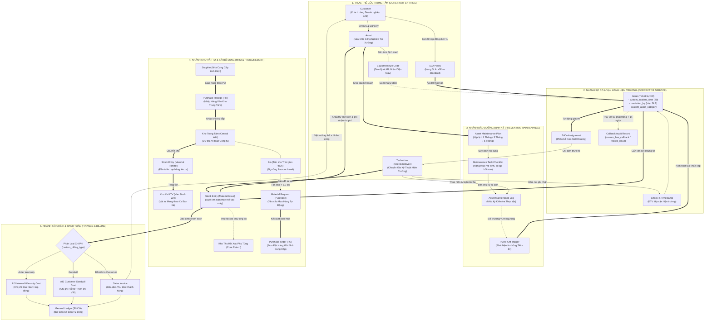
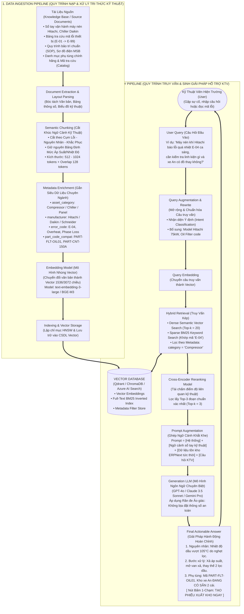
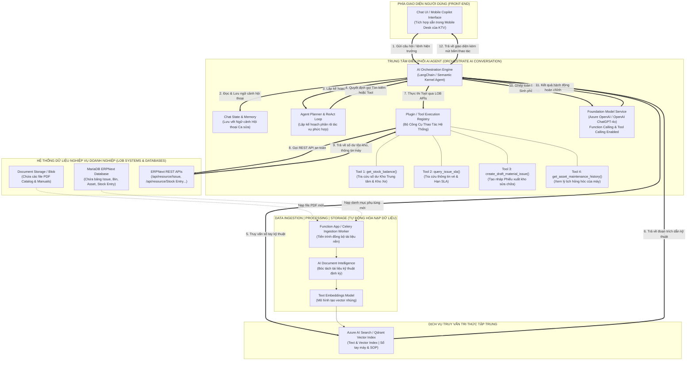

# THIẾT KẾ KIẾN TRÚC HỆ THỐNG TỔNG THỂ (ENTERPRISE SYSTEM ARCHITECTURE BLUEPRINT)
> **Dự án:** Hệ thống Smart HelpDesk & Quản trị Bảo trì Công nghiệp (Field Service Management - FSM, CMMS & MRO)  
> **Nền tảng chủ đạo:** ERPNext v16 / Frappe Framework v16 kết hợp Trợ lý Trí tuệ Nhân tạo (Enterprise AI Copilot & RAG Engine)  
> **Đơn vị thực hiện:** Nhóm sinh viên DUT.K1N4  
> **Tài liệu quy chuẩn thiết kế:** Phỏng theo mô hình kiến trúc chuẩn mực của **Microsoft Teams Architecture** và **Azure Enterprise Generative AI / RAG Architecture**.

---

## MỤC LỤC TỔNG QUAN

1. [Phần 1: Nguyên Tắc Thiết Kế & 4 Góc Nhìn Kiến Trúc Chuẩn Mực](#phần-1-nguyên-tắc-thiết-kế--4-góc-nhìn-kiến-trúc-chuẩn-mực)
2. [Sơ Đồ 1: Kiến Trúc Hệ Thống & Các Khối Dịch Vụ Tổng Thể (System & Component Architecture)](#sơ-đồ-1-kiến-trúc-hệ-thống--các-khối-dịch-vụ-tổng-thể-system--component-architecture)
3. [Sơ Đồ 2: Kiến Trúc Logic & Phả Hệ Thực Thể Nghiệp Vụ (Logical Architecture & Entity Hierarchy)](#sơ-đồ-2-kiến-trúc-logic--phả-hệ-thực-thể-nghiệp-vụ-logical-architecture--entity-hierarchy)
4. [Sơ Đồ 3: Kiến Trúc Pipeline Dữ Liệu Tri Thức Kỹ Thuật (RAG Data Ingestion & Query Pipeline)](#sơ-đồ-3-kiến-trúc-pipeline-dữ-liệu-tri-thức-kỹ-thuật-rag-data-ingestion--query-pipeline)
5. [Sơ Đồ 4: Kiến Trúc Điều Phối AI Agent Tích Hợp Nghiệp Vụ Doanh Nghiệp (Enterprise AI Agent & LOB ERP Integration)](#sơ-đồ-4-kiến-trúc-điều-phối-ai-agent-tích-hợp-nghiệp-vụ-doanh-nghiệp-enterprise-ai-agent--lob-erp-integration)
6. [Phần 6: Bảng Quy Chuẩn Đồ Họa, Mã Màu & Ký Hiệu Để Vẽ Sơ Đồ (Diagramming & Styling Guide)](#phần-6-bảng-quy-chuẩn-đồ-họa-mã-màu--ký-hiệu-để-vẽ-sơ-đồ-diagramming--styling-guide)

---

# PHẦN 1: NGUYÊN TẮC THIẾT KẾ & 4 GÓC NHÌN KIẾN TRÚC CHUẨN MỰC

Để thiết kế một đồ án Hệ thống Thông tin (HTTT) chuẩn doanh nghiệp, kiến trúc không thể chỉ mô tả những gì đã code được ở hiện tại mà phải cung cấp **Bản vẽ Quy hoạch Tổng thể (Master Blueprint)** hoàn chỉnh cho toàn bộ vòng đời sản phẩm.

Dựa trên tài liệu tham chiếu chuẩn công nghiệp (Microsoft Teams & Azure Enterprise Architecture), hệ thống Smart HelpDesk & Maintenance được thiết kế qua **4 Góc Nhìn Kiến Trúc (4 Architectural Views)**:

```
┌──────────────────────────────────────────────────────────────────────────────────────────────────┐
│                   BỘ TỨ GÓC NHÌN KIẾN TRÚC TỔNG THỂ (ENTERPRISE ARCHITECTURE SUITE)              │
├────────────────────────────────┬─────────────────────────────────────────────────────────────────┤
│ GÓC NHÌN 1: SYSTEM ARCHITECTURE│ Cấu trúc các tầng (Tiers), các ứng dụng Client, Gateway,        │
│ (Tương ứng Page 1 & 2 mẫu)     │ Khối dịch vụ lõi (Services), Tích hợp mở rộng & Hạ tầng máy chủ.│
├────────────────────────────────┼─────────────────────────────────────────────────────────────────┤
│ GÓC NHÌN 2: LOGICAL ARCHITECTURE│ Phả hệ quan hệ đối tượng (Entities), quan hệ sở hữu (Ownership),│
│ (Tương ứng Page 3 mẫu)         │ Luồng thông tin logic xuyên suốt từ Khách hàng -> Máy -> Kho.   │
├────────────────────────────────┼─────────────────────────────────────────────────────────────────┤
│ GÓC NHÌN 3: RAG PIPELINE       │ Pipeline nạp tri thức kỹ thuật (Ingestion) và Pipeline truy vấn │
│ (Tương ứng Page 4 mẫu)         │ thông tin đa tầng (Query, Retrieval, Rerank, Generation).       │
├────────────────────────────────┼─────────────────────────────────────────────────────────────────┤
│ GÓC NHÌN 4: ENTERPRISE AI AGENT│ Kiến trúc tích hợp giữa Chat Front-end, AI Orchestrator,        │
│ (Tương ứng Page 5 mẫu)         │ Function Calling / Tool Registry và LOB ERPNext REST API.       │
└────────────────────────────────┴─────────────────────────────────────────────────────────────────┘
```

---

# SƠ ĐỒ 1: KIẾN TRÚC HỆ THỐNG & CÁC KHỐI DỊCH VỤ TỔNG THỂ (SYSTEM & COMPONENT ARCHITECTURE)
*(Tương ứng cấu trúc phân tầng tại Trang 1 & 2 của tài liệu mẫu Microsoft Teams)*

Sơ đồ này thể hiện sự phân tách rõ ràng giữa: **Giao diện Client** $\rightarrow$ **Cửa ngõ API & Bảo mật** $\rightarrow$ **Các khối Dịch vụ Nghiệp vụ lõi (Core Business Services)** $\rightarrow$ **Dịch vụ Hỗ trợ & Xử lý Nền (Auxiliary & Background Services)** $\rightarrow$ **Tầng Lưu trữ & Hạ tầng Nền tảng (Platform & Storage Tier)**.

```mermaid
flowchart TD
    %% TẦNG CLIENTS
    subgraph TIER_CLIENTS["1. TẦNG TRẢI NGHIỆM ĐA KÊNH (CLIENTS & TOUCHPOINTS)"]
        CL_WEB["Web Portal Khách Hàng<br/>(B2B Customer Self-Service)"]
        CL_TECH["Mobile Desk PWA (KTV)<br/>(Check-in, Xuất kho, GPS)"]
        CL_DISP["Dispatcher Desk<br/>(Bàn Điều phối & Theo dõi SLA)"]
        CL_WH["Warehouse Desk<br/>(Thủ kho & Quản lý Xuất/Nhập)"]
        CL_ACC["Billing & Finance Desk<br/>(Kế toán Dịch vụ & Hóa đơn)"]
        CL_EXEC["Executive Dashboard<br/>(Ban Giám đốc & Phân tích KPI)"]
        CL_QR["Tem Quét QR Hiện Trường<br/>(Quét mã thân máy 15s)"]
        CL_IOT["Gateway Cảm Biến IoT<br/>(Nhiệt độ, Rung động, Áp suất)"]
    end

    %% TẦNG GATEWAY & AUTH
    subgraph TIER_GATEWAY["2. CỬA NGÕ TRUY CẬP, XÁC THỰC & BẢO VỆ (API GATEWAY & SECURITY)"]
        GW_REV["Nginx Reverse Proxy & SSL Termination"]
        GW_AUTH["Xác Thực & Quản Lý Phiên (OAuth2 / JWT / Session)"]
        GW_RBAC["Bộ Kiểm Soát Vai Trò & Phân Tách Nhiệm Vụ (RBAC & SoD)"]
        GW_ISO["Động Cơ Cách Ly Dữ Liệu Khách Hàng (User Permission Multi-Tenancy)"]
        GW_LIMIT["Rate Limiting, CORS & Audit Trail Logger"]
    end

    %% TẦNG DỊCH VỤ LÕI (CORE SERVICES)
    subgraph TIER_SERVICES["3. CÁC KHỐI DỊCH VỤ NGHIỆP VỤ LÕI (CORE ERP SERVICES & BUSINESS MODULES)"]
        subgraph MOD_HELPDESK["Khối Helpdesk & Quản Trị SLA"]
            S_INGEST["Incident Ingestion Engine<br/>(Đa kênh QR/Portal/Hotline)"]
            S_SLA["2D SLA Matrix Engine<br/>(Đếm ngược SLA VIP vs Standard)"]
            S_ROUTE["Skill-Based Routing Engine<br/>(Phân công theo Chuyên môn Máy)"]
            S_FTFR["Callback & FTFR Audit Engine<br/>(Truy vết Lỗi Tái phát 7-14 ngày)"]
        end

        subgraph MOD_CMMS["Khối Quản Lý Thiết Bị & Bảo Trì (CMMS)"]
            S_ASSET["Digital Asset Registry<br/>(Hồ sơ Lý lịch & Mã QR Động)"]
            S_ISO_ACC["Asset Accounting Isolation<br/>(Khóa Khấu hao Máy Khách)"]
            S_PM_PLAN["PM Schedule Engine<br/>(Kế hoạch Bảo trì 1M / 3M / 6M)"]
            S_PM2CM["PM-to-CM Anomaly Trigger<br/>(Tự sinh Vé khi Khám phát hiện Lỗi)"]
            S_TOOL["Tool Calibration Tracking<br/>(Quản lý Kiểm định Thiết bị Đo)"]
        end

        subgraph MOD_MRO["Khối Quản Trị Kho Vật Tư MRO"]
            S_CENTRAL["Kho Tổng Trung Tâm (SBN)<br/>(Dự trữ An toàn 12 Loại Phụ tùng)"]
            S_VAN["Kho Xe KTV Lưu Động (Van Stock)<br/>(Trách nhiệm Vật chất Cá nhân)"]
            S_TRANSFER["Material Transfer Engine<br/>(Điều chuyển Vật tư Lên Xe)"]
            S_ISSUE_MAT["Material Issue Engine<br/>(Xuất Linh kiện vào Máy hỏng)"]
            S_REORDER["Reorder Trigger Engine<br/>(Cảnh báo Tồn thực tế < Ngưỡng)"]
            S_SCRAP["Core Return / Scrap Warehouse<br/>(Kho Thu hồi Xác Phụ tùng Hỏng)"]
        end

        subgraph MOD_PROCURE["Khối Mua Sắm & Bổ Sung Tồn Kho"]
            S_MR["Material Request Engine<br/>(Yêu cầu Mua hàng Tự động)"]
            S_PO["Purchase Order Management<br/>(Quản lý Đơn Đặt Hàng NCC)"]
            S_PR["Purchase Receipt Engine<br/>(Tiếp nhận & Tăng Tồn Kho Tổng)"]
            S_SUPPLIER["Supplier Portal & Rating<br/>(Quản lý Danh bạ & Báo giá NCC)"]
        end

        subgraph MOD_FINANCE["Khối Quyết Toán Chi Phí & Doanh Thu"]
            S_BILL_CLS["Billing Classification Engine<br/>(Under Warranty / Billable / Goodwill)"]
            S_SINV["Sales Invoice Generator<br/>(Hóa đơn Vật tư + Giờ công Kỹ thuật)"]
            S_TCO["Asset TCO & Cost Center Ledger<br/>(Bóc tách Chi phí Sửa chữa Từng Máy)"]
        end
    end

    %% TẦNG DỊCH VỤ NỀN & TÍCH HỢP
    subgraph TIER_INTEGRATION["4. DỊCH VỤ NỀN, SỰ KIỆN & TÍCH HỢP (INTEGRATION & ASYNC SERVICES)"]
        ASYNC_REDIS["Redis Message Broker & Celery Task Queue"]
        ASYNC_CRON["Scheduled Cron Jobs (Lập lịch Tự động chạy Định kỳ)"]
        ASYNC_NOTIF["Notification Hub (Gửi Email SMTP, Zalo ZNS, Web Push)"]
        ASYNC_TELEMETRY["Telemetry & Sensor Ingestion Listener (MQTT / HTTP)"]
        ASYNC_SEARCH["Full-Text Global Search Indexer"]
        ASYNC_AUDIT["Immutable Audit Trail & Version Control Engine"]
    end

    %% TẦNG AI COPILOT
    subgraph TIER_AI["5. PHÂN HỆ TRÍ TUỆ NHÂN TẠO (AI COPILOT & RAG SUBSYSTEM)"]
        AI_ORCH["AI Agent Orchestrator (LangChain / Semantic Kernel)"]
        AI_PLAN["Planner & Dynamic Tool Execution Registry"]
        AI_RAG["RAG Retrieval Engine (Vector Search + BM25 Hybrid)"]
        AI_VEC["Vector Database (Qdrant / ChromaDB Embeddings)"]
        AI_LLM["Large Language Model (GPT-4o / Claude 3.5 / Gemini)"]
    end

    %% TẦNG HẠ TẦNG & LƯU TRỮ
    subgraph TIER_INFRA["6. HẠ TẦNG NỀN TẢNG & CƠ SỞ DỮ LIỆU (PLATFORM & STORAGE)"]
        INFRA_DB["MariaDB 10.6+ InnoDB Storage Engine (ACID Transactional Data)"]
        INFRA_CACHE["Redis In-Memory Key-Value Store (Cache & Session)"]
        INFRA_FILES["Object Storage / File System (Ảnh chụp hiện trường, PDF)"]
        INFRA_DOCKER["Docker Compose Container Runtime (9 Isolated Micro-containers)"]
    end

    %% LIÊN KẾT GIỮA CÁC TẦNG
    TIER_CLIENTS ==> TIER_GATEWAY
    TIER_GATEWAY ==> TIER_SERVICES
    TIER_SERVICES <==> TIER_INTEGRATION
    TIER_SERVICES <==> TIER_AI
    TIER_SERVICES ==> TIER_INFRA
    TIER_INTEGRATION ==> TIER_INFRA
    TIER_AI ==> TIER_INFRA
```



### Bảng Đặc Tả Thành Phần Hệ Thống (Component Catalog):

| Nhóm Tầng | Thành Phần / Module | Chức Năng Chính | Công Nghệ / Giao Thức |
| :--- | :--- | :--- | :--- |
| **Clients** | B2B Customer Portal | Cho phép đại diện nhà máy báo hỏng, xem tiến độ, nghiệm thu số. | Web App / Frappe Portal, Responsive HTML5. |
| **Clients** | Field Tech Mobile PWA | Giao diện hiện trường cho thợ: Check-in GPS, xuất kho phụ tùng, hoàn thành vé. | PWA Mobile Desk, Quick Actions Client Script. |
| **Clients** | Dispatcher Console | Màn hình điều phối trung tâm: Bản đồ, đồng hồ đếm ngược SLA, phân công KTV. | ERPNext Desk Workspace, Real-time List View. |
| **Gateway** | Nginx & Security | Điều hướng tải, chấm dứt SSL, kiểm tra xác thực và phân quyền RBAC/SoD. | Nginx 1.25+, OAuth2 Bearer Tokens, Frappe Auth. |
| **Core Services** | Helpdesk & SLA Engine | Tiếp nhận sự cố, tính toán SLA 2 chiều (VIP vs Std), định tuyến KTV theo chuyên môn. | Frappe DocType ORM (`Issue`, `Assignment Rule`). |
| **Core Services** | CMMS & Maintenance | Quản lý vòng đời máy, cách ly khấu hao, lập lịch bảo trì 1M/3M/6M, kích hoạt PM-to-CM. | `Asset`, `Asset Maintenance`, `Asset Maintenance Log`. |
| **Core Services** | MRO Inventory | Quản lý kho đa tầng (Kho Trung tâm, Kho Xe KTV), trừ kho theo ca sửa, cảnh báo Reorder. | `Stock Entry`, `Bin`, `Warehouse Tree`. |
| **Core Services** | Procurement Loop | Tự động sinh Material Request khi chạm ngưỡng an toàn, phát hành PO, nhập kho PR. | `Material Request`, `Purchase Order`, `Purchase Receipt`. |
| **Core Services** | Finance Touchpoints | Phân định chi phí: Trong bảo hành (AIS chịu), Tính phí (Xuất hóa đơn), Thiện chí (AIS chịu). | `Sales Invoice`, `Cost Center`, Custom Billing Fields. |
| **Integration** | Celery / Redis Queue | Chạy tiến trình ngầm: Quét kiểm tra vi phạm SLA, sinh lịch bảo dưỡng, gửi email/SMS. | Redis 7.0, Python Celery Workers, Cron Scheduler. |
| **AI Subsystem** | Agent & RAG Copilot | Tra cứu sổ tay máy nén/chiller, chẩn đoán mã lỗi hiện trường, tự động điền form xuất kho. | LangChain, Vector DB (Qdrant), LLM API. |
| **Storage** | MariaDB 10.6+ InnoDB | Lưu trữ toàn bộ dữ liệu quan hệ giao dịch doanh nghiệp với độ toàn vẹn ACID cao. | MariaDB InnoDB, UTF8MB4 Collation. |

---

# SƠ ĐỒ 2: KIẾN TRÚC LOGIC & PHẢ HỆ THỰC THỂ NGHIỆP VỤ (LOGICAL ARCHITECTURE & ENTITY HIERARCHY)
*(Tương ứng cấu trúc quan hệ logic tại Trang 3 của tài liệu mẫu Microsoft Teams)*

Sơ đồ này mô tả **"Bản đồ quan hệ logic"** giữa các thực thể cốt lõi trong hệ sinh thái FSM & MRO, làm rõ cách thức dữ liệu liên kết từ thực thể trung tâm (**Customer & Asset**) lan tỏa sang 3 nhánh nghiệp vụ: **Dịch vụ Hiện trường (Helpdesk)**, **Bảo dưỡng Định kỳ (CMMS)**, và **Chuỗi Cung ứng - Tài chính (Supply Chain & Finance)**.



### Nguyên Lý Vận Hành Logic (Logical Invariants):
1. **Một Máy - Một Hồ Sơ Duy Nhất:** Máy móc (`Asset`) là điểm tựa kết nối trung tâm; mọi lịch sử hỏng hóc (`Issue`), nhật ký bảo dưỡng (`Asset Maintenance Log`), và phụ tùng đã thay (`Stock Entry`) đều gắn chặt vào mã máy để tính tổng chi phí sở hữu (Total Cost of Ownership - TCO).
2. **Kho Đi Theo Người:** Mỗi KTV sở hữu một kho xe ảo (`Warehouse Type = Transit / Van Stock`). Mọi thao tác xuất dùng phụ tùng hiện trường bắt buộc trừ từ kho xe của KTV đó để xác lập trách nhiệm cá nhân.
3. **Phân Định Tài Chính Bất Biến:** Mọi phiếu xuất kho sửa chữa đều phải mang một trong ba nhãn tài chính (`Under Warranty`, `Billable to Customer`, `Goodwill`) trước khi ký duyệt, đảm bảo dòng vật chất không bao giờ bị xuất đi mà không rõ ai là người thanh toán.

---

# SƠ ĐỒ 3: KIẾN TRÚC PIPELINE DỮ LIỆU TRI THỨC KỸ THUẬT (RAG DATA INGESTION & QUERY PIPELINE)
*(Tương ứng kiến trúc chuẩn tại Trang 4 của tài liệu mẫu Basic RAG Architecture)*

Trong môi trường bảo trì công nghiệp, các kỹ thuật viên phải đối mặt với hàng nghìn trang sổ tay kỹ thuật dày đặc (Manuals), mã lỗi phức tạp (Error Codes) và sơ đồ đấu dây điện. Sơ đồ này mô tả **2 Pipeline song song khép kín**: **Data Ingestion Pipeline** (Chuẩn bị và số hóa tri thức) và **Query Pipeline** (Tiếp nhận câu hỏi và sinh giải pháp hỗ trợ KTV tức thời).



### Các Đặc Điểm Kỹ Thuật Trọng Yếu Của RAG Pipeline Công Nghiệp:
1. **Phân Đoạn Theo Cấu Trúc Kỹ Thuật (Domain Semantic Chunking):** Không cắt ngẫu nhiên theo số từ. Mỗi chunk bắt buộc gom trọn: *Hiện tượng lỗi $\rightarrow$ Nguyên nhân gốc rễ $\rightarrow$ Biện pháp an toàn $\rightarrow$ Mã phụ tùng khuyến nghị*.
2. **Truy Vấn Lai Hai Tầng (Hybrid Retrieval: Vector + Keyword BM25):** 
   * Vector Search giỏi hiểu ngữ cảnh (*"máy nóng ran bốc khói"* $\approx$ *"quá nhiệt"*).
   * BM25 Keyword Search bắt buộc phải có để khớp chính xác 100% các mã kỹ thuật ngắn như `E-04`, `PT100`, `LC1D150`, nơi mà vector thuần túy dễ bị nhầm lẫn.
3. **Cơ Chế Reranking (Tái Xếp Hạng):** Sử dụng Cross-Encoder để loại bỏ các đoạn tài liệu tương tự nhưng sai đời máy (ví dụ: máy nén khí Piston thay vì trục vít).

---

# SƠ ĐỒ 4: KIẾN TRÚC ĐIỀU PHỐI AI AGENT TÍCH HỢP NGHIỆP VỤ DOANH NGHIỆP (ENTERPRISE AI AGENT & LOB INTEGRATION)
*(Tương ứng kiến trúc đám mây chuẩn doanh nghiệp tại Trang 5 của tài liệu mẫu Azure OpenAI Enterprise Architecture)*

Sơ đồ này mô tả cách một **Hệ Thống Trợ Lý AI Đa Tác Vụ (Agentic Workflow)** không chỉ dừng lại ở việc "trò chuyện", mà thực sự kết nối trực tiếp vào các giao diện lập trình ứng dụng nghiệp vụ (**Line of Business - LOB APIs / ERPNext REST API**) để tra cứu số liệu thực tế, kiểm tra số dư tồn kho và tạo giao dịch tự động.



### Kịch Bản Tác Vụ Thực Tế Minh Họa (End-to-End Walkthrough):
1. **Bước 1 (User Prompt):** KTV Nguyễn Văn An giơ điện thoại nói với Copilot: *"Máy nén khí Hitachi của Tân Á báo lỗi E-04, xe tôi còn lọc dầu không? Tạo giúp tôi phiếu xuất kho 2 cái."*
2. **Bước 2 (Agent Planning & RAG Retrieval):** 
   * Orchestrator nhận diện có 2 ý định: (1) Kiểm tra kỹ thuật lỗi E-04, (2) Kiểm tra kho và xuất hàng.
   * Gọi `AI_SEARCH` tra cứu mã `E-04`: Xác định nguyên nhân do nghẹt dầu, phụ tùng tương thích là `PART-FLT-OIL01`.
3. **Bước 3 (Tool Execution via ERPNext REST API):** 
   * Gọi `TOOL_INV` truy vấn ERPNext: `Bin` tại `Kho Xe - Nguyen Van An - SBN` có `actual_qty = 2.0`.
   * Gọi `TOOL_CREATE_SE`: Gửi request tạo bản nháp `Stock Entry (Material Issue)` gắn vào vé `ISS-2026-00001`, thiết bị `ACC-ASS-2026-00002`.
4. **Bước 4 (Phản hồi Hành động):** Copilot trả lời:  
   *"Lỗi E-04 đã được xác nhận là nghẹt lọc dầu Hitachi. Xe của bạn đang có đúng 2 chiếc `PART-FLT-OIL01`. Tôi đã tạo sẵn bản nháp Phiếu xuất kho `MAT-STE-DRAFT-01`. Bạn chỉ cần bấm nút [Xác nhận Ký xuất] bên dưới để hoàn tất ca."*

---

# PHẦN 6: BẢNG QUY CHUẨN ĐỒ HỌA, MÃ MÀU & KÝ HIỆU ĐỂ VẼ SƠ ĐỒ (DIAGRAMMING & STYLING GUIDE)

Khi đem bản thiết kế này lên các công cụ vẽ đồ họa chuyên nghiệp (**Draw.io, Microsoft Visio, Canva, Lucidchart hoặc Stitch**), sinh viên cần tuân thủ bảng quy chuẩn màu sắc và hình khối để sơ đồ đạt tính thẩm mỹ và chuẩn mực công nghiệp cao nhất:

### 1. Bảng Mã Màu Tiêu Chuẩn (Enterprise Hex Color Palette):

```
┌─────────────────────────┬─────────────┬─────────────┬────────────────────────────────────────────┐
│ Khối Phân Tầng          │ Màu Viền    │ Màu Nền Box │ Ý Nghĩa Trực Quan                          │
├─────────────────────────┼─────────────┼─────────────┼────────────────────────────────────────────┤
│ Tầng 1: Clients         │ #0284C7     │ #E0F2FE     │ Xanh Biển (Sky Blue): Người dùng & Thiết bị│
│ Tầng 2: Gateway & Auth  │ #475569     │ #F1F5F9     │ Xám Đậm (Slate Gray): Bảo mật & Cửa ngõ    │
│ Tầng 3: Core Helpdesk   │ #4F46E5     │ #EEF2FF     │ Tím Indigo: Xương sống điều phối dịch vụ   │
│ Tầng 3: CMMS / Asset    │ #059669     │ #ECFDF5     │ Xanh Lá (Emerald): Máy móc & Vận hành bền  │
│ Tầng 3: MRO / Inventory │ #D97706     │ #FEF3C7     │ Vàng Hổ Phách (Amber): Kho bãi & Vật tư    │
│ Tầng 3: Finance / Bill  │ #0D9488     │ #F0FDFA     │ Xanh Mòng Két (Teal): Dòng tiền & Hóa đơn  │
│ Tầng 4: AI & RAG Subsys │ #DB2777     │ #FDF2F8     │ Hồng Đào (Pink): Trí tuệ nhân tạo & Vector │
│ Tầng 5: Platform & DB   │ #1E293B     │ #F8FAFC     │ Xanh Than Tối: Cơ sở dữ liệu & Máy chủ ảo  │
└─────────────────────────┴─────────────┴─────────────┴────────────────────────────────────────────┘
```

### 2. Quy Chuẩn Ký Hiệu Mũi Tên (Connector Conventions):
* **Mũi tên Nét liền Đậm (`==>`):** Dòng dữ liệu giao dịch đồng bộ chính (Synchronous Transactional Flow / CRUD / REST Calls).
* **Mũi tên Nét đứt (`-.->`):** Luồng sự kiện kích hoạt bất đồng bộ (Asynchronous Event / Trigger / Webhook / Celery Job).
* **Mũi tên Hai chiều (`<==>`):** Giao tiếp hai chiều đối soát trạng thái (Two-way Handshake / State Validation).

### 3. Hướng Dẫn Trình Bày Khi Báo Cáo Với Giảng Viên Hướng Dẫn:
1. **Khi thầy hỏi về Tính Tổng Thể:** Mở **Sơ Đồ 1** để chứng minh dự án có đầy đủ 6 tầng của một Enterprise Application (Client $\rightarrow$ Gateway $\rightarrow$ Core ERP $\rightarrow$ Integration $\rightarrow$ AI Copilot $\rightarrow$ Infrastructure), không phải một web app nghiệp vụ chắp vá.
2. **Khi thầy hỏi về Mối Liên Kết Giữa Các Nghiệp Vụ:** Mở **Sơ Đồ 2** để chứng minh dòng dữ liệu khép kín: Khách hàng báo hỏng $\rightarrow$ Hệ thống tra chuyên môn giao thợ $\rightarrow$ Thợ kiểm tra máy $\rightarrow$ Xuất kho xe $\rightarrow$ Kích hoạt mua sắm bù đắp $\rightarrow$ Hạch toán tài chính 3 hướng rõ ràng.
3. **Khi thầy hỏi về Tính Năng Thông Minh / Hiện Đại (AI):** Mở **Sơ Đồ 3 & Sơ Đồ 4** để chứng minh định hướng phát triển AI Agent thực thụ (RAG Hybrid Search kết hợp Function Calling tương tác trực tiếp CSDL ERPNext), vượt trội so với các chatbot hỏi đáp thông thường.

---
*Tài liệu thiết kế kiến trúc chuẩn mực được biên soạn bởi Nhóm dự án DUT.K1N4 — Smart HelpDesk & Maintenance System.*
