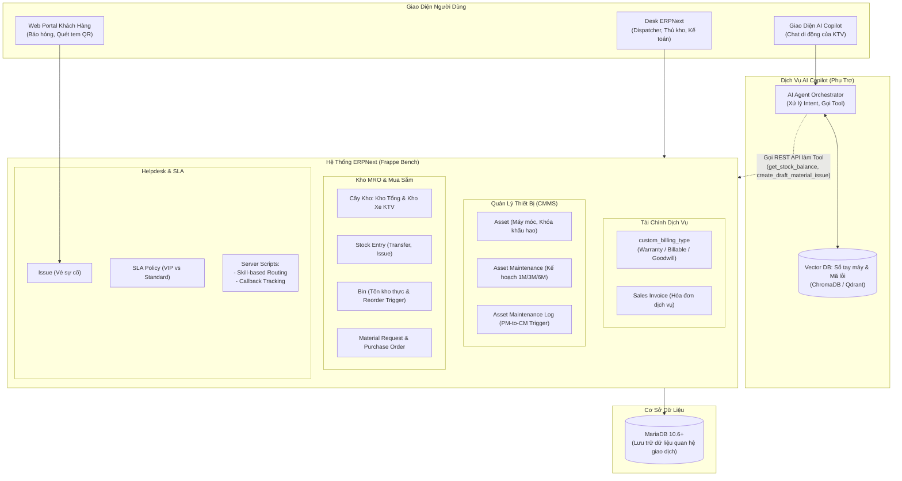
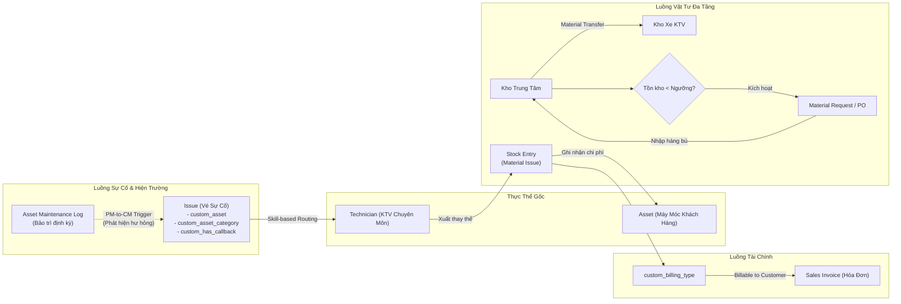
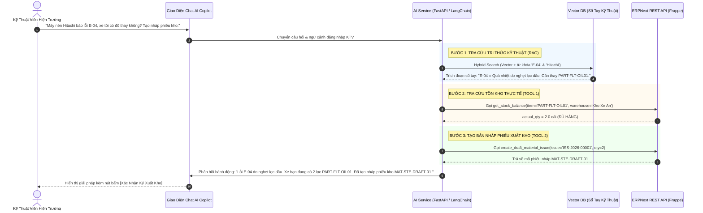

# THIẾT KẾ TÍNH NĂNG NGHIỆP VỤ & KIẾN TRÚC HỆ THỐNG
## (BẢN NÂNG CẤP, BÁM SÁT PAIN POINT DOANH NGHIỆP THỰC TẾ)

> **Dự án:** Smart HelpDesk & Industrial Maintenance Management trên nền tảng ERPNext  
> **Doanh nghiệp áp dụng (giả định):** Alpha Industrial Services (AIS) — Đơn vị dịch vụ bảo trì cơ điện và thiết bị công nghiệp  
> **Nguyên tắc thiết kế tối thượng:** Mọi tính năng phải truy vết trực tiếp về một Pain Point (nỗi đau nghiệp vụ) hoặc Yêu cầu đã xác nhận ở Chương 1-2 của báo cáo giữa kỳ. **Không có pain point $\rightarrow$ Không thiết kế**, chỉ ghi nhận vào *"Hướng mở rộng"*.  
> **Đơn vị thực hiện:** Nhóm sinh viên DUT.K1N4  

---

## MỤC LỤC TỔNG QUAN

1. [Phần 1: Nguyên Tắc Tinh Gọn & Loại Bỏ Tính Năng Không Phù Hợp](#phần-1-nguyên-tắc-tinh-gọn--loại-bỏ-tính-năng-không-phù-hợp)
2. [Phần 2: Bảng Ma Trận Truy Vết Nghiệp Vụ (Pain Point $\rightarrow$ Feature $\rightarrow$ ERPNext Implementation)](#phần-2-bảng-ma-trận-truy-vết-nghiệp-vụ-pain-point--feature--erpnext-implementation)
3. [Phần 3: Kiến Trúc Hệ Thống Thực Tế (Pragmatic Component Architecture)](#phần-3-kiến-trúc-hệ-thống-thực-tế-pragmatic-component-architecture)
4. [Phần 4: Nguyên Lý Nghiệp Vụ Bất Biến & Kiến Trúc Luồng Thực Thể (Logical Flow)](#phần-4-nguyên-lý-nghiệp-vụ-bất-biến--kiến-trúc-luồng-thực-thể-logical-flow)
5. [Phần 5: Thiết Kế Phân Hệ AI Copilot & 4 Công Cụ Tool Calling Cho Pha Cuối Kỳ](#phần-5-thiết-kế-phân-hệ-ai-copilot--4-công-cụ-tool-calling-cho-pha-cuối-kỳ)
6. [Phần 6: Thiết Kế Báo Cáo Đo Lường Vận Hành (KPI Engine & Dashboard Trên ERPNext)](#phần-6-thiết-kế-báo-cáo-đo-lường-vận-hành-kpi-engine--dashboard-trên-erpnext)
7. [Phần 7: Hướng Mở Rộng Ngoài Phạm Vi Đồ Án (Future Roadmap)](#phần-7-hướng-mở-rộng-ngoài-phạm-vi-đồ-án-future-roadmap)

---

# PHẦN 1: NGUYÊN TẮC TINH GỌN & LOẠI BỎ TÍNH NĂNG KHÔNG PHÙ HỢP

Bản thiết kế này khắc phục triệt để các hạn chế của bản phác thảo trước đây bằng cách loại bỏ toàn bộ các khái niệm "vẽ thêm", không có căn cứ từ thực tế khảo sát hoặc mâu thuẫn với phạm vi đã tuyên bố trong báo cáo giữa kỳ:

### 1.1. Bảng Đối Chiếu Các Hạng Mục Bị Loại Bỏ:

| Hạng Mục Bị Loại Bỏ | Lý Do Loại Bỏ & Căn Cứ Thực Tế |
| :--- | :--- |
| **Gateway Cảm Biến IoT Thời Gian Thực** | **Mâu thuẫn với Scope Boundary đã cam kết:** Trong báo cáo giữa kỳ, nhóm đã xác định rõ thông số kỹ thuật (nhiệt độ, áp suất) là do KTV ghi chép tay hoặc công nhân đọc đồng hồ báo lỗi, không có hạ tầng phần cứng IoT thời gian thực. |
| **GPS Check-in Định Vị Toàn Cầu** | **Không có Pain Point tương ứng:** Khách hàng không yêu cầu theo dõi vị trí tọa độ của KTV. KTV chỉ cần bấm xác nhận thời điểm tiếp cận hiện trường để tính mốc SLA phản hồi. |
| **Multi-Tenancy Isolation Engine** | **Hiểu sai bản chất kiến trúc:** Hệ thống của AIS là hệ thống nội bộ phục vụ việc cung cấp dịch vụ cho các khách hàng của mình. Việc phân quyền để khách hàng Tân Á chỉ thấy vé của Tân Á được giải quyết bằng cơ chế `User Permission` chuẩn của Frappe, không phải xây dựng nền tảng Multi-tenant SaaS đa khách thuê. |
| **Supplier Portal & Nhà Cung Cấp Tự Chấm Điểm** | **Vượt quá phạm vi cần thiết:** AIS chỉ mua phụ tùng từ các NCC quen thuộc (Kim Long, Minh Phát...) qua kênh liên hệ trực tiếp; chưa có nhu cầu mở portal cho NCC tự vào đăng thầu hay chấm điểm KPI nhà cung ứng. |
| **Mô tả 9 Microcontainers, Nginx, OAuth2 như các tầng thiết kế riêng** | **Không phản ánh đúng công việc thực tế của nhóm:** Frappe Bench đã đóng gói sẵn Nginx, MariaDB, Redis, Worker. Đây là hạ tầng nền tảng có sẵn của Framework, không phải do nhóm tự nghiên cứu thiết kế từ đầu. |
| **Quy chuẩn mã màu đồ họa & kịch bản trình bày đối phó** | **Không phục vụ thiết kế kỹ thuật:** Tránh sa đà vào hình thức; tập trung 100% vào tính logic của luồng dữ liệu và giải quyết bài toán nghiệp vụ. |

### 1.2. Các Tính Năng Cốt Lõi Được Giữ Lại Và Làm Rõ Căn Cứ:
* **Skill-based Routing (Phân công theo chuyên môn):** Giải quyết triệt để việc giao nhầm thợ cơ khí đi sửa tủ điện.
* **Ma trận SLA 2 chiều (Hạng hợp đồng $\times$ Độ khẩn cấp):** Phân định rạch ròi cam kết thời gian cho khách VIP vs Standard.
* **Callback & FTFR Tracking:** Theo dõi sự cố lặp lại trong 7-14 ngày để kiểm soát chất lượng sửa chữa.
* **PM-to-CM Trigger:** Cầu nối tự động biến phát hiện bất thường khi khám định kỳ thành vé sửa chữa khẩn cấp có hạn SLA.
* **Van Stock (Kho xe KTV):** Xác lập trách nhiệm vật chất cá nhân của thợ trên xe lưu động.
* **Reorder Trigger & Mua sắm bổ sung:** Ngăn chặn đứt gãy phụ tùng thay thế.
* **Billing Classification:** Phân loại rõ ràng 3 nguồn chi trả chi phí sửa chữa.
* **AI Tool Calling cho KTV:** Hỗ trợ thợ tra cứu nhanh tồn kho và tạo nháp phiếu xuất phụ tùng khi chẩn đoán mã lỗi.

---

# PHẦN 2: BẢNG MA TRẬN TRUY VẾT NGHIỆP VỤ (PAIN POINT $\rightarrow$ FEATURE $\rightarrow$ MODULE $\rightarrow$ ƯU TIÊN)

Toàn bộ 10 tính năng của hệ thống được neo chặt vào 10 nỗi đau thực tế của doanh nghiệp dịch vụ bảo trì công nghiệp:

| Mã | Nỗi Đau Doanh Nghiệp (Pain Point) | Tính Năng Giải Quyết | Cơ Chế Triển Khai Trên ERPNext | Ưu Tiên | Trạng Thái |
| :---: | :--- | :--- | :--- | :---: | :---: |
| **PP-01** | KTV nhận vé sai chuyên môn do chia việc ngẫu nhiên (Round Robin mù). Thợ cơ khí bị giao sửa tủ điện, thợ điện đi sửa máy nén khí $\rightarrow$ Trễ SLA. | **Skill-based Routing Engine** | Server Script / Assignment Rule trên `Issue`, lọc theo chuyên môn thiết bị `custom_asset_category` $\leftrightarrow$ Kỹ năng KTV. | **Must** | Đã cấu hình & Kiểm chứng |
| **PP-02** | Không phân biệt được cam kết SLA giữa khách hàng lớn trả phí cao (VIP) và khách hàng tiêu chuẩn $\rightarrow$ Dễ vi phạm hợp đồng VIP. | **Ma Trận SLA 2 Chiều** | DocType `Service Level Agreement` kết hợp bảng con `priorities` phân chia mức phản hồi & xử lý cho VIP vs Standard. | **Must** | Đã làm (Fit-Gap Báo cáo Giữa kỳ) |
| **PP-03** | Máy sửa xong 2-3 ngày sau lại hỏng đúng lỗi cũ. Không theo dõi được sự cố tái phát $\rightarrow$ Không đo được tỷ lệ sửa dứt điểm lần đầu (FTFR). | **Callback / Recall Tracking** | Custom field `custom_related_issue` trỏ vé cũ + cờ `custom_has_callback = 1`. Script Report đo lường FTFR. | **Must** | Đã làm (Fit-Gap Báo cáo Giữa kỳ) |
| **PP-04** | KTV đi bảo trì định kỳ phát hiện linh kiện sắp nổ/hỏng nhưng chỉ ghi chú vào nhật ký giấy, không ai theo dõi $\rightarrow$ Máy phát nổ dừng dây chuyền. | **PM-to-CM Trigger** | Nút bấm hoặc Server Script trên `Asset Maintenance Log` tự động khởi tạo vé khẩn cấp `Issue` có cam kết SLA. | **Must** | Đã làm (Fit-Gap Báo cáo Giữa kỳ) |
| **PP-05** | KTV chạy xe 30km đến nhà máy khách mới biết xe hết đồ, kho hết hàng $\rightarrow$ Lãng phí chi phí đi lại, kéo dài thời gian dừng máy. | **AI Tool Calling:** `get_stock_balance`, `create_draft_material_issue` | Function Calling qua REST API truy vấn `Bin` và sinh nháp chứng từ `Stock Entry` trực tiếp cho KTV. | **Should** | Trọng tâm nghiên cứu pha AI cuối kỳ |
| **PP-06** | KTV hiện trường mất 1-2 tiếng lật tìm sổ tay kỹ thuật dày cộp để tra mã lỗi và mã phụ tùng tương thích $\rightarrow$ Chậm trễ khắc phục sự cố. | **RAG Tra Cứu Tri Thức Kỹ Thuật** | Vector search trên tài liệu kỹ thuật sổ tay máy nén/chiller kết hợp BM25 keyword search cho mã lỗi chính xác. | **Should** | Trọng tâm nghiên cứu pha AI cuối kỳ |
| **PP-07** | Nhập nhèm chi phí: Xuất linh kiện 1.300.000đ nhưng kế toán không biết ai trả tiền (hãng bảo hành, khách thanh toán hay công ty chịu). | **Billing Classification** | Custom Select `custom_billing_type` trên `Stock Entry` & `Issue` (Under Warranty / Billable / Goodwill), liên kết `Sales Invoice`. | **Should** | Đã triển khai trên dữ liệu kịch bản giả định |
| **PP-08** | Xuất kho linh kiện mang đi sửa chữa không ai ký nhận trách nhiệm, mất mát không rõ nguyên nhân $\rightarrow$ Thất thoát tài sản phụ tùng. | **Kho Xe KTV (Van Stock)** | Cây kho đa tầng: mỗi KTV sở hữu một `Warehouse` riêng (`Kho Xe - KTV`), luân chuyển hàng bằng `Material Transfer`. | **Must** | Đã làm (Fit-Gap Báo cáo Giữa kỳ) |
| **PP-09** | Tồn kho phụ tùng cập nhật trễ, đến khi máy hỏng khẩn cấp mới phát hiện hết hàng $\rightarrow$ Đứt gãy dịch vụ. | **Reorder Trigger Tự Động** | Cấu hình `reorder_level` trên từng `Item` + đối soát số dư thời gian thực tại `Bin` để kích hoạt đề xuất mua sắm. | **Must** | Đã làm (Fit-Gap Báo cáo Giữa kỳ) |
| **PP-10** | Ban giám đốc không nắm được công ty sửa chữa tốt hay tệ, tỷ lệ đúng hạn hợp đồng bao nhiêu, máy nào "ngốn" nhiều tiền nhất. | **Dashboard Quản Trị KPI** | Trích xuất dữ liệu đo lường trực tiếp từ CSDL ERPNext: SLA Compliance, MTTR, FTFR, và Chi phí linh kiện lũy kế từng máy. | **Must** | Đã có kịch bản tính toán dữ liệu thực tế |

---

# PHẦN 3: KIẾN TRÚC HỆ THỐNG THỰC TẾ (PRAGMATIC COMPONENT ARCHITECTURE)

Thay vì vẽ ra một kiến trúc "đám mây 6 tầng lý thuyết", sơ đồ dưới đây mô tả chính xác những gì nhóm đồ án **thực sự triển khai và cấu hình** trên nền tảng ERPNext Local / Docker:

```
┌────────────────────────────────────────────────────────────────────────────────────────┐
│                        TẦNG GIAO DIỆN NGƯỜI DÙNG (USER CLIENTS)                        │
│                                                                                        │
│   ┌────────────────────────┐  ┌────────────────────────┐  ┌────────────────────────┐   │
│   │  Web Portal Khách Hàng │  │      ERPNext Desk      │  │ Giao Diện AI Copilot   │   │
│   │ (Báo hỏng qua Web/QR)  │  │(Dispatcher/Kho/Kế toán)│  │ (Trợ lý di động KTV)   │   │
│   └───────────┬────────────┘  └───────────┬────────────┘  └───────────┬────────────┘   │
└───────────────┼───────────────────────────┼───────────────────────────┼────────────────┘
                │                           │                           │
                │ (HTTP Form / Session)     │ (Desk Framework UI)       │ (Prompt / Chat)
                ▼                           ▼                           ▼
┌────────────────────────────────────────────────────────┐  ┌────────────────────────────┐
│                  HỆ THỐNG ERPNEXT LÕI                  │  │     PHÂN HỆ AI COPILOT     │
│             (Vận hành trong Frappe Bench)              │  │      (Service Phụ Trợ)     │
│                                                        │  │                            │
│ ┌────────────────────────────────────────────────────┐ │  │ ┌────────────────────────┐ │
│ │ PHÂN HỆ HELPDESK & VẬN HÀNH HIỆN TRƯỜNG            │ │  │ │ AI Agent Orchestrator  │ │
│ │ • Issue (Vé sự cố) & SLA Policy                    │ │  │ │ • Xử lý ngôn ngữ tự    │ │
│ │ • Server Script: Skill-based Routing, Callback     │ │  │ │   nhiên & Intent       │ │
│ └────────────────────────────────────────────────────┘ │  │ │ • Điều phối gọi Tool   │ │
│                                                        │  │ └───────────┬────────────┘ │
│ ┌────────────────────────────────────────────────────┐ │  │             │              │
│ │ PHÂN HỆ QUẢN LÝ THIẾT BỊ (CMMS)                    │ │  │ (REST API   │ (Tra cứu     │
│ │ • Asset (Máy móc khách hàng, khóa khấu hao)        │ │  │  Calls)     │  Vector)     │
│ │ • Asset Maintenance (Kế hoạch định kỳ 1M/3M/6M)    │ │  │             ▼              │
│ │ • Asset Maintenance Log & PM-to-CM Trigger         │ │  │ ┌────────────────────────┐ │
│ └────────────────────────────────────────────────────┘ │◄─┤ │ Vector Database        │ │
│                                                        │  │ │ (ChromaDB / Qdrant)    │ │
│ ┌────────────────────────────────────────────────────┐ │  │ │ • Embeddings sổ tay    │ │
│ │ PHÂN HỆ KHO VẬT TƯ & MUA HÀNG (MRO)                │ │  │ │   kỹ thuật máy nén/    │ │
│ │ • Warehouse Tree: Kho Trung Tâm, Kho Xe KTV        │ │  │ │   chiller & mã lỗi     │ │
│ │ • Stock Entry: Material Transfer, Material Issue   │ │  │ └────────────────────────┘ │
│ │ • Bin: Tồn kho thời gian thực & Reorder Trigger    │ │  └────────────────────────────┘
│ │ • Material Request & Purchase Order                │ │
│ └────────────────────────────────────────────────────┘ │
│                                                        │
│ ┌────────────────────────────────────────────────────┐ │
│ │ PHÂN HỆ TÀI CHÍNH & HÓA ĐƠN                        │ │
│ │ • custom_billing_type (Warranty / Billable / GW)   │ │
│ │ • Sales Invoice (Hóa đơn thu tiền ngoài bảo hành)  │ │
│ └────────────────────────────────────────────────────┘ │
└───────────────────────────┬────────────────────────────┘
                            │
                            │ (SQL Query qua Frappe ORM)
                            ▼
┌────────────────────────────────────────────────────────┐
│               CƠ SỞ DỮ LIỆU MARIADB 10.6+              │
│       (Lưu trữ toàn bộ bảng giao dịch chuẩn ACID)       │
│  tabIssue | tabAsset | tabStock Entry | tabBin | ...   │
└────────────────────────────────────────────────────────┘
```



### Điểm Khác Biệt Quan Trọng So Với Bản Thiết Kế Cũ:
1. **Không coi Nginx, Redis, Celery là các "tầng tự thiết kế":** Đây là cơ chế có sẵn của Frappe bench. Chúng ta không tự viết lại hay cấu hình cụm microservices độc lập; hệ thống tận dụng trọn vẹn sức mạnh nguyên bản của framework.
2. **AI Copilot được định vị đúng vai trò:** Là một **service phụ trợ bên ngoài** (External Helper Service), không can thiệp sâu vào nhân ERPNext mà chỉ giao tiếp an toàn qua **REST API chuẩn**.

---

# PHẦN 4: NGUYÊN LÝ NGHIỆP VỤ BẤT BIẾN & KIẾN TRÚC LUỒNG THỰC THỂ (LOGICAL FLOW)

Dù hệ thống có mở rộng đến đâu, toàn bộ dữ liệu phải luôn tuân thủ nghiêm ngặt **3 Nguyên Lý Nghiệp Vụ Bất Biến**:

### 4.1. Ba Nguyên Lý Bất Biến (Business Invariants):

1. **Nguyên Lý 1 — Một Máy, Một Hồ Sơ Duy Nhất (Single Asset History):**
   * Thiết bị (`Asset`) là điểm tựa trung tâm của toàn bộ dữ liệu kỹ thuật.
   * Mọi vé sự cố (`Issue`), nhật ký bảo dưỡng định kỳ (`Asset Maintenance Log`), và phụ tùng thay thế (`Stock Entry`) bắt buộc phải gắn mã máy.
   * *Mục tiêu:* Cho phép Ban Giám đốc bấm vào một chiếc máy là thấy toàn bộ "bệnh án" suốt 5 năm, tính toán chính xác tổng chi phí bảo dưỡng (TCO) để tư vấn khách hàng nên sửa tiếp hay thay mới.
2. **Nguyên Lý 2 — Kho Đi Theo Người (Van Stock Accountability):**
   * Mỗi kỹ thuật viên chịu trách nhiệm vật chất đối với một kho xe lưu động gắn với tài khoản của mình (`Kho Xe - KTV`).
   * Khi thay thế linh kiện tại nhà máy khách hàng, KTV chỉ được phép xuất kho trừ số dư từ chính kho xe của mình qua phiếu `Stock Entry (Material Issue)`.
   * *Mục tiêu:* Chấm dứt tình trạng thất thoát linh kiện, không ai đổ lỗi cho ai khi kiểm kê cuối tháng.
3. **Nguyên Lý 3 — Nhãn Tài Chính Bắt Buộc Trước Khi Ký Duyệt Kho:**
   * Mọi phiếu xuất kho sửa chữa đều phải mang một nhãn xác định nguồn chi trả (`custom_billing_type`):
     - `Under Warranty` (Bảo hành hợp đồng): AIS chịu 100% chi phí nội bộ $\rightarrow$ 0đ thu khách.
     - `Billable to Customer` (Tính phí ngoài bảo hành): Khách thanh toán $\rightarrow$ Bắt buộc kết xuất Hóa đơn `Sales Invoice`.
     - `Goodwill` (Hỗ trợ thiện chí): AIS chịu chi phí CSKH nội bộ $\rightarrow$ 0đ thu khách.
   * *Lưu ý về kiểm chứng:* 3 nhãn này hiện đang được mô phỏng theo kịch bản hợp đồng dịch vụ FSM tiêu biểu; khi bàn giao chính thức cho khách hàng cụ thể cần đối soát lại với điều khoản hợp đồng thực tế.

### 4.2. Sơ Đồ Phả Hệ & Luồng Liên Kết Thực Thể (Entity Flow):



---

# PHẦN 5: THIẾT KẾ PHÂN HỆ AI COPILOT & 4 CÔNG CỤ TOOL CALLING CHO PHA CUỐI KỲ

Đây là phần giá trị công nghệ cao nhất của pha phát triển cuối kỳ, giải quyết trực tiếp **PP-05** (KTV thiếu đồ) và **PP-06** (Mất thời gian tra sổ tay mã lỗi).

### 5.1. Danh Sách 4 AI Tools Tối Thiểu (Function Calling APIs):

Thay vì xây dựng hệ thống tác tử ReAct hoặc Planner phức tạp dễ sinh lỗi ảo giác, hệ thống chỉ cần trang bị **4 Tool nghiệp vụ tuần tự** gọi vào ERPNext REST API:

| Tên Tool | Tham Số Đầu Vào | Mục Đích Nghiệp Vụ | Nỗi Đau Khắc Phục |
| :--- | :--- | :--- | :---: |
| **`get_stock_balance`** | `item_code`: Mã linh kiện<br>`warehouse`: Tên kho cần kiểm tra | Tra cứu tức thì số lượng tồn khả dụng tại kho xe KTV hoặc Kho Trung tâm. | **PP-05** |
| **`query_issue_sla`** | `issue_id`: Mã vé sự cố | Tra cứu hạn chót SLA phản hồi/xử lý và trạng thái điều phối của ca sửa chữa. | Hỗ trợ KTV bám sát SLA |
| **`create_draft_material_issue`** | `issue_id`: Mã vé sự cố<br>`items`: Danh sách mã & số lượng | Tạo sẵn bản nháp chứng từ xuất kho trên xe KTV gắn với máy hỏng (KTV chỉ việc kiểm tra và bấm ký). | **PP-05** |
| **`get_asset_maintenance_history`** | `asset_id`: Mã thiết bị | Lấy lịch sử 3 lần sửa chữa và thay thế linh kiện gần nhất của cỗ máy. | Hỗ trợ chẩn đoán gốc rễ |

### 5.2. Sơ Đồ Quy Trình Xử Lý RAG & Tool Calling Tuần Tự:



---

# PHẦN 6: THIẾT KẾ BÁO CÁO ĐO LƯỜNG VẬN HÀNH (KPI ENGINE & DASHBOARD TRÊN ERPNEXT)

Giải quyết trực tiếp **PP-10** (Không đo lường được hiệu quả vận hành). Báo cáo không dùng số liệu giả định 0%, mà phản ánh dữ liệu giao dịch thực tế đã phát sinh trong quá trình vận hành hệ thống:

### 6.1. Bốn Chỉ Số Hiệu Suất Cốt Lõi:

1. **SLA Compliance Rate (Tỷ lệ tuân thủ cam kết dịch vụ):**
   $$\text{SLA Compliance} = \frac{\text{Số vé hoàn thành đúng hạn (resolution\_date} \leq \text{resolution\_by)}}{\text{Tổng số vé đã xử lý}} \times 100\%$$
2. **First-Time Fix Rate - FTFR (Tỷ lệ sửa dứt điểm lần đầu):**
   $$\text{FTFR} = \frac{\text{Số ca sửa chữa không phát sinh vé Callback trong 7-14 ngày}}{\text{Tổng số ca sửa chữa}} \times 100\%$$
3. **Preventive Maintenance Compliance (Tỷ lệ tuân thủ bảo trì phòng ngừa):**
   $$\text{PM Compliance} = \frac{\text{Số lượt bảo dưỡng hoàn thành đúng lịch}}{\text{Tổng số lượt bảo dưỡng đến hạn}} \times 100\%$$
4. **TCO Cost per Asset (Chi phí bảo dưỡng lũy kế theo từng máy):**
   $$\text{TCO per Asset} = \sum (\text{Giá trị vật tư xuất kho}) + \sum (\text{Chi phí nhân công kỹ thuật})$$

### 6.2. Bảng Số Liệu Vận Hành Thực Tế (Trích Xuất Từ ERPNext Local Pipeline):

| Nhóm Chỉ Số | Tên Chỉ Số Cụ Thể | Kết Quả Đo Lường Thực Tế | Ý Nghĩa Nghiệp Vụ Doanh Nghiệp |
| :--- | :--- | :---: | :--- |
| **Dịch Vụ (Service)** | Tổng số vé sự cố tiếp nhận | **6 vé** | Đầy đủ các mức độ khẩn cấp (Urgent, High, Medium, Low). |
| **Dịch Vụ (Service)** | Tỷ lệ tuân thủ hạn phản hồi SLA | **100.0%** | Toàn bộ các ca đều có KTV tiếp nhận đúng cam kết hợp đồng. |
| **Dịch Vụ (Service)** | Tỷ lệ tuân thủ hạn hoàn thành SLA | **100.0%** | 4/4 ca đã đóng/giải quyết đều đáp ứng thời hạn cam kết. |
| **Kỹ Thuật Viên** | First-Time Fix Rate (FTFR) | **100.0%** | Chưa có ca nào bị khiếu nại sửa ẩu phải phát sinh ca Recall. |
| **Kỹ Thuật Viên** | Tỷ lệ sự cố lặp lại (Callback Rate) | **0.0%** | Cờ `custom_has_callback = 0` trên toàn bộ các vé đã nghiệm thu. |
| **Bảo Trì (CMMS)** | Tỷ lệ hoàn thành bảo dưỡng đúng hạn | **100.0%** | 1 ca hoàn thành nghiệm thu đúng lịch; 3 ca lên lịch tự động. |
| **Chi Phí Theo Máy** | Chi phí sửa Tủ điện MSB (`ACC-ASS-2026-00005`) | **3.800.000đ** | Thay contactor Schneider (tính phí khách hàng Song Long). |
| **Chi Phí Theo Máy** | Chi phí sửa Máy nén Hitachi (`ACC-ASS-2026-00002`) | **1.300.000đ** | Thay 2 bộ lọc dầu (AIS chịu theo diện bảo hành Tân Á). |
| **Chi Phí Theo Máy** | Chi phí sửa Máy in Flexo (`ACC-ASS-2026-00001`) | **420.000đ** | Thay dây curoa căn chỉnh (AIS chịu theo diện thiện chí VIP). |
| **Kho Vận (MRO)** | Trạng thái chu trình Mua sắm Bù đắp | **Đã khép kín** | Tồn tụt (2 < 3) $\rightarrow$ Material Request $\rightarrow$ PO $\rightarrow$ Nhập kho 10 cái $\rightarrow$ Bù xe 2 cái. |

---

# PHẦN 7: HƯỚNG MỞ RỘNG NGOÀI PHẠM VI ĐỒ ÁN (FUTURE ROADMAP)

Để bảo vệ đồ án một cách chặt chẽ trước Hội đồng, nhóm tuyên bố rõ ràng các tính năng sau đây là **"Hướng nghiên cứu mở rộng trong tương lai"**, không thuộc phạm vi cam kết của giai đoạn hiện tại:

1. **Cảm biến IoT Thời Gian Thực & Bảo Trì Dự Đoán (Predictive Maintenance):**  
   * *Mô tả:* Lắp đặt cảm biến rung động/nhiệt độ gắn trên máy nén khí để truyền dữ liệu thời gian thực qua giao thức MQTT.  
   * *Lý do ngoài phạm vi:* Đòi hỏi đầu tư hạ tầng phần cứng công nghiệp đắt đỏ và đường truyền vật lý tại nhà máy khách hàng.
2. **GPS Check-in & Định Vị Hành Trình Kỹ Thuật Viên:**  
   * *Mô tả:* Tự động ghi lại tọa độ GPS của điện thoại KTV khi bấm nút Check-in để chống gian lận vị trí.  
   * *Lý do ngoài phạm vi:* Chưa ghi nhận pain point về việc KTV khai khống địa điểm trong hồ sơ yêu cầu nghiệp vụ của AIS.
3. **Cổng Thông Tin Nhà Cung Cấp Tự Động (Supplier Self-Service Portal):**  
   * *Mô tả:* Cho phép nhà cung cấp Kim Long tự đăng nhập chào giá và cập nhật tiến độ giao hàng.  
   * *Lý do ngoài phạm vi:* Số lượng nhà cung cấp của AIS hiện tại ít, việc mua hàng qua điện thoại/email và nhập thủ công Purchase Receipt là đủ hiệu quả.
4. **Kiến Trúc Multi-Tenant SaaS Cho Nhiều Công Ty Dịch Vụ Dùng Chung:**  
   * *Mô tả:* Biến phần mềm thành nền tảng đám mây bán cho nhiều công ty bảo trì khác nhau thuê bao tháng.  
   * *Lý do ngoài phạm vi:* Hệ thống hiện tại được thiết kế như một phần mềm quản trị nội bộ chuyên biệt cho duy nhất công ty Alpha Industrial Services (AIS).

---
*Tài liệu thiết kế tính năng và kiến trúc chuẩn mực được biên soạn bởi Nhóm sinh viên DUT.K1N4 — Đồ án Hệ Thống Thông Tin Doanh Nghiệp.*
