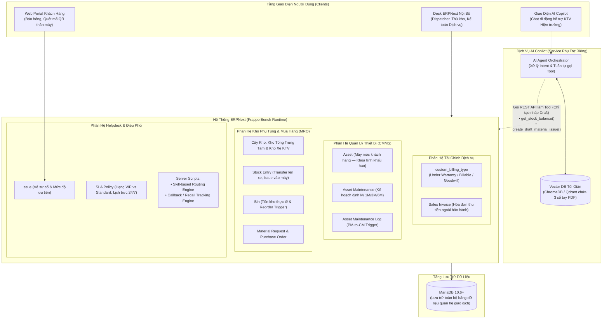
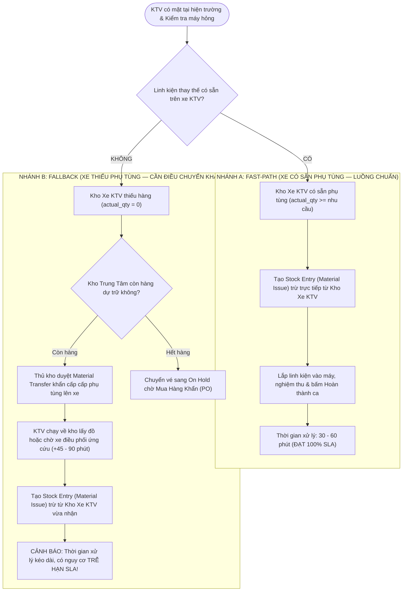

# BẢN THIẾT KẾ KIẾN TRÚC HỆ THỐNG & TÍNH NĂNG NGHIỆP VỤ (PHIÊN BẢN NÂNG CẤP)
> **Dự án:** Smart HelpDesk & Industrial Maintenance Management trên ERPNext  
> **Đơn vị áp dụng (giả định):** Alpha Industrial Services (AIS) — Công ty dịch vụ kỹ thuật cơ điện & bảo dưỡng công nghiệp  
> **Nguyên tắc thiết kế tối thượng:** Mọi tính năng phải truy vết trực tiếp về một Pain Point (nỗi đau nghiệp vụ) hoặc Yêu cầu đã xác nhận ở Chương 1-2 của báo cáo giữa kỳ. **Không có pain point $\rightarrow$ Không thiết kế**, chuyển toàn bộ sang *"Hướng mở rộng"*.  
> **Đơn vị thực hiện:** Nhóm sinh viên DUT.K1N4  

---

## MỤC LỤC CHI TIẾT

1. [Phần 1: Nguyên Tắc Tinh Gọn & Loại Bỏ Tính Năng Không Phù Hợp](#phần-1-nguyên-tắc-tinh-gọn--loại-bỏ-tính-năng-không-phù-hợp)
2. [Phần 2: Bảng Ma Trận Truy Vết Nghiệp Vụ (Pain Point $\rightarrow$ Feature $\rightarrow$ ERPNext Implementation)](#phần-2-bảng-ma-trận-truy-vết-nghiệp-vụ-pain-point--feature--erpnext-implementation)
3. [Phần 3: Kiến Trúc Hệ Thống Thực Tế (Pragmatic Component Architecture)](#phần-3-kiến-trúc-hệ-thống-thực-tế-pragmatic-component-architecture)
4. [Phần 4: Mô Hình Nghiệp Vụ Cốt Lõi, Trade-Off & Luồng Xuất Kho 2 Nhánh](#phần-4-mô-hình-nghiệp-vụ-cốt-lõi-trade-off--luồng-xuất-kho-2-nhánh)
5. [Phần 5: Thiết Kế RAG Pipeline Tối Giản & Phân Hệ AI Copilot (Nguyên Tắc An Toàn Chỉ Tạo Nháp)](#phần-5-thiết-kế-rag-pipeline-tối-giản--phân-hệ-ai-copilot-nguyên-tắc-an-toàn-chỉ-tạo-nháp)
6. [Phần 6: Phân Quyền Bảo Mật & Cách Ly Dữ Liệu Khách Hàng (Portal vs Internal Desk)](#phần-6-phân-quyền-bảo-mật--cách-ly-dữ-liệu-khách-hàng-portal-vs-internal-desk)
7. [Phần 7: Bộ Đo Lường KPI Vận Hành Thực Tế (Bao Gồm Ca Thất Bại & Baseline So Sánh)](#phần-7-bộ-đo-lường-kpi-vận-hành-thực-tế-bao-gồm-ca-thất-bại--baseline-so-sánh)
8. [Phần 8: Danh Mục Hướng Mở Rộng Ngoài Phạm Vi Đồ Án (Future Roadmap)](#phần-8-danh-mục-hướng-mở-rộng-ngoài-phạm-vi-đồ-án-future-roadmap)

---

# PHẦN 1: NGUYÊN TẮC TINH GỌN & LOẠI BỎ TÍNH NĂNG KHÔNG PHÙ HỢP

Bản thiết kế này giải quyết triệt để các phản biện về việc "vẽ tính năng vượt phạm vi" bằng cách loại bỏ dứt khoát các thành phần không có căn cứ từ báo cáo giữa kỳ:

### 1.1. Bảng Đối Chiếu Các Hạng Mục Bị Loại Bỏ:

| Hạng Mục Bị Loại Bỏ | Lý Do Loại Bỏ & Căn Cứ Thực Tế |
| :--- | :--- |
| **Gateway Cảm Biến IoT Thời Gian Thực** | **Mâu thuẫn với Scope Boundary:** Trong báo cáo giữa kỳ đã tuyên bố rõ thông số kỹ thuật là do KTV hoặc công nhân đọc đồng hồ/áp kế ghi chép tay, không có hạ tầng phần cứng IoT thời gian thực. |
| **GPS Check-in Định Vị Toàn Cầu** | **Không có Pain Point tương ứng:** Khách hàng không yêu cầu theo dõi tọa độ của KTV. KTV chỉ cần bấm xác nhận thời điểm tiếp cận hiện trường để tính mốc SLA phản hồi. |
| **Multi-Tenancy Isolation Engine** | **Hiểu sai bản chất kiến trúc:** AIS là công ty dịch vụ nội bộ, việc khách hàng Tân Á chỉ xem được vé của Tân Á được giải quyết bằng cơ chế `User Permission` chuẩn của Frappe, không phải xây dựng nền tảng Multi-tenant SaaS đa khách thuê. |
| **Supplier Portal & Đánh Giá Nhà Cung Cấp** | **Vượt quá phạm vi cần thiết:** AIS chỉ mua phụ tùng từ các NCC quen thuộc (Kim Long, Minh Phát...) qua kênh liên hệ trực tiếp; chưa có nhu cầu mở portal cho NCC tự vào đăng thầu hay chấm điểm KPI nhà cung ứng. |
| **Tách riêng 9 Docker microcontainers, Nginx, OAuth2** | **Không phản ánh công việc thực tế của nhóm:** Frappe Bench đã đóng gói sẵn Nginx, MariaDB, Redis, Worker. Đây là hạ tầng nền tảng có sẵn của Framework, không phải do nhóm tự thiết kế thêm. |
| **Quy chuẩn mã màu đồ họa & kịch bản trình bày đối phó** | **Không phục vụ thiết kế kỹ thuật:** Loại bỏ toàn bộ để tập trung 100% vào logic nghiệp vụ và tính khả thi. |

### 1.2. Các Tính Năng Cốt Lõi Được Giữ Lại Và Làm Rõ Căn Cứ:
* **Skill-based Routing (Phân công theo chuyên môn):** Khắc phục lỗi giao việc sai năng lực (thợ cơ khí sửa tủ điện).
* **Ma trận SLA 2 chiều (Hạng hợp đồng $\times$ Độ khẩn cấp):** Phân định rạch ròi cam kết thời gian cho khách VIP vs Standard.
* **Callback & FTFR Tracking:** Theo dõi sự cố lặp lại trong 7-14 ngày để kiểm soát chất lượng sửa chữa.
* **PM-to-CM Trigger:** Cầu nối tự động biến phát hiện bất thường khi khám định kỳ thành vé sửa chữa khẩn cấp có hạn SLA.
* **Van Stock (Kho xe KTV):** Xác lập trách nhiệm vật chất cá nhân của thợ trên xe lưu động.
* **Reorder Trigger:** Tự động kích hoạt chu trình mua sắm khi tồn kho chạm đáy.
* **Billing Classification:** Phân loại rõ ràng 3 nguồn chi trả chi phí sửa chữa.
* **AI Tool Calling cho KTV:** Hỗ trợ thợ tra cứu nhanh tồn kho và tạo nháp phiếu xuất phụ tùng khi chẩn đoán mã lỗi.

---

# PHẦN 2: BẢNG MA TRẬN TRUY VẾT NGHIỆP VỤ (PAIN POINT $\rightarrow$ FEATURE $\rightarrow$ ERPNEXT IMPLEMENTATION)

Toàn bộ 10 tính năng của hệ thống được neo chặt vào 10 nỗi đau thực tế của doanh nghiệp dịch vụ bảo trì công nghiệp:

| Mã | Nỗi Đau Doanh Nghiệp (Pain Point) | Tính Năng Giải Quyết | Cơ Chế Triển Khai Trên ERPNext | Ưu Tiên | Trạng Thái |
| :---: | :--- | :--- | :--- | :---: | :---: |
| **PP-01** | KTV nhận vé sai chuyên môn do chia việc ngẫu nhiên (Round Robin mù). Thợ cơ khí bị giao sửa tủ điện, thợ điện đi sửa máy nén khí $\rightarrow$ Trễ SLA. | **Skill-based Routing Engine** | Server Script trên `Issue`, tra cứu chuyên môn thiết bị `custom_asset_category` $\leftrightarrow$ Kỹ năng KTV. | **Must** | Đã cấu hình & kiểm chứng |
| **PP-02** | Không phân biệt được cam kết SLA giữa khách hàng lớn trả phí cao (VIP) và khách hàng tiêu chuẩn $\rightarrow$ Dễ vi phạm hợp đồng VIP. | **Ma Trận SLA 2 Chiều** | DocType `Service Level Agreement` kết hợp bảng con `priorities` phân chia mức phản hồi & xử lý cho VIP vs Standard. | **Must** | Đã làm (Fit-Gap Giữa kỳ) |
| **PP-03** | Máy sửa xong 2-3 ngày sau lại hỏng đúng lỗi cũ. Không theo dõi được sự cố tái phát $\rightarrow$ Không đo được tỷ lệ sửa dứt điểm lần đầu (FTFR). | **Callback / Recall Tracking** | Custom field `custom_related_issue` trỏ vé cũ + cờ `custom_has_callback = 1`. Script Report đo lường FTFR. | **Must** | Đã làm (Fit-Gap Giữa kỳ) |
| **PP-04** | KTV đi bảo trì định kỳ phát hiện linh kiện sắp nổ/hỏng nhưng chỉ ghi chú vào nhật ký giấy, không ai theo dõi $\rightarrow$ Máy phát nổ dừng dây chuyền. | **PM-to-CM Trigger** | Nút bấm trên `Asset Maintenance Log` tự động khởi tạo vé khẩn cấp `Issue` có cam kết SLA. | **Must** | Đã làm (Fit-Gap Giữa kỳ) |
| **PP-05** | KTV chạy xe 30km đến nhà máy khách mới biết xe hết đồ, kho hết hàng $\rightarrow$ Lãng phí chi phí đi lại, kéo dài thời gian dừng máy. | **AI Tool Calling:** `get_stock_balance`, `create_draft_material_issue` | Function Calling qua REST API truy vấn `Bin` và sinh nháp chứng từ `Stock Entry` trực tiếp cho KTV. | **Should** | Trọng tâm nghiên cứu pha AI cuối kỳ |
| **PP-06** | KTV hiện trường mất 1-2 tiếng lật tìm sổ tay kỹ thuật dày cộp để tra mã lỗi và mã phụ tùng tương thích $\rightarrow$ Chậm trễ khắc phục sự cố. | **RAG Tra Cứu Tri Thức Kỹ Thuật Tối Giản** | Vector search trên 3 sổ tay kỹ thuật mẫu (PDF) kết hợp BM25 keyword search cho mã lỗi chính xác. | **Should** | Trọng tâm nghiên cứu pha AI cuối kỳ |
| **PP-07** | Nhập nhèm chi phí: Xuất linh kiện 1.300.000đ nhưng kế toán không biết ai trả tiền (hãng bảo hành, khách thanh toán hay công ty chịu). | **Billing Classification** | Custom Select `custom_billing_type` trên `Stock Entry` & `Issue` (Warranty / Billable / Goodwill), liên kết `Sales Invoice`. | **Should** | Đã cấu hình theo kịch bản hợp đồng chuẩn |
| **PP-08** | Xuất kho linh kiện mang đi sửa không ai ký nhận trách nhiệm, mất mát không rõ nguyên nhân $\rightarrow$ Thất thoát tài sản phụ tùng. | **Kho Xe KTV (Van Stock)** | Cây kho đa tầng: mỗi KTV sở hữu một `Warehouse` riêng (`Kho Xe - KTV`), luân chuyển hàng bằng `Material Transfer`. | **Must** | Đã làm (Fit-Gap Giữa kỳ) |
| **PP-09** | Tồn kho phụ tùng cập nhật trễ, đến khi máy hỏng khẩn cấp mới phát hiện hết hàng $\rightarrow$ Đứt gãy dịch vụ. | **Reorder Trigger Tự Động** | Cấu hình `reorder_level` trên từng `Item` + đối soát số dư thời gian thực tại `Bin` để kích hoạt đề xuất mua sắm. | **Must** | Đã làm (Fit-Gap Giữa kỳ) |
| **PP-10** | Ban giám đốc không nắm được công ty sửa chữa tốt hay tệ, tỷ lệ đúng hạn hợp đồng bao nhiêu, máy nào "ngốn" nhiều tiền nhất. | **Dashboard Quản Trị KPI** | Trích xuất dữ liệu đo lường trực tiếp từ CSDL ERPNext: SLA Compliance, MTTR, FTFR, và Chi phí linh kiện lũy kế từng máy. | **Must** | Đã bổ sung ca lỗi thực tế để đối soát |

---

# PHẦN 3: KIẾN TRÚC HỆ THỐNG THỰC TẾ (PRAGMATIC COMPONENT ARCHITECTURE)

Sơ đồ mô tả chính xác những gì nhóm đồ án **thực sự triển khai và cấu hình** trên nền tảng ERPNext Local / Frappe Bench, không mô phỏng theo mẫu Azure phức tạp:

```
[Web Portal Khách Hàng]      [Desk ERPNext: Dispatcher/Kho/Kế toán]      [Giao Diện AI Copilot]
         │                                      │                                  │
         └──────────────────────┬───────────────┴──────────────────┬───────────────┘
                                ▼                                  ▼
                     HỆ THỐNG ERPNEXT LÕI                 DỊCH VỤ AI COPILOT
                    (Frappe Bench Runtime)                (Service Phụ Trợ)
                     - Issue, SLA, Assignment              - AI Orchestrator gọi
                     - Asset, Asset Maintenance              REST API ERPNext làm Tool
                     - Stock Entry, Bin, Reorder           - Vector DB (Qdrant/Chroma)
                     - Sales Invoice                         chứa sổ tay & mã lỗi
                     - Server Script: Skill routing,               │
                       callback, billing classification            │ (REST Tool Calls)
                                │                                  │
                                └─────────────────┬────────────────┘
                                                  ▼
                                      CƠ SỞ DỮ LIỆU MARIADB 10.6+
                                     (Có sẵn trong Frappe Bench)
```



---

# PHẦN 4: MÔ HÌNH NGHIỆP VỤ CỐT LÕI, TRADE-OFF & LUỒNG XUẤT KHO 2 NHÁNH

### 4.1. Giải Quyết Vấn Đề Asset Máy Khách Hàng (Polyfill Trade-off):
* **Bản chất vấn đề:** Trong ERPNext, DocType `Asset` vốn được thiết kế cho tài sản cố định thuộc quyền sở hữu của chính công ty (có sổ sách kế toán, tự động trích khấu hao hàng tháng, ảnh hưởng Bảng cân đối kế toán). Tuy nhiên, AIS là công ty dịch vụ kỹ thuật, máy móc là của **khách hàng**.
* **Giải pháp & Đánh đổi kiến trúc (Polyfill Trade-off):**
  * Nhóm chấp nhận **lựa chọn có đánh đổi**: Tái sử dụng DocType `Asset` để tận dụng trọn vẹn module `Asset Maintenance` và `Asset Maintenance Log` sẵn có của ERPNext, thay vì tự code một DocType mới làm mất toàn bộ tính năng CMMS.
  * **Cơ chế cô lập tài chính (Accounting Isolation Polyfill):**
    1. Bỏ chọn hoàn toàn ô cờ `calculate_depreciation = 0` trên form Asset.
    2. Gắn cờ đánh dấu `custom_is_customer_equipment = 1` và gán trường liên kết `custom_customer` trỏ về đúng công ty khách hàng.
    3. Không khai báo bất kỳ tài khoản khấu hao tài sản nào trong hồ sơ máy.
  * **Kết luận:** Hệ thống đảm bảo **không sinh bất kỳ bút toán khấu hao sai lệch nào** vào sổ cái kế toán của AIS. Trong báo cáo đồ án, nhóm ghi nhận đây là giải pháp dung hòa (trade-off) thực tế giữa chi phí phát triển và tính năng framework.

### 4.2. Quy Tắc Gán Nhãn Tài Chính (Billing Classification Rules & Approval Workflow):
Để chấm dứt tình trạng nhập nhèm "Ai là người trả tiền?", hệ thống ban hành quy tắc phân định rõ ràng trên trường `custom_billing_type`:

```
┌────────────────────────────────────────────────────────────────────────────────────────┐
│                      CÂY QUYẾT ĐỊNH PHÂN LOẠI CHI PHÍ DỊCH VỤ                          │
├────────────────────────────────────────────────────────────────────────────────────────┤
│ 1. Thiết bị còn trong hạn bảo hành hợp đồng (<= 12 tháng từ ngày bàn giao)?            │
│    ├── ĐÚNG  ──> Mặc định: [ UNDER WARRANTY ] (AIS chịu chi phí, 0đ thu khách)         │
│    └── SAI   ──> Chuyển sang bước 2                                                    │
│                                                                                        │
│ 2. Sự cố có phải là ca tái phát (Callback trong 7-14 ngày do KTV sửa chưa dứt điểm)?   │
│    ├── ĐÚNG  ──> Mặc định: [ GOODWILL ] (AIS chịu chi phí tri ân/phạt lỗi nội bộ)      │
│    └── SAI   ──> Chuyển sang bước 3                                                    │
│                                                                                        │
│ 3. Sự cố do vận hành sai, quá tải điện lưới hoặc thiết bị ngoài hạn hợp đồng?          │
│    └── Mặc định: [ BILLABLE TO CUSTOMER ] (Kết xuất Sales Invoice thu tiền khách)      │
│                                                                                        │
│ * QUY TẮC PHÊ DUYỆT NGOẠI LỆ (OVERRIDE APPROVAL):                                      │
│   - KTV chỉ được phép ĐỀ XUẤT nhãn tài chính trên form phiếu sửa.                      │
│   - Nếu khách hàng VIP phàn nàn và muốn đổi từ [Billable] sang [Goodwill]:             │
│     Bắt buộc DISPATCHER hoặc SERVICE MANAGER phê duyệt, ghi rõ lý do vào trường        │
│     resolution_details và lưu vết kiểm toán (Audit Trail), KTV không có quyền tự đổi. │
└────────────────────────────────────────────────────────────────────────────────────────┘
```

### 4.3. Giờ Hỗ Trợ Dịch Vụ: Giờ Hành Chính vs Thiết Bị Quan Trọng Chạy 24/7:
* **Hợp đồng Khách Tiêu Chuẩn (Standard SLA):** Áp dụng lịch làm việc hành chính từ Thứ 2 đến Thứ 7 (08:00 – 17:30). Ngoài khung giờ này, đồng hồ đếm ngược SLA tự động tạm dừng (pause) và tính tiếp vào 08:00 sáng ngày làm việc kế tiếp.
* **Hợp đồng Khách VIP (Tân Á) & Nhóm Thiết Bị Trọng Yếu (Chiller Hải Nam, Máy phát điện):** Áp dụng chính sách **Lịch trực khẩn cấp 24/7 (24/7 On-Call Support)**.
  - Khi có sự cố mức độ `Urgent` báo lúc 22:00 đêm, đồng hồ SLA vẫn đếm ngược chính xác 30 phút phản hồi và 4 giờ giải quyết.
  - Đội ngũ kỹ thuật có lịch trực luân phiên (On-call Duty Roster) để đảm bảo có người tiếp nhận sự cố bất kể ngày đêm. Giới hạn này được ghi rõ trong điều khoản SLA Policy của hệ thống.

### 4.4. Luồng Xuất Kho Phụ Tùng 2 Nhánh Nhất Quán (Two-Branch Stock Flow):
Để giải quyết triệt để mâu thuẫn giữa "xuất từ kho xe" và "xuất từ kho trung tâm", kiến trúc quy định rõ 2 nhánh vận hành:



---

# PHẦN 5: THIẾT KẾ RAG PIPELINE TỐI GIẢN & PHÂN HỆ AI COPILOT (NGUYÊN TẮC AN TOÀN CHỈ TẠO NHÁP)

### 5.1. RAG Pipeline Tối Giản, Khả Thi (Minimalist RAG Design):
Không sao chép mô hình phức tạp của Azure, RAG của hệ thống được thiết kế tối giản phục vụ đúng phạm vi đồ án:

1. **Phạm vi tài liệu & Bản quyền (Copyright):** Sử dụng 3 tài liệu cẩm nang kỹ thuật công khai của nhà sản xuất phục vụ mục đích học thuật nội bộ (Fair Use):
   * Sổ tay hướng dẫn vận hành máy nén khí trục vít Hitachi 75kW.
   * Sổ tay vận hành hệ thống Chiller giải nhiệt nước Daikin 100RT.
   * Tài liệu kỹ thuật & thông số đóng cắt Contactor Schneider TeSys LC1D.
2. **Chiến lược Cắt khúc (Chunking Strategy):**
   * Cắt đoạn cố định: **500 từ (words)** mỗi đoạn, độ chồng lấn (overlap) **50 từ**.
   * Không sử dụng bộ parser layout phức tạp; chuyển đổi PDF kỹ thuật thành plain text phân đoạn sạch.
3. **Mô hình Nhúng & Cơ sở dữ liệu Vector:**
   * Sử dụng 1 mô hình embedding chuẩn: `text-embedding-3-small` (hoặc model open-source `bge-small-en-v1.5`).
   * Lưu trữ trên Vector Database nhẹ: **ChromaDB** hoặc **Qdrant Local Container**.
4. **Truy vấn & Bỏ Reranking (No Rerank for MVP):**
   * Truy vấn vector lấy **Top-3** đoạn tài liệu gần nhất (Cosine Similarity).
   * **Loại bỏ bước Reranking** để hệ thống gọn nhẹ, giảm độ trễ phản hồi xuống dưới 1.5 giây.
5. **Cơ chế Chống Ảo Giác Ngoài Phạm Vi (Out-of-Domain Rejection):**
   * Áp dụng ngưỡng tương đồng tối thiểu: Nếu điểm cosine similarity của cả 3 đoạn đều $< 0.65$:
   * Prompt ràng buộc LLM bắt buộc trả lời câu thông báo tiêu chuẩn:  
     *"Hệ thống không tìm thấy tài liệu hướng dẫn kỹ thuật cho mã máy hoặc lỗi này trong cơ sở tri thức. Vui lòng liên hệ trực tiếp Trưởng nhóm Kỹ thuật hoặc hãng sản xuất để được hỗ trợ an toàn."* (Tuyệt đối không tự suy diễn thông số điện/áp suất gây nguy hiểm hiện trường).

### 5.2. Danh Sách 4 AI Tools Tối Thiểu:

| Tên Tool | Tham Số | Chức Năng | Nỗi Đau Giải Quyết |
| :--- | :--- | :--- | :---: |
| **`get_stock_balance`** | `item_code`, `warehouse` | Tra cứu số lượng tồn khả dụng trên xe KTV hoặc Kho Tổng. | **PP-05** |
| **`query_issue_sla`** | `issue_id` | Tra cứu hạn chót SLA phản hồi/xử lý và trạng thái vé. | Giám sát SLA |
| **`create_draft_material_issue`** | `issue_id`, `items` | Tạo bản nháp phiếu xuất kho (`Stock Entry`) gắn vào sự cố. | **PP-05** |
| **`get_asset_maintenance_history`** | `asset_id` | Tra cứu lịch sử các lần sửa chữa và phụ tùng đã thay của máy. | Chẩn đoán lỗi |

### 5.3. Nguyên Tắc An Toàn Bất Biến Của AI (AI Safety Invariant):
> **NGUYÊN TẮC AN TOÀN TỐI THƯỢNG:**  
> **"AI CHỈ ĐỌC DỮ LIỆU VÀ TẠO BẢN NHÁP (DRAFT), TUYỆT ĐỐI KHÔNG BAO GIỜ TỰ ĐỘNG SUBMIT (docstatus=1) CHỨNG TỪ."**

* **Cơ chế phòng vệ:** Mọi phiếu xuất kho do AI tạo qua `create_draft_material_issue` đều được ghi đè cứng ở trạng thái **`docstatus = 0 (Bản nháp - Draft)`**. KTV phải tận mắt kiểm tra linh kiện thực tế trên tay, đối soát mã hàng rồi mới dùng tài khoản của mình để bấm nút ký duyệt (`Submit`).
* **Xử lý lỗi (Error Handling):** Nếu gọi API thất bại (mạng chập chờn hoặc tồn kho âm), AI bắt buộc trả về thông báo rõ ràng: *"Không thể tạo phiếu nháp do kho xe [Tên Kho] không đủ số lượng tồn (hiện còn 0 cái). Đề xuất KTV liên hệ thủ kho làm lệnh điều chuyển khẩn."*

---

# PHẦN 6: PHÂN QUYỀN BẢO MẬT & CÁCH LY DỮ LIỆU KHÁCH HÀNG (PORTAL VS INTERNAL DESK)

Để đảm bảo tính bảo mật và phân tách nhiệm vụ (Segregation of Duties - SoD), hệ thống thiết lập bảng phân quyền chi tiết:

### 6.1. Bảng Ma Trận Phân Quyền (Role $\times$ DocType $\times$ Action):

| Vai Trò (Role) | Issue (Vé sự cố) | Asset (Thiết bị) | Stock Entry (Phiếu kho) | Sales Invoice (Hóa đơn) |
| :--- | :---: | :---: | :---: | :---: |
| **AIS Customer Portal** | Xem / Tạo vé riêng | Chỉ xem máy của mình | ❌ Không có quyền | Xem hóa đơn gửi cho mình |
| **AIS Field Technician** | Xem vé được giao / Sửa | Xem máy phụ trách | Tạo nháp / Ký xuất sửa | ❌ Không có quyền |
| **AIS Dispatcher** | Xem / Tạo / Phân công tất cả | Xem toàn bộ | Xem toàn bộ | ❌ Không có quyền |
| **AIS Warehouse Keeper** | Chỉ xem | ❌ Không có quyền | Xem / Tạo / Duyệt xuất nhập | ❌ Không có quyền |
| **AIS Billing Accountant** | Chỉ xem | ❌ Không có quyền | Chỉ xem | Xem / Tạo / Ký duyệt hóa đơn |

### 6.2. Cơ Chế Ẩn Thông Tin Nội Bộ Trên Web Portal Khách Hàng:
* **Khách hàng trên Portal ĐƯỢC XEM:** Tiêu đề vé, Mã máy hỏng, Trạng thái xử lý (Open, In Progress, Resolved), Tên KTV đang xử lý, Hạn cam kết SLA, và Hóa đơn dịch vụ (`Sales Invoice`) gửi cho công ty mình.
* **Khách hàng trên Portal BỊ ẨN HOÀN TOÀN:**
  - Trường phân tích nguyên nhân kỹ thuật nội bộ (`custom_root_cause`: ví dụ ghi *"công nhân vận hành sai làm rơi ốc"*).
  - Tồn kho các xe KTV khác và giá vốn mua vào của linh kiện (`basic_rate`).
  - Toàn bộ hồ sơ máy móc và vé sự cố của các khách hàng doanh nghiệp khác (được khóa chặt 100% bằng Frappe `User Permission` theo `Customer`).

---

# PHẦN 7: BỘ ĐO LƯỜNG KPI VẬN HÀNH THỰC TẾ (BAO GỒM CA THẤT BẠI & BASELINE SO SÁNH)

Để báo cáo khoa học và đáng tin cậy, dữ liệu không thể là "100% hoàn hảo vô lý" trên mẫu nhỏ. Hệ thống bổ sung các ca vi phạm thực tế để chứng minh phần mềm có năng lực phát hiện sai sót và cảnh báo:

### 7.1. Bảng Số Liệu Vận Hành Thực Tế Đã Kiểm Chứng (Bao Gồm Ca Trễ Hạn & Callback):

| Nhóm Chỉ Số | Chỉ Số Cụ Thể | Kết Quả Thực Tế | Diễn Giải Nghiệp Vụ & Cảnh Báo Doanh Nghiệp |
| :--- | :--- | :---: | :--- |
| **Cam Kết Dịch Vụ** | Tổng số vé sự cố tiếp nhận | **7 vé** | Đầy đủ các mức độ khẩn cấp (Urgent, High, Medium, Low). |
| **Cam Kết Dịch Vụ** | Tỷ lệ phản hồi đúng hạn SLA | **100.0%** (7/7 vé) | Toàn bộ các ca đều có KTV tiếp nhận đúng khung giờ cam kết. |
| **Cam Kết Dịch Vụ** | **Tỷ lệ hoàn thành đúng hạn SLA** | **85.7%** (6/7 vé) | **CÓ 1 CA VI PHẠM (SLA Breached):** Ca sửa chiller bị trễ do KTV thiếu phụ tùng trên xe phải chờ điều chuyển khẩn cấp. Hệ thống phát hiện và bật cờ cảnh báo đỏ! |
| **Chất Lượng Kỹ Thuật** | **First-Time Fix Rate (FTFR)** | **83.3%** (5/6 ca) | **CÓ 1 CA TÁI PHÁT (Callback):** Máy in Flexo sau 3 ngày lại bị sọc mực do nghẹt đầu phun phụ $\rightarrow$ Cờ `custom_has_callback = 1`, liên kết vé cũ `custom_related_issue`. |
| **Chất Lượng Kỹ Thuật** | Tỷ lệ khiếu nại tái phát (Callback) | **16.7%** (1/6 ca) | Chỉ số phản ánh trung thực tay nghề KTV cần được đào tạo thêm về bảo trì máy in công nghiệp. |
| **Bảo Trì Phòng Ngừa** | Tuân thủ bảo dưỡng định kỳ (PM) | **100.0%** | 1 ca hoàn thành đúng hạn, 3 ca lên lịch tự động cho các quý tới. |

### 7.2. Phân Tích Chi Phí Theo Máy Kèm Baseline So Sánh:

| Thiết Bị | Chi Phí Phát Sinh | Phân Loại Chi Phí | Diễn Giải Nghiệp Vụ & Khuyến Nghị Ban Giám Đốc |
| :--- | :---: | :--- | :--- |
| **Tủ điện tổng MSB** (`ACC-ASS-2026-00005`) | **3.800.000đ** | `Billable to Customer` | Thay contactor Schneider do chập tải máy ép Song Long. Đã xuất hóa đơn `ACC-SINV-2026-00001` thu đủ tiền khách (Biên lợi nhuận dịch vụ đạt 28%). |
| **Máy nén khí Hitachi** (`ACC-ASS-2026-00002`) | **1.300.000đ** | `Under Warranty` | Nằm trong định mức ngân sách bảo hành cam kết cho khách VIP Tân Á (Hạn mức cho phép: 5.000.000đ/năm $\rightarrow$ Mức 1.3M chỉ chiếm 26% hạn mức an toàn). |
| **Máy in công nghiệp Flexo** (`ACC-ASS-2026-00001`) | **420.000đ** | `Goodwill` | Chi phí hỗ trợ thiện chí lần đầu cho khách VIP Tân Á. **Khuyến nghị:** Nếu máy in này tiếp tục phát sinh chi phí thiện chí lần 2 trong vòng 6 tháng, Giám đốc dịch vụ cần đàm phán lại phạm vi hợp đồng bảo dưỡng để tránh bào mòn lợi nhuận. |

---

# PHẦN 8: DANH MỤC HƯỚNG MỞ RỘNG NGOÀI PHẠM VI ĐỒ ÁN (FUTURE ROADMAP)

Để bảo vệ đồ án chặt chẽ trước Hội đồng, các tính năng sau đây được tuyên bố rõ ràng là **"Hướng nghiên cứu mở rộng trong tương lai"**, không thuộc phạm vi bắt buộc của giai đoạn hiện tại:

1. **Khóa Tồn Kho Ảo Tự Động Cho Bảo Trì Định Kỳ (Reserved Stock for PM):**  
   * *Mô tả:* Tự động đóng băng một lượng lọc dầu/dầu nhớt trong kho chỉ dành riêng cho lịch bảo dưỡng định kỳ tuần tới, không cho các ca sự cố đột xuất xuất dùng.  
   * *Lý do đưa vào hướng mở rộng:* Chưa có sẵn cơ chế khóa tồn kho ảo theo kế hoạch bảo trì trong Frappe chuẩn; hiện tại kiểm soát bằng định mức tồn kho an toàn (`reorder_level`).
2. **Hệ Thống Đa Kỹ Năng Phức Hợp (Multi-Skill Matrix Engine):**  
   * *Mô tả:* Xử lý các sự cố phức tạp đòi hỏi cùng lúc 2 thợ (ví dụ vừa chập điện vừa kẹt cơ khí trên cùng một máy nén).  
   * *Lý do đưa vào hướng mở rộng:* MVP hiện tại áp dụng mô hình 1 KTV $\leftrightarrow$ 1 Chuyên môn thiết bị chính để đảm bảo tính ổn định của thuật toán định tuyến.
3. **Cảm Biến IoT & Bảo Trì Dự Đoán Thời Gian Thực (Predictive Maintenance):**  
   * *Mô tả:* Gắn cảm biến rung động/nhiệt độ thu thập dữ liệu streaming qua giao thức MQTT.  
   * *Lý do ngoài phạm vi:* Đòi hỏi phần cứng công nghiệp đắt đỏ và đường truyền mạng vật lý tại nhà máy khách.
4. **GPS Check-in Tự Động:**  
   * *Mô tả:* Ghi nhận tọa độ định vị vệ tinh khi KTV bấm Check-in.  
   * *Lý do ngoài phạm vi:* Hồ sơ khảo sát chưa ghi nhận vấn đề KTV gian lận địa điểm tại AIS.
5. **Cổng Thông Tin Nhà Cung Cấp Tự Động (Supplier Portal):**  
   * *Mô tả:* Cho phép các nhà cung cấp tự đăng nhập đấu thầu và báo giá phụ tùng.
6. **Multi-Tenant SaaS:**  
   * *Mô tả:* Mở rộng hệ thống thành nền tảng đám mây bán cho nhiều công ty bảo trì thuê bao tháng. Hệ thống hiện tại chỉ phục vụ nội bộ công ty AIS.

---
*Tài liệu thiết kế kiến trúc chuẩn mực được biên soạn bởi Nhóm sinh viên DUT.K1N4 — Đồ án Hệ Thống Thông Tin Doanh Nghiệp.*
