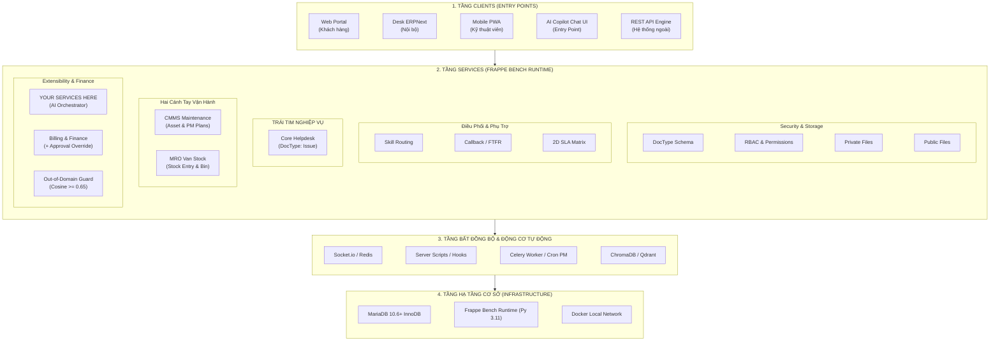

# KỊCH BẢN THUYẾT TRÌNH KIẾN TRÚC HỆ THỐNG SMART HELPDESK & CMMS
## (DỰA TRÊN SƠ ĐỒ TAB 5: TEAMS-MAPPED ARCHITECTURE TRONG DRAW.IO)

> **Dự án:** Smart HelpDesk & Industrial Maintenance Management System trên ERPNext  
> **Tài liệu tham chiếu sơ đồ:** Tab 5 (`5. Teams-Mapped Architecture`) trong [`docs/SYSTEM_ARCHITECTURE_DESIGN.drawio`](file:///e:/DUT.K1N4/HTTT/Project_SmartHelpDesk_Mainternance/docs/SYSTEM_ARCHITECTURE_DESIGN.drawio)  
> **Thời lượng thuyết trình đề xuất:** 7 – 10 phút (+ 5 phút phản biện Q&A)  
> **Mục tiêu cốt lõi:** Dẫn dắt người nghe (Hội đồng chấm thi, Giảng viên hướng dẫn, Kỹ sư doanh nghiệp) hiểu sâu sắc bản chất hệ thống theo một trình tự logic tự nhiên, mạch lạc, xóa bỏ hoàn toàn cảm giác "vẽ sơ đồ đối phó" hoặc "sao chép hình thức".

---

## MỤC LỤC KỊCH BẢN

1. [Phần 1: Mở Đầu & Định Vị Triết Lý Kiến Trúc (1 Phút)](#phần-1-mở-đầu--định-vị-triết-lý-kiến-trúc-1-phút)
2. [Phần 2: Trình Bày Tuần Tự 5 Tầng Kiến Trúc (5 Phút)](#phần-2-trình-bày-tuần-tự-5-tầng-kiến-trúc-5-phút)
   - [2.1. Tầng 1: Cửa ngõ tương tác (Clients / Entry Points)](#21-tầng-1-cửa-ngõ-tương-tác-clients--entry-points)
   - [2.2. Tầng 2: Cột an ninh & Framework Plumbing xuyên suốt](#22-tầng-2-cột-an-ninh--framework-plumbing-xuyên-suốt)
   - [2.3. Tầng 3: Trái tim vận hành & 2 cánh tay nghiệp vụ (Core Hub)](#23-tầng-3-trái-tim-vận-hành--2-cánh-tay-nghiệp-vụ-core-hub)
   - [2.4. Tầng 4: Bộ não điều phối thông minh & Phân hệ AI Extensibility](#24-tầng-4-bộ-năo-điều-phối-thông-minh--phân-hệ-ai-extensibility)
   - [2.5. Tầng 5: Tự động hóa bất đồng bộ & Nền tảng hạ tầng](#25-tầng-5-tự-động-hóa-bất-đồng-bộ--nền-tảng-hạ-tầng)
3. [Phần 3: Kịch Bản Kể Chuyện Luồng Nghiệp Vụ Thực Tế (2 Phút)](#phần-3-kịch-bản-kể-chuyện-luồng-nghiệp-vụ-thực-tế-2-phút)
4. [Phần 4: Cheat-Sheet Đối Soát "Bố Cục Mượn vs Chức Năng Thật"](#phần-4-cheat-sheet-đối-soát-bố-cục-mượn-vs-chức-năng-thật)
5. [Phần 5: Bộ Cẩm Nang Phản Biện Q&A Trước Hội Đồng](#phần-5-bộ-cẩm-nang-phản-biện-qa-trước-hội-đồng)

---

# PHẦN 1: MỞ ĐẦU & ĐỊNH VỊ TRIẾT LÝ KIẾN TRÚC (1 PHÚT)

> [!TIP]
> **Mục tiêu của mở đầu:** Tạo ấn tượng tự tin, trung thực về mặt học thuật và định hình góc nhìn cho người nghe ngay từ giây đầu tiên. Tránh để người nghe tự hỏi *"Tại sao nhìn sơ đồ này quen quen?"*.

### 🎙️ Lời thoại mẫu của người thuyết trình:

> *"Kính thưa Thầy/Cô trong Hội đồng và các bạn,*
>
> *Khi thiết kế kiến trúc cho một hệ thống vận hành phức tạp như **Smart HelpDesk & Bảo trì thiết bị công nghiệp (CMMS)**, bài toán khó nhất không phải là vẽ thật nhiều hộp công nghệ, mà là **làm sao để tổ chức các thành phần một cách có quy củ, phân định rõ ràng giữa Cửa ngõ tương tác, Dịch vụ lõi, Phân hệ mở rộng và Tầng hạ tầng chạy ngầm**.*
>
> *Chính vì vậy, nhóm chúng em đã tham khảo **Mô hình kiến trúc nền tảng (Platform Architecture Pattern)** từ các hệ sinh thái doanh nghiệp tiêu chuẩn cao — cụ thể là mô hình kiến trúc của Microsoft Teams — để làm khung tham chiếu bố cục không gian.*
>
> *Tuy nhiên, nhóm xin khẳng định một nguyên tắc nhất quán: **Chúng em mượn bố cục trình bày chuẩn mực, nhưng 100% ruột bên trong là các thực thể nghiệp vụ có thật của ERPNext và Frappe Framework**, được ánh xạ chính xác để giải quyết đúng 10 bài toán thực tế của doanh nghiệp bảo dưỡng cơ điện AIS. Không có bất kỳ thành phần nào bị vẽ 'ảo' hay thừa thãi.*
>
> *Sau đây, em xin phép dẫn dắt Thầy/Cô đi qua 5 tầng kiến trúc của hệ thống theo trình tự từ ngoài vào trong, từ giao diện người dùng xuống tầng thực thi dữ liệu."*

---

# PHẦN 2: TRÌNH BÀY TUẦN TỰ 5 TẦNG KIẾN TRÚC (5 PHÚT)



---

## 2.1. Tầng 1: Cửa ngõ tương tác (Clients / Entry Points)
*(Vị trí trên sơ đồ: Hộp trắng lớn trên cùng)*

* **Hành động:** Trỏ vào dải `CLIENTS (ENTRY POINTS)` ở trên cùng.
* **Lời thoại:**
  > *"Trước tiên, nhìn vào dải trên cùng của sơ đồ, hệ thống cung cấp **5 điểm vào (Entry Points)** phục vụ độc lập cho 4 đối tượng người dùng khác nhau:*
  > 
  > 1. *Khách hàng báo hỏng qua **Web Portal** bằng cách quét mã QR dán trên thân máy.*
  > 2. *Nhân sự vận hành (Điều phối viên Dispatcher, Thủ kho, Kế toán) làm việc tập trung trên **Desk ERPNext**.*
  > 3. *Kỹ thuật viên tại hiện trường thao tác xử lý công việc qua **Mobile Desk PWA**.*
  > 4. *Đặc biệt, KTV có thêm một cổng tương tác nhanh là **AI Copilot Chat UI** — đóng vai trò giao diện hội thoại tự nhiên để hỏi đáp sự cố.*
  > 5. *Và cuối cùng là **Frappe REST API Engine** để tích hợp dữ liệu với các hệ thống bên ngoài.*
  > 
  > *Điểm mấu chốt ở đây: **AI Copilot Chat UI chỉ là một Entry Point** phía giao diện người dùng, chứ không phải bộ não xử lý. Bộ não AI sẽ nằm ở tầng dịch vụ bên dưới."*

---

## 2.2. Tầng 2: Cột an ninh & Framework Plumbing xuyên suốt
*(Vị trí trên sơ đồ: 4 cột dọc màu xám đậm `DocType Schema`, `User Permissions & RBAC`, `Private Files`, `Public Files` ở góc trái)*

* **Hành động:** Trỏ vào 4 cột dọc màu tối ở bên trái khối Services.
* **Lời thoại:**
  > *"Đi xuống tầng **SERVICES (FRAPPE BENCH RUNTIME)**, xin Thầy/Cô chú ý vào 4 cột dọc màu tối ở góc trái.*
  > 
  > *Trong các hệ thống lớn như Microsoft Teams, dải dọc này là nơi đặt **Azure Active Directory** và các dịch vụ lưu trữ nền tảng SharePoint/OneDrive. Trong hệ thống Smart HelpDesk của chúng em:*
  > - *Cột an ninh **User Permissions & Role-Based Access Control (RBAC)** đứng sừng sững xuyên suốt toàn bộ hệ thống. Nhờ cơ chế này, khách hàng Tân Á chỉ xem được tài sản của Tân Á, KTV chỉ thấy kho xe của riêng mình, loại bỏ hoàn toàn rủi ro rò rỉ dữ liệu mà không cần phải viết thêm một lớp bảo mật microservice cồng kềnh.*
  > - *Ba cột còn lại là **DocType Schema & ORM** định nghĩa cấu trúc dữ liệu, cùng hai cơ chế phân loại lưu trữ tệp đính kèm của Frappe: **Private Files** (cho chứng từ nội bộ, hóa đơn) và **Public Files** (cho hình ảnh báo hỏng công khai)."*

---

## 2.3. Tầng 3: Trái tim vận hành & 2 cánh tay nghiệp vụ (Core Hub)
*(Vị trí trên sơ đồ: Khối xanh dương đậm `Core Helpdesk services` ở trung tâm và 2 khối xanh lá / cam `CMMS` & `MRO` bên phải)*

* **Hành động:** Trỏ vào khối xanh dương `Core Helpdesk services`, sau đó mở rộng sang 2 khối `CMMS` và `MRO`.
* **Lời thoại:**
  > *"Bây giờ chúng ta tiến vào **Trái tim vận hành** của toàn bộ hệ thống.*
  > 
  > *Trung tâm của sơ đồ là khối màu xanh dương đậm: **Core Helpdesk Services**, được hiện thực hóa bằng DocType `Issue`. Mọi yêu cầu bảo dưỡng, sửa chữa khẩn cấp hay khiếu nại dịch vụ đều bắt đầu và kết thúc tại đây.*
  > 
  > *Tuy nhiên, một hệ thống bảo dưỡng kỹ thuật không thể chạy một mình nếu thiếu 2 phân hệ vận hành chủ chốt — được bố trí như **hai cánh tay đắc lực** ở bên phải:*
  > 
  > 1. *Phía trên là **CMMS Equipment Maintenance** (màu xanh lá): Quản lý vòng đời tài sản (`Asset`) và kế hoạch bảo trì định kỳ (`Asset Maintenance Plan`).*
  > 2. *Phía dưới là **MRO Van Stock & Supply Chain** (màu cam): Quản lý kho xe di động của từng kỹ thuật viên (`Warehouse - Kho Xe KTV`), xuất nhập vật tư phụ tùng qua `Stock Entry` và kiểm soát ngưỡng tái đặt hàng tại `Bin`.*
  > 
  > *(Ghi chú nhanh cho Hội đồng): Trên sơ đồ mẫu của Teams, hai vị trí này là Chat và Calling. Tuy nhiên, dự án của chúng em không có tính năng gọi thoại P2P thời gian thực, nên chúng em đã **mượn layout vị trí hai bên Core** để đặt 2 phân hệ xương sống CMMS và MRO. Chúng em đã ghi chú rất minh bạch điều này ở chân trang sơ đồ."*

---

## 2.4. Tầng 4: Bộ não điều phối thông minh & Phân hệ AI Extensibility
*(Vị trí trên sơ đồ: Cụm 3 thanh xếp chồng bên trái Core, khối đỏ `YOUR SERVICES HERE`, và khối tím `Billing & Finance` bên phải)*

* **Hành động:** Trỏ lần lượt từ cụm 3 thanh -> Khối đỏ AI -> Khối Tím và Khối Guardrail.
* **Lời thoại:**
  > *"Vậy làm thế nào để Core Helpdesk vận hành trơn tru và không bị lỗi con người? Câu trả lời nằm ở các khối điều phối bao quanh:*
  > 
  > * **Thứ nhất, cụm 3 bộ lọc logic (bên trái Core):**
  >   - `Skill-based Routing`: Tự động phân công vé dựa trên khớp nối chuyên môn của KTV với loại máy hỏng (thợ cơ khí sửa máy nén, thợ điện sửa biến tần — giải quyết triệt để lỗi chia việc ngẫu nhiên).
  >   - `Callback / FTFR`: Đánh dấu sự cố tái phát trong vòng 7 ngày để đo lường tỷ lệ sửa dứt điểm lần đầu (FTFR).
  >   - `2D SLA Matrix`: Áp ma trận cam kết thời gian 2 chiều giữa Hạng hợp đồng (VIP vs Standard) và Mức độ nghiêm trọng của sự cố.
  > 
  > * **Thứ hai, khối màu đỏ rực rỡ 'YOUR SERVICES HERE' — Phân hệ AI Orchestrator:**
  >   - Đây chính là câu trả lời dứt khoát cho bản chất của AI trong hệ thống: **AI đóng vai trò là một Lõi Nghiệp Vụ Mở Rộng (Extensibility Backend)**.
  >   - Khi KTV chat ở cổng vào, AI Orchestrator sẽ gọi Tool qua REST API (`get_stock_balance`, `get_asset_history`).
  >   - **Nguyên tắc an toàn tối thượng:** AI **CHỈ ĐƯỢC PHÉP TẠO BẢN GHI NHÁP (`docstatus=0`)**. AI tuyệt đối không thể tự động duyệt xuất kho hay ghi sổ tài chính mà không có sự kiểm tra của con người.
  > 
  > * **Thứ ba, cơ chế phòng thủ và thanh quyết toán (bên phải):**
  >   - `Out-of-Domain Guard`: Dùng ngưỡng Cosine Similarity $\ge 0.65$ để chặn đứng việc AI 'bịa lỗi' nếu câu hỏi không thuộc tài liệu kỹ thuật của thiết bị.
  >   - `Billing & Finance`: Tự động phân loại 3 nguồn chi phí (Warranty / Billable / Goodwill). Đặc biệt, hệ thống tích hợp **Approval Override Workflow**: nếu KTV tại hiện trường muốn đổi nhãn từ Bảo hành sang Tính phí khách hàng, bắt buộc phải có sự phê duyệt trực tiếp của Dispatcher."*

---

## 2.5. Tầng 5: Tự động hóa bất đồng bộ & Nền tảng hạ tầng
*(Vị trí trên sơ đồ: Dải 4 nút màu ở giữa, dải Engine Hooks/Scheduler/Vector DB, và hộp trắng dưới cùng INFRASTRUCTURE)*

* **Hành động:** Trỏ xuống nửa dưới sơ đồ (hàng sub-services, hàng engine, và khung hạ tầng).
* **Lời thoại:**
  > *"Để toàn bộ logic trên vận hành thời gian thực mà không làm nghẽn hệ thống, chúng em thiết kế hai tầng phụ trợ ở phía dưới:*
  > 
  > 1. *Hàng dịch vụ bất đồng bộ gồm:*
  >    - **Socket.io Realtime**: Đẩy thông báo tức thì lên màn hình Desk khi có vé khẩn.
  >    - **Redis Cache & Queue**: Lưu bộ nhớ đệm và gánh các tác vụ ngầm.
  >    - **Frappe Email Account (SMTP Relay)**: Gửi email tự động cho khách hàng.
  >    - **Server Scripts & Celery Worker**: Lắng nghe sự kiện (DocEvents Hooks) để đếm lùi thời gian vi phạm SLA.
  >    - **Cron Scheduler Engine & PM-to-CM Trigger**: Định kỳ quét lịch bảo dưỡng phòng ngừa (PM); nếu phát hiện linh kiện xuống cấp, lập tức sinh vé sửa chữa khẩn cấp (CM) có hẹn giờ SLA.
  >    - **ChromaDB / Qdrant**: Lưu trữ vector nhúng của các sổ tay kỹ thuật PDF phục vụ RAG.
  > 
  > 2. *Dưới đáy cùng là **INFRASTRUCTURE & RUNTIME**: Toàn bộ hệ thống chạy trên nền tảng **MariaDB 10.6+ InnoDB** (đảm bảo tính toàn vẹn giao dịch ACID), môi trường **Frappe Bench Python 3.11**, đóng gói trên hạ tầng **Docker Local Containers** an toàn và dễ dàng nhân bản."*

---

# PHẦN 3: KỊCH BẢN KỂ CHUYỆN LUỒNG NGHIỆP VỤ THỰC TẾ (2 PHÚT)

> [!IMPORTANT]
> **Kỹ thuật Storytelling:** Thay vì nói lý thuyết, hãy dẫn dắt Hội đồng đi qua một tình huống nghiệp vụ thực tế (End-to-End Walkthrough) từ đầu đến cuối. Khi câu chuyện chạy, người nghe sẽ thấy mọi khối trên sơ đồ "bừng sáng" và liên kết chặt chẽ với nhau!

### 🎬 Tình huống: "Sự cố Máy Nén Khí Trục Vít tại Nhà Máy Xi Măng Tân Á"

```
[Khách hàng quét QR] 
       │
       ▼
[Web Portal] ──> [Issue Core Hub] ──> [2D SLA Matrix: VIP 2h]
                       │
                       ▼
             [Skill Routing Engine] ──> [Giao việc KTV Nam (Cơ điện)]
                       │
                       ▼
             [KTV bật Copilot Chat] ──> [YOUR SERVICES HERE (AI Backend)]
                                                │
                                                ▼ (Tool Call & RAG Guard)
                                        [Check Kho Xe & Tạo Nháp Stock Entry]
                                                │
                                                ▼
                                        [Thay linh kiện & Bấm Hoàn Tất]
                                                │
                                                ▼
                                  [Callback Tracking: 0 lỗi lặp lại]
                                                │
                                                ▼
                                  [Billing: Approval Override -> Khách trả tiền]
```

* **Lời thoại:**
  > *"Để chứng minh tính thực tế của kiến trúc, em xin minh họa qua một ca xử lý sự cố điển hình:*
  > 
  > 1. ***Báo hỏng:*** *Công nhân Tân Á dùng điện thoại quét mã QR trên máy nén khí, gửi yêu cầu qua **Web Portal (Entry Point 1)**.*
  > 2. ***Tiếp nhận & Áp cam kết:*** *Yêu cầu đổ về **Core Helpdesk**, hệ thống tra cứu hợp đồng thấy Tân Á là khách VIP $\rightarrow$ **2D SLA Matrix** lập tức kích hoạt cam kết: Có mặt trong 2 giờ, sửa xong trong 6 giờ.*
  > 3. ***Điều phối thông minh:*** *Thay vì gán bừa, **Skill-based Routing** đọc mã thiết bị là 'Máy nén khí trục vít' $\rightarrow$ Tự động chuyển vé cho KTV Nguyễn Văn Nam (chuyên môn Cơ - Điện khí nén).*
  > 4. ***Hỗ trợ KTV hiện trường:*** *KTV Nam đến nơi, mở **Mobile PWA** và bật **AI Copilot Chat UI**. Nam gõ: 'Mã lỗi E-04 máy Atlas Copco cần thay gioăng gì, xe tôi còn không?'.*
  > 5. ***AI kiểm soát an toàn:*** *Khối **YOUR SERVICES HERE (AI Orchestrator)** vượt qua **Out-of-Domain Guard**, tra sổ tay kỹ thuật trả lời đúng mã phụ tùng, đồng thời gọi Tool `get_stock_balance` kiểm tra thấy 'Kho Xe KTV Nam' còn đúng 2 chiếc.*
  > 6. ***Tạo nháp vật tư:*** *AI sinh một bản ghi nháp `Stock Entry (docstatus=0)`. KTV Nam kiểm tra mắt thấy đúng phụ tùng, bấm nút Phê duyệt trên PWA để xuất kho xe.*
  > 7. ***Quyết toán tài chính:*** *Sau khi máy chạy êm, hệ thống kiểm tra máy đã hết hạn bảo hành $\rightarrow$ **Billing & Finance** kích hoạt đề xuất tính phí. Dispatcher kiểm tra duyệt **Approval Override**, hệ thống tự động sinh `Sales Invoice` gửi kế toán.*
  > 8. ***Hậu kiểm chất lượng:*** *Vé đóng lại. Trong 7 ngày tiếp theo, **Callback / FTFR Engine** liên tục theo dõi xem máy nén khí này có bị báo hỏng lại hay không để ghi nhận điểm KPI chất lượng cho KTV Nam.*
  > 
  > *Như Thầy/Cô thấy, qua một vòng đời sự cố, toàn bộ các khối từ Clients, Routing, AI, Kho MRO, đến Finance và Hạ tầng đều phối hợp nhịp nhàng như một cỗ máy đồng hồ."*

---

# PHẦN 4: CHEAT-SHEET ĐỐI SOÁT "BỐ CỤC MƯỢN VS CHỨC NĂNG THẬT"

*(Bảng cứu nguy bỏ túi cho người thuyết trình — Giúp tự tin trả lời bất kỳ câu hỏi nào về việc so sánh với sơ đồ Microsoft Teams)*

| Ô Trên Sơ Đồ Mẫu (MS Teams) | Thành Phần Tương Ứng Trong Dự Án | Loại Chuẩn (Chức Năng Thật) | Bản Chất & Ghi Chú Bảo Vệ |
| :--- | :--- | :--- | :--- |
| **Clients** (Desktop, Web, Mobile) | Web Portal, Desk ERPNext, Mobile PWA, REST API | **Entry Point** | Điểm chạm người dùng thật sự của dự án. |
| **AAD / Information Protection** | `User Permissions & RBAC` | **Hạ tầng plumbing** | Giữ duy nhất ở cột trái làm rào chắn an ninh dữ liệu. |
| **Core team services / Middle Tier** | `Core Helpdesk services (DocType: Issue)` | **Lõi nghiệp vụ** | Trái tim tiếp nhận và quản lý vòng đời vé sự cố. |
| **YOUR SERVICES HERE (Red Box)** | `AI Orchestrator & Tool Calling Engine` | **Lõi nghiệp vụ (Mở rộng)** | Nằm ở backend; chỉ sinh chứng từ nháp (`docstatus=0`). |
| **Experimental / MRU Services** | `Skill-based Routing` & `Callback / FTFR` | **Lõi nghiệp vụ** | Các thuật toán điều phối thông minh nội bộ. |
| **Exchange / Calendar** | `2D SLA Matrix` | **Lõi nghiệp vụ** | ⚠️ **Mượn layout:** Teams dùng lưu lịch/mail; Dự án không có Calendar server riêng, mượn vị trí này để nhóm cùng cụm điều phối. |
| **Chat and presence** | `CMMS Equipment Maintenance (Asset)` | **Lõi nghiệp vụ** | ⚠️ **Mượn layout:** Teams dùng chat người-người; Dự án không có P2P Chat, dùng vị trí này để đặt phân hệ Bảo trì thiết bị. |
| **Calling and meeting** | `MRO Van Stock (Stock Entry & Bin)` | **Lõi nghiệp vụ** | ⚠️ **Mượn layout:** Teams dùng gọi thoại/video; Dự án dùng vị trí này để đặt phân hệ Quản lý phụ tùng kho xe. |
| **OneDrive / SharePoint** | `Frappe Private Files` & `Public Files` | **Hạ tầng plumbing** | Lưu trữ tệp đính kèm phân quyền (Private vs Public). |
| **Telemetry / Search / EOP** | `Billing & Finance` & `Out-of-Domain Guard` | **Lõi nghiệp vụ / Phụ trợ** | Kiểm soát doanh thu chi phí và chốt chặn an toàn AI. |
| **Service Fabric / VMs / Containers** | `MariaDB`, `Frappe Bench`, `Docker Engine` | **Hạ tầng plumbing** | Tầng máy chủ CSDL và runtime thực thi trên máy trạm. |

---

# PHẦN 5: BỘ CẨM NANG PHẢN BIỆN Q&A TRƯỚC HỘI ĐỒNG

> [!CAUTION]
> Dưới đây là 5 câu hỏi "hóc búa" nhất mà các thầy cô trong Hội đồng phản biện thường đặt ra khi nhìn vào một sơ đồ kiến trúc quy chuẩn cao. Hãy nắm vững câu trả lời cốt lõi này!

---

### ❓ Câu 1: "Tại sao nhóm lại vẽ sơ đồ giống hệt Microsoft Teams? Có phải các em đang 'râu ông nọ cắm cằm bà kia' không?"

* **Trả lời chuẩn:**
  > *"Dạ thưa Thầy/Cô, chúng em hoàn toàn không copy nguyên xi. Trong công nghệ phần mềm, việc kế thừa **Mẫu kiến trúc nền tảng (Platform Architecture Pattern)** đã được kiểm chứng của các hệ thống lớn là một thực hành kỹ thuật tiêu chuẩn (Best Practice).*
  > 
  > *Chúng em học tập Teams ở **cách tổ chức không gian 4 tầng**: Cửa ngõ (Clients) $\rightarrow$ Dịch vụ lõi (Core Services Hub) $\rightarrow$ Khả năng mở rộng (Extensibility) $\rightarrow$ Hạ tầng (Plumbing & Infrastructure).*
  > 
  > *Tuy nhiên, về mặt **chức năng thật**, nhóm đã thực hiện đối soát nghiêm ngặt: Những gì Teams có mà đồ án không có (như gọi video P2P, Exchange Mail server) chúng em đều tuyên bố rõ ràng là 'Không có tương đương'. Còn các ô trên sơ đồ đều là DocType, Server Script và Docker Container chạy thật trên ERPNext của nhóm."*

---

### ❓ Câu 2: "Tại sao trên sơ đồ vị trí Calling và Meeting lại biến thành MRO Van Stock? Hai cái này có liên quan gì đến nhau đâu?"

* **Trả lời chuẩn:**
  > *"Dạ thưa Thầy/Cô, câu hỏi của Thầy/Cô rất chuẩn xác ạ! Về mặt chức năng, **Calling/Meeting của Teams hoàn toàn KHÔNG tương đương với MRO Van Stock**.*
  > 
  > *Sở dĩ MRO và CMMS nằm ở hai vị trí đối xứng quanh Core là vì **lý do bố cục không gian (Layout Borrowing)**: Trong bài toán Smart HelpDesk, CMMS (quản lý máy) và MRO (quản lý phụ tùng xe) là hai phân hệ vận hành lớn nhất chạy song hành với vé sự cố. Nhóm đã ghi chú rất rõ điều này ngay dưới chân trang của sơ đồ để đảm bảo tính trung thực học thuật cao nhất."*

---

### ❓ Câu 3: "Phân hệ AI của các em rốt cuộc là Giao diện (Entry Point) hay là Lõi Nghiệp Vụ (Core Service)?"

* **Trả lời chuẩn:**
  > *"Dạ thưa Thầy/Cô, hệ thống tách bạch rất dứt khoát 2 phần:*
  > 
  > 1. *Tại tầng Clients: **AI Copilot Chat UI là một Entry Point** — nó chỉ là màn hình trò chuyện trên điện thoại KTV.*
  > 2. *Tại tầng Services: **AI Orchestrator (khối màu đỏ) là một Lõi Nghiệp Vụ Mở Rộng** — nó nằm hoàn toàn ở backend, chịu trách nhiệm nhận prompt, gọi vector search, phân tích context và thực thi Tool Calling qua REST API.*
  > 
  > *Việc tách rời này giúp chúng em có thể đổi mô hình AI (từ GPT sang Claude hay mô hình mã nguồn mở cục bộ) mà không làm ảnh hưởng đến giao diện của KTV."*

---

### ❓ Câu 4: "Cho AI tự động xuất kho linh kiện phụ tùng thì có sợ thất thoát, sai lệch tồn kho không?"

* **Trả lời chuẩn:**
  > *"Dạ thưa Thầy/Cô, đây chính là 'nỗi đau' lớn nhất mà nhóm đã thiết kế rào chắn kỹ thuật để ngăn chặn:*
  > 
  > * **Nguyên tắc Draft Only:** AI chỉ được quyền gọi API sinh ra bản ghi `Stock Entry` ở trạng thái **Nháp (`docstatus = 0`)**.*
  > * **Con người là chốt chặn cuối cùng (Human-in-the-loop):** KTV bắt buộc phải nhìn thấy phiếu nháp, đối chiếu mắt với linh kiện thật trên xe, rồi tự tay nhấn 'Submit' (`docstatus = 1`) thì hàng mới thực sự trừ khỏi `Bin`.*
  > * **Out-of-Domain Guard:** Nếu KTV hỏi một mã linh kiện lạ không có trong tài liệu máy, bộ lọc độ tương đồng Cosine $< 0.65$ sẽ từ chối trả lời ngay lập tức, ngăn ngừa 100% hiện tượng ảo giác (hallucination)."*

---

### ❓ Câu 5: "Tại sao RBAC lại được kéo dài thành cột dọc ở bên trái mà không để thành một dịch vụ bên trong?"

* **Trả lời chuẩn:**
  > *"Dạ thưa Thầy/Cô, trong Frappe Framework, `User Permission` và `Role-Based Access Control` không phải là một module nghiệp vụ mà là một **Bộ lọc tầng sâu (Framework Middleware Layer)**.*
  > 
  > *Mọi truy vấn SQL từ Web Portal, Desk, hay REST API khi đi vào CSDL đều phải đi qua bộ lọc RBAC này trước. Việc đặt nó thành một cột dọc xuyên suốt bên trái thể hiện chính xác tính chất: Nó là bức tường an ninh bảo vệ toàn diện, đảm bảo khách hàng không xem trộm dữ liệu của nhau và KTV không can thiệp vào kho xe của người khác."*

---

# PHẦN 6: CHECKLIST CHUẨN BỊ TRƯỚC KHI LÊN BỤC

- [ ] Đã mở sẵn file [`docs/SYSTEM_ARCHITECTURE_DESIGN.drawio`](file:///e:/DUT.K1N4/HTTT/Project_SmartHelpDesk_Mainternance/docs/SYSTEM_ARCHITECTURE_DESIGN.drawio) tại **Tab 5 (`5. Teams-Mapped Architecture`)**.
- [ ] Phóng to vùng nhìn (Zoom fit) toàn cảnh để thấy rõ 4 tầng và khối chú thích chân trang.
- [ ] Con trỏ chuột sẵn sàng: Khi nói đến đâu, lia chuột khoanh tròn nhẹ vào khối đó (đặc biệt là lúc kể chuyện Luồng nghiệp vụ ở Phần 3).
- [ ] Nhớ kỹ 2 nguyên tắc vàng:
  1. *Luôn tự tin khẳng định: Mượn khung bố cục chuẩn của Teams để cấu trúc hóa hệ thống, nhưng 100% ruột là thực thể Frappe/ERPNext giải quyết bài toán thật.*
  2. *Luôn nhấn mạnh nguyên tắc an toàn: AI chỉ tạo nháp (`docstatus=0`), con người là chốt chặn kiểm duyệt.*
