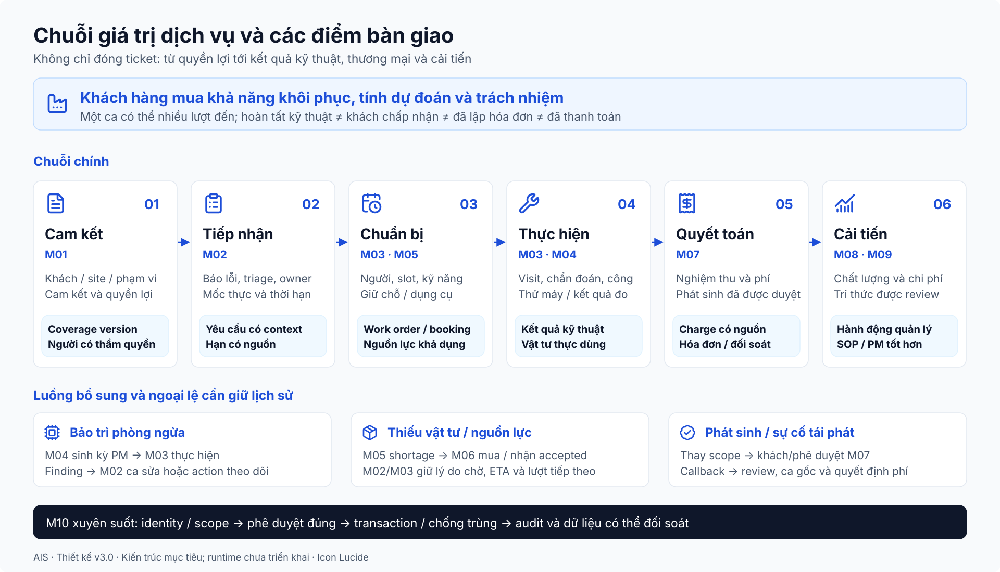
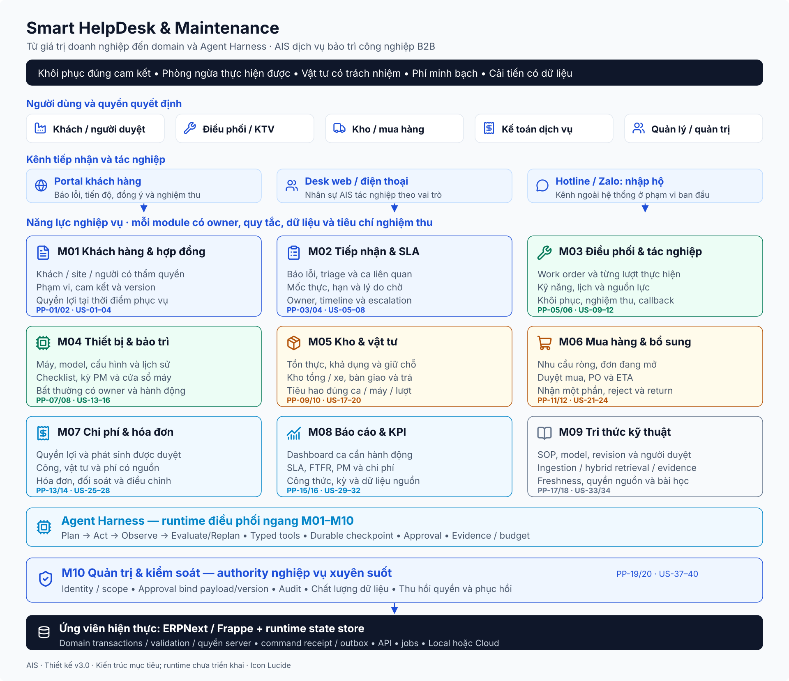

# Thiết kế tổng quan Smart HelpDesk & Maintenance

Phiên bản 3.0 · Bối cảnh: doanh nghiệp dịch vụ bảo trì công nghiệp B2B · 08/10/2026.

Bổ sung lớp AI Agent Harness ngang M01-M10. M09 giữ Knowledge Domain; runtime planning/execution/checkpoint/approval không còn nằm bên trong module tri thức. Nguồn chuẩn về nhất quán nghiệp vụ: [domain/workflow](05_domain_workflow_contracts.md); bộ thiết kế runtime: [AI architecture](ai_architecture/readme.md).

## 1. Doanh nghiệp đang bán giá trị gì?

AIS không đơn thuần bán việc đóng ticket. Khách hàng mua khả năng khôi phục hoạt động của thiết bị, giảm rủi ro gián đoạn và dự đoán được chi phí phục vụ. Một ca có thể đã được KTV đánh dấu hoàn thành nhưng khách chưa xác nhận máy chạy ổn định, vật tư chưa đối soát hoặc khoản phát sinh chưa được chấp thuận. Vì vậy, hệ thống phải theo dõi đồng thời kết quả kỹ thuật, cam kết dịch vụ và kết quả thương mại.

Mô hình thiết kế gồm ba loại dịch vụ: bảo trì định kỳ theo thỏa thuận, sửa chữa đột xuất và kiểm tra/tư vấn theo yêu cầu. Khách có một hoặc nhiều nhà máy, mỗi nhà máy có nhiều thiết bị; người báo lỗi có thể khác người xác nhận hoàn thành hoặc duyệt chi phí. AIS tổ chức đội điều phối, kỹ thuật viên nhiều chuyên môn, kho trung tâm và vật tư trên xe, bộ phận mua hàng, kế toán và quản lý dịch vụ.

Các quy mô và chính sách cụ thể cần được xác nhận bằng khảo sát. Thiết kế không cố định doanh nghiệp có đúng 3 khách, 3 KTV hay 5 máy chỉ vì bộ dữ liệu demo có các số đó.

## 2. Phương pháp thiết kế và nguồn căn cứ

Phân tích bắt đầu từ chuỗi giá trị và các điểm bàn giao. Với mỗi bước, đặt câu hỏi: ai quyết định, ai phải cung cấp thông tin, nếu thiếu thông tin thì điều gì thất bại, doanh nghiệp mất tiền hoặc mất cam kết ở đâu. Từ đó lập pain point có cơ chế nguyên nhân, user story có giá trị và chức năng có đầu ra đo được.

Mô hình tham khảo ở tài liệu Field Service của Microsoft phân biệt work order, hoạt động phục vụ, vật tư và hợp đồng. Thiết kế này vận dụng sự phân biệt đó để tránh gộp mọi thứ vào một ticket; không lựa chọn Dynamics 365 làm nền tảng. [Nguồn tham khảo mô hình work order](https://learn.microsoft.com/en-us/dynamics365/field-service/field-service-architecture).

Phân biệt bảo trì phòng ngừa với bảo trì dự đoán dựa trên phương pháp thực hiện: kỳ/checklist so với dữ liệu tình trạng. Bộ này chọn kế hoạch và thông số nhập tay ở phạm vi ban đầu; không giả định đã có IoT. [Nguồn tham khảo IBM](https://www.ibm.com/think/topics/predictive-vs-preventive-maintenance).

Các tài liệu và mã nguồn dự án là bằng chứng về giải pháp từng được thử, không chứng minh toàn bộ nhu cầu doanh nghiệp. PDF Teams là tham khảo cách phân tầng hình. Pain point và chính sách mới đều có trạng thái giả thuyết trong [bản phân tích](01_phan_tich_doanh_nghiep_va_yeu_cau.md).

## 3. Mục tiêu kinh doanh và phép đo

| Mục tiêu | Giá trị với khách/AIS | Đo bằng gì? | Điều cần tránh |
|---|---|---|---|
| G01: tiếp nhận đầy đủ và minh bạch | Khách không phải lặp thông tin; ca không mất chủ trách nhiệm | Độ trễ ghi nhận, ca thiếu phân loại, thời gian xác nhận tiếp nhận | Chỉ đếm số ticket được tạo |
| G02: khôi phục thiết bị đúng cam kết | Giảm chờ và điều xe lại | SLA phản hồi/khôi phục, first-time fix, thời gian chờ theo nguyên nhân | Đóng ca sớm để đẹp SLA |
| G03: phòng ngừa có hiệu quả | Lịch PM phản ánh cửa sổ máy dừng và nguồn lực | PM đúng hạn, PM bị hoãn, bất thường được xử lý tiếp | Chỉ đếm nhật ký Completed |
| G04: kiểm soát phụ tùng và trách nhiệm | Biết hàng đang ở đâu, dành cho ca nào và đã tiêu hao bao nhiêu | Chênh lệch kho, yêu cầu thiếu hàng, reservation, vật tư theo ca | Coi chuyển lên xe là đã tiêu hao |
| G05: bảo vệ biên lợi nhuận dịch vụ | Không bỏ sót công, tính sai quyền lợi hoặc thu phí chưa được đồng ý | Chi phí ca, giá trị hóa đơn, chi phí tái phát, tỷ lệ tranh chấp | Dùng giá bán thay giá vốn |
| G06: quản trị đáng tin cậy | Quyết định có dữ liệu và người chịu trách nhiệm | Tính đầy đủ dữ liệu, vi phạm quyền, lịch sử phê duyệt | Gán cứng chỉ tiêu 100% |

Chưa đặt tỷ lệ cải thiện hoặc mục tiêu uptime cụ thể. Thu baseline trong giai đoạn khảo sát, rồi thống nhất mục tiêu theo hạng hợp đồng và năng lực thực tế.

## 4. Tác nhân, quyền quyết định và nhu cầu

| Tác nhân | Quyết định/đóng góp | Điều họ cần nhìn thấy |
|---|---|---|
| Người báo lỗi phía khách | Mô tả hiện tượng, thời điểm, máy và mức ảnh hưởng | Mã yêu cầu, người phụ trách, bước tiếp theo |
| Người nghiệm thu/duyệt phí phía khách | Xác nhận kết quả, cho phép phát sinh | Kết quả kiểm tra, đề nghị thay đổi, chi phí và phạm vi đã đồng ý |
| Điều phối dịch vụ | Triage, chọn nguồn lực và sắp thứ tự | Quyền lợi hợp đồng, mức ảnh hưởng, kỹ năng, lịch, phụ tùng và hạn |
| Kỹ thuật viên | Chẩn đoán, tác nghiệp và ghi bằng chứng | Hồ sơ máy, lần sửa trước, SOP, work order, vật tư dành cho ca |
| Trưởng nhóm kỹ thuật | Xử lý ca phức tạp, kiểm tra chất lượng | Chẩn đoán, root cause, ca tái phát và lý do thay người |
| Thủ kho | Nhận, chuyển, cấp và đối soát hàng | Nhu cầu được duyệt, tồn thực, hàng giữ chỗ, người nhận |
| Mua hàng | Chọn nguồn cung và theo dõi đơn | Nhu cầu thiếu, PO mở, thời gian dự kiến và hàng nhận thiếu |
| Kế toán dịch vụ | Đối soát chi phí, lập hóa đơn | Công/vật tư hợp lệ, phạm vi bảo hành, khách đã duyệt khoản nào |
| Quản lý dịch vụ | Xử lý nguy cơ vi phạm và năng lực đội | Ca chờ, SLA, chất lượng sửa, chi phí và hiệu quả PM |
| Quản trị dữ liệu/hệ thống | Cấu hình quyền, danh mục, lịch và chính sách | Thay đổi cấu hình, phạm vi truy cập, chất lượng và khả năng phục hồi |
| Nhà cung cấp | Xác nhận cung ứng và giao phụ tùng | Đơn mua và tiêu chí nhận hàng; liên hệ ngoài hệ thống ở pha đầu |

Vai trò nghiệp vụ không nhất thiết là chức danh độc lập trong doanh nghiệp nhỏ. Một người có thể kiêm nhiều vai trò; quyền và phê duyệt vẫn cần rõ để biết họ đang hành động với trách nhiệm nào.

## 5. Chuỗi giá trị và các điểm thất bại

1. **Cam kết dịch vụ:** xác lập khách, site, máy, phạm vi, lịch phục vụ, giá và trách nhiệm. Điểm thất bại: không biết máy hoặc hạng quyền lợi có nằm trong hợp đồng.
2. **Tiếp nhận và phân loại:** xác nhận sự cố, mức ảnh hưởng, thời điểm, quyền lợi. Điểm thất bại: nhập muộn, yêu cầu trùng, nhầm “máy có cảnh báo” với “dừng dây chuyền”.
3. **Chuẩn bị và điều phối:** chọn người đủ kỹ năng, thời gian tiếp cận, vật tư và điều kiện hiện trường. Điểm thất bại: gán người đang bận hoặc đi thiếu phụ tùng.
4. **Thực hiện và khôi phục:** có thể nhiều lượt đến, đổi chẩn đoán, xin phép phát sinh. Điểm thất bại: gộp nhiều lần đi thành một dòng status, không có chứng cứ kiểm tra máy sau sửa.
5. **Nghiệm thu và thương mại:** phân biệt kỹ thuật hoàn tất, khách chấp nhận và kế toán đã quyết toán. Điểm thất bại: tính phí chưa được duyệt, quên giờ công hoặc vật tư trả lại.
6. **Học từ kết quả:** phân tích tái phát, cập nhật SOP, ngưỡng tồn, kế hoạch PM và năng lực. Điểm thất bại: dữ liệu KPI không ghi nhận thời gian chờ hoặc cửa sổ callback.

Luồng PM tạo ra công việc theo kế hoạch trước khi có sự cố. Khi phát hiện bất thường, phải quyết định giữa xử lý ngay, tạo ca có SLA hoặc theo dõi theo lịch; không phải mọi phát hiện đều biến thành ca Urgent.

## 6. Từ nhu cầu đến các module

| Module | Câu hỏi doanh nghiệp | Năng lực chính | Đầu ra bàn giao |
|---|---|---|---|
| M01 Khách hàng & hợp đồng | Ai có quyền yêu cầu gì và AIS đã hứa gì? | Khách/site/liên hệ, phạm vi máy, cam kết, lịch, giá và phiên bản | Hồ sơ quyền lợi tại thời điểm yêu cầu |
| M02 Tiếp nhận & SLA | Việc gì đã xảy ra, quan trọng ra sao và khi nào phải đáp ứng? | Đa kênh có kiểm soát, triage, hợp nhất trùng, deadline/escalation | Yêu cầu đã phân loại có chủ trách nhiệm |
| M03 Điều phối & tác nghiệp | Ai làm, làm trong lần đến nào và kết quả ra sao? | Work order, lượt tác nghiệp, khả dụng/kỹ năng, nghiệm thu, callback | Kết quả kỹ thuật và thực tế công/vật tư |
| M04 Thiết bị & bảo trì | Máy nào, lịch sử gì, lần PM kế tiếp khi nào? | Hồ sơ kỹ thuật, criticality, checklist, lịch PM, kết quả/bất thường | Công việc PM, phát hiện và lịch sử vòng đời |
| M05 Kho & vật tư | Hàng thật có ở đâu và đã dành cho ca nào? | Tồn, reservation, chuyển/cấp, tiêu hao/trả lại, thu hồi | Giao dịch vật tư có người và ca chịu trách nhiệm |
| M06 Mua hàng & bổ sung | Nhu cầu nào chưa được đáp ứng, mua tới đâu? | Ngưỡng/nhu cầu, duyệt mua, NCC, PO, nhận thiếu/sai | Vật tư được nhận và tiến độ cung ứng |
| M07 Chi phí & hóa đơn | Khách phải trả gì, AIS chịu gì và có đối soát được không? | Ước tính/đồng ý, chính sách phí, công/giá vốn, hóa đơn/điều chỉnh | Quyết toán minh bạch và trạng thái phải thu |
| M08 Báo cáo & KPI | Ca nào cần hành động, năng lực/chi phí đang thay đổi ra sao? | Dashboard hành động, SLA/FTFR/PM, chi phí, dữ liệu nguồn | Chỉ tiêu có kỳ và nguyên nhân để cải tiến |
| M09 Tri thức kỹ thuật | KTV/runtime tìm được nguồn tin cậy khi cần không? | SOP/version/model, ingestion/index, hybrid retrieval, freshness và bài học từ ca | Evidence có scope, applicability, version và provenance |
| M10 Quản trị & kiểm soát | Ai được làm gì và ai đã quyết định? | Identity, quyền theo phạm vi, phê duyệt, audit, chất lượng dữ liệu | Kiểm soát áp dụng cho tất cả module |

M10 kiểm soát ngang toàn hệ thống. Agent Harness là ranh giới runtime ngang: gateway identity → context/planner → bounded controller/observation/evaluator → typed ERP tools/M09 retrieval → checkpoint và approval. Nó phối hợp M01-M10, không là module nghiệp vụ thứ 11. Khả năng phục hồi ERP và tri thức không phụ thuộc agent; scope thiết kế AI v3 phải có protocol/testing trước triển khai.

## 7. Phân rã đối tượng cốt lõi

Thiết kế phân biệt **yêu cầu dịch vụ**, **ca sự cố**, **work order** và **lượt tác nghiệp**. Yêu cầu là việc khách muốn; ca sự cố là vấn đề cần khôi phục; work order là gói việc được giao; lượt tác nghiệp là lần thực hiện cụ thể với người, giờ và kết quả. Một ca sửa cần hai chuyến xe không được xem là hai ca độc lập cũng không được xóa mất lần sửa đầu.

Tương tự, phân biệt **kế hoạch PM** với **lần PM đến hạn**, **giữ chỗ vật tư** với **xuất tiêu hao**, **hoàn thành kỹ thuật** với **nghiệm thu khách**, **đã lập hóa đơn** với **đã thanh toán**. Các sự kiện có thể gần nhau nhưng không đồng nghĩa. Những phân biệt này quyết định dữ liệu, quyền và công thức KPI.

Đối với đồ án, có thể hiện thực một phần đối tượng bằng DocType sẵn có hoặc bảng con; không xóa khái niệm nghiệp vụ chỉ vì ERPNext Issue không có trường tương ứng.

## 8. Ba hành trình cụ thể

### Hành trình A: sửa chữa đột xuất và phát sinh phụ tùng

Quản đốc báo máy nén dừng lúc 08:00. Điều phối ghi yêu cầu, xác minh máy tại site và hợp đồng đang hiệu lực, đánh giá ảnh hưởng sản xuất. Hệ thống chọn hạn theo cam kết, tạo work order cho người có kỹ năng và giữ chỗ lọc dầu. Lượt đầu xác nhận lỗi cần thêm van chưa có trong kho xe; KTV xin thay đổi phạm vi và giá, khách có thẩm quyền đồng ý. Mua hàng cung ứng phần thiếu; lượt hai thay van, thử máy và ghi kết quả. Khách xác nhận khôi phục; kế toán đối soát phần bảo hành và phần ngoài phạm vi; báo cáo giữ nguyên thời gian chờ vật tư, không sửa lịch sử để coi đạt SLA.

### Hành trình B: bảo trì định kỳ có bất thường

Một công việc PM sinh từ lịch hợp đồng và cửa sổ máy dừng mà khách cho phép. Điều phối kiểm tra nguồn lực/vật tư trước ngày thực hiện. KTV hoàn thành checklist và ghi thông số có đơn vị; phát hiện rung vượt ngưỡng nhưng máy còn hoạt động. Trưởng nhóm quyết định tạo ca sửa ưu tiên phù hợp, nối phát hiện và thiết bị; không tự chuyển mọi bất thường thành Urgent. PM được đánh dấu đã kiểm tra, còn ca sửa theo dõi riêng tới khôi phục.

### Hành trình C: sự cố tái phát và trách nhiệm chất lượng

Khách báo lỗi tương tự sau 3 ngày. Hệ thống hiển thị ca gốc, lượt thực hiện và vật tư đã thay. Trưởng nhóm xác định có phải callback của cùng triệu chứng/nguyên nhân hay vấn đề mới, phân công phù hợp và giữ dấu vết quyết định. Chính sách bảo hành sửa chữa xác định phần AIS chịu; KPI tính theo ca gốc đã đủ cửa sổ quan sát, không theo số lần bấm đóng.

## 9. Phạm vi và lựa chọn giai đoạn

Phạm vi tối thiểu xuyên suốt: khách/site/hợp đồng đơn giản, tiếp nhận có mốc, work order và lượt thực hiện, PM theo lịch, kho/giữ chỗ cơ bản, mua có liên kết, đối soát phí, quyền và báo cáo có bằng chứng. Lõi nghiệp vụ gồm cả nhánh thất bại; không nghiệm thu chỉ bằng happy path.

Scope AI v3 gồm single orchestrator, bounded planning/tool execution, hybrid RAG/evidence, state/checkpoint, HITL, idempotency/reconciliation và observability/evaluation. Baseline đọc/đề nghị, persist draft sau approval; không submit ledger hoặc override nghiệp vụ. Phạm vi nâng cấp sau baseline: multi-agent khi có benchmark, tối ưu tuyến/tổ đội, hiệu chuẩn/chứng nhận chi tiết, portal NCC, offline và nhiều chi nhánh.

IoT/predictive maintenance không được đặt trong sơ đồ lõi khi chưa có dữ liệu và thiết bị. Không thiết kế đa tenant SaaS nếu AIS chỉ là một doanh nghiệp phục vụ nhiều khách. Nhiều khách cần cách ly truy cập, không tự làm phát sinh nhu cầu nhiều tenant.

## 10. Tiêu chí tổng thể

Hệ thống phải chứng minh được một hành trình từ quyền lợi → yêu cầu → work order/lượt → vật tư → khôi phục/đồng ý → hóa đơn/chi phí. Một người có quyền hẹp không truy cập được khách hoặc kho khác; thay đổi hợp đồng không đổi hồi tố cam kết ca đã nhận; hai người không giữ chỗ vượt tồn; retry không tạo trùng; khách chưa chấp nhận phát sinh thì hóa đơn không coi khoản đó đã được duyệt.

Các tiêu chí và quyết định mở được phân rã trong [yêu cầu](01_phan_tich_doanh_nghiep_va_yeu_cau.md) và [module](readme.md). ERPNext là ứng viên hiện thực, không là điểm xuất phát của nhu cầu.
