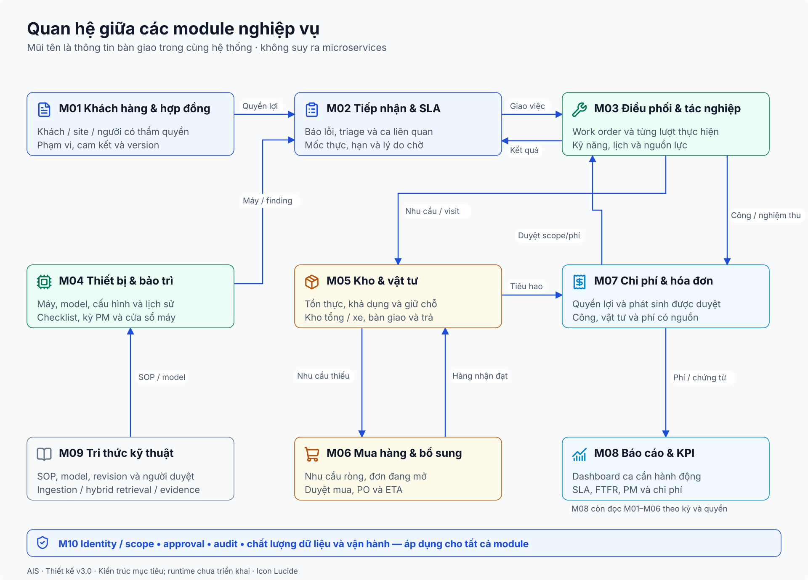
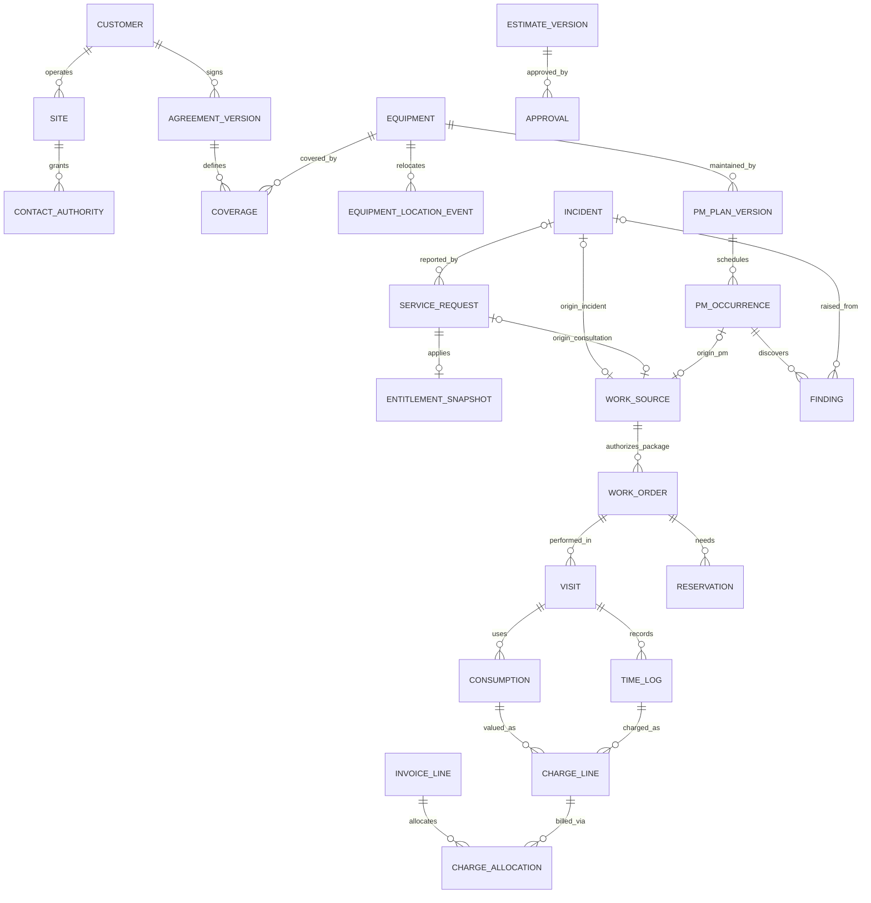

# Kiến trúc logic, hợp đồng module và mô hình dữ liệu

Phiên bản 3.0. [Hợp đồng domain/workflow](05_domain_workflow_contracts.md) là nguồn chuẩn cho ownership, nguồn việc, constraints và phân kỳ. [Agent Harness](ai_architecture/01_agent_harness_architecture.md) là runtime ngang M01-M10, tách khỏi M09 tri thức.

## 1. Các mức kiến trúc

Thiết kế nghiệp vụ trả lời AIS cần năng lực gì; kiến trúc logic xác định ai sở hữu dữ liệu/luồng; kiến trúc thực thi chọn ERPNext/DocType/API; triển khai chọn môi trường và trách nhiệm vận hành. Không dùng số module để suy ra số container. Một hệ thống ERP có thể hiện thực tất cả module trên cùng cơ sở dữ liệu mà vẫn phân ranh trách nhiệm rõ.

Phân vùng đề xuất: cam kết-tiếp nhận M01/M02; thực thi M03/M04; nguồn lực-tài chính M05/M06/M07; cải tiến M08/M09; kiểm soát M10 xuyên suốt. Ranh giới xuất phát từ loại quyết định và sự kiện, không phải thư mục Python.

## 2. Quyền sở hữu thông tin và hợp đồng bàn giao

| Nguồn → đích | Dữ liệu bàn giao | Sự kiện/điều kiện | Bất biến |
|---|---|---|---|
| M01 → M02/M07 | Snapshot coverage, phiên bản và người xác nhận | Quyền lợi xác định tại mốc nhận | Ca/charge giữ source version |
| M02 → M03 | Request/incident, ưu tiên, hạn, owner/site | Triage đủ đầu vào | Công việc không tự sửa cam kết |
| M04 → M03 | PM occurrence, checklist version, nguồn lực | Kỳ đến hạn được duyệt | Plan thay không ghi đè kỳ đã làm |
| M04 → M02 | Finding, máy/site, giờ phát hiện, mức ảnh hưởng | Người xác nhận cần ca sửa | Một finding không sinh ca trùng khi retry |
| M03 → M05 | Work order/visit, item/spec, lượng, needed_at | Nhu cầu chuẩn bị/thực dùng | Reservation khác consumption |
| M05 → M06 | Thiếu đã xét giữ chỗ và nguồn mở | Nhu cầu hợp lệ chưa được đáp ứng | Giữ source tránh đặt lặp |
| M06 → M05 | Receipt accepted theo dòng, qty, location | Hàng đã được nhận/chấp nhận | Không tăng khả dụng bằng rejected |
| M03/M05 → M07 | Công thực, consumption/return, acceptance | Nguồn được xác nhận | Giá vốn không bằng giá bán |
| M07 → M03/M02 | Approval estimate/change, pending/dispute | Đúng người/phiên bản | Không làm vượt phần được chấp thuận |
| M03 → M02 | Restored/acceptance, outcome và mốc | Thử máy/người xác nhận hợp lệ | Không ghi Complete thay cả invoice/payment |
| M01-M07 → M08 | Snapshot/sự kiện/chứng từ theo quyền | Tập nguồn nhất quán theo cut-off | Tổng có source ID và định nghĩa |
| M03/M04 → M09 | Lesson/context/version nguồn dùng | Quality review, publish | Draft lesson không thành SOP tự động |
| M09 → Harness/M03 | Tài liệu, chunks, phiên bản, evidence và quyền | Published/effective/model/scope phù hợp | M09 không sở hữu plan/run hoặc lệnh ghi ERP |
| Harness → M01-M10 | Typed read, đề nghị và command qua gateway | Identity, policy, approval, version và idempotency | Facts/commit authority vẫn thuộc module nguồn |
| M10 ↔ mọi module | Identity/scope/policy/approval/audit | Mỗi thao tác/kênh | Quyền UI và API không lệch nhau |

Mỗi thông điệp có entity ID, version, actor, occurred_at, correlation/idempotency key và outcome. Đây là hợp đồng logic; triển khai ban đầu có thể là hàm server cùng transaction, không bắt buộc message broker.

## 3. Mô hình domain và quan hệ

Đây là mô hình conceptual, chưa phải DDL hoặc schema ERPNext. WorkSource dùng XOR ba FK: incident, request không có incident, hoặc PM occurrence. Request báo cùng incident dùng nguồn incident. Quan hệ optional trong hình không thay thế CHECK/UNIQUE; quy tắc tạo work order/PM không trùng nằm trong [hợp đồng nguồn việc](05_domain_workflow_contracts.md). Một nguồn có nhiều gói việc nhưng mỗi package/version chỉ sinh một work order.

### Từ điển các đối tượng dễ bị gộp sai

| Đối tượng | Ý nghĩa | Không được đồng nhất với |
|---|---|---|
| Service request | Điều khách yêu cầu hoặc liên hệ tiếp nhận | Incident, visit hoặc invoice |
| Incident | Vấn đề kỹ thuật cần khôi phục và nguyên nhân/lịch sử | Mọi tin báo cùng máy |
| Work order | Gói việc được giao có scope và nguồn lực | Người được gán trong ToDo |
| WorkSource | Nguồn chuẩn có loại, FK và version, dùng cho mọi loại công việc | Một chuỗi source_type/source_id không được kiểm tra |
| Visit | Một lần thực hiện, crew/giờ/outcome | Status hiện tại của ticket |
| PM occurrence | Một kỳ đến hạn của plan version | Toàn bộ kế hoạch PM |
| Finding | Bất thường có owner và outcome | Ghi chú không có người xử lý |
| Reservation | Cam kết giữ vật tư theo ca/kho | Giảm ledger/tiêu hao |
| Consumption | Vật tư thực dùng | Chuyển lên xe hoặc dòng invoice |
| Charge line | Phần phí có nguồn và chính sách | Giá vốn thuần hoặc mọi time log |
| Acceptance | Đồng ý kết quả/phạm vi bởi người đúng quyền | KTV bấm hoàn tất |

## 4. Bất biến nghiệp vụ xuyên module

1. Ca có máy/site/khách khớp quyền sở hữu theo thời điểm; chuyển chủ sau không viết lại ca cũ.
2. Coverage, deadline, estimate và checklist được áp theo version; sửa sau cần correction/approval.
3. Giữ chỗ không vượt khả dụng; transfer bảo toàn tổng; receipt/consumption retry không nhân đôi ledger.
4. Technical complete, customer accepted, invoiced, settled là những sự kiện riêng, không suy một từ event còn lại.
5. Một charge không bị thu lặp; cancellation/return có source và không bỏ dấu vết.
6. PM hoàn thành không tự đóng findings; callback có quyết định và ca gốc.
7. Actor/scope được kiểm ở mọi kênh, bao gồm file, export, scheduler và AI tool.

Các bất biến phải có kiểm tra server/transaction; Client Script dùng để hướng dẫn tác nghiệp, không là lớp duy nhất bảo đảm dữ liệu.

## 5. Khả năng hiện thực trên ERPNext

| Năng lực | Thành phần có thể tái sử dụng | Phần cần thiết kế bổ sung |
|---|---|---|
| Customer/site/contact | Customer, Contact, Address | Site/authority và coverage theo hiệu lực |
| Request/incident/SLA | Issue, Service Level Agreement, Communication | Snapshot quyền lợi, mốc dịch vụ, wait interval và liên hệ trùng |
| Work order/visit | Assignment Rule/ToDo, dữ liệu Issue | Work order/visit/time log hoặc app chuyên biệt; không dùng ToDo thay toàn bộ |
| Equipment/PM | Asset, Asset Maintenance/Log | Máy khách phi kế toán, checklist version, occurrence/finding và location history |
| Stock/procurement | Item/Warehouse/Bin/Stock Entry, MR/PO/PR | Reservation/custody/accepted quality và source demand khi native chưa đủ |
| Billing | Sales Invoice/Item và workflow | Estimate version, approved charge, allocation và đối soát nguồn |
| Knowledge/controls | Files/permissions, Role/User Permission/Workflow | Version tài liệu, effective scope, audit bổ sung và tool gateway |

Không xác nhận API/DocType cụ thể hỗ trợ toàn bộ từ bảng này. Cần thử trên version mục tiêu và tài liệu chính thức trước triển khai. Đây là phương án ánh xạ, không là tuyên bố mọi thứ đã có sẵn.

## 6. Quyết định kiến trúc và các lựa chọn

### ADR-01: nền tảng ERP tích hợp thay vì nhiều dịch vụ độc lập

Lý do: các quyết định liên quan cùng chứng từ và quyền; đồ án cần một luồng nhất quán hơn là vận hành nhiều service. Chọn ERPNext/Frappe làm ứng viên, code server cho dữ liệu/validation và API làm kênh ngoài. Chi phí: phụ thuộc schema/framework; cần custom app khi logic lớn. Chỉ tách service nếu có yêu cầu quy mô/tổ chức rõ, như RAG worker độc lập.

### ADR-02: máy khách là equipment kỹ thuật, không tự coi vốn AIS

Lựa chọn A dùng Asset với control kỹ thuật/kế toán đầy đủ; B tạo equipment DocType và liên kết kế hoạch; C tích hợp CMMS ngoài. Đề xuất đánh giá A/B theo gap thực tế, ưu tiên tránh ghi tăng vốn máy khách. Một checkbox custom chưa giải quyết mọi hạch toán; chưa chốt phương án chỉ từ code hiện có.

### ADR-03: tách work order và visit trong dữ liệu

Lý do: multi-visit, công, vật tư, nghiệm thu và FTFR cần nguồn. P1 có thể một work order/incident nhưng nhiều visits. Chi phí thêm đối tượng được bù bằng truy trách nhiệm và report đúng; không dùng modified timestamp của Issue làm thời gian công.

### ADR-04: lấy snapshot/version các chính sách ảnh hưởng quyền lợi

Hợp đồng/lịch/checklist/estimate/KPI giữ version; giao dịch giữ source. Chi phí lưu thêm metadata và quản trị version, nhưng cần để chứng minh vì sao một ca có hạn/phí/kết quả khác ca khác. Không tự áp mới hồi tố.

### ADR-05: tách tri thức và runtime agent

M09 sở hữu lifecycle, ingestion/indexing/retrieval/freshness; Harness sở hữu run/plan/controller/checkpoint/memory/evaluator. Chọn single orchestrator với specialized capabilities và controlled gateway làm baseline AI. Workflow xác định trước xử lý các bước giao dịch; planner chỉ quyết định bước thu thập/đánh giá trong giới hạn. Multi-agent chỉ xét sau benchmark baseline. Kho tri thức và ERP vẫn dùng được khi AI không sẵn sàng.

## 7. Triển khai, vận hành và chất lượng

Kênh truy cập: browser portal/Desk responsive; Hotline/Zalo nhập hộ ở P1. Không mô tả desktop/iOS/Android app riêng nếu chưa được phát triển. Local Docker và Frappe Cloud là môi trường thay thế, không mặc định hai hệ thống đồng bộ.

Runtime ERP thực hiện DocType/validation/transaction; scheduler sinh kỳ PM/nhu cầu/cảnh báo có chống trùng; scripts setup/test/report là công cụ quản trị, không tự trở thành ứng dụng khách. API service account phải scope và audit; người vận hành không dùng token admin cho mọi vai trò.

Backup/restore, phân trang report, concurrency reservation, idempotency, lỗi mạng và quyền file được nghiệm thu riêng. Chọn custom app khi validation/work order/version/tool cần logic ổn định; không nhồi toàn bộ vào Client Script hoặc prototype sandbox rồi xem đó là kiến trúc hoàn thiện.
