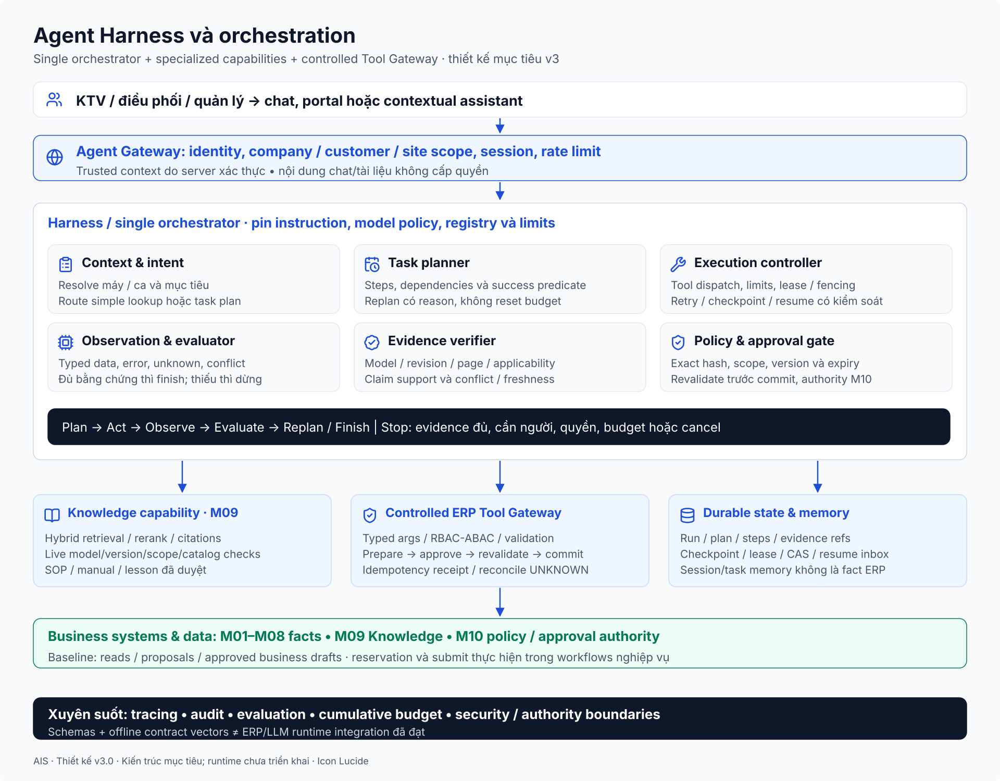
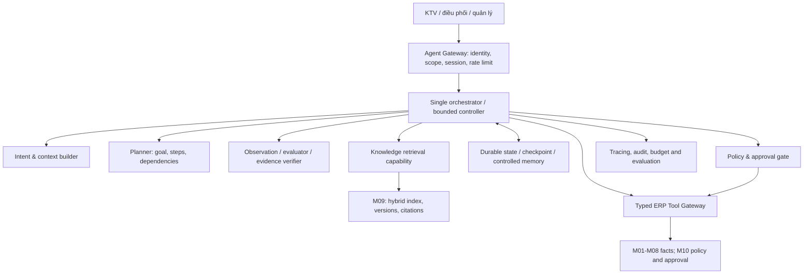

# Kiến trúc Agent Harness và ranh giới năng lực

## 1. Mục tiêu và quyết định nền tảng

Harness giúp KTV/điều phối/quản lý hoàn thành một mục tiêu nhiều bước: lấy ngữ cảnh, thu thập bằng chứng, kiểm tra lịch sử/nguồn lực, đề nghị hành động và chờ duyệt khi cần. Nó không chỉ route một câu hỏi sang RAG rồi gọi tool một lần. Baseline chọn **single orchestrator + specialized capabilities + controlled tool gateway**, không gán 10 agents cho 10 module.

M09 sở hữu nguồn tri thức, version, ingestion/index và retrieval. M01-M08 sở hữu nghiệp vụ/facts; M10 sở hữu policy/authority. Harness sở hữu plan/run/state, vòng thực thi và kiểm tra kết quả. Tách logic không đòi hỏi thêm microservice hoặc chọn framework ngay.

Vận dụng nguyên tắc bắt đầu từ cấu trúc đơn giản và tăng độ phức tạp sau đánh giá trong [Building effective agents](https://www.anthropic.com/engineering/building-effective-agents). Các component, limits và protocol sau đây là **đề xuất cho AIS**, không trích nguyên một framework.

## 2. Sơ đồ component

## 3. Thành phần, trách nhiệm và thứ không sở hữu

| Component | Input / output | Trách nhiệm | Không được suy ra |
|---|---|---|---|
| Agent Gateway | Authenticated request → trusted actor context/run ID | Identity, company/customer/site scope, session và admission/rate limits | Role/site do prompt khai là quyền thật |
| Context builder | Request + module reads → versioned context | Resolve máy/ca, lọc scope, ưu tiên dữ liệu cần thiết | Toàn bộ ERP được đưa vào context |
| Intent router | Goal → simple read, fixed workflow hoặc bounded plan | Dùng đường ngắn nhất đủ bằng chứng | Mọi câu hỏi cần một agent loop phức tạp |
| Planner | Goal/context/tool manifest → Plan version | Bước/dependency, preconditions, outputs và stop criteria | Plan là quyền thực hiện |
| Execution controller | Ready steps → authorized calls/state updates | Budget, timeout, fencing, checkpoint và stop | Để LLM tự lặp không giới hạn |
| Observation handler | Typed tool result → fact/error/conflict | Không biến timeout thành dữ liệu rỗng | Tool trả 200 là mục tiêu đã đạt |
| Evidence verifier/evaluator | Claims + evidence → supported/partial/conflicted | Đủ nguồn, còn thiếu gì, finish/replan/escalate | Confidence tự báo của model thay evidence |
| Approval gate | Proposed exact command → wait hoặc permit | Bind hash/version/scope, revalidate tại commit | “Đồng ý” trong một chunk là approval |
| State store | Run/steps/checkpoint → durable version | Lease, CAS, resume condition và counters | Memory conversation là sổ giao dịch |
| ERP gateway | Typed payload + trusted context → module result | Quyền/validation/idempotency và receipt | Token admin hoặc arbitrary URL/SQL |
| Finalizer | Verified observations → câu trả lời/outcome | Tách đã làm, chưa làm, chờ duyệt và nguồn | Câu trả lời tạo fact nghiệp vụ mới |

## 4. Các năng lực runtime có mã

AH-F01 context/intent; AH-F02 planning; AH-F03 bounded controller/recovery; AH-F04 evidence/finalization; AH-F05 typed gateway; AH-F06 durable checkpoint/memory; AH-F07 approval/policy; AH-F08 observability/evaluation. Đây là năng lực runtime, không đổi 60 chức năng domain thành agents.

Một lookup SOP có thể route trực tiếp retrieval và verify. Một nhiệm vụ phân tích thiếu phụ tùng dùng plan dependency với một số reads độc lập. Các writes dùng workflow cố định, do server kiểm soát; model chỉ đề nghị input trong allowlist. Không có tool chạy shell/SQL hoặc URL tùy ý trong baseline.

## 5. Limits và điều kiện dừng

Profile `ais-baseline-v1` đề xuất để thử nghiệm: tối đa 12 logical steps, 16 tool attempts tổng, 6 model turns, 12.000 model tokens cộng dồn, 90 giây active wall time, tối đa 3 resumes, approval TTL 24 giờ. Tool retry tối đa 2 retries sau lần đầu nếu budget cho phép. Đây là số khởi điểm cần benchmark, không SLA doanh nghiệp đã phê duyệt.

Counters không reset khi restart/resume/replan; retry và model response lỗi đều tiêu budget. Waiting approval không giữ HTTP/LLM process nhưng có hạn chờ riêng. Controller kiểm budget trước mọi dispatch và sau observation, đồng thời giới hạn fan-out/max in-flight=2 cho các reads độc lập. Một partial result vẫn phải có nguồn đủ quyền và nhãn thiếu.

Stop khi objective đủ chứng cứ, cần input/approval, bị chặn quyền, nguồn xung đột chưa giải quyết, hết budget, deadline/cancel hoặc unrecoverable error. Run outcome và command outcome là hai state machines riêng; run cancelled không tự hoàn tác một command đã commit.

## 6. Baseline quyền hành động

R0 retrieval, R1 business reads, R2 đề nghị/control-plane preparation và ghi **business draft** đã được phê duyệt; R3 reservation thực, submit kho/MR/PO/hóa đơn, assign override/đóng ca bị loại khỏi tool allowlist baseline. Người có quyền thực hiện R3 trong module nghiệp vụ. Approval R2 không cấp quyền R3.

Nếu giai đoạn sau muốn tự động R3, phải có adapter cụ thể, atomic checks, approval và integration tests riêng; không chỉ đổi prompt. Hai runtime đọc cùng số dư không thể cam kết hàng; M05 reservation atomic mới là authority.

## 7. Tổ chức triển khai và tiêu chí

MVP có thể một dịch vụ orchestrator + state store và custom app ERP cho gateway/approval/idempotency/outbox; M09 index có thể riêng. Có thể dùng workflow engine hoặc database scheduler, miễn chứng minh durable pause/resume và recovery. [Temporal workflow execution](https://docs.temporal.io/workflow-execution) là tham khảo về durability, không lựa chọn bắt buộc.

**HA-01:** Một model/tool adapter thay thế không thay permissions/transaction protocol. **HA-02:** Single orchestrator thực hiện E2E với plan/observation và bounded counters. **HA-03:** ERP/M09 dùng được khi Harness lỗi. **HA-04:** Không có R3 trong baseline manifest; prompt không mở thêm tool. **HA-05:** Multi-agent chỉ được đề xuất sau task-success/latency/cost baseline và lý do khả năng/context cụ thể.
