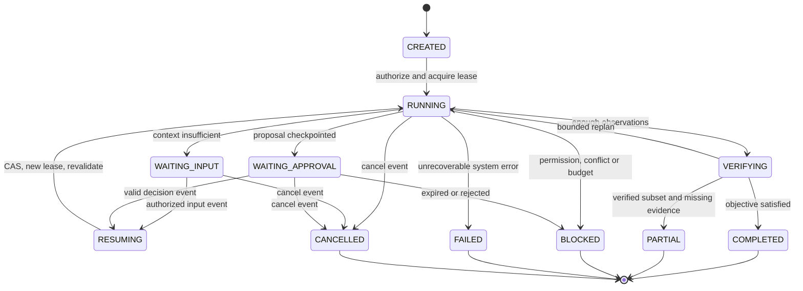
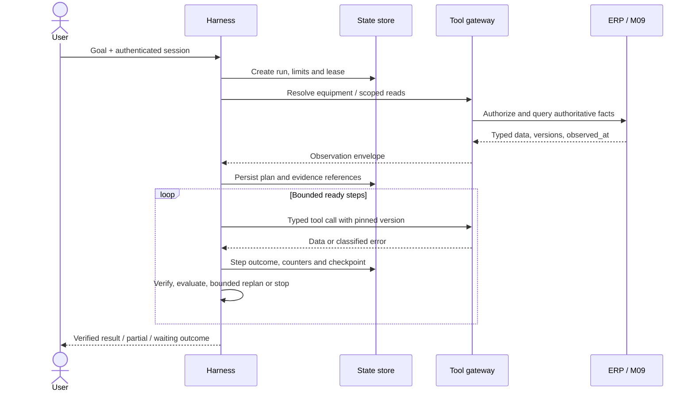
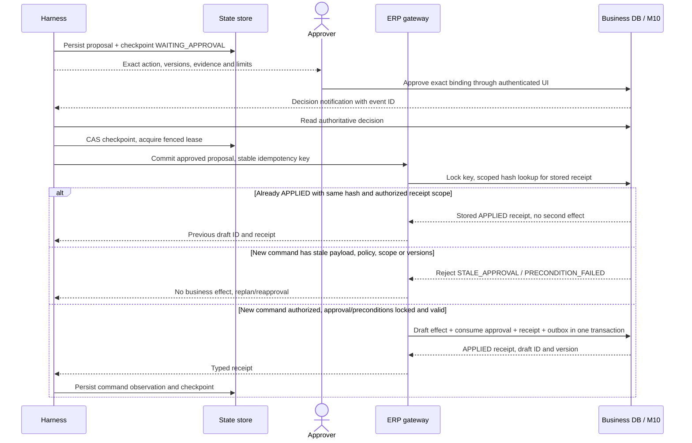

# Orchestration, lifecycle và transaction protocol

## 1. Lifecycle run và outcome

Terminal states không được sửa thành success khi một tool chạy lại. Một yêu cầu tiếp tục sau terminal tạo run mới liên kết run trước và context mới; key lệnh cũ vẫn không đổi khi chỉ reconcile cùng command. CREATED có run persisted; chỉ RUNNING/RESUMING có worker lease. WAITING không giữ request mở.

COMPLETED nghĩa objective đã đạt theo success predicate, có thể chỉ “đã chuẩn bị draft”; không suy ra kho đã giữ hay chứng từ submitted. PARTIAL có verified facts và thiếu bước; BLOCKED không đủ điều kiện tiếp tục; FAILED là lỗi hạ tầng/hợp đồng không khôi phục được; reason_code đi kèm để không gộp lỗi vào shortage.

## 2. Luồng chính nhiều bước

Reads độc lập được chạy song song trong limit; evidence phụ thuộc model/scope không được retrieval trước resolve máy rồi coi là khớp. Async dispatch lưu logical step/attempt ID trước call; kết quả trễ của worker mất lease không được ghi đè state mới.

## 3. Prepare → approve → revalidate → commit

Prepare tạo proposal immutable trong control plane: target type, payload, trusted scope, object versions, policy/tool versions, evidence references và payload_hash. Nó không tiêu hao/giữ vật tư hoặc submit ERP. Hash tính `SHA-256(JCS(approval_binding))`; JCS theo [RFC 8785](https://www.rfc-editor.org/rfc/rfc8785). Human summary không phải bytes được authorize.

Approval authoritative thuộc M10/ERP, bind proposal/hash, actor scope, expected versions, policy version, expiry và approver. AgentApproval trong state là reference. Resume event chỉ là tín hiệu; controller tải quyết định authoritative, kiểm chữ ký/identity, run/checkpoint và duplicate event ID, không tin payload callback khai approved.

Commit baseline tạo business draft docstatus=0; không thực hiện R3. Scope/preconditions authority không lấy từ model. Receipt ghi actual effect, không chỉ “request accepted”. Gateway recheck hiện trạng cả khi approval hợp lệ; approve lúc 09:00 không chứng minh hàng vẫn đủ lúc 11:00.

## 4. Idempotency và cửa sổ crash sau ERP commit

Unique key scope gồm company/actor/command type/idempotency_key, kèm payload_hash. Retry/resume cùng logical command phải cùng key. Same key/different hash → IDEMPOTENCY_CONFLICT. Record key, business effect, approval consumption và result nằm trong **cùng transaction ERP**; runtime checkpoint ở database khác không thay transaction này.

Nếu gateway timeout sau dispatch, command=OUTCOME_UNKNOWN; không gửi key mới, không báo thất bại chắc chắn, không compensation mù. `get_command_outcome` tra record ERP cùng key/hash/scope. APPLIED → dùng receipt cũ; NOT_FOUND authoritative → retry cùng key trong budget; APPLYING → poll bounded/backoff; UNKNOWN → giữ RECONCILING và báo pending determination. Read replica lag không được dùng để kết luận NOT_FOUND.

Worker chết sau ERP commit nhưng trước checkpoint: worker mới CAS lease, kiểm command key cũ, đọc receipt và chỉ ghi observation còn thiếu. Hai worker cùng retry: DB unique/lock serialize; một effect. Nếu adapter không có server idempotency/result lookup, **không được đưa vào baseline write manifest**.

## 5. Retry, compensation và cancellation

| Lỗi | Hành vi | Không được làm |
|---|---|---|
| Timeout/429/5xx trên read | Retry tối đa 2, backoff jitter, giới hạn retry_after và budget | Trả stock=0 hoặc đoán dữ liệu |
| Permission denied/not found trong scoped read | Stop phần đó; ẩn existence theo policy | Tăng quyền hoặc tìm ID khác ngoài scope |
| Schema invalid/unsupported tool version | Fail step; không retry cùng input lỗi | Gửi raw payload ngoài schema |
| Stale evidence/version/conflicting sources | Refresh/replan trong limit; có thể xin duyệt lại | Chọn nguồn similarity cao hơn để bỏ conflict |
| Write timeout | Reconcile cùng command key trước mọi retry | Key mới hoặc undo khi chưa biết outcome |
| Approval rejected/expired | BLOCKED với reason; release runtime resources | Tự approve hoặc replay approval cũ |

Compensation chỉ có cho effect đã được xác nhận và adapter/approval cụ thể; baseline không tự cancel kho/hóa đơn. Hủy run trước commit ngăn dispatch; hủy cạnh tranh commit được serialize bằng command/approval row, kết quả committed trước vẫn hiển thị APPLIED và cần quyết định nghiệp vụ nếu muốn điều chỉnh. CANCELLED không là rollback.

## 6. Resume, webhook và delivery

Notification inbox có unique event_id và run/approval reference; source authenticated, replay window và scope kiểm tại gateway. Mất notification có poll/recovery job đọc authoritative pending approvals. Một checkpoint chỉ được consume đúng state_version; stale resume bị bỏ, quyết định không mất. Outbox delivery có thể at-least-once; consumer inbox/CAS bảo đảm không dispatch gấp đôi theo logical command.

## 7. Nghiệm thu protocol

OW-01 worker crash sau APPLIED trước checkpoint cho đúng một draft; OW-02 approval callback trùng chỉ resume một logical transition; OW-03 scope/policy/object version đổi buộc reapproval; OW-04 write timeout không kết luận shortage hoặc tạo key mới; OW-05 cancellation sau commit giữ receipt/effect; OW-06 WAITING không giữ process/LLM request; OW-07 counters còn nguyên sau resume. Các oracle được đưa vào [test plan](08_observability_and_evaluation.md).
