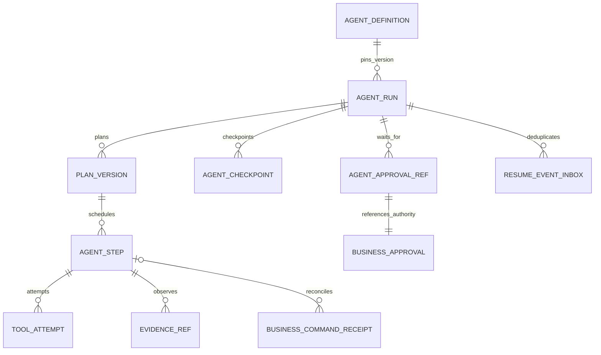

# State, memory, checkpoint và versioning

## 1. Authority và nơi lưu

Run/plan/step/checkpoint nằm trong durable runtime store; facts, approval authority, command idempotency receipt và business draft nằm ở ERP. M09 giữ document/index versions. Session memory không là sổ nghiệp vụ; một chuỗi hội thoại bị xóa không được làm mất receipt hoặc audit.

Không cần mọi bảng đều là Frappe DocType. Lựa chọn store/engine chưa chốt; yêu cầu CAS, durable persistence, access control, query pending runs và backup/restore phải được chứng minh trên implementation đã chọn.

## 2. Mô hình dữ liệu runtime



| Đối tượng | Thuộc tính bắt buộc | Ràng buộc/version |
|---|---|---|
| AgentDefinition | definition_id/version, instruction_version, model_policy, registry_version, allowed_tools, limits | Immutable version; run pin toàn bộ bundle |
| AgentRun | run_id, actor/context/scope ref, goal, status/reason, timestamps, correlation_id, counters | state_version CAS; không reset counters |
| PlanVersion | run_id, plan_version, objective/success predicate, steps/dependencies, assumptions | DAG và input/output refs; replan giữ bản cũ |
| AgentStep | logical_step_id, run/plan ref, type/tool_version, dependencies, preconditions, input/output/evidence refs, outcome | Stable logical identity qua retries |
| ToolAttempt | logical step, attempt ordinal, call_id, deadline, dispatch/response, error | Retry có attempt riêng; key business command ổn định |
| AgentCheckpoint | run_id, state_version, plan_version, pending steps/action keys, counters, evidence refs, resume condition | Unique run/state_version; không chỉ text summary |
| AgentApprovalRef | authoritative approval_id, proposal/hash, scope, source versions, expiry/decision ref | Không tự sinh decision; authoritative read khi resume |
| Lease | run_id, owner, fencing_epoch, expires_at | Một active lease; CAS tăng epoch khi takeover |
| ResumeEventInbox | event_id, run/checkpoint/approval ref, verified source, handled_at | Unique event_id; stale checkpoint không consume |
| EvidenceRef | source/tool observation, hash/version, scope, effective time, freshness | Có provenance, không chỉ confidence model |

AgentRun schema và fixtures nằm trong [contracts](contracts/schemas/agent_run.schema.json). Schema shape không tự xác nhận actor/scope thật; server tạo trusted context từ identity, không nhận nó như tool arguments của model.

## 3. Memory theo ba loại

| Memory | Nội dung được lưu | Isolation/retention | Không dùng cho |
|---|---|---|---|
| Session memory | User messages, context refs, short summaries đã lọc | Theo actor/session/company/customer scope; TTL theo policy | Authority approval hoặc state ERP mới nhất |
| Task memory | Plan, steps, observations, checkpoints, pending commands | Theo run; có audit/counters và retention nghiệp vụ | Lưu raw chain-of-thought hoặc secrets |
| Persistent knowledge/preferences | SOP đã duyệt, lesson, preference được chấp nhận | Publish/version ở M09; preference có consent/scope/TTL | Tự học từ mọi chat thành SOP chính thức |

Máy, stock, permission và coverage phải đọc lại theo freshness/precondition; memory chỉ có reference/version. Tóm tắt context không xóa evidence IDs hoặc status pending. Raw reasoning nội bộ không cần lưu; lưu quyết định ngắn, assumptions, tool choice và evidence hỗ trợ để review, tránh coi suy nghĩ model là sự kiện nghiệp vụ.

## 4. Ví dụ checkpoint

```json
{
  "run_id": "run-demo-001",
  "state_version": 7,
  "status": "WAITING_APPROVAL",
  "plan_version": 2,
  "pending_step_ids": ["step-commit-draft"],
  "pending_command_keys": ["run-demo-001:step-commit-draft:proposal-1"],
  "evidence_refs": ["obs-equipment-3", "obs-stock-5", "doc-sop-demo-r1-p4"],
  "counters": {"steps": 6, "tool_attempts": 7, "model_turns": 3, "tokens": 4300, "resumes": 0, "active_ms": 24000},
  "resume_condition": {"kind": "APPROVAL_DECISION", "approval_id": "approval-demo-1"}
}
```

Checkpoint không chứa token ERP hoặc approval capability có thể replay. Payload proposal immutable nằm ở protected store; references giữ hash để phát hiện thay đổi.

## 5. Concurrency và replay

Worker A có epoch 4, worker B takeover epoch 5: A không được CAS checkpoint của epoch mới. Trước dispatch write, gateway nhận fenced command context; command record không chấp nhận owner epoch thấp hơn đã ghi. Fencing không thay idempotency: server unique key/hash và receipt vẫn cần, kể cả hai requests hợp lệ đến cùng lúc.

Model/tool calls là nondeterministic. Durable workflow không replay LLM rồi tạo kế hoạch khác mà vẫn gọi đó là replay của bước cũ; persist approved plan/output observations. Nếu engine replay, calls là activities với kết quả đã ghi hoặc phải điều phối như attempt mới. Phiên bản code/registry/instruction cũ dùng cho resume; incompatible migration yêu cầu checkpoint migration được duyệt hoặc run mới, không lén đổi tool schema.

## 6. Retention, scope change và mất dữ liệu

Khi quyền actor thu hồi, resume kiểm lại scope, không dùng memory cũ để vượt quyền. Context bị redacted thì finalizer không đọc lại blob ngoài scope. Dữ liệu retention có thể xóa raw chat nhưng giữ business receipt theo chính sách; ghi tombstone reference và hạn chế tái tạo nếu evidence bị xóa.

Recovery job tìm lease hết hạn và runs chờ; reconcile pending command trước replan. Nếu runtime store mất nhưng ERP có receipt, khôi phục run từ checkpoint/command refs đã backup; không đoán APPLIED chỉ từ chat “đã tạo”. Nếu không đủ dữ liệu, BLOCKED/MANUAL_RECONCILIATION và giữ điều chưa biết.

## 7. Nghiệm thu

SM-01 hai workers CAS cùng version chỉ một transition; SM-02 stale epoch không ghi đè; SM-03 resume pin registry/instruction và giữ counters; SM-04 user/customer khác không đọc checkpoint/blob; SM-05 chat summary giữ pending command/evidence refs; SM-06 snapshot memory cũ không thay stock read/commit checks; SM-07 phục hồi không nhân đôi side effect. Đây là oracle thiết kế; integration cần store/ERP thật.
