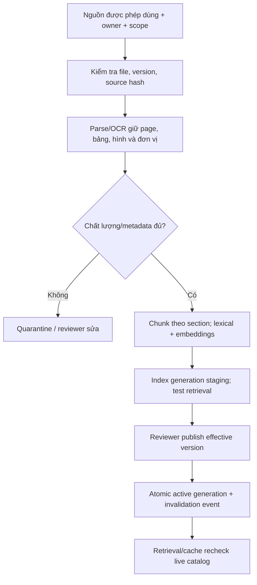
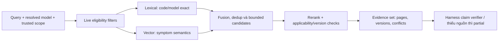

# RAG: ingestion, hybrid retrieval, evidence và freshness

## 1. Ranh giới và đối tượng dữ liệu

M09 là authority cho DocumentVersion/Chunk/IndexGeneration và publish/revoke. Retrieval trả evidence envelope cho Harness; Harness lập claim/action rồi verify. Tồn, reservation, coverage và trạng thái ca không được sao chép vào vector index để dùng như dữ liệu sống.

Mỗi DocumentVersion có document_id/version, model/revision áp dụng, error_codes, status, effective_from/to, source authority, customer/site access scope, reviewer, source_hash và storage reference. Chunk giữ stable chunk_id, document version, page/section, text_hash, parent section, units/specs được trích, parser/OCR version và confidence cờ chất lượng. IndexGeneration ghi corpus version và cách xây dựng; embedding similarity không là độ đúng kỹ thuật.

## 2. Ingestion và publish

PDF OCR phải giữ page và quan hệ bảng/đơn vị; không chia đoạn cắt số đo khỏi đơn vị hoặc ghi chú áp dụng. Không tự publish khi trích xuất xong. File lỗi/malicious hoặc metadata máy chưa rõ vào quarantine, không là SOP chính thức.

Index staging và active pointer thay atomically để query không trộn nửa thế hệ cũ/nửa mới. Retire/revoke cập nhật live catalog ngay trước cleanup index; query bắt buộc recheck catalog status/permission. Nếu revocation checker không sẵn sàng, không trả khuyến nghị kỹ thuật như đã xác nhận. Xóa vật lý chunk và cache invalidation là bước tiếp theo có tracking, không phụ thuộc nó để thu hồi quyền tức thời.

## 3. Retrieval hybrid theo ngữ cảnh kỹ thuật

Resolve máy và context được phép trước truy hồi. Query có terms nguyên gốc như E17/model và query expansion giới hạn; không để rewriting làm mất mã lỗi. Lexical/full-text tìm exact code/part/model; vector hỗ trợ symptom khác cách diễn đạt. Metadata filters scope/status/effective/model được áp tại retrieval, sau đó recheck ở từng hit/finalization.

Rerank trên candidate set đã được lọc, dựa mức liên quan/applicability; không gọi reranker với tài liệu user không được đọc. Kết hợp thứ hạng có thể dùng weighted fusion/RRF được benchmark; trọng số, top_k và candidate limits thuộc retrieval_policy_version. Không coi một trọng số thiết kế thử là chuẩn đúng cho mọi model.

Sai model hoặc tài liệu draft/retired mặc định không được chọn vì similarity cao. Historical lookup có chế độ rõ ràng để hiểu ca cũ, không dùng retired source làm chỉ dẫn hiện hành. Query không có model đủ chắc → WAITING_INPUT hoặc chỉ trả kiến thức tổng quát có giới hạn, không chọn part cụ thể.

## 4. Evidence contract và xác minh từng claim

Evidence envelope có evidence_id, source_type, doc/version/page/section, content_hash, quoted/extracted fact, applicability, effective times, observed_at, access decision ref và index_generation. Final answer lưu claim_id → evidence IDs và support status `SUPPORTED`, `PARTIAL`, `CONFLICTED`, `UNSUPPORTED`.

Mỗi khuyến nghị kỹ thuật quan trọng và quyết định tương thích phải có nguồn áp dụng. Citation có thể trỏ trang nhưng chunk không chứa nội dung hỗ trợ claim → unsupported, không đạt chỉ vì có hyperlink. Quantity/serial/model lấy typed source, không để LLM tự trích số bất kỳ rồi submit.

SOP A và manual B mâu thuẫn: so applicability, revision/effective scope và authority policy đã duyệt. Nếu một nguồn bị superseded theo catalog, ghi lý do loại; nếu cả hai có hiệu lực và conflict thật, ghi conflict set, không quyết định bằng similarity/rerank. Trưởng nhóm xác minh hoặc policy authority hợp lệ giải quyết. Agent có thể hoàn các phần không xung đột nhưng không đề nghị thay part dựa claim conflicted.

## 5. Freshness và cache

Cache key gồm actor/scope fingerprint, query/model, catalog/index/retrieval-policy versions; không chia cache raw answer giữa khách khác scope. Trước trả và trước commit dùng nguồn, recheck rights/catalog; quyền đổi invalidate theo permission epoch. Revoked source đang ở checkpoint không được tái sử dụng khi resume, dù index cũ còn chunk.

Freshness stock/coverage/history là tool policy; profile thử stock max_age=60s cho planning, commit vẫn revalidate actual versions. SOP cache TTL không thay revocation check. Evidence hash không tự chứng minh nội dung còn hiệu lực.

Nếu index lag catalog, retry/retrieve alternate generation có kiểm soát hoặc báo index chưa cập nhật; không dùng nguồn cũ lặng lẽ. Source tombstone giữ audit provenance nhưng không bypass quyền đọc lại file/chunk.

## 6. Dataset và nghiệm thu RAG

Test set phân tầng exact error code, symptom paraphrase, sai model, revision cũ, scope khác, OCR bảng/đơn vị, no-answer và source conflict. Gold do chuyên gia xác nhận, chứa eligible versions/evidence và forbidden recommendations. Tách train/dev/test theo document family/model để tránh leakage.

Đo recall@k của nguồn hợp lệ, evidence support theo claim, đúng model/version, no-answer calibration, conflict detection, permission leakage và thời gian tra cứu. Kết hợp human review với deterministic scope/version oracle; LLM judge không phê duyệt quyền hoặc là oracle duy nhất cho an toàn kỹ thuật.

RG-01 revoked document bị loại ngay khi catalog cập nhật dù index/cache lag; RG-02 exact E17 không bị rewriting mất code; RG-03 conflicting current sources chặn part proposal; RG-04 citation hỗ trợ đúng claim/page; RG-05 hidden scope không vào candidates/reranker/log export; RG-06 historical mode có nhãn, không tạo action hiện hành từ nguồn cũ.
