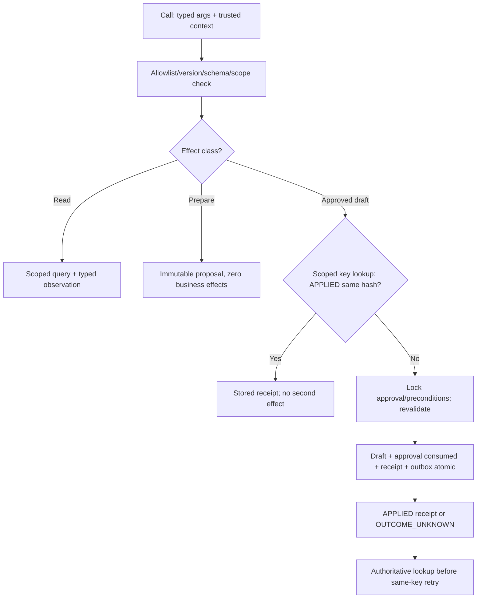

# Tool registry, schema và hợp đồng thực thi

## 1. Registry là allowlist có version

Run pin registry_version và AgentDefinition.allowed_tools. Manifest mô tả tên/version, module adapter, input/output schema, risk/effects, scopes/preconditions, timeout, retry và error classes. Model không chọn một tool chỉ vì tên xuất hiện trong tài liệu; controller và gateway cùng kiểm allowlist, schema và phiên bản.

Machine-readable artifacts: [registry](contracts/tool_registry.json), [tool schemas](contracts/schemas/tool_contracts.schema.json), [command binding](contracts/schemas/command_binding.schema.json), [approval](contracts/schemas/approval.schema.json). JSON Schema 2020-12 dùng required/additionalProperties=false tại các input objects; quantity là chuỗi decimal để tránh ambiguity tiền/số đo, validation nghiệp vụ vẫn cần Decimal > 0 và đúng đơn vị.

## 2. Catalog baseline

| Tool | Domain | Rủi ro / effect | Điều cần xác minh |
|---|---|---|---|
| resolve_equipment | M04 | R1 read | Mã không mơ hồ, model/serial/site, scope |
| get_service_context | M02/M03 | R1 read | Request/work source/work order và versions |
| get_entitlement_snapshot | M01 | R1 read | Coverage version đúng ca, không hợp đồng hiện tại thay hồi tố |
| get_work_history | M03 | R1 read | Visits/outcomes/callback theo máy và scope |
| search_approved_knowledge | M09 | R0 scoped retrieval | Published/effective/model, catalog epoch |
| verify_compatibility | M04/M09 | R1 read | Item/model compatibility có source/version, conflict flag |
| get_available_stock | M05 | R1 read | Actual/held/available, kho/đơn vị/stock version và observed_at |
| get_open_supply | M06 | R1 read | Demand/PO/accepted receipts, phần đang mở |
| get_eligible_technicians | M03 | R1 read | Kỹ năng/availability; chỉ đề nghị, không assign |
| get_pm_findings | M04 | R1 read | Finding scope/version/outcome, kỳ cụ thể |
| get_charge_reconciliation | M07 | R1 sensitive read | Quyền kế toán và charge/coverage/approval refs |
| get_operational_risks | M08 | R1 read | Snapshot/formula/watermark và scope |
| prepare_proposal | Control plane | R2 preparation; chưa có business effect | Evidence, payload/preconditions hợp lệ; immutable proposal |
| commit_approved_proposal | M05/M06/M03 adapter | R2 write draft | Approval/hash/versions/policy, atomic idempotency receipt |
| get_command_outcome | Gateway/M10 | R1 control read | Authoritative key/hash/scope; không đọc replica để quyết định retry |

Registry không có tool submit kho/PO/hóa đơn, giữ chỗ thực, override/gán người hoặc đóng ca trong baseline. Registry mới/thêm R3 cần change review, adapter, policy và tests, không sửa tên tool trong prompt là xong.

## 3. Trusted context tách khỏi arguments

Gateway inject actor_id, company/customer/site scope, session/run/step/attempt IDs, deadline, permission epoch và policy refs từ credentials/checkpoint. Model chỉ gửi arguments đúng schema như equipment_code, work_order_id hoặc warehouse_id. Các field `actor_id`, `role=Administrator`, `ignore_permissions`, URL/SQL/script không thuộc schema và phải bị reject.

Tool scoping dùng business relationships, không chỉ string ID. Not found/denied có thể trả cùng public code RESOURCE_UNAVAILABLE để không lộ existence; internal trace có reason phù hợp quyền kiểm soát. Retrieval rights theo document/file scope, không chỉ role ERP.

## 4. Result envelope

```json
{
  "tool_version": "1.0.0",
  "status": "ok",
  "observed_at": "2026-10-08T09:00:00+07:00",
  "source_version": "stock-17",
  "data": {
    "item_code": "PART-DEMO-01",
    "warehouse_id": "WH-DEMO-01",
    "actual_qty": "2.000",
    "held_qty": "1.000",
    "available_qty": "1.000",
    "uom": "Nos"
  },
  "evidence_refs": ["stock-observation-demo-17"]
}
```

Ví dụ synthetic, không số tồn thật. Error envelope có status=error, code, category, retryable, observed_at và correlation ref; **không có data tồn giả**. Write receipt có command_state, command/key/hash, effect_count, document_id/docstatus=0 và module source version. `ok` HTTP chỉ kiểm transport; nội dung schema/domain oracle mới xác định success.

## 5. Timeout/retry và errors

Profile thử: stock/context read 3-5s, retrieval/history 8s, prepare 5s, commit 10s, outcome lookup 3s. Reads transient tối đa 2 retries với backoff+jitter; registry specifies max_attempts=3 gồm lần đầu. Error SCHEMA_INVALID/PERMISSION_DENIED/STALE_APPROVAL/PRECONDITION_FAILED/KNOWLEDGE_CONFLICT không retry mù. READ_TIMEOUT không là INSUFFICIENT_STOCK.

Commit write không auto retry qua HTTP client. Outcome UNKNOWN đi qua outcome lookup; NOT_FOUND authoritative mới cho retry cùng key. Commit max_attempts=1 mỗi dispatch; controller có thể dispatch lại cùng logical command sau reconciliation trong cumulative budget. Tool timeout nhận remaining run budget; không giữ call sống vượt deadline run.

## 6. Chuẩn bị proposal và immutable binding

Proposal binding chứa command_type, target_domain, actor_id, company/customer/site, payload, expected_versions, policy_version, tool_version và evidence_refs. Sau canonical JCS/hash, thay bất kỳ field authorization nào đổi hash. Reason/summary hiển thị người duyệt phải truy exact payload/versions, không là mô tả tự do có thể khác action.

Prepare không giảm kho hoặc tạo MR submitted; nó persist control-plane proposal/checkpoint. Commit baseline chỉ tạo business draft sau approval. Draft có origin/evidence/command refs để người kiểm tra submit trong ứng dụng nghiệp vụ; không nói “đã giữ hàng” từ một draft allocation.

## 7. Server-side transaction contract



Adapter lock command/idempotency row và approval/precondition rows; kiểm scope/policy epoch/object versions, schema/domain invariants, expiry và approver. Ghi effect draft, approval consumed, receipt/hash và outbox cùng transaction. Unique key/hash bảo vệ retries; returns old receipt nếu APPLIED trước đó mà không consume approval lần hai.

[Frappe Database API](https://docs.frappe.io/framework/user/en/api/database) mô tả transaction của framework; thiết kế này **không coi generic REST POST sẵn có là đã có idempotency/approval atomic**. Cần custom server adapter/DocTypes hoặc equivalent transaction implementation và thử crash boundaries. Không dùng db.set_value bỏ qua validation/permission để thực hiện command.

## 8. Contract tests và versioning

CT-01 schema extra identity/action fields rejected; CT-02 unavailable stock returns typed error không data; CT-03 positive qty/unit/compatibility required; CT-04 same key/same binding returns same receipt; CT-05 same key/different binding conflict; CT-06 adapter không có result lookup không được enabled write; CT-07 resume dùng pinned version hoặc explicit migration.

Schema/registry examples và protocol fixtures được checker offline kiểm tra. Gateway implementation sau này phải chạy cùng positive/negative vectors, thêm integration tests quyền/concurrency/transaction; không được dựa vào PASS offline để bỏ kiểm thử ERP.
