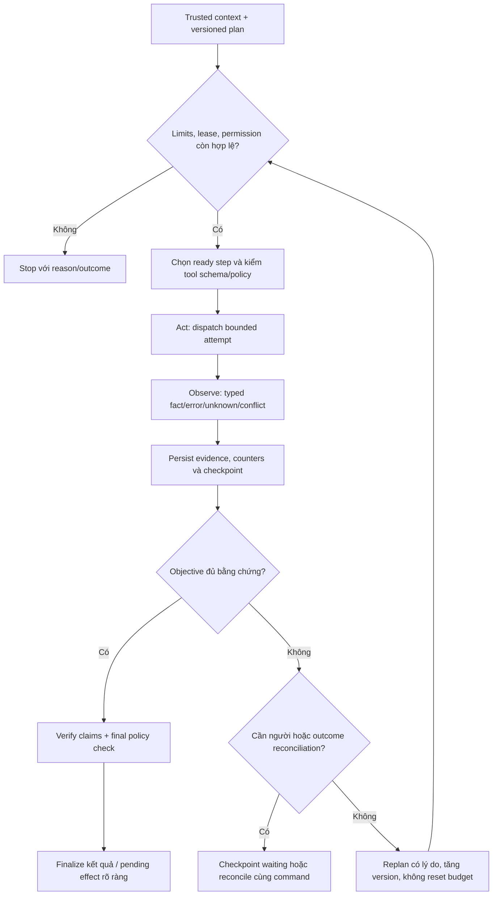

# Reasoning, planning và bounded execution

## 1. Phân biệt các công việc

Reasoning ở đây là đánh giá facts/assumptions và chọn bước tiếp theo trong policy; planning là cấu trúc mục tiêu/dependencies; acting là gọi tool được phép; observing là đọc dữ liệu/lỗi thực; evaluating là so objective với evidence. Chúng không đồng nghĩa để model tự suy nghĩ/gọi tools không giới hạn.

Lưu decision summary ngắn và evidence refs, không yêu cầu ghi raw chain-of-thought. Model gợi ý plan; code kiểm allowlist, DAG, input refs, risk, quyền/budget và conditions. Policy/permission/quantity/idempotency checks không được chuyển thành câu hỏi “LLM có nghĩ là an toàn không”.

## 2. Plan contract

Plan có goal, plan_version, assumptions, success_predicate, steps và failure strategy. Step có stable ID, kind, tool/version, dependencies, input_refs, expected_observation, risk và bounded retry/refinement. Không có chuỗi code tùy ý hoặc tool name lấy từ SOP.

```json
{
  "run_id": "run-demo-001",
  "plan_version": 1,
  "goal": "Phân tích máy demo và chuẩn bị đề nghị vật tư nếu đủ căn cứ",
  "steps": [
    {"step_id": "resolve", "tool": "resolve_equipment", "depends_on": [], "success": "UNAMBIGUOUS_AUTHORIZED_EQUIPMENT"},
    {"step_id": "sop", "tool": "search_approved_knowledge", "depends_on": ["resolve"], "success": "ELIGIBLE_EVIDENCE"},
    {"step_id": "history", "tool": "get_work_history", "depends_on": ["resolve"], "success": "SCOPED_HISTORY"},
    {"step_id": "compatibility", "tool": "verify_compatibility", "depends_on": ["sop"], "success": "VERIFIED_ITEM_COMPATIBILITY"},
    {"step_id": "stock", "tool": "get_available_stock", "depends_on": ["compatibility"], "success": "FRESH_AVAILABLE_STOCK"},
    {"step_id": "proposal", "tool": "prepare_proposal", "depends_on": ["stock", "history"], "success": "IMMUTABLE_PROPOSAL"}
  ]
}
```

History và SOP có thể đọc độc lập sau resolve. Stock trước compatibility chỉ là exploratory read, không chứng minh item phù hợp. Commit không nằm trong plan read phase như đã được cấp quyền: controller thêm guarded workflow step chỉ sau approval exact proposal.

## 3. Vòng execution do controller quản lý



Pseudocode contract:

```text
acquire_fenced_lease(run)
while ready_and_within_limits(run):
    step = choose_ready_step(validated_plan)
    enforce_trusted_scope_and_pinned_registry(step)
    persist_attempt_before_dispatch(step)
    observation = dispatch_with_remaining_deadline(step)
    validate_envelope_and_domain_observation(observation)
    checkpoint(observation, evidence_refs, cumulative_counters)
    decision = evaluate_objective_and_failure_policy()
    if needs_human: persist_wait_condition_and_release_lease(); return
    if unknown_write: reconcile_stable_command_before_other_write()
    if done_or_blocked: break
    if replan: validate_new_plan_and_preserve_old_versions()
finalize_only_verified_claims_and_known_effects()
```

## 4. Stop conditions và giữ budget cho reconciliation

Mỗi retry/model turn tăng cumulative counters; replan/resume không reset. Controller ngăn vòng lặp không có tiến bộ: cùng query/context/output hash liên tiếp chỉ được refinement trong giới hạn, sau đó PARTIAL/BLOCKED. Planner không bypass bằng tạo step ID mới cho cùng read vô ích.

Trước write, dành tối thiểu 2 remaining tool attempts trong 16 của profile baseline cho dispatch và outcome lookup; không dispatch khi không còn room reconciliation. Nếu lookup vẫn unknown và hết budget, trả pending/manual reconciliation, giữ command ID; background recovery có budget riêng được khai báo, không lén reset run counters.

Waiting approval có expiry/resume limits, không tiêu active token/wall-time liên tục. Context/model policy đổi incompatibly thì checkpoint migration hoặc new run được ghi, không “resume” với một bundle mới mà không audit.

## 5. Bằng chứng, conflicts và replan

Observation typed error được đưa vào failure policy. Stock timeout sau max_attempts → PARTIAL nếu SOP/history đủ căn cứ; không infer stock=0 hoặc tạo mua. Item compatibility UNKNOWN/CONFLICTED → hỏi chuyên gia, không dùng similarity. Scope denied → không tìm tool/credential khác để lấy dữ liệu.

Replan cần reason, evidence delta và các bước giữ/thay/bỏ. Không đổi payload của proposal đang approved; nếu cần đổi phải supersede proposal và xin approval mới sau reconcile lệnh cũ nếu outcome unknown. Plan mới không làm các actions trước đó biến mất.

## 6. Finalization contract

Kết quả gồm outcome, claims/evidence, completed actions có receipt, missing data/failed steps, pending approval/command IDs và bước người dùng cần làm. “Đã chuẩn bị” phải nêu control-plane proposal hay ERP draft; “đã tạo draft” có docstatus=0, không đồng nghĩa đã submit hoặc giữ hàng.

Không chuyển failure thành câu trả lời mơ hồ “có thể hết hàng”. Không trình bày technical diagnosis như đã xác nhận nếu chỉ là hypothesis. Người dùng thấy summary plan/evidence/actions cần thiết, không raw hidden reasoning.

## 7. Nghiệm thu

PE-01 DAG cycle/unknown dependency rejected; PE-02 malformed model plan/unsupported tool bị chặn trước call; PE-03 không progress hết limit dừng đúng; PE-04 timeout observation không tạo shortage; PE-05 counters giữ qua replan/resume; PE-06 proposal mutation cần hash/approval mới; PE-07 completed chỉ đạt declared objective với evidence/action receipts; PE-08 pending write unknown không được bỏ khỏi finalizer.
