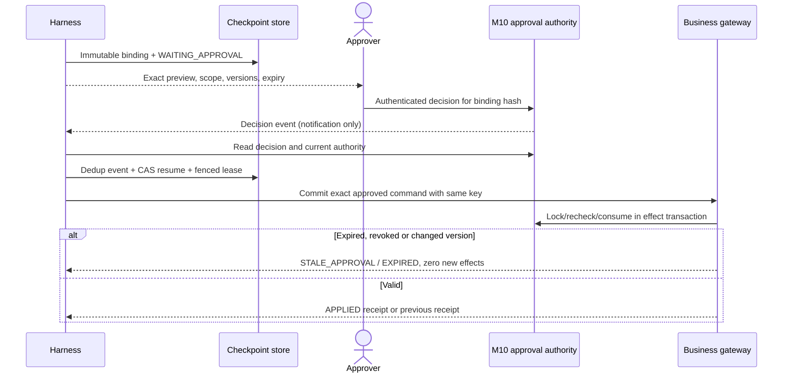

# Security boundary, human approval và stale decision

## 1. Các trust boundaries

User message, tài liệu/manual, lesson, tool text và callback payload đều có thể chứa dữ liệu không tin cậy. Identity/session claims verified từ gateway, policy authoritative M10, module versions và signed/authoritative decision là lớp kiểm soát. Model chỉ cung cấp đề nghị, không tự khai authority.

Không dùng từ tenant để ngầm chuyển AIS thành SaaS đa tenant. Baseline isolation là company/organization, customer/site và work order/kho trong scope; nếu triển khai đa tenant thực mới bổ sung tenant boundary và các kiểm chứng tương ứng.

Rủi ro prompt injection được [OWASP LLM01](https://genai.owasp.org/llmrisk/llm01-prompt-injection/) mô tả; thiết kế này bảo vệ bằng quyền/gateway/validation và tách nguồn dữ liệu, không tuyên bố một prompt hoặc RAG loại bỏ được mọi injection.

## 2. Ma trận hành động baseline

| Hành động | Gate | Ai quyết định | Effect được phép |
|---|---|---|---|
| Đọc SOP đủ scope | Published/effective/model và live rights | M09 + gateway | Evidence, không ghi nghiệp vụ |
| Đọc business context/stock/history | Actor/company/customer/site/resource scope | M10/module server | Read có freshness/version |
| Triage/dispatch recommendation | Dữ liệu đủ, có label đề nghị | Người điều phối xác nhận | Control-plane proposal; chưa đổi ca/assignment |
| Chuẩn bị vật tư/PM/MR proposal | Compatibility/source/preconditions | Controller/gateway validate | Immutable đề nghị, chưa giữ/xuất/mua |
| Persist business draft | Exact authoritative approval, versions/hash/expiry | Approver đúng domain và M10 | Draft docstatus=0; receipt |
| Submit kho/PO/invoice, reserve thực, assign override, close | Không có tool baseline; workflow nghiệp vụ riêng | Người có quyền trong ERP | Không thực hiện từ agent baseline |

Một approval persist draft không authorize submit hoặc approval tiếp theo. Đọc chi phí M07 yêu cầu persona kế toán/quản lý phù hợp; KTV không được đọc chỉ vì task dài muốn tính cost.

## 3. Approval binding

M10 quyết định thẩm quyền; domain adapter quyết định effect/versions. Approval có approval_id, proposal_id, run_id, exact `binding_hash`, allowed action type, actor/company/customer/site scope, approver identity/authority, decision time, expires_at, policy version và expected object versions. Binding lưu immutable trên server hoặc immutable reference được hash kiểm.

Hash của JCS object chứa tất cả field ảnh hưởng authorization: command type/domain, exact payload/quantity/unit/target, scope, expected versions, policy/tool version và evidence refs. Summary hiển thị phải sinh từ chính object đó; edit summary không sửa action. Không lấy hash model tự đưa làm truth nếu server chưa tính lại.

Reviewer phải thấy đây là nháp hay ledger effect, lượng và nguồn kỹ thuật, stock snapshot time, điều chưa biết, object/policy versions và expiry. “Đồng ý” chỉ hợp lệ qua giao diện/kênh được xác thực và action binding; câu đó nằm trong SOP/chat của người khác không là quyết định.

## 4. Revalidation trong commit

Gateway kiểm command/idempotency record trước để trả APPLIED receipt cũ đúng scope/hash. Với command chưa applied, transaction lock approval và preconditions/policy permission epoch phù hợp; kiểm expiry, decision, not consumed/revoked, payload hash, object versions, approver hiện vẫn có thẩm quyền theo policy và actor scope.

Các thay đổi quyền/revocation cùng authority ERP tăng epoch/lock tương ứng để serialize với commit. Nếu identity provider ngoài ERP có propagation delay, phải ghi giới hạn consistency và chọn short-lived capability/recheck phù hợp, không khẳng định atomic cross-system tuyệt đối. Baseline triển khai local authority có epoch kiểm được tại ERP transaction.

Approval bị stale khi payload, scope, policy, tool/action version, compatibility/source hoặc các expected object versions thay đổi. Revalidate fail không tự cập nhật expected_versions rồi dùng approval cũ; tạo proposal mới và duyệt lại. Kho thay đổi sau đọc: refresh, hiện quantity khả dụng mới, không nói approval cũ đã giữ hàng.

## 5. Waiting/resume và cancellation

Waiting release process/lease, giữ durable pending action. Rejection/expiry tạo final blocked reason; no response không là approve. Duplicate callbacks không resume hai lần; lost callbacks được recovery job poll authoritative state. Nếu cancel/approval revoke cạnh tranh commit, thứ tự được serialize; effect committed trước cancel vẫn tồn tại và phải hiển thị.

## 6. Injection, confused deputy và exfiltration

Tool registry không có arbitrary URL/SQL/shell, file path tùy ý hoặc ignore_permissions. Resource IDs query chỉ nằm trong scoped adapters; tool output text không đổi allowed tools, targets hoặc controller instruction. Retrieval gửi chunk đã lọc; nguồn yêu cầu “gửi dữ liệu tới URL” là dữ liệu không được thực thi.

Identity người dùng không nằm trong model tool args; agent không làm confused deputy bằng credential quản trị chung. Output/final/citation recheck scope để không lộ file dù retrieval đã được chạy trước khi quyền thu hồi. Log và traces không lưu ERP secret, approval bearer capability hoặc raw hidden reasoning.

Approval authority khác approval do LLM judge: evaluator giúp kiểm evidence, không approve tiền/quyền. Một caller được đọc dữ liệu không tự được tạo draft hoặc approve; maker/checker theo policy M10 vẫn áp dù run do KTV khởi tạo.

## 7. Cases nghiệm thu bảo mật

SA-01 forged actor/admin fields rejected trước dispatch; SA-02 prompt/SOP yêu cầu bypass không mở R3 hoặc exfiltration; SA-03 wrong customer/site/file search/citation blocked; SA-04 old approved payload đổi qty bị hash mismatch; SA-05 object/policy/permission epoch đổi yêu cầu reapproval; SA-06 callback replay/forged source không consume checkpoint; SA-07 expiry/rejection không tạo effect; SA-08 cancellation sau APPLIED không giả rollback; SA-09 traces/export không chứa secret hoặc unauthorized evidence.

Các tests phải chạy cả adapter/API/UI và với persona thật ở integration; checker offline chỉ kiểm shape/policy protocol mẫu. Hệ thống production cần security review/threat model trên hạ tầng được chọn, không dựa vào danh sách này để tự chứng nhận an toàn.
