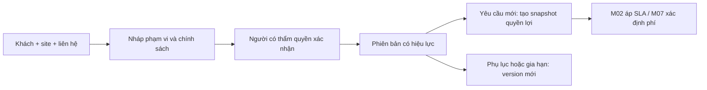

# M01. Khách hàng, địa điểm và hợp đồng dịch vụ

## 1. Vì sao doanh nghiệp cần module này?

Một máy đặt tại nhà máy không tự cho biết người có quyền yêu cầu, phạm vi AIS phải làm miễn phí, giờ phục vụ hay mức cam kết. Nếu hợp đồng nằm trong PDF còn ticket chỉ giữ tên Customer, điều phối và kế toán phải suy đoán quyền lợi riêng. M01 biến cam kết thương mại thành thông tin có hiệu lực theo thời gian mà các module khác dùng nhất quán.

Truy vết: PP-01/02; mục tiêu G01/G02/G05. Chủ nghiệp vụ: quản lý khách hàng và quản lý dịch vụ. Module sở hữu hồ sơ quyền lợi, không sở hữu deadline ca cụ thể, lượt sửa hoặc hóa đơn.

## 2. User story và giá trị

| Story | Nhu cầu | Giá trị / kết quả |
|---|---|---|
| US-01 | Quản lý khách tập hợp khách, site và liên hệ có vai trò | Điều phối liên hệ đúng người; không lấy mọi người báo lỗi làm người duyệt phí |
| US-02 | Quản lý dịch vụ xác định máy và dịch vụ trong phạm vi | Tránh cấp miễn phí hoặc hứa phục vụ vượt hợp đồng |
| US-03 | Điều phối đọc cam kết hiệu lực tại ngày báo lỗi | Ca không đổi quyền lợi hồi tố khi hợp đồng thay đổi |
| US-04 | Quản lý khách theo dõi hiệu lực và thay đổi | Duy trì phục vụ hoặc chủ động thông báo điều kiện ngoài hợp đồng |

## 3. Phân rã chức năng

| Mã | Chức năng | Đầu vào | Đầu ra / kiểm soát |
|---|---|---|---|
| M01-F01 | Hồ sơ tổ chức khách | Tên, mã, bên thanh toán | Customer ổn định, chống bản ghi trùng |
| M01-F02 | Site và người liên hệ | Vị trí, lịch tiếp cận, người báo/duyệt/nghiệm thu | Danh sách role phía khách có thời gian hiệu lực |
| M01-F03 | Phạm vi phục vụ | Máy, loại dịch vụ, hạng mục bao gồm/loại trừ | Coverage theo hợp đồng và phiên bản |
| M01-F04 | Chính sách dịch vụ và phí | Giờ phục vụ, mức cam kết, bảo hành, giá | Gói chính sách tham chiếu được, chưa áp vào ca |
| M01-F05 | Hiệu lực và snapshot quyền lợi | Ngày sự kiện, phiên bản hợp đồng | Entitlement snapshot cho M02/M07 |
| M01-F06 | Gia hạn và thay đổi phạm vi | Phụ lục, ngày hiệu lực, xác nhận | Version mới, cảnh báo hết hạn và lịch sử |

## 4. Quy trình trước, trong và sau cam kết

Quản lý khách tạo khách/site và xác nhận bên thanh toán. Quản lý dịch vụ đưa phạm vi máy, loại dịch vụ, lịch hỗ trợ, SLA và quy tắc phí vào bản nháp. Người có thẩm quyền xác nhận phiên bản và ngày hiệu lực. Chỉ phiên bản Active được dùng tự động; bản nháp không tạo cam kết thực thi.

Khi M02 nhận yêu cầu, truy quyền lợi theo khách/site/máy/loại dịch vụ và thời điểm báo. Nếu có nhiều quyền lợi chồng nhau, hiển thị ngoại lệ cho người có thẩm quyền giải quyết thay vì chọn ngẫu nhiên hạng VIP. Snapshot giữ mã phiên bản, các điều khoản liên quan và lý do người xác nhận. M02 tính deadline từ snapshot; M07 xác định phí từ cùng bản đó.

Khi ký phụ lục, tạo version mới có ngày bắt đầu. Ca cũ giữ bản đã áp trừ khi có quyết định điều chỉnh được lưu vết. Khi hợp đồng hết hạn, không xóa các máy/site hoặc ca; ca đang mở được xử lý theo điều khoản đã chốt và quyết định chuyển tiếp. Hệ thống phải phân biệt khách còn tồn tại với quyền lợi đang hết hiệu lực.

## 5. Dữ liệu nghiệp vụ

| Đối tượng | Thuộc tính quan trọng | Ràng buộc |
|---|---|---|
| Customer | Mã, tổ chức, bên thanh toán, trạng thái | Ngừng giao dịch không xóa lịch sử |
| Site | Customer, mã site, tiếp cận, lịch máy dừng | Đổi chủ sở hữu lưu hiệu lực, không ghi đè ca cũ |
| Contact role | Người, phạm vi, loại thẩm quyền, hiệu lực | Người báo không tự động được duyệt tiền |
| Service agreement | Version, hiệu lực, trạng thái, phạm vi | Không sửa nội dung đã active mà mất version |
| Coverage line | Máy/nhóm máy, loại dịch vụ, bao gồm/loại trừ | Phải biết dòng nào cấp quyền lợi cho ca |
| Entitlement snapshot | Source version, mốc, cam kết và người quyết định | Bất biến sau áp dụng; điều chỉnh bằng sự kiện riêng |

Site, coverage và snapshot là khái niệm đề xuất; hiện thực có thể bằng DocType bổ sung hoặc bảng con. Không giả định ERPNext Customer/SLA mặc định bao phủ đầy đủ chúng.

## 6. Chính sách và tình huống biên

- Hạng VIP/Standard chỉ là cách đóng gói chính sách; nếu hai hợp đồng VIP khác lịch thì không được gom bằng một nhãn.
- Thiết bị mới chưa vào danh sách có thể được tiếp nhận để triage; chưa xác nhận coverage thì không tự hứa miễn phí.
- Bên vận hành và bên trả tiền khác nhau phải được ghi riêng; hóa đơn không lấy tên người đang gọi làm Customer.
- Máy chuyển site hoặc khách đổi tên vẫn giữ danh tính kỹ thuật; ca lịch sử không bị viết lại chủ sở hữu.
- Đơn yêu cầu ngoài hợp đồng cần điều kiện chấp thuận và phí riêng, không bị mất trong hàng đợi.
- Bản chính sách đang đổi phải hiển thị ca nào chịu ảnh hưởng; không tái tính deadline hàng loạt im lặng.

## 7. Quyền và liên kết module

Quản lý khách sửa thông tin liên hệ; người được duyệt hợp đồng kích hoạt version. Điều phối/KTV chỉ đọc quyền lợi cần phục vụ; khách chỉ đọc phần thỏa thuận/ca của tổ chức mình. Giá vốn và chính sách phê duyệt nội bộ không được đưa vào portal.

M04 tham chiếu owner/site, M02 nhận snapshot, M07 nhận phạm vi phí, M08 đọc version để phân nhóm hiệu quả hợp đồng, M10 kiểm soát phê duyệt. M01 không sửa chi phí thực tế ở M07.

## 8. Tiêu chí nghiệm thu

- **AC-01.1:** Given site có người báo và người duyệt khác nhau, When nhận yêu cầu, Then biết đúng cả hai vai trò; người báo không thể duyệt phát sinh vượt quyền.
- **AC-02.1:** Given một máy ngoài coverage, When triage, Then hiển thị chưa có quyền lợi phù hợp và cần quyết định; không tự gán miễn phí.
- **AC-03.1:** Given ca nhận với version A và ngày sau đổi version B, Then ca cũ vẫn truy được A và deadline gốc; ca mới dùng B.
- **AC-03.2:** Given hai coverage cùng hiệu lực, Then tạo ngoại lệ cần xác nhận; không chọn bằng thứ tự trả về API.
- **AC-04.1:** Hợp đồng hết hạn vẫn cho xem lịch sử; quyền lợi cho ca mới không được dùng tự động.

## 9. Quyết định cần xác nhận và phân kỳ

P1 dùng một hợp đồng hiệu lực chính theo máy/loại dịch vụ và snapshot tối thiểu. P2 hỗ trợ coverage chồng, phụ lục và gia hạn có workflow. Chưa quyết định kỳ nhắc gia hạn, thẩm quyền tiền và việc ca đang mở sau hết hạn có đổi chính sách hay không. Khảo sát các ca tranh chấp để chốt, không suy từ `.env` hoặc dữ liệu demo.
