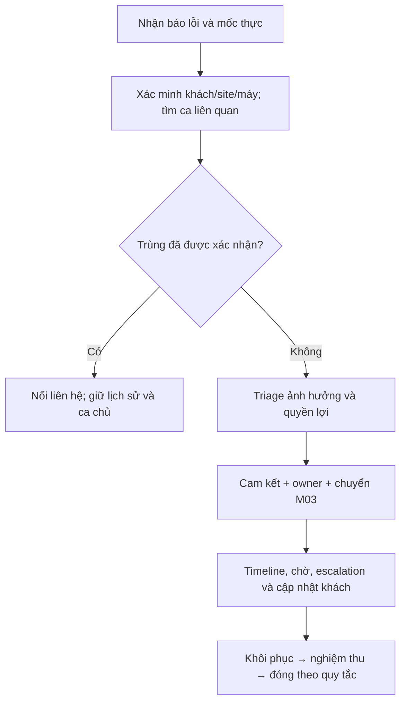

# M02. Tiếp nhận, phân loại và cam kết dịch vụ

## 1. Bài toán và ranh giới

Khách cần biết AIS đã nhận việc và bước tiếp theo; điều phối cần biết yêu cầu nào ảnh hưởng sản xuất, đã có ai nhận trách nhiệm và hạn nào đang chạy. Một cuộc gọi lúc 08:00 nhưng nhập lúc 09:15 không thể bị xem là khách chỉ chờ từ 09:15. M02 quản hồ sơ yêu cầu và timeline dịch vụ, độc lập với việc KTV đã tới hay vật tư đã xuất.

Truy vết PP-03/04, US-05 đến US-08, G01/G02. Chủ module: điều phối. M01 cung cấp quyền lợi, M03 thực hiện công việc. Yêu cầu tư vấn/PM và sự cố dừng máy dùng cùng cổng tiếp nhận nhưng không có cùng cam kết.

## 2. User story

| Story | Nhu cầu cụ thể | Kết quả mong muốn |
|---|---|---|
| US-05 | Người báo chọn/tra máy, mô tả ảnh hưởng và nhận mã | Không phải báo lại; yêu cầu được truy đúng thiết bị/site |
| US-06 | Điều phối nhập hộ và liên kết bản báo trùng | Giữ thời điểm thực, không mất lịch sử liên hệ |
| US-07 | Điều phối triage theo mức ảnh hưởng và coverage | Ưu tiên có lý do, deadline có nguồn |
| US-08 | Khách/quản lý biết đang chờ gì, ai xử lý và hẹn nào | Theo dõi minh bạch và can thiệp trước nguy cơ trễ |

## 3. Phân rã chức năng

| Mã | Chức năng | Kiểm soát chính |
|---|---|---|
| M02-F01 | Tiếp nhận portal, nhập hộ, QR hoặc API | Danh tính, quyền máy/site và mã yêu cầu |
| M02-F02 | Mốc thời gian và tương tác | Reported/received/recorded/acknowledged tách riêng |
| M02-F03 | Nhận diện/hợp nhất liên hệ trùng | Giữ bản gốc và quan hệ duplicate_of; người quyết định |
| M02-F04 | Triage loại việc và ảnh hưởng | Criticality máy, mức dừng, phạm vi sản xuất, lý do ưu tiên |
| M02-F05 | Tính và giữ cam kết | Snapshot quyền lợi, lịch làm việc, deadline gốc, phiên bản công thức |
| M02-F06 | Hàng đợi, chờ và escalation | Owner, lý do chờ, ETA, cảnh báo có người nhận |

## 4. Luồng xử lý

Nhận đủ thông tin tối thiểu để không mất ca: người/site, hiện tượng, giờ báo và mức ảnh hưởng sơ bộ. Nếu chưa xác định máy, cấp mã tạm và giao owner phân loại; không bắt khách biết mã Asset nội bộ mới được báo.

Điều phối kiểm tra ca mở cùng máy/triệu chứng, xác nhận trùng hoặc liên quan. Hợp nhất không xóa tin báo: một incident có thể được nhiều người báo và các tin báo vẫn lưu. Sau triage, gắn snapshot M01, mức ưu tiên có lý do, thời hạn và owner. Chuyển M03 work order; không coi đã giao là đã phản hồi.

Khi M03 báo chờ vật tư, khách chưa cho dừng máy hoặc cần duyệt phí, M02 ghi interval chờ có lý do, bắt đầu/kết thúc và người xác nhận. Chỉ tạm dừng bộ đếm cam kết nếu chính sách cho phép. Cảnh báo không thay deadline; đổi cam kết phải có quyết định và giữ deadline trước đó.

## 5. Mốc và trạng thái

Nguồn chuẩn: [ownership sự kiện](../05_domain_workflow_contracts.md). M03 sở hữu WorkOrderRestored/CustomerAcceptanceRecorded; M02 lưu projection theo event ID/version và quyết định đóng yêu cầu. M02 không tự viết fact thử máy hoặc acceptance; một visit Complete không đủ đánh dấu toàn ca Restored.

| Mốc | Ý nghĩa | Ai/sự kiện ghi |
|---|---|---|
| reported_at | Khách báo hoặc phát hiện tại hiện trường | Người nhập khai + nguồn tin |
| received_at | AIS thực nhận qua kênh | Kênh/tác nhân tiếp nhận |
| recorded_at | Bản ghi được tạo | Server |
| acknowledged_at | AIS xác nhận và trả lời có nội dung | Tương tác với khách, không chỉ click check-in |
| restored_at | Thiết bị đạt tiêu chí khôi phục đã định nghĩa | Kết quả M03 |
| accepted_at | Khách có thẩm quyền đồng ý kết quả | Nghiệm thu M03 |
| closed_at | Đóng hồ sơ theo quy tắc | Owner/người có quyền |

Trạng thái logic: Received → Triage → Ready → Active → Restored → Accepted → Closed; Waiting là trạng thái/thuộc tính kèm lý do của Ready/Active. Rejected/Cancelled/Duplicate có lý do và không tính là sửa thành công. Đây là thiết kế nghiệp vụ, chưa gán thẳng vào các giá trị Issue.status của ERPNext.

## 6. Quy tắc SLA

SLA phản hồi, có mặt và khôi phục là ba chỉ tiêu khác nhau; hợp đồng có thể chỉ cam kết hai trong ba. Mỗi cam kết có anchor, lịch/timezone, thời lượng, pause policy và fulfilled event. Deadline được server tính có thể giải thích bằng lịch và điều khoản, không chỉ lưu một chuỗi ngày.

Reported_at có thể nhập muộn; dùng mốc nào tính cam kết phải do M01 quyết định. Không tự sửa creation hoặc bỏ toàn bộ thời gian chờ. Khởi tạo hạng khách/priority từ bảng demo chỉ là mặc định để thảo luận; chưa có lý do doanh nghiệp để cố định 30 phút/4 giờ.

Thay đổi ưu tiên có reason và lịch sử. Trường hợp giảm ưu tiên không được xóa việc từng quá hạn. On Hold không mặc nhiên dừng mọi SLA. Deadline thiếu → trạng thái chưa đủ dữ liệu, không được báo đạt.

## 7. Ngoại lệ, quyền và nghiệm thu

Khách không được đổi coverage, owner, clock hoặc deadline. Điều phối sửa triage và mốc khai báo theo thẩm quyền; mọi correction giữ giá trị cũ và lý do. Mạng chậm/retry dùng idempotency key; tạo một yêu cầu và trả lại cùng mã.

- **AC-05.1:** Báo máy hợp lệ tạo mã; máy ngoài khách/site bị từ chối; chưa biết máy vẫn được tiếp nhận để triage.
- **AC-06.1:** Báo 08:00, nhận 08:05, nhập 09:15 giữ ba mốc và tính 70 phút trễ ghi nhận từ received, 75 phút từ reported, có nhãn rõ.
- **AC-06.2:** Hợp nhất hai tin báo giữ cả tương tác và tham chiếu ca chủ; không nhân đôi work order.
- **AC-07.1:** Hạn ngoài giờ/ngày nghỉ được tính bằng calendar đã chọn; đổi hợp đồng không viết lại ca.
- **AC-08.1:** Chờ vật tư hiển thị ETA, lý do và owner; chỉ pause nếu có chính sách; quá hạn vẫn xuất hiện khi clock không pause.

## 8. Phân kỳ và câu hỏi mở

P1 nhập hộ/portal cơ bản, các mốc, triage và tính hạn có lịch. P2 hợp nhất trùng/escalation, nhiều loại cam kết. P3 tích hợp tự động các kênh khi có API và nhu cầu. Cần xác nhận “khôi phục tạm” có đáp ứng cam kết không và ai đủ thẩm quyền đổi anchor; không lấy một action UI làm câu trả lời.
