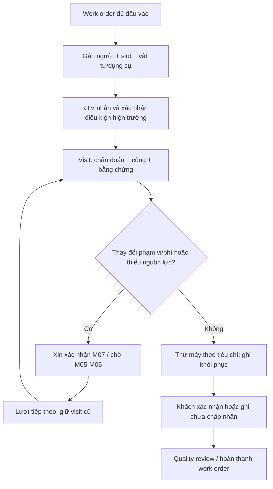

# M03. Điều phối nguồn lực và tác nghiệp hiện trường

## 1. Vấn đề doanh nghiệp

Gán người theo vòng chỉ giải quyết công bằng về số ca, không giải quyết việc có làm được ca hay không. AIS còn phải biết người có kỹ năng phù hợp, đang rảnh vào khung nào, có dụng cụ/vật tư, máy có được phép dừng và khách đã cho phép phần phát sinh chưa. Một ca cần nhiều lượt phải giữ lịch sử để hiểu chi phí và first-time fix.

Truy vết PP-05/06, US-09 đến US-12, G02/G05. Điều phối sở hữu kế hoạch, KTV ghi thực hiện, trưởng nhóm quyết định chất lượng/tái phát. M03 không xác nhận quyền lợi hợp đồng hoặc sửa ledger kho.

## 2. User story và phân rã

| US | Kết quả người dùng cần | Chức năng |
|---|---|---|
| US-09 | Gói việc và lượt đến có người, phạm vi và kết quả riêng | M03-F01: work order và visit |
| US-10 | Người phù hợp và kế hoạch thực hiện có thể đáp ứng | M03-F02: kỹ năng/khả dụng; M03-F03: chuẩn bị nguồn lực |
| US-11 | Chẩn đoán, công, kết quả và nghiệm thu có bằng chứng | M03-F04: thực hiện; M03-F05: khôi phục/nghiệm thu |
| US-12 | Tái phát được phân loại và truy về lần sửa gốc | M03-F06: callback và quality review |

Work order chứa phạm vi tác vụ và owner; visit chứa người tham gia, thời gian, site và từng lần thực hiện. Mỗi work order có WorkSource loại INCIDENT, SERVICE_REQUEST không có incident hoặc PM_OCCURRENCE, đúng một FK nguồn. UNIQUE(source_id, package_key, generation_version) chống tạo trùng; nhiều gói khác nhau phải được xác nhận scope. Request báo cùng incident không được nhân đôi nguồn việc. P1 giữ nhiều visits dù giới hạn một gói chính; xem [hợp đồng nguồn](../05_domain_workflow_contracts.md).

## 3. Quy trình điều phối và chuẩn bị

Điều phối nhận ca có triage và cam kết M02; chọn năng lực cần làm, xác minh cửa sổ site/máy và vật tư. Bộ lọc loại người không đủ kỹ năng hoặc đang vắng; người còn lại được xếp theo lịch, khả năng đáp ứng, vật tư/dụng cụ và tính liên tục với ca trước. Điều phối có quyền override có lý do, không bỏ kiểm tra đủ điều kiện.

Xác nhận kế hoạch không giống xác nhận KTV đã nhận việc. KTV nhận work order và đọc hồ sơ, checklist, điều kiện tiếp cận; thiếu đầu vào thì báo trước khi xuất phát. Vật tư cần giữ chỗ ở M05; phải giải quyết hàng chưa chắc có trước khi hứa chuyến đi sẽ khôi phục.

## 4. Luồng thực hiện và nghiệm thu

KTV ghi observed symptoms, diagnosis, root cause sau kiểm tra, hành động, time log và hàng thực dùng; chẩn đoán có thể thay đổi, không bị ép ghi một nguyên nhân cố định lúc chưa đủ bằng chứng. Checklist tác nghiệp/điều kiện an toàn dùng quy trình đã được doanh nghiệp/site duyệt; thiết kế không tự đưa hướng dẫn kỹ thuật nguy hiểm vào nội dung hệ thống.

Khôi phục ghi tiêu chí thử máy, kết quả đo, người xác nhận và thời điểm. Khách chưa có người nghiệm thu hoặc máy chưa được chạy thử thì lưu trạng thái pending acceptance, không tự giả chữ ký/đồng ý. Nếu quy trình cho đóng sau một khoảng chờ phải có điều khoản được xác nhận, không đặt sẵn số giờ tùy ý.

M03 là authority cho WorkOrderRestored và CustomerAcceptanceRecorded; M02 phản chiếu theo source events và đóng request theo policy. Với nhiều work orders bắt buộc, chỉ khi đủ facts restored/accepted mới cập nhật tổng thể. Correction/reopen phát sự kiện mới; không sửa độc lập mốc phản chiếu ở M02.

## 5. Dữ liệu và trạng thái

| Đối tượng | Nội dung | Điều cần giữ |
|---|---|---|
| Skill profile | Kỹ năng, mức, nhóm máy, hiệu lực nếu có | Chuyên môn khai báo khác năng lực đã được xác nhận |
| Availability/booking | Ca làm, vắng, slot đã nhận | Không double-book cho cùng khoảng có xung đột |
| Work order | Request, scope, tasks, owner, slot, nguồn chính sách | Phạm vi được giao và thay đổi có version |
| Visit | Work order, crew, start/end, outcome, lý do chưa xong | Không ghi đè visit trước khi đi lại |
| Time log | Người, thời lượng, loại công/chờ/di chuyển | Số thực và phần tính phí tách riêng |
| Acceptance | Tiêu chí, kết quả, người phía khách, bằng chứng | Accepted/Rejected/Pending riêng |
| Callback relation | Ca gốc, ca mới, symptom/cause, quyết định | Không chỉ so cùng Asset rồi kết luận tái phát |

Work order: Planned → Assigned → Accepted → In progress → Technically complete → Customer accepted → Closed, có Waiting/Cancelled. Visit: Scheduled → Started → Completed/Incomplete/Cancelled. Hoàn visit không tự hoàn work order; hoàn kỹ thuật không tự nghĩa đã thu tiền.

## 6. Quy tắc phân công và callback

Các ràng buộc bắt buộc gồm kỹ năng, khả dụng, tiếp cận site và thẩm quyền; các tiêu chí ưu tiên gồm đến kịp, gần/người đang ở site, kinh nghiệm máy và cân tải. P1 dùng người điều phối lựa chọn dựa thông tin; thuật toán tối ưu là nâng cấp, không hứa tự động ngay.

Callback là quyết định chất lượng trong một cửa sổ theo chính sách, không chỉ ca tạo trong 7 ngày. Giữ liên kết ca gốc, phạm vi bảo hành sửa chữa và người kết luận. Nếu vấn đề mới cùng máy, đánh dấu related khác callback. Khi chưa kết luận, KPI hiển thị pending classification.

Người đã làm ca gốc có thể được ưu tiên để liên tục chẩn đoán, nhưng ca phức tạp/tái phát nhiều lần cần trưởng nhóm quyết định có thay người hay không; không bắt buộc người cũ trong mọi trường hợp.

## 7. Ngoại lệ và quyền

KTV chỉ ghi ca/visit được giao và không tự thay đổi giá/coverage. Điều phối gán lại, không sửa time log đã xác nhận mà mất lịch sử. Trưởng nhóm được quality review, kế toán chỉ đọc công đã xác nhận để tính phí. M10 kiểm tra quyền cả API.

Không có người đủ năng lực → hàng đợi exception có owner; khách không cho dừng máy → visit hoãn có lý do; mạng mất → chưa lưu/đang gửi hiển thị rõ, retry an toàn; hàng không phù hợp → quay về chẩn đoán, giữ vật tư trả/tiêu hao đúng trạng thái.

## 8. Nghiệm thu

- **AC-09.1:** Hai visit cho một ca giữ thời gian/kết quả từng lượt và một incident; không tính FTFR thành công khi lượt đầu không giải quyết.
- **AC-10.1:** Người nghỉ hoặc thiếu kỹ năng không được tự gán; override hợp lệ ghi lý do và thẩm quyền.
- **AC-10.2:** Hai booking trùng gây cảnh báo/chặn theo chính sách; chuyển người giữ lịch sử.
- **AC-11.1:** Chưa có thử máy/nghiệm thu thì work order không thể Customer accepted bằng UI hoặc API.
- **AC-11.2:** Công thực, công tính phí và thời gian chờ không bị trộn vào một trường.
- **AC-12.1:** Ca tái phát có ca gốc và quyết định nguyên nhân; vấn đề mới cùng máy không tự tính callback.

## 9. Phân kỳ

P1 work order đơn giản, nhiều visit, gán có thông tin, nghiệm thu và time log. P2 availability chi tiết, reservation và quality review. P3 tối ưu lịch/tuyến và offline đồng bộ. Cửa sổ callback, cách tính travel và người xác nhận thử máy là quyết định nghiệp vụ còn mở.
