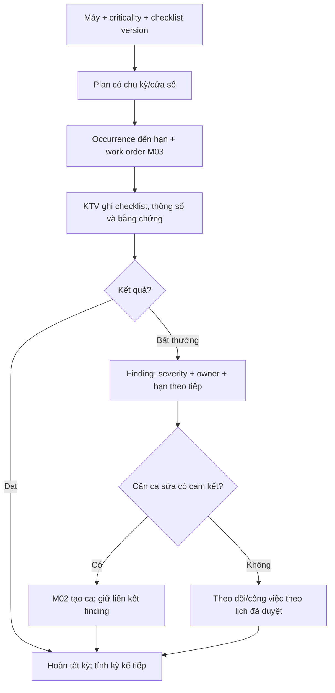

# M04. Thiết bị, lịch sử kỹ thuật và bảo trì phòng ngừa

## 1. Vấn đề doanh nghiệp và phạm vi

Thiết bị của khách là đối tượng được phục vụ, không mặc nhiên là tài sản vốn của AIS. KTV cần model, serial, cấu hình, vị trí, lịch sử hỏng và hướng dẫn phù hợp; người lập PM cần thời điểm máy có thể dừng, độ quan trọng và checklist. Danh sách tên máy cùng chu kỳ hàng tháng chưa đủ đảm bảo một kế hoạch thực hiện được.

Truy vết PP-07/08, US-13 đến US-16, G02/G03. Chủ nghiệp vụ: trưởng nhóm kỹ thuật/quản lý bảo trì. M04 quản hồ sơ và kế hoạch, M03 quản người và lần thực hiện; M02 quản sự cố cần cam kết.

## 2. User story và năng lực

| Story | Kết quả cần | Chức năng |
|---|---|---|
| US-13 | Xác định đúng máy và xem lịch sử kỹ thuật trước chẩn đoán | M04-F01: hồ sơ máy; M04-F02: lịch sử/cấu hình |
| US-14 | Kế hoạch/checklist có cửa sổ sản xuất và nguồn lực | M04-F03: template; M04-F04: lần đến hạn |
| US-15 | Kết quả đo/bất thường có owner và hành động theo tiếp | M04-F05: thực hiện PM và findings |
| US-16 | Chuyển site/ngừng máy và thay kế hoạch giữ lịch sử | M04-F06: thay đổi vòng đời kỹ thuật |

## 3. Hồ sơ máy và nhận diện

Hồ sơ giữ mã ổn định, Customer/site theo hiệu lực, model, serial, category, thông số chính, ngày đưa vào sử dụng, độ quan trọng và liên hệ vận hành. Criticality phản ánh hậu quả khi máy dừng, không phải giá mua; một máy giá thấp có thể là điểm nghẽn dây chuyền. BOM/phụ tùng tương thích, tài liệu M09 và các thay đổi cấu hình có ngày áp dụng.

QR trỏ đến hồ sơ/form báo lỗi phù hợp quyền, không chứa token hoặc cấp quyền. Nếu đổi site/khách, mã máy và lịch sử không đổi. Khi chưa xác định đúng serial, ghi mức chắc chắn và yêu cầu xác minh; không nhập model gần giống rồi coi là đúng.

## 4. Kế hoạch PM và lần thực hiện

Kế hoạch chứa template công việc, chu kỳ theo ngày hoặc cách khác được duyệt, cửa sổ sớm/muộn, người phụ trách, yêu cầu nguồn lực và phiên bản. Mỗi kỳ sinh một occurrence có due date gốc, deadline chấp nhận, trạng thái và work order M03. Thay plan không sửa im lặng những kỳ đã sinh hoặc đã làm.

UNIQUE(plan_version_id, equipment_id, period_key) chống sinh kỳ trùng. WorkSource PM_OCCURRENCE nối đúng FK occurrence; gói PM_MAIN dùng generation_version của scope occurrence, có UNIQUE(source_id, package_key, generation_version). Retry trả cùng ID. Finding phát sinh ca sửa dùng nguồn INCIDENT riêng, không đổi work source của công việc PM đã thực hiện. Chi tiết: [domain/workflow](../05_domain_workflow_contracts.md).

Khách đề nghị hoãn phải ghi lý do, người chấp thuận và due date mới; báo cáo giữ cả hạn gốc và hạn điều chỉnh. Máy ngừng sử dụng có thể tạm dừng kế hoạch với ngày hiệu lực; không xóa các kỳ đã quá hạn để làm đẹp compliance.

## 5. Dữ liệu kiểm tra và phát hiện

| Đối tượng | Thuộc tính | Kiểm soát |
|---|---|---|
| Checklist template | Version, loại máy, bước, kết quả bắt buộc | Chỉ version đã duyệt được dùng |
| PM occurrence | Plan version, due gốc/điều chỉnh, owner | Unique plan + kỳ để không sinh trùng |
| Observation | Chỉ tiêu, số đo, đơn vị, người/giờ, thiết bị đo nếu cần | Ngưỡng theo model; không so số khác đơn vị |
| Finding | Hiện tượng, mức ảnh hưởng, đề nghị, owner/hạn | Nhiều finding trên một lần PM; mỗi finding có outcome |
| Lifecycle event | Chuyển site, thay cấu hình, tạm dừng/ngừng dùng | Hiệu lực và lý do; không phá lịch sử |

Kết quả checklist có Passed/Abnormal/Not applicable/Not performed với lý do phù hợp. “Không đo” khác “đo bằng 0”. Dữ liệu tay phải ghi nguồn; chưa có sensor thì không hiển thị là real-time telemetry.

## 6. Quy tắc và ngoại lệ

Hoàn tất kiểm tra PM không đồng nghĩa finding đã giải quyết. Một occurrence có nhiều findings và mỗi finding có thể nối công việc/ca riêng. Khi sinh lại sau lỗi mạng, cùng finding trả ca đã có thay vì tạo hai ca. Tạo ca mới giữ giờ phát hiện, site/máy và quyền lợi; priority theo ảnh hưởng, không tự Urgent.

Nếu lịch đo yêu cầu dụng cụ hiệu chuẩn, plan ghi điều kiện; hệ thống không xác nhận số đo hợp lệ khi dụng cụ không đủ điều kiện theo quy trình được duyệt. Nếu chưa có quản lý hiệu chuẩn, ghi phần này là nâng cấp, không khẳng định đã bảo đảm.

Máy của khách cần hồ sơ kỹ thuật tách khỏi hạch toán vốn AIS. Lựa chọn dùng Asset với control hay DocType equipment riêng được đánh giá ở kiến trúc, không dựa vào một cờ custom rồi coi là đã cách ly kế toán.

## 7. Quyền và liên kết

KTV được ghi kết quả lần được giao; sửa kết quả đã nghiệm thu phải có correction. Trưởng nhóm duyệt checklist/ngưỡng và phân loại findings. Khách xem lịch/kết quả máy của mình, không đọc toàn bộ chi phí nội bộ hoặc máy của khách khác. M01 cấp coverage, M03 thực hiện, M02 theo tiếp sự cố, M05 giữ lịch sử vật tư, M09 cấp hướng dẫn, M08 báo PM/chi phí.

## 8. Nghiệm thu và phân kỳ

- **AC-13.1:** Quét QR cho máy đúng quyền ra đúng serial/model/site; user ngoài phạm vi không đọc được.
- **AC-14.1:** Sinh cùng kỳ hai lần chỉ có một occurrence; thay plan giữ due gốc của kỳ cũ.
- **AC-14.2:** Hoãn do khách giữ ngày gốc, ngày mới, lý do và người duyệt; báo cáo phân biệt hai cách tính.
- **AC-15.1:** Hai findings trong một PM đều có owner/hạn; một finding tạo ca, một được theo dõi; hoàn PM không đóng cả hai.
- **AC-15.2:** Số đo thiếu và số đo 0 phân biệt; khác đơn vị không được so ngưỡng sai.
- **AC-16.1:** Máy chuyển site giữ lịch sử khách/site theo thời điểm của các ca cũ.

P1 hồ sơ, version checklist, kỳ PM và findings; P2 cửa sổ/hoãn, cấu hình lịch sử, dụng cụ; P3 theo usage và IoT khi có nguồn dữ liệu. Cần xác nhận criticality, quyền đổi checklist và chính sách due date sau hoãn.
