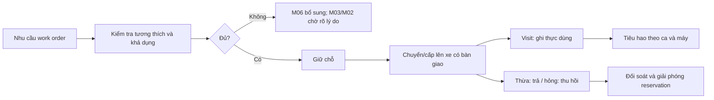

# M05. Kho phụ tùng, giữ chỗ và trách nhiệm vật tư

## 1. Bài toán và ranh giới

Kho tổng có 2 lọc dầu nhưng hai ca cùng nhìn thấy 2 và đều được hứa cấp thì lượng tồn đúng vẫn không đảm bảo giao việc đúng. Cần phân biệt tồn thực, giữ chỗ và khả dụng. Phụ tùng chuyển lên xe vẫn thuộc AIS; chỉ tiêu hao/trả/thu hồi mới cho biết chi phí và trách nhiệm của một ca.

Truy vết PP-09/10, US-17 đến US-20, G04/G05. Thủ kho sở hữu sổ và bàn giao; KTV xác nhận thực dùng; M06 mua bổ sung, M07 định giá/đối soát phí. M05 không tự quyết định vật tư có miễn phí cho khách hay không.

## 2. User story và chức năng

| US | Kết quả cần | Chức năng |
|---|---|---|
| US-17 | Lượng thật có thể cam kết và ca đang giữ hàng | M05-F01: số dư; M05-F02: reservation |
| US-18 | Người giữ và vị trí vật tư có chứng từ | M05-F03: chuyển/bàn giao |
| US-19 | Thực dùng, thừa, hỏng được phản ánh theo ca | M05-F04: cấp/tiêu hao; M05-F05: trả/thu hồi |
| US-20 | Chênh kiểm kê có lý do và người duyệt | M05-F06: đối soát tồn |

## 3. Luồng vật tư từ chuẩn bị tới hoàn tất

Điều phối lập nhu cầu theo work order và số lượng. Thủ kho/engine kiểm tra hàng tương thích, lượng khả dụng và kho có quyền; reservation có work order, owner và thời hạn sử dụng. Khi chuyển lên xe, ghi source/destination và người bàn giao/nhận; reservation có thể chuyển vị trí mà không nhân đôi.

KTV ghi lượng thực dùng ở visit; Material Issue/consumption phát sinh theo lượng đó. Vật tư đã cấp nhưng chưa dùng được trả hoặc tiếp tục giữ theo chính sách, không bị tính là đã tiêu hao chỉ vì rời kho tổng. Linh kiện hỏng tháo ra được phân biệt với hàng mới chưa dùng; nếu cần core return/serial thì có tình trạng và quyết định xử lý riêng.

## 4. Dữ liệu và bất biến

| Dữ liệu | Nội dung | Bất biến |
|---|---|---|
| Item compatibility | Mã, đơn vị, model tương thích, tracking nếu cần | Hàng thay thế phải có phê duyệt kỹ thuật |
| Stock balance | Kho, thực có, giữ chỗ, khả dụng | Khả dụng không bằng actual nếu có reservation |
| Reservation | Work order, item, kho, qty, state, expiry | Không giữ chỗ vượt lượng được phép; release rõ |
| Transfer/custody | Nguồn/đích, người giao/nhận, qty | Tổng hàng doanh nghiệp không đổi khi chuyển |
| Consumption | Ca, máy, visit, user, item/serial, qty, valuation | Không tiêu hao hai lần cùng lần xác nhận |
| Return/recovery | Nguồn vật tư, tình trạng, lý do, outcome | Hàng hỏng không nhập lại như hàng sẵn dùng |
| Stock count | Kỳ, lượng đếm, chênh, duyệt | Điều chỉnh sổ cần thẩm quyền và lịch sử |

Reservation mục tiêu có Proposed → Held → Picked/Consumed hoặc Released/Expired. Không coi một request giữ chỗ là ledger đã giảm. Định nghĩa available phải ghi cách xét hàng hỏng, đang chuyển và tồn khác kho; không cộng mọi kho để hứa hàng đang ở xe người khác.

## 5. Quy tắc nghiệp vụ

Server kiểm tra lượng và quyền tại thời điểm xác nhận, không chỉ khi tải form. Giữ chỗ đồng thời phải khóa/kiểm tra atomic để hai yêu cầu không cùng thành công vượt tồn. Khi đổi lịch hoặc hủy work order, reservation được giải phóng có sự kiện; expiry không tự thu hồi vật tư đã chuyển mà không bàn giao.

Material transfer tăng/giảm kho, Material Issue giảm tổng; phiếu cấp nếu có chỉ biểu thị custody trước tiêu hao. Mô hình MVP có thể gộp cấp và tiêu hao khi KTV đã xác nhận thực dùng, nhưng phải nói rõ giới hạn và hỗ trợ trả phần chưa dùng. Không biến receipt tồn đầu thành chứng từ mua thay M06.

Giá trị tiêu hao lấy từ ledger/định giá được chấp nhận. Invoice bán hàng không trừ kho lần nữa cho cùng lượng đã Material Issue. Return hàng chưa dùng không tạo doanh thu; recovery hàng hỏng không tự giảm chi phí ca khi chưa có giá trị được xác nhận.

## 6. Ngoại lệ và kiểm soát

Chặn lượng 0/âm, sai đơn vị chuyển đổi, kho khác công ty, item không tương thích, thiếu ca/máy/visit với tiêu hao phục vụ và user không được giao kho. Hết hàng sau đọc tồn → báo thất bại không ghi thành công. Tồn âm nếu có chính sách cho phép phải là ngoại lệ riêng, không mặc định demo bật để chạy.

Kiểm kê có thể khác sổ do ca chưa đồng bộ; cần danh sách giao dịch pending và thời điểm cut-off trước khi điều chỉnh. Không xóa chênh để báo zero stockout. M10 kiểm soát submit/hủy/adjustment; người đếm không tự duyệt mọi chênh của mình khi cần phân tách.

## 7. Hợp đồng giao tiếp

M03 gửi nhu cầu/visit, M04 cấp tương thích máy, M06 nhận thiếu đã xét đơn mở, M07 đọc consumption và return hợp lệ, M08 đọc yêu cầu đủ/thiếu tại thời điểm thực chứ không suy từ tồn hiện tại. M02 nhận lý do chờ/ETA; M09 chỉ có thể đọc tồn hoặc đề nghị nháp theo quyền.

## 8. Nghiệm thu

- **AC-17.1:** Tồn 2, hai request giữ 2 đồng thời: chỉ một Held, request còn lại thấy thiếu; tổng giữ không vượt 2.
- **AC-18.1:** Chuyển 2 kho tổng sang xe: tổng không đổi, hai kho đúng số và có người nhận.
- **AC-19.1:** Cấp 2, dùng 1, trả 1: ca chịu tiêu hao 1 và item returned có nguồn; không ghi cả 2 là chi phí.
- **AC-19.2:** Recovery hàng hỏng vào tình trạng/quarantine riêng, không tăng availability hàng dùng được.
- **AC-20.1:** Chênh kiểm kê chưa duyệt không làm đổi ledger; được duyệt có người/lý do và giao dịch liên kết.

## 9. Phân kỳ

P1 bắt buộc reservation atomic cho lời hứa cấp hàng: khóa/CAS item-kho, kiểm tra available, ghi hold/version và idempotency result cùng transaction. Không chọn chỉ cấp trực tiếp rồi vẫn hứa giữ hàng cho nhiều ca. P2 bàn giao/return/kiểm kê sâu, serial/core return; P3 tối ưu ngưỡng. Nguồn chuẩn: [P1 vật tư](../05_domain_workflow_contracts.md). Giao dịch có thể xuất trực tiếp từ kho tổng; không bắt mọi ca phải đi qua xe.
