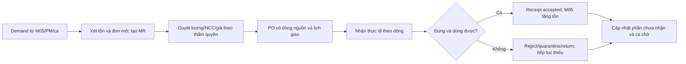

# M06. Mua hàng, bổ sung và xác nhận nguồn cung

## 1. Giá trị doanh nghiệp và phạm vi

Khi một phụ tùng chạm ngưỡng, doanh nghiệp cần biết có nhu cầu thật chưa đáp ứng, đã có đơn đang mở hay chưa và hàng bao giờ dùng được. Tự tạo MR không giải quyết việc PO giao chậm, nhận sai model hoặc hàng bị reject. M06 quản cả quá trình từ nhu cầu đến hàng được nhận chấp nhận, nối tiến độ với ca đang chờ.

Truy vết PP-11/12, US-21 đến US-24, G02/G04/G05. Chủ module: mua hàng; thủ kho ghi nhận hàng; trưởng nhóm xác nhận tương thích khi cần. Không mở portal NCC hoặc quy trình đấu thầu đầy đủ ở pha đầu.

## 2. User story và phân rã

| US | Kết quả | Chức năng |
|---|---|---|
| US-21 | Nhu cầu ròng xét tồn/giữ chỗ/đơn mở | M06-F01: demand; M06-F02: requisition |
| US-22 | Người duyệt thấy nguồn và lựa chọn NCC | M06-F03: duyệt và PO |
| US-23 | Hàng nhận theo dòng, đúng lượng/tình trạng | M06-F04: receipt; M06-F05: reject/return |
| US-24 | ETA và chậm giao phản ánh ở ca chờ | M06-F06: tiến độ và escalation |

## 3. Xác định nhu cầu ròng

Nguồn gồm mức tồn an toàn theo item/kho, work order có nhu cầu, lịch PM tương lai và yêu cầu thủ công có lý do. Mỗi demand giữ source và date required; chỉ cộng nguồn chưa được đáp ứng, tránh đếm cùng nhu cầu cả reservation lẫn work order hai lần.

Xét hàng đang đặt còn mở, hàng chưa qua kiểm tra, lượng đã dành cho ca khác và lead time. Công thức cụ thể phụ thuộc chính sách: mục tiêu tồn/nhu cầu hợp lệ trừ lượng có thể dùng và nguồn cung chắc chắn. Hàng NCC chỉ “dự kiến giao” không được cộng availability hiện trường, nhưng cần được xét để tránh đặt mua lặp.

Batch/mức mua tối thiểu có thể tạo lượng mua khác thiếu thực; phải giải thích phần dư. Không hardcode mua 10 chỉ vì kịch bản demo dùng 10. Ngưỡng `<` hay `<=` và projected quantity được chốt thành policy có version.

## 4. Luồng chứng từ và bàn giao

MR có thể gom nhiều demands, PO có thể phục vụ nhiều MR và một PO nhận nhiều lần. Tham chiếu ở dòng hàng và allocation nguồn để biết đã đáp ứng nhu cầu nào. Một ca có hàng chưa received accepted không được báo vật tư đã sẵn sàng.

## 5. Dữ liệu và trạng thái

| Đối tượng | Dữ liệu quan trọng | Quy tắc |
|---|---|---|
| Demand | Source, item/spec, kho/site, quantity, needed_at | Deduplicate theo nguồn và phiên bản nhu cầu |
| Requisition/MR | Dòng demand, lượng, lý do/criticality | Duyệt không mất source |
| Supplier offer | Spec, đơn vị, giá, lead time, validity | Giá rẻ không thay thế kiểm tra tương thích |
| PO line | Source MR/demand, ordered, hẹn giao | Đổi ETA/quantity giữ lịch sử |
| Receipt line | PO row, lượng giao/accepted/rejected, tình trạng | Accepted + rejected giải thích lượng giao |
| Return/dispute | Receipt, lý do, lượng, outcome | Không trừ tồn và tính lại thiếu hai lần |

Trạng thái thương mại của PO và trạng thái hàng cần tách: Ordered/Partial/Received/Cancelled không tự nói hàng đã qua kiểm tra. Demand có Open/Partially fulfilled/Fulfilled/Cancelled với số lượng còn lại.

## 6. Ngoại lệ, phê duyệt và tiến độ

NCC giao 6/10 → nguồn thiếu còn 4; receipt của 6 làm tăng tồn tương ứng, không coi hoàn tất. Nếu 2/6 sai model thì availability tăng 4, phần reject/quarantine được theo dõi khác. Đổi sang item thay thế phải trưởng nhóm xác nhận và cập nhật compatibility; không chỉ sửa text mô tả.

Người lập MR không tự vượt thẩm quyền duyệt giá; workflow dựa amount/criticality được xác nhận ở M10. Mua khẩn vì dừng dây chuyền vẫn có ngoại lệ ghi lý do và phê duyệt, không xóa kiểm soát nguồn.

ETA thay đổi tác động M03 lịch visit/M02 hẹn khách. Escalation gửi người phụ trách và quản lý theo thời gian chờ, tránh lặp thông báo mỗi lần scheduler. KPI nhận đúng hạn tính thời điểm accepted đủ, không chỉ creation của PR.

## 7. Quyền và liên kết module

Mua hàng lập PO và cập nhật NCC/ETA; thủ kho nhập hàng thực, kỹ thuật xác minh spec; người phê duyệt được chọn theo thẩm quyền. Kế toán đọc PO/PR để đối soát khi mở rộng công nợ NCC; module hiện không tự viết chính sách thuế/pháp lý.

M05 cấp tồn/ngưỡng/giữ chỗ và nhận accepted receipt; M04 cung cấp spec máy/PM; M03/M02 nhận thiếu/ETA; M07 dùng giá vốn ledger, không sao chép giá chào NCC vào phí khách; M08 đọc nhu cầu/chờ/supplier delivery.

## 8. Nghiệm thu

- **AC-21.1:** Có PO đang mở đáp ứng đúng demand thì không tạo mua trùng; demand mới khác nguồn vẫn được xét rõ.
- **AC-22.1:** Chưa đủ thẩm quyền không submit PO vượt mức; duyệt lưu lượng/giá/nguồn được chấp thuận.
- **AC-23.1:** Nhận 6/10, accept 4, reject 2: tồn dùng được tăng 4 và demand chưa hoàn tất.
- **AC-23.2:** Retry receipt có cùng khóa không làm tăng tồn hai lần.
- **AC-24.1:** ETA đổi thông báo cho owner ca và giữ ETA trước; không coi đã hết chờ bằng trạng thái PO.

## 9. Phân kỳ và quyết định mở

P1 MR-PO-PR có tham chiếu, nhận một phần và nhu cầu còn lại; P2 tự động nhu cầu ròng/duyệt/ETA, reject/return; P3 đánh giá NCC và portal khi có giá trị. Cần khảo sát lead time, mức duyệt, cách nhận hàng và item cần kiểm tra chất lượng trước sử dụng.
