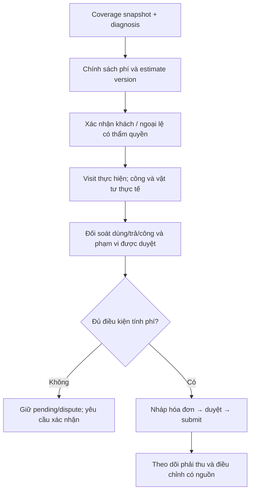

# M07. Phạm vi tính phí, chi phí ca và hóa đơn

## 1. Bài toán và kết quả cần

AIS cần tránh cả việc thu sai khách và việc đã làm nhưng không đối soát được. Máy đang trong bảo hành không có nghĩa mọi nguyên nhân đều được miễn phí; khách báo lỗi không có nghĩa đã đồng ý thay một phụ tùng đắt hơn. Một ca có thể gồm phần hợp đồng bao phủ, phần ngoài phạm vi, hỗ trợ goodwill và chi phí tái phát do AIS chịu.

Truy vết PP-13/14, US-25 đến US-28, G05. Kế toán sở hữu đối soát, quản lý có thẩm quyền xác nhận chính sách/ngoại lệ, người phía khách xác nhận phát sinh. Module quản hóa đơn và trạng thái đối soát phải thu; không thiết kế chi tiết kết nối ngân hàng, thuế hoặc kê khai pháp lý.

## 2. User story và chức năng

| US | Kết quả cần | Chức năng |
|---|---|---|
| US-25 | Phần AIS/khách chịu có nguồn quyền lợi và lý do | M07-F01: quyết định chi phí |
| US-26 | Khách có quyền đồng ý phạm vi/giá thay đổi trước khi làm | M07-F02: estimate và change approval |
| US-27 | Công/vật tư được đối soát và hóa đơn không trùng | M07-F03: cost ledger; M07-F04: invoice |
| US-28 | Giảm/đổi/hủy và tình trạng phải thu có lịch sử | M07-F05: adjustment; M07-F06: reconciliation |

## 3. Từ quyền lợi tới xác nhận phát sinh

M01 cung cấp snapshot hợp đồng, M03 cung cấp chẩn đoán và đề nghị thay đổi. Quyết định phí xét loại công việc, nguyên nhân và hạng mục, không chỉ warranty_status trên máy. Ước tính gồm vật tư/công, giá bán, hạng mục miễn và điều kiện thay đổi; không giả định mọi dòng đều thu tiền.

Khách duyệt estimate version nào thì lưu version đó, người, phạm vi, thời điểm và bằng chứng. KTV phát hiện cần thêm vật tư ngoài version đã duyệt thì gửi change request, không ghi đè estimate. Nếu ca khẩn cần làm trước, phải có chính sách và người chấp thuận ngoại lệ; không tự coi im lặng là đồng ý.

## 4. Đối soát thực tế và hóa đơn

Cost ledger giữ giá vốn vật tư theo consumption, công thực/công tính phí và phân bổ chi phí khác nếu doanh nghiệp xác nhận cách tính. Travel/waiting không mặc nhiên billable. Vật tư đã chuyển nhưng chưa dùng không đưa vào tiêu hao ca; hàng trả được xử lý theo ledger nguồn.

Một hóa đơn có thể gom nhiều ca nếu chính sách cho phép; liên kết ở invoice line tới service/visit hoặc charge line giúp chống tính trùng. Mỗi charge chỉ được invoiced một lần trừ khi có correction rõ ràng. P1 có thể giới hạn một ca một hóa đơn, nhưng dữ liệu nguồn vẫn phải có danh tính charge.

## 5. Dữ liệu nghiệp vụ

| Đối tượng | Dữ liệu chính | Kiểm soát |
|---|---|---|
| Billing decision | Coverage, cause, người xác nhận, AIS/customer share | Quyết định có version và nguồn |
| Estimate/change | Version, dòng công/vật tư, giá bán, hạn/điều kiện | Duyệt gắn version, không chỉ một checkbox |
| Cost/charge line | Source consumption/time, valuation, billable, amount | Giá vốn và giá bán tách; currency/UOM rõ |
| Acceptance | Người phía khách, nguồn/xác nhận, approved scope | Thẩm quyền theo site/hợp đồng |
| Invoice allocation | Invoice line ↔ charge/ca | Không thu lặp nguồn; cùng bên thanh toán |
| Adjustment/dispute | Source invoice/charge, lý do, approved amount | Không xóa hóa đơn submitted để đổi kết quả |

Trạng thái thương mại: Unassessed → Estimated → Awaiting approval → Approved → Reconciled → Invoiced → Settled/Partially settled hoặc Disputed. Trạng thái technical complete ở M03 không tự chuyển Invoiced hoặc Settled.

## 6. Quy tắc và trường hợp biên

- Under warranty, Billable và Goodwill có thể áp theo dòng, không chỉ một nhãn cho cả ca. MVP có thể một policy/ca nhưng phải lưu giới hạn đó.
- Khách từ chối phần phát sinh: không ghi phần đó là approved; thông tin tiến độ kỹ thuật giữ riêng.
- Goodwill có mức/thẩm quyền và lý do; KTV không tự miễn mọi khoản để đóng ca.
- Giá bán có thể cao/thấp hơn giá vốn; report không dùng một trường rate cho cả hai.
- Hàng đã Material Issue không bật xuất kho lại trên hóa đơn cho cùng tiêu hao.
- Công bị sửa sau xác nhận cần correction; thời gian visit không bằng toàn bộ billable labor.
- Thuế, tiền tệ và rounding lấy cấu hình được nghiệp vụ/kế toán xác nhận; tài liệu này không đưa quy tắc thuế cụ thể.

## 7. Quyền và tích hợp

KTV đề nghị và ghi nguồn; khách có quyền duyệt trong phạm vi được giao; kế toán đối soát/lập hóa đơn; quản lý duyệt goodwill/điều chỉnh. M10 kiểm tra maker/checker và mức thẩm quyền; role cộng dồn không được làm user vượt quyền quyết định.

M01 quyền lợi, M03 công/diagnosis/acceptance, M05 ledger dùng/trả, M06 nguồn mua không dùng trực tiếp thay ledger, M08 chi phí/doanh thu/biên lợi nhuận theo định nghĩa. M02 được biết trạng thái chờ duyệt nhưng không lộ toàn bộ giá vốn cho khách.

## 8. Tiêu chí nghiệm thu

- **AC-25.1:** Một ca có dòng warranty và billable được giải thích bằng phạm vi; không miễn toàn bộ chỉ vì máy có bảo hành.
- **AC-26.1:** Khách duyệt version A, thêm dòng B thì B vẫn pending; user không đủ thẩm quyền không duyệt được.
- **AC-27.1:** Dùng 1/trả 1, công thực 3 giờ nhưng được thu 2 giờ: chi phí và hóa đơn phản ánh hai định nghĩa riêng.
- **AC-27.2:** Retry lập hóa đơn chỉ allocation một lần cho cùng charge; cùng Customer nhưng ca khác không bị lấy nhầm hóa đơn.
- **AC-28.1:** Hóa đơn submitted bị tranh chấp giữ nguồn và trạng thái; adjustment có lý do/phê duyệt, không viết lại lịch sử.

## 9. Phân kỳ

P1 bắt buộc approval phát sinh tối thiểu trước thực hiện: estimate/scope version, approver đúng quyền, payload hash, quyết định và expiry; scope/giá đổi phải duyệt lại. Chính sách khẩn nếu chưa được xác nhận thì giữ pending. P1 còn gồm nguồn công/vật tư và invoice chống trùng. P2 mở rộng routing nhiều cấp/delegation, dispute và charge sâu; không trì hoãn approval P1. P3 tích hợp thanh toán sâu. Agent dùng cùng M10/M07 approval, không có đường miễn phí/duyệt riêng ít kiểm soát; xem [approval AI](../ai_architecture/07_security_and_human_approval.md).
