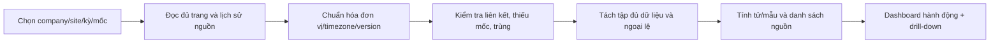

# M08. Báo cáo hành động, chất lượng và hiệu quả dịch vụ

## 1. Vì sao dashboard cần thiết kế nghiệp vụ?

Quản lý cần biết ca nào phải can thiệp và vì sao; tỷ lệ tổng không trả lời được vật tư thiếu hay người vắng đang làm chậm dịch vụ. Một ca đóng hôm nay chưa đủ thời gian để kết luận không callback. Một kỳ PM bị hoãn không được coi đúng hạn chỉ bằng ngày mới. Vì vậy, báo cáo cần định nghĩa tập xét và lịch sử, không chỉ cộng status hiện tại.

Truy vết PP-15/16, US-29 đến US-32, G01-G06. Chủ nghiệp vụ: quản lý dịch vụ; data steward chịu lỗi dữ liệu nguồn. M08 không sửa trạng thái ca hoặc mốc thời gian để đạt KPI.

## 2. User story và chức năng

| US | Quyết định được hỗ trợ | Chức năng |
|---|---|---|
| US-29 | Ca nào sắp trễ, ai chịu trách nhiệm, chờ gì? | M08-F01: dashboard hành động |
| US-30 | Chất lượng sửa/PM và cam kết khác nhau ra sao? | M08-F02: SLA/ca; M08-F03: FTFR/PM |
| US-31 | Hợp đồng/máy/ca và vật tư đang tiêu tốn gì? | M08-F04: chi phí và nguồn lực |
| US-32 | Số tổng đến từ đâu và dữ liệu nào cần sửa? | M08-F05: drill-down; M08-F06: data quality |

## 3. Hợp đồng mỗi chỉ tiêu

Mỗi KPI có tên, câu hỏi kinh doanh, đơn vị, tử/mẫu, inclusion/exclusion, clock, cohort, thời điểm snapshot, version công thức và owner. Cùng tên SLA nhưng tính theo reported_at hay received_at phải có nhãn khác; không ghép hai định nghĩa trong một chuỗi xu hướng.

| Chỉ tiêu | Tập xét và công thức đề xuất | Điều thiếu phải hiển thị |
|---|---|---|
| Độ trễ ghi nhận | recorded - received; bổ sung recorded - reported nếu có | Mốc khai báo/nhận thiếu và mức chắc chắn |
| SLA phản hồi | Số đáp ứng deadline / ca đủ dữ liệu đã phản hồi hoặc đã đến hạn | Thiếu mốc, coverage, lịch hoặc deadline |
| SLA khôi phục | Ca restored đúng cam kết / ca đủ mốc đã đến hạn hoặc restored | Pending/chưa đủ dữ liệu; interval pause chưa duyệt |
| Thời gian chờ | Tổng interval theo nguyên nhân: hàng, khách, nguồn lực, duyệt | Interval chưa kết thúc hoặc thiếu lý do |
| First-time fix | Ca đủ quan sát, đạt khôi phục ở visit đầu và không callback / ca đủ quan sát phù hợp | Ca chưa đủ cửa sổ; visit outcome chưa phân loại |
| Callback rate | Ca gốc có callback xác nhận trong cửa sổ / ca gốc đủ quan sát | Pending classification; vấn đề mới không tính callback |
| PM đúng hạn gốc | Kỳ due trong kỳ làm đúng hạn gốc / tất cả kỳ due trong kỳ | Kỳ chưa làm/hoãn không bị loại im lặng |
| PM theo hạn điều chỉnh | Tương tự nhưng dùng hạn mới đã duyệt | Đếm và lý do hoãn; báo song song với hạn gốc |
| Chi phí ca | Vật tư consumed net + công/chi phí theo chính sách | Chưa xác nhận công hoặc phân bổ chưa có |
| Contribution margin | Doanh thu được định nghĩa - chi phí trực tiếp được định nghĩa | Không gọi lợi nhuận ròng khi chưa có overhead đầy đủ |
| Fill rate vật tư | Nhu cầu đủ quantity vào thời điểm cần / nhu cầu hợp lệ | Chưa có demand timestamp/quantity fulfilled |
| Thời gian bổ sung | Accepted receipt đủ - approved demand | Còn mở/right-censored hiển thị riêng |

Cửa sổ callback theo chính sách M01/M03, không cố định 7/14 ngày cho mọi nhóm máy. FTFR loại ca tư vấn không sửa, loại ca chưa đủ window khỏi mẫu số nhưng báo số đang chờ quan sát. Nếu mẫu số 0 trả N/A, không 0% hoặc 100% tùy tiện.

## 4. Các màn hình phục vụ hành động

Dashboard điều phối có hàng đợi theo urgency/deadline, ca chưa có owner, work order thiếu nguồn lực và ETA. Dashboard kỹ thuật có callback/bất thường PM chưa có action. Dashboard kho/mua có shortages, demand chưa có nguồn, PO chậm và reservation lâu. Dashboard quản lý có xu hướng theo hợp đồng/site/category, cùng dữ liệu thiếu và thay đổi policy.

Mỗi cảnh báo dẫn tới danh sách ca/chứng từ với owner và action có thể thực hiện. Báo cáo chỉ giúp xác định hành động; thay đổi nguồn vẫn qua module và quyền tương ứng. Export theo quyền, có thời điểm, filter và version công thức.

## 5. Pipeline dữ liệu và độ nhất quán

Không đọc Bin hôm nay rồi gọi là tồn cuối tháng trước; báo cáo quá khứ cần ledger tới cut-off. Không dùng ToDo tổng làm tải việc nếu ca đã đóng hoặc một ca có nhiều ToDo trùng. Không trộn invoice canceled/draft vào doanh thu thực hiện. Nếu nguồn chỉ có snapshot hiện tại, chỉ báo được trạng thái hiện tại, không dựng lại lịch sử giả.

Event đến muộn, callback muộn hoặc sửa mốc tạo snapshot revision mới cho kỳ chịu ảnh hưởng. Giữ event-time window, processing watermark, as_of, formula/policy versions và delta/reason; không overwrite báo cáo đã phát. Event ID chống đếm lặp; correction dùng supersedes_event_id để không cộng hai facts. Provisional/final và thời điểm chốt kỳ là policy cần xác nhận. Xem [hợp đồng event/KPI](../05_domain_workflow_contracts.md).

## 6. Chất lượng, quyền và kiểm soát thiên lệch

Data quality queue chứa missing owner/time/coverage, máy khác khách, work log âm, consumption không có visit, invoice allocation trùng. Owner sửa nguồn với correction và giải thích; M08 tính lại có version/snapshot. Missing records không được loại âm thầm làm tỷ lệ tăng.

So sánh KTV theo mix ca, chuyên môn, độ khó và ca được giao; số ticket không tự phản ánh năng suất. Chi phí máy cần kỳ và bối cảnh sử dụng; không gọi MTBF khi chưa có giờ vận hành và failure event đầy đủ. Quản lý chỉ thấy phạm vi được cấp; portal khách không xem chỉ tiêu khách khác hoặc giá vốn AIS.

## 7. Nghiệm thu

- **AC-29.1:** Ca chưa owner/sắp trễ/chờ hàng có action và người chịu trách nhiệm; ca trễ không biến mất khi status đổi.
- **AC-30.1:** Dataset có 1 ca đạt, 1 trễ, 1 chưa đến hạn, 1 thiếu mốc trả đúng tử/mẫu và nhóm thiếu.
- **AC-30.2:** Callback trong window giảm FTFR; ca chưa đủ window không được kết luận thành công; PM hoãn hiện cả hạn gốc/mới.
- **AC-31.1:** Giá vốn khác giá bán cho ra cost/revenue riêng; canceled không được cộng sai.
- **AC-32.1:** Hơn 50 bản ghi, hai company và dữ liệu ngoài kỳ không bị cắt/trộn; tổng đối chiếu được từng source ID.

## 8. Phân kỳ và câu hỏi mở

P1 report từ dữ liệu nguồn đầy đủ và dashboard ca cần hành động; P2 lịch sử/snapshot, data quality và cost cohort; P3 phân tích dự báo khi đã có baseline. Cần chốt event khôi phục, callback window, kỳ cohort, định nghĩa doanh thu và mức phân bổ chi phí trước khi chốt KPI.
