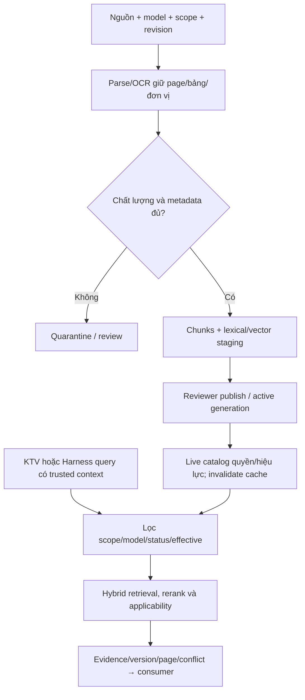

# M09. Knowledge Domain: tri thức kỹ thuật và bằng chứng

Phiên bản 3.0. Tên file giữ để ổn định links; **runtime AI không nằm trong M09**. [Agent Harness](../ai_architecture/01_agent_harness_architecture.md) sở hữu run/plan/loop/tools/checkpoint/approval. M09 sở hữu tài liệu, lifecycle, ingestion/index/retrieval/freshness và cung cấp evidence cho KTV hoặc Harness.

## 1. Bài toán doanh nghiệp và trách nhiệm

KTV cần nguồn đúng model/revision và bài học sửa đã review. Tài liệu trong chat cá nhân, sai revision hoặc findings chưa kiểm chứng dễ làm lặp chẩn đoán sai. M09 bảo đảm truy được nguồn/phạm vi/phiên bản và biết khi chưa đủ căn cứ; không tự xác nhận root cause hoặc thực hiện lệnh kho.

Truy vết PP-17/18, G02/G06. Trưởng nhóm kỹ thuật là owner nội dung/reviewer; quản trị quản truy cập/index; KTV là người dùng/đề nghị lesson. M09 không sở hữu facts ERP hay authority approval. Kho tri thức vẫn sử dụng được nếu runtime AI ngừng.

## 2. Story và phân rã chức năng

| Story | Ownership | Chức năng |
|---|---|---|
| US-33 tìm SOP theo model/version | M09 | M09-F01 catalog/version; M09-F02 search |
| US-34 lesson được review/publish | M09 | M09-F03 lesson review |
| US-35 grounded answer biết thiếu nguồn | Harness AH-F04, M09 hỗ trợ | M09-F04 ingestion; M09-F05 hybrid retrieval |
| US-36 tool/draft scoped | Harness AH-F05/F07, module nguồn | M09-F06 freshness/citation quyền; không gọi commit ERP từ M09 |

F04 gồm parse/OCR/chunk/index staging; F05 lexical+vector/rerank/evidence eligibility; F06 live catalog/cache/revocation và citations. US-41–48 nghiệp vụ AI được phân rã riêng trong [scenarios](../ai_architecture/09_end_to_end_agent_scenarios.md).

## 3. Vòng đời nguồn và lessons

DocumentVersion chứa nguồn sử dụng hợp lệ, owner/reviewer, model/revision, error code, status, effective dates, customer scope và source hash. Draft không là hướng dẫn chính thức; Published có hiệu lực được search; Superseded/Retired vẫn truy lịch sử theo quyền nhưng không mặc định làm recommendation hiện tại. Revoked loại khỏi retrieval ngay qua live catalog dù index chưa cleanup.

Lesson gắn ca, context/model, symptom, diagnosis, action, result và điều kiện áp dụng. Trưởng nhóm review trước publish; ca máy chạy lại một lần không chứng minh phương án cho mọi máy. Giữ version SOP được visit sử dụng để điều tra callback; sửa SOP không làm mất version ca trước.

## 4. Ingestion và retrieval

Chunk không cắt số đo khỏi đơn vị hoặc bỏ ghi chú áp dụng. Exact error code/model dùng lexical; semantic search hỗ trợ symptom khác cách nói. Reranker chỉ nhận candidates đủ quyền. Retrieval không quyết định authoritative action hoặc tự động chọn part từ tên giống.

Evidence chứa doc/version/page/section/hash, fact trích, applicability, effective time, observed_at và permission/catalog refs. Consumer phải kiểm từng claim; có citation link nhưng không hỗ trợ claim vẫn là unsupported. Nguồn có hiệu lực mâu thuẫn được ghi conflict set và chuyển reviewer theo authority policy, không chọn similarity cao hơn.

## 5. Dữ liệu và invariants

| Đối tượng | Danh tính/metadata | Invariant |
|---|---|---|
| DocumentVersion | doc_id/version/source_hash/model/effective/status | Immutable published version, revoke có tombstone |
| Chunk | document version/page/section/text_hash/parser version | Citation quay được đoạn gốc đủ quyền |
| IndexGeneration | corpus/index/policy version, activation | Staging không lẫn nửa active generation |
| Lesson | source ca/visit, reviewer và applicability | Draft không tự thành SOP |
| EvidenceSet | source IDs/support/conflict/observed_at/scope | Retrieval confidence không thay validity |
| CacheRecord | scope/model/catalog/index/policy fingerprint | Không chia answers giữa scope khác |

Policy/cache TTL không thay live revocation check. Tồn/coverage/trạng thái công việc là dữ liệu module nguồn lấy tool; không index để trả “hiện tại”. Memory của Harness chỉ giữ reference/hash, khi resume phải kiểm nguồn còn hiệu lực/quyền.

## 6. Giao tiếp và security

Search API/capability nhận query và resolved technical context; trusted scope từ identity gateway, không field role do model khai. Trả bounded evidence set và reasons chưa đủ/không khớp/conflict. M09 không có tool arbitrary SQL/URL hoặc method submit ERP.

Người soạn draft, reviewer publish, KTV đọc nguồn hợp lệ; khách không mặc nhiên đọc SOP nội bộ. Chunk/index/file rights đồng nhất; link citation recheck scope. Nguồn chứa instruction vượt quyền là dữ liệu không được thực thi. Chi tiết: [RAG](../ai_architecture/04_rag_ingestion_and_retrieval.md) và [security](../ai_architecture/07_security_and_human_approval.md).

## 7. Nghiệm thu và phân kỳ

AC-33.1 tìm đúng published model/version/page; scope khác hoặc revoked bị loại khỏi search/file. AC-34.1 lesson draft không có trong SOP chính thức, publish có reviewer/context. AC-35.* là Harness evidence acceptance với đầu vào M09; AC-36.* là gateway/HITL acceptance, không được dùng để tuyên bố M09 có transaction engine.

RG-01 catalog revoke loại nguồn dù cache/index lag; RG-02 exact code không mất trong query rewriting; RG-03 conflict không tạo part recommendation chắc chắn; RG-04 citation hỗ trợ từng claim; RG-05 authorized reranking và no leakage. Dataset gồm wrong model/revision, no-answer, OCR units, source conflict; expert gold chưa có thật trong repository.

P1 catalog/version/lesson/search và ingestion kiểm soát; khi đưa Harness vào baseline phải có metadata/retrieval/evidence/freshness tương ứng, không trì hoãn revocation/rights. P2 cải tiến rerank/chunk theo dữ liệu đánh giá. Runtime/delegation/model provider chọn riêng ở AI architecture, không quyết định bằng loại tài liệu Teams tham khảo.
