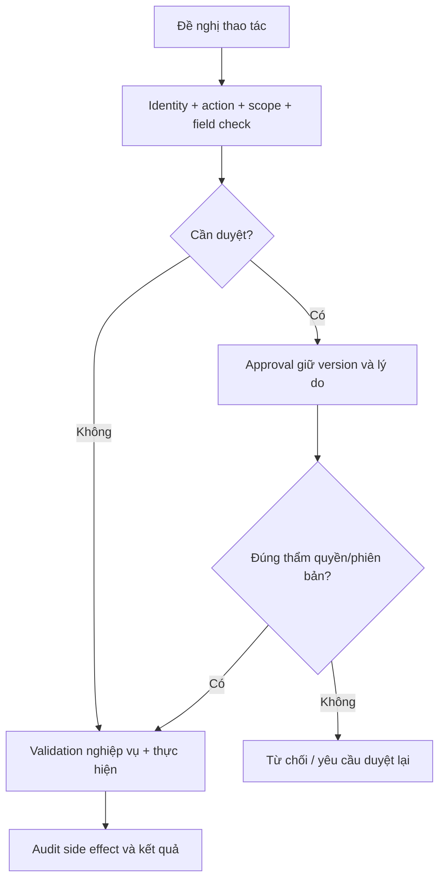

# M10. Danh tính, phê duyệt và kiểm soát vận hành

## 1. Giá trị doanh nghiệp và tính xuyên suốt

AIS phục vụ nhiều khách, có kho xe và quyết định miễn phí/đổi hạn/hủy chứng từ. Nếu chỉ dùng tài khoản quản trị hoặc role rộng, doanh nghiệp không biết ai đã quyết định và khách có thể thấy dữ liệu không thuộc mình. M10 là năng lực ngang áp cho mọi module; không phải bước cuối sau khi lập hóa đơn.

Truy vết PP-19/20, US-37 đến US-40, G06. Quản trị quản identity và cấu hình; quản lý nghiệp vụ duyệt thẩm quyền; người kiểm soát đọc audit. Không có role nào được hiểu là tự do bỏ qua mọi validation trong vận hành thường ngày.

## 2. User story và phân rã

| US | Kết quả | Chức năng |
|---|---|---|
| US-37 | Tài khoản cá nhân, role và scope đúng trách nhiệm | M10-F01: identity; M10-F02: authorization |
| US-38 | Ngoại lệ được quyết định đúng người/mức | M10-F03: approval policy |
| US-39 | Thay đổi và chất lượng dữ liệu có thể điều tra | M10-F04: audit; M10-F05: data/config controls |
| US-40 | Thu hồi và phục hồi không làm mất tính liên tục | M10-F06: lifecycle/backup/restore |

## 3. Mô hình quyền

Quyền là tổ hợp thao tác, đối tượng và phạm vi: read/update/create/approve/submit/cancel/export trên customer/site/assigned work order/warehouse. Quyền field/tệp cũng cần kiểm tra; user đọc ca không tự được đọc giá vốn hoặc tệp nội bộ.

| Persona | Phạm vi điển hình | Hành động | Điều không suy ra |
|---|---|---|---|
| Khách báo lỗi | Customer/site được giao | Create/read yêu cầu, bổ sung mô tả | Không tự duyệt phí hoặc sửa SLA |
| Khách duyệt | Site/hợp đồng và mức thẩm quyền | Accept kết quả, approve estimate version | Không thấy giá vốn AIS |
| Điều phối | Ca trong đội/đơn vị | Triage, assign, điều chỉnh có lý do | Không tự submit mọi hóa đơn |
| KTV | Work order/visit được giao, kho xe được cấp | Work log, đề nghị và thực dùng theo policy | Không đọc mọi khách hoặc kho |
| Thủ kho | Kho thuộc trách nhiệm | Receipt/transfer/consumption/return hợp lệ | Không tự duyệt mọi inventory adjustment |
| Mua hàng | Nhu cầu/PO được giao | Create/track supplier order | Không vượt thẩm quyền duyệt giá |
| Kế toán | Chứng từ đủ scope | Reconcile/invoice/adjust theo mức | Không sửa diagnosis hoặc lịch sử visit |
| Quản lý | Đơn vị dịch vụ | Review KPI/ngoại lệ/phê duyệt | Không mặc định quyền admin kỹ thuật |

Một người kiêm vai trò được đánh giá quyền tổng hợp. Role hẹp cộng role chuẩn rộng không làm quyền tự hẹp; phải kiểm chứng effective permission và scope trong ứng dụng/API/report/file. Chính sách có version và có người xác nhận.

## 4. Phê duyệt ngoại lệ

Những quyết định cần chính sách gồm thay quyền lợi/hạn, hạng mục phát sinh, goodwill, mua vượt mức, hủy submitted, chỉnh tồn và sửa mốc đã xác nhận. Mỗi approval giữ đối tượng/version, reason, proposed values, người đề nghị, người duyệt, timestamp và outcome.

Maker/checker áp theo mức rủi ro và quy mô thực tế; không tự đặt mọi thao tác cần hai người nếu doanh nghiệp không đủ nhân lực. Nếu kiêm nhiệm được phép, lưu lý do/thẩm quyền và giới hạn, không giả workflow phân tách đã tồn tại.

Nếu dữ liệu được sửa sau duyệt, approval cũ không cấp quyền cho version mới. Từ chối giữ lý do; timeout không tự xem là approved. Lỗi API sau duyệt không đánh dấu đã thực hiện nếu side effect chưa xác nhận.

AI runtime giữ AgentApproval như tham chiếu tới approval authoritative của M10/module nguồn, không là chữ “approved” do LLM sinh. Approval bind actor/company/customer/site, exact command/hash, object versions, policy và expiry. Commit server recheck/consume approval cùng business effect và idempotency result; cancellation/revocation được serialize với commit. Chi tiết protocol, stale approval và kết quả không xác định: [security/HITL](../ai_architecture/07_security_and_human_approval.md), [orchestration](../ai_architecture/02_agent_orchestration_workflow.md).

## 5. Audit và chất lượng cấu hình

Lưu ai/lúc nào/nguồn kênh/action/đối tượng, giá trị trước-sau cần thiết, reason, approval và correlation ID. Nhật ký phân biệt đề nghị với thành công; không chứa token/secret. Không sửa audit để hợp thức hóa thao tác; access log và nghiệp vụ change log phục vụ mục đích khác nhau.

Cấu hình lịch, SLA, callback window, item compatibility, kho/người, danh mục nguyên nhân và công thức KPI phải versioned. Thay đổi có danh sách tác động và áp dụng từ ngày xác nhận. M10 sở hữu kiểm soát cấu hình; chuyên môn kỹ thuật/kinh doanh vẫn sở hữu nội dung.

Data quality không tự “sửa” tất cả bản ghi thiếu bằng mặc định. Tạo lỗi có owner, severity, source và action; correction trong module nguồn giữ lịch sử. M08 hiển thị tỷ lệ đầy đủ nhưng không là nơi chỉnh trường gốc.

## 6. Vòng đời tài khoản và phục hồi

Onboarding gồm persona, scope, đào tạo và người duyệt; thay việc rà quyền cũ/mới; offboarding thu hồi tài khoản/token, bàn giao ca/booking/reservation còn mở và giữ lịch sử. Không xóa user để mất actor của giao dịch cũ.

Backup gồm database, tệp, cấu hình/chính sách và nguồn tri thức cần thiết. Restore test phải kiểm tra số chứng từ/liên kết, quyền và khả năng truy tệp; có backup chưa đủ chứng minh phục hồi. RPO/RTO/retention do doanh nghiệp xác nhận; không ghi số giả. Local/Cloud có trách nhiệm vận hành khác nhau cần phân định ở kế hoạch triển khai.

## 7. Tình huống biên và tích hợp

Link file được chia sẻ công khai có thể vượt scope dù API ca đã chặn; test cả tệp. Export/download phải mang cùng filter quyền. Tool AI dùng identity người gọi, không quyền admin chung. Scheduler/API service account có nhiệm vụ/scope giới hạn và audit nguồn; không dùng token Administrator cho mọi sản phẩm vận hành.

M01 duyệt contract; M02 đổi clock/priority; M03 assign/accept; M04 publish checklist; M05 adjustment; M06 PO approval; M07 goodwill/invoice; M08 export; M09 publish/tool đều gọi cùng policy logic để không có lỗ hổng giữa kênh.

## 8. Nghiệm thu

- **AC-37.1:** Khách A thử list/read/update/export/file của khách B đều bị từ chối; không chỉ ẩn hàng trên UI.
- **AC-37.2:** KTV ca/kho ngoài phạm vi bị từ chối dù thêm role chuẩn; effective permission có bằng chứng.
- **AC-38.1:** Duyệt version A, sửa sang B thì submit cần duyệt lại; mức vượt thẩm quyền không được approve.
- **AC-39.1:** Sửa mốc/hủy/miễn phí truy được actor, reason, before/after và approval; audit không chứa secret.
- **AC-40.1:** User nghỉ bị từ chối, work order có người bàn giao; restore thử giữ chứng từ/liên kết/tệp/quyền.

## 9. Phân kỳ và quyết định mở

P1 tài khoản cá nhân, scope server, audit và validation quan trọng; P2 approval matrix, lifecycle và restore drill; P3 tích hợp IdP/SSO nếu có nhu cầu. Phải xác nhận maker/checker, mức duyệt, dữ liệu nào được export và thời hạn lưu giữ trước production.
