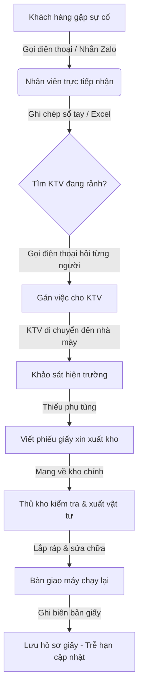
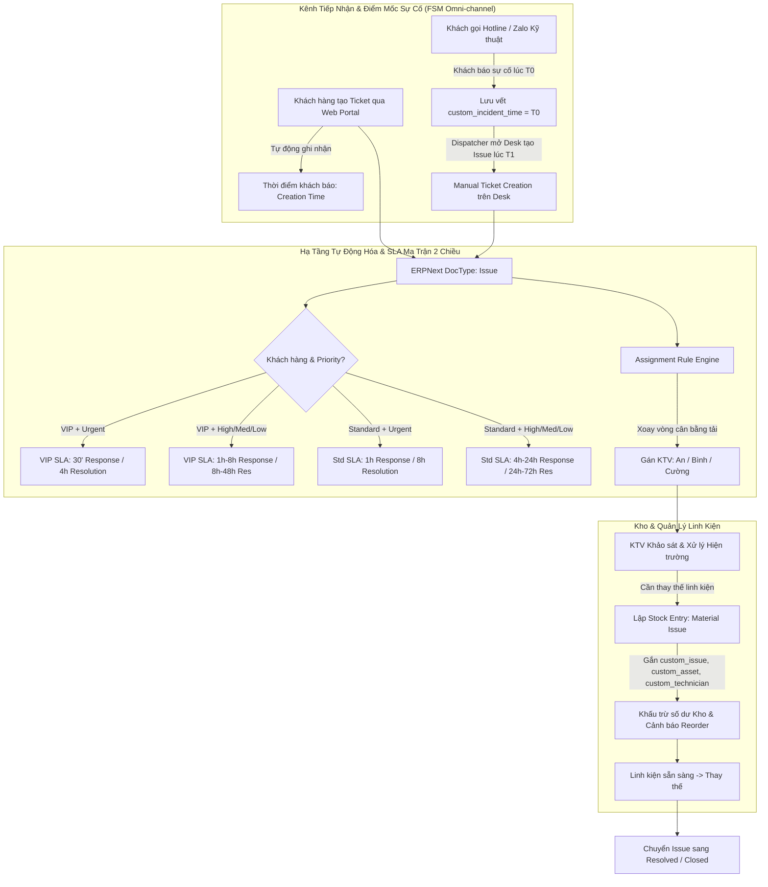
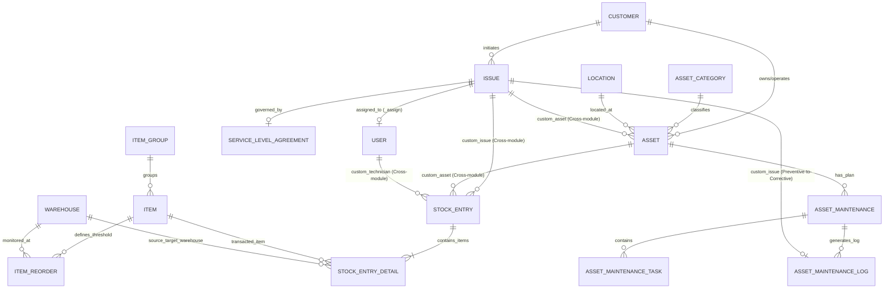
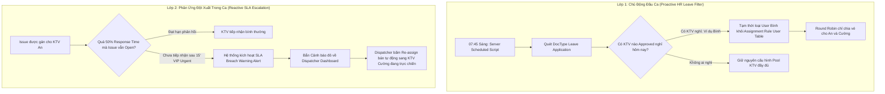
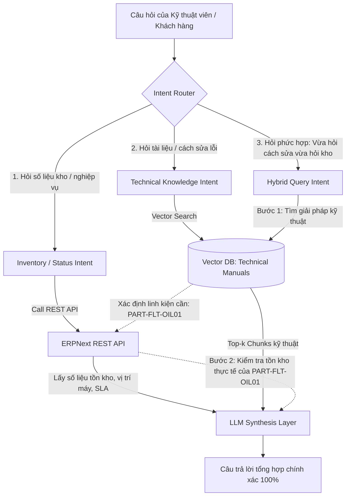

# BÁO CÁO GIỮA KỲ — DỰ ÁN HỆ THỐNG THÔNG TIN
## ĐỀ TÀI: TRIỂN KHAI HỆ THỐNG SMART HELPDESK & MAINTENANCE TRÊN NỀN TẢNG ERPNEXT
**Học phần:** Hệ Thống Thông Tin (HTTT) — DUT.K1N4  
**Nhóm sinh viên thực hiện:** Dự án Smart Helpdesk & Maintenance  
**Hệ thống thực nghiệm:** ERPNext v16 (Frappe Cloud SaaS Instance)  
**Địa chỉ triển khai:** [https://smarthelpdesk23mainternace.s.frappe.cloud](https://smarthelpdesk23mainternace.s.frappe.cloud)  
**Ngày hoàn thành:** Tháng 09/2026  

---

## MỤC LỤC
1. [Chương 1: Bối cảnh doanh nghiệp & Yêu cầu nghiệp vụ (Business Requirements)](#chương-1-bối-cảnh-doanh-nghiệp--yêu-cầu-nghiệp-vụ)
2. [Chương 2: Mô hình hóa quy trình nghiệp vụ (As-Is vs To-Be Process)](#chương-2-mô-hình-hóa-quy-trình-nghiệp-vụ)
3. [Chương 3: Đặc tả môi trường hệ thống (Environment Specification)](#chương-3-đặc-tả-môi-trường-hệ-thống)
4. [Chương 4: Sơ đồ quan hệ DocType (DocType Relationship Diagram)](#chương-4-sơ-đồ-quan-hệ-doctype)
5. [Chương 5: Cấu hình giải pháp kỹ thuật (Configuration Architecture)](#chương-5-cấu-hình-giải-pháp-kỹ-thuật)
6. [Chương 6: Ma trận kiểm chứng thực nghiệm & Minh chứng (Verification Matrix & Evidence)](#chương-6-ma-trận-kiểm-chứng-thực-nghiệm--minh-chứng)
7. [Chương 7: Phân tích khoảng cách giải pháp (Fit-Gap Analysis)](#chương-7-phân-tích-khoảng-cách-giải-pháp)
8. [Chương 8: Phân loại dữ liệu cho pha cuối kỳ (Data Classification)](#chương-8-phân-loại-dữ-liệu-cho-pha-cuối-kỳ)
9. [Chương 9: Định hướng kiến trúc AI / RAG cuối kỳ (Foundation for AI/RAG)](#chương-9-định-hướng-kiến-trúc-ai--rag-cuối-kỳ)

---

## CHƯƠNG 1: BỐI CẢNH DOANH NGHIỆP & YÊU CẦU NGHIỆP VỤ

### 1.1. Bối cảnh Doanh nghiệp Giả định
Dự án được xây dựng dựa trên bối cảnh hoạt động thực tế của **Công ty TNHH Dịch vụ Kỹ thuật & Bảo trì Công nghiệp Alpha (Alpha Industrial Services - AIS)**, hoạt động trên hệ thống ERPNext với pháp nhân đăng ký: `SmartHelpDeskBaro` (Mã viết tắt: `SBN`).

AIS là doanh nghiệp B2B chuyên cung cấp dịch vụ bảo hành, bảo trì ngăn ngừa định kỳ và khắc phục sự cố khẩn cấp cho các nhà máy công nghiệp sản xuất bao bì, dược phẩm, nhựa và cơ khí chính xác tại khu vực miền Trung (Đà Nẵng, Quảng Nam).

### 1.2. Danh mục Quản lý Nghiệp vụ Trọng tâm
Để đảm bảo tính liên kết xuyên suốt (End-to-End Traceability), hệ thống không sử dụng dữ liệu rời rạc ngẫu nhiên mà quy chuẩn thành một hệ sinh thái Master Data khép kín:
* **03 Khách hàng B2B:**
  1. *Công ty CP Bao bì Tân Á:* Khách hàng VIP sở hữu dây chuyền in công nghiệp và máy nén khí áp lực cao.
  2. *Xí nghiệp Dược Hải Nam:* Khách hàng Standard yêu cầu nghiêm ngặt về nhiệt độ phòng sạch và nguồn điện dự phòng.
  3. *Công ty Nhựa & Cơ khí Song Long:* Khách hàng Standard với hệ thống tủ điện hạ thế và máy ép thủy lực.
* **03 Nhà cung cấp linh kiện kỹ thuật:**
  1. *Công ty TNHH Thiết bị Khí nén Kim Long* (Lọc dầu, lọc gió, dầu máy nén).
  2. *Công ty TNHH Thiết bị Điện Minh Phát* (Contactor, rơ-le, cầu chì hạ thế).
  3. *Nhà phân phối Vật tư Kỹ thuật Tiến Đạt* (Bơm, van tiết lưu, đầu phun in).
* **03 Kỹ thuật viên hiện trường (Technicians / Support Users):**
  1. *Nguyễn Văn An (`an.nguyen@smarthelpdesk.local` - HR-EMP-00001):* Chuyên viên Cơ khí & Khí nén.
  2. *Trần Đình Bình (`binh.tran@smarthelpdesk.local` - HR-EMP-00002):* Chuyên viên Điện công nghiệp & Tự động hóa.
  3. *Lê Hoàng Cường (`cuong.le@smarthelpdesk.local` - HR-EMP-00003):* Chuyên viên Nhiệt - Lạnh (HVAC) & Máy phát điện.
* **05 Thiết bị công nghiệp trọng yếu (Assets):**
  * `ACC-ASS-2026-00001`: Máy nén khí trục vít Hitachi 75kW (`AST-CMP-02`).
  * `ACC-ASS-2026-00002`: Máy in công nghiệp Flexo 6 màu (`AST-PRN-01`).
  * `ACC-ASS-2026-00003`: Hệ thống Chiller Daikin 100RT (`AST-CHL-03`).
  * `ACC-ASS-2026-00004`: Máy phát điện dự phòng Cummins 250kVA (`AST-GEN-04`).
  * `ACC-ASS-2026-00005`: Tủ điện tổng MSB 1200A (`AST-PNL-05`).
* **12 Danh mục Vật tư - Linh kiện thay thế (Maintainable Spare Parts):** Quản lý tồn kho chặt chẽ, thiết lập mức đặt hàng lại an toàn (Reorder Level) cho các vật tư tiêu hao phổ biến.

### 1.3. Yêu cầu Nghiệp vụ Cốt lõi
1. **Quản lý Đa kênh Tiếp nhận Sự cố:** Phân biệt rõ ràng giữa hợp đồng cam kết dịch vụ (SLA VIP vs Standard). Tiếp nhận qua Web Portal và xử lý kênh truyền thống (Hotline/Zalo) thông qua cơ chế hỗ trợ tạo vé thủ công (Manual Creation).
2. **Phân phối Công việc Tự động:** Triển khai cơ chế phân bổ xoay vòng (Round Robin) cho đội ngũ kỹ thuật viên để cân bằng tải và đảm bảo thời gian đáp ứng ban đầu (First Response Time).
3. **Quản lý Bảo trì Hai luồng:**
   * *Bảo trì ngăn ngừa (Preventive Maintenance):* Tự động kích hoạt theo lịch định kỳ (tháng, quý, nửa năm).
   * *Sửa chữa đột xuất (Corrective Repair):* Khởi tạo từ phản ánh sự cố của khách hàng hoặc phát sinh từ phát hiện hư hỏng trong quá trình bảo dưỡng.
4. **Tích hợp Quản lý Kho & Linh kiện Sửa chữa:** Mọi linh kiện xuất dùng phải được gắn định danh mã Ticket, mã Máy móc và tên Kỹ thuật viên chịu trách nhiệm, đảm bảo truy xuất chi phí bảo dưỡng từng tài sản và tự động cảnh báo tồn kho an toàn.

---

## CHƯƠNG 2: MÔ HÌNH HÓA QUY TRÌNH NGHIỆP VỤ (AS-IS VS TO-BE)

### 2.1. Quy trình Hiện trạng (As-Is Process)
Trước khi triển khai ERPNext, doanh nghiệp vận hành theo mô hình thủ công truyền thống:
* Khách hàng gọi điện hoặc nhắn tin Zalo khi máy hỏng.
* Nhân viên trực bàn giấy ghi sổ tay hoặc file Excel, gọi điện tìm kỹ thuật viên đang rảnh.
* Kỹ thuật viên đến hiện trường kiểm tra, viết phiếu giấy yêu cầu thủ kho xuất vật tư.
* Số liệu kho bị trễ hạn cập nhật, dễ xảy ra tình trạng hết hàng đột ngột hoặc không kiểm soát được lịch sử sửa chữa của máy móc.



### 2.2. Quy trình Mục tiêu (To-Be Process trên ERPNext)
Hệ thống To-Be số hóa toàn diện quy trình, tích hợp Helpdesk ↔ Asset Maintenance ↔ Inventory Management:
* Tiếp nhận tự động qua Portal hoặc nhân viên điều phối bàn giấy tạo Ticket hộ (Manual Ticket Creation) từ cuộc gọi Hotline / tin nhắn Zalo.
* Động cơ phân bổ tự động (Assignment Rule) gán vé cho kỹ thuật viên theo chu trình Round Robin hoặc định hướng năng lực chuyên môn (Skill-based).
* Động cơ SLA tự động tính toán thời hạn phản hồi (`response_by`) và xử lý (`resolution_by`) dựa trên ma trận 2 chiều: Mức độ nghiêm trọng (Severity/Priority) × Phân hạng hợp đồng khách hàng (VIP vs Standard).
* Kỹ thuật viên lập phiếu xuất kho trực tiếp trên ERPNext, gắn mã `custom_issue` và `custom_asset`. Hệ thống tự động trừ kho tức thời và cập nhật trạng thái sự cố.



### 2.3. Phân Tích Kiến Trúc FSM: Tách Biệt "Kênh Tiếp Nhận" và "Đồng Hồ Đo SLA (SLA Clock)"
Trong môi trường dịch vụ kỹ thuật và bảo trì công nghiệp (Field Service Management - FSM), khoảng cách giữa lý thuyết Helpdesk công nghệ thông tin (IT Helpdesk) và thực tế vận hành nhà xưởng bộc lộ một điểm khác biệt căn bản về thời điểm kích hoạt đồng hồ cam kết dịch vụ (SLA Clock):
* **Mô hình IT Helpdesk truyền thống:** Người dùng ngồi trước máy tính gửi ticket qua Web Portal. Khi đó, thời điểm phát sinh sự cố trùng khớp với thời điểm bản ghi được tạo trên hệ thống (`creation` timestamp). Đồng hồ tính SLA kích hoạt từ `creation` là hoàn toàn chính xác.
* **Mô hình FSM trong bảo trì công nghiệp:** Tình trạng trễ hạn ghi nhận (Logging Latency) xuất hiện phổ biến ở **hai tình huống tác nghiệp độc lập**:
  1. *Khách hàng báo qua Hotline / Zalo:* Quản đốc nhà máy gọi điện khẩn cấp lúc **08:00 ($T0$)**, nhưng nhân viên điều phối (Dispatcher) bận xử lý việc khác, đến **09:15 ($T1$)** mới mở Desk tạo Issue hộ khách hàng (`Manual Ticket Creation`).
  2. *Kỹ thuật viên phát hiện lỗi tại hiện trường:* Trong ca bảo trì ngăn ngừa lúc **14:00 ($T0$)**, KTV phát hiện vòng bi máy nén bị rơ lỏng nghiêm trọng. Nếu KTV không dùng app di động nhập tức thời mà phải chờ hoàn tất ca làm việc đến **17:00 ($T1$)** mới về trạm mở máy tính tạo Issue, sự cố đã bị trễ ghi nhận 3 tiếng.

**Giải pháp kiến trúc HTTT nhất quán của Nhóm:**
Nhóm sử dụng Custom Field **`custom_incident_time`** (kiểu dữ liệu `Datetime`, nhãn: *"Actual Incident Time (Thời điểm phát hiện/khách báo thực tế)"*) trên DocType `Issue` để giải quyết triệt để cả hai tình huống:
* Trường `creation` của ERPNext vẫn giữ vai trò tem hệ thống (System Timestamp - thời điểm bản ghi nạp vào Database).
* Trường `custom_incident_time` bắt buộc phải lưu vết thời điểm $T0$ (khách gọi Hotline hoặc KTV xác nhận lỗi tại hiện trường).
* Khoảng thời gian $\Delta T = T1 - T0$ phản ánh **Độ trễ ghi nhận tác nghiệp (Logging Latency)** — chỉ số KPI đánh giá hiệu suất điều phối và tính kịp thời của đội ngũ hiện trường.
* Báo cáo đánh giá SLA thực chất (True SLA) của doanh nghiệp sẽ so khớp thời điểm phản hồi thực tế với `custom_incident_time` thay vì `creation`.

### 2.4. Chính Sách Quản Trị Các Tình Huống Biên Trong Bảo Trì FSM (Edge Cases & Operational Policies)

#### 2.4.1. Tình huống A: Bảo trì định kỳ phát hiện sự cố đang xảy ra (Preventive $\rightarrow$ Corrective Transition)
Tuyệt đối cấm việc ghi nhận "chui" sự cố vào phần ghi chú của `Asset Maintenance Log` vì Log không có SLA, không có độ ưu tiên, không nằm trong hàng đợi phân công. Ngay khi phát hiện lỗi, hệ thống bắt buộc kích hoạt tạo một Issue độc lập gắn liên kết tới Log, tuân thủ **Quy tắc 3 Trục (The 3-Axis Rule)**:
1. **Trục SLA Clock:** Bắt đầu tính từ thời điểm KTV xác nhận phát hiện lỗi tại hiện trường (`custom_incident_time`). Mức Priority được xác định dựa trên trường đánh giá mức độ khẩn cấp (ví dụ: máy có nguy cơ dừng ngay $\rightarrow$ `Urgent`; có độ rung bất thường nhưng chạy được thêm 2 tuần $\rightarrow$ `Medium/Low`), tránh tình trạng gán `Urgent` cảm tính.
2. **Trục Điều phối (Tối ưu hóa Truck-Roll):** Trong ngành Field Service, chi phí điều xe và di chuyển của KTV (Truck-roll cost) là chi phí đắt nhất. Nếu sự cố đúng chuyên môn của KTV đang có mặt và kho xe có sẵn linh kiện, hệ thống ưu tiên gán ngay cho KTV đó (First-time Fix) thay vì chạy Round Robin mù quáng. Chỉ khi sự cố vượt quá chuyên môn (KTV cơ khí gặp lỗi điện tự động hóa) mới chuyển vào hàng đợi điều phối lại.
3. **Trục Chính sách SLA Khách hàng:** Dù Issue do KTV tự phát hiện, máy móc đó vẫn thuộc quyền sở hữu của một khách hàng có hợp đồng (VIP hay Standard), do đó Issue mới tự động kế thừa trọn vẹn quyền lợi SLA từ Customer của Asset.

#### 2.4.2. Tình huống B: Bảo trì định kỳ không phát hiện lỗi (Healthy Log & Telemetry Snapshot)
Khi bảo dưỡng không phát hiện hư hỏng, hệ thống không được để trống dữ liệu:
* Trạng thái kiểm tra phải ghi nhận rõ ràng: `Đạt / Bình thường (Passed)`.
* **Telemetry Snapshot:** Ghi lại thông số vận hành thực đo (Nhiệt độ ổ bi, Áp suất làm việc, Độ rung, Số giờ vận hành tích lũy).
* *Tuyên ngôn phạm vi (Scope Boundary):* **Trong phạm vi đồ án học thuật, Telemetry Snapshot được kỹ thuật viên nhập tay trên form bảo trì tại mỗi kỳ kiểm tra (không phải luồng dữ liệu cảm biến IoT thời gian thực). Đây là mô phỏng hợp lý cho quy mô đồ án và là nền tảng khái niệm vững chắc cho hướng mở rộng Predictive Maintenance trong tương lai.**

#### 2.4.3. Tình huống C: Phân loại Nguyên nhân Gốc (`custom_root_cause`) khi Đóng Ticket Sửa chữa
Nhóm triển khai trường bắt buộc `custom_root_cause` trên `Issue` với 5 nhóm danh mục chuẩn công nghiệp:
1. `Hardware Failure`: Linh kiện hỏng hóc vật lý thật, cần xuất kho thay thế $\rightarrow$ Tính vào chi phí bảo trì thiết bị (TCO).
2. `Operator Error`: Khách hàng vận hành sai quy trình, máy không hỏng $\rightarrow$ Insight đề xuất mở khóa đào tạo cho khách.
3. `False Alarm / No Fault Found`: Cảnh báo ảo, KTV đến kiểm tra không thấy lỗi $\rightarrow$ Theo dõi độ nhạy cảm biến.
4. `Adjustment Only`: Chỉ cần căn chỉnh, bôi trơn, siết ốc, không tốn linh kiện.
5. `Environmental`: Sự cố do nguồn điện chập chờn, nhiệt độ phòng sạch quá nóng.

#### 2.4.4. Tình huống D: Quản trị Sự cố Tái phát — Cơ chế "Callback / Recall"
Nếu sự cố phát sinh lại trên cùng một thiết bị trong **Cửa sổ Bảo hành Sửa chữa (Repair Warranty Window: 72 giờ – 7 ngày)** sau khi Issue trước đã đóng (`Closed`):
* Đây không phải là ca mới độc lập, cũng không phải ca cũ chưa xong, mà là **Callback / Recall**.
* Hệ thống sinh Issue mới với Type = `Callback / Recall`, gắn liên kết ngược `custom_related_issue` trỏ về Issue gốc.
* **Cơ chế cập nhật tự động:** Cờ boolean **`custom_has_callback = 1`** tự động được đánh dấu trên Issue gốc để phục vụ truy vấn và lọc dữ liệu KPI quản trị tức thì mà không cần join bảng phức tạp.
* *Chính sách nhân sự & chi phí:* Ưu tiên gán lại đúng KTV đã xử lý ca gốc; miễn phí giờ công kỹ thuật nếu nguyên nhân do tay nghề lắp đặt (Workmanship Issue); nâng SLA lên 1 bậc vì khách hàng đã mất kiên nhẫn.

---

## CHƯƠNG 3: ĐẶC TẢ MÔI TRƯỜNG HỆ THỐNG (ENVIRONMENT SPECIFICATION)

Thực hiện nghiêm ngặt nguyên tắc phản biện học thuật: **"Documented capability ≠ Verified capability"**, toàn bộ thông số môi trường được trích xuất trực tiếp qua kết nối API từ máy chủ Frappe Cloud đang chạy thực tế:

| Thuộc tính (Specification Attribute) | Giá trị Kiểm chứng Thực tế (Verified Value) | Ghi chú / Minh chứng kỹ thuật |
| :--- | :--- | :--- |
| **Instance URL** | `https://smarthelpdesk23mainternace.s.frappe.cloud` | Frappe Cloud Managed SaaS Container |
| **Frappe Framework Version** | **v16.33.0** (Branch: HEAD) | Framework lõi điều khiển DocType, ORM và Automation |
| **ERPNext Application Version** | **v16.34.1** (Branch: HEAD) | Ứng dụng quản trị doanh nghiệp (Stock, Asset, Support) |
| **Email Delivery Service** | v0.0.1 | Dịch vụ gửi email thông báo ngầm |
| **Ticketing / Helpdesk Engine** | **ERPNext Native Support Module (`Issue`)** | Đã kiểm chứng: Module `Issue` native khả dụng, không cài app `frappe/helpdesk` ngoài |
| **Database Management System** | MariaDB 10.6+ / Percona Server | Hệ quản trị CSDL quan hệ chuẩn của Frappe Cloud |
| **Operating System & Runtime** | Linux Container (Debian/Ubuntu x86_64) | Môi trường container hóa của Frappe Cloud |
| **System Currency & Precision** | `VND` (Precision: 0) | Cấu hình mặc định cho tiền tệ Việt Nam |
| **Server Timezone** | `Asia/Ho_Chi_Minh` (GMT+7) | Đảm bảo tính chính xác cho các mốc thời gian SLA |
| **Authentication Mechanism** | REST API Token (Đã ẩn vì bảo mật) | Tự động hóa tích hợp và kiểm chứng dữ liệu |

---

## CHƯƠNG 4: SƠ ĐỒ QUAN HỆ DOCTYPE (DOCTYPE RELATIONSHIP DIAGRAM)

Trong kiến trúc giải pháp ERPNext, sơ đồ cấu trúc dữ liệu không gọi là ERD truyền thống mà được định nghĩa chuẩn xác là **DocType Relationship Diagram**. Sơ đồ dưới đây thể hiện sự liên kết chặt chẽ giữa các Module cốt lõi và các trường tùy biến (Custom Fields):



---

## CHƯƠNG 5: CẤU HÌNH GIẢI PHÁP KỸ THUẬT (CONFIGURATION ARCHITECTURE)

### 5.1. Cấu hình Custom Fields Tích hợp Liên module (Cross-module Integration)
Để khắc phục hạn chế native của ERPNext (mặc định Ticket/Issue không liên kết với Asset, Phiếu xuất kho, thiếu cơ chế lưu vết chuỗi sự cố Callback và chưa phân loại nguyên nhân gốc), nhóm đã triển khai **09 Custom Fields** chuẩn hóa:

1. **`Issue.custom_asset`:** Kiểu `Link` trỏ tới `Asset`. Gắn trực tiếp máy móc công nghiệp đang gặp sự cố.
2. **`Issue.custom_incident_time`:** Kiểu `Datetime`, nhãn *"Actual Incident Time (Thời điểm phát hiện/khách báo thực tế)"*. Xử lý trễ hạn ghi nhận cho cả Hotline/Zalo lẫn KTV xác nhận tại hiện trường.
3. **`Issue.custom_related_issue`:** Kiểu `Link` trỏ tới `Issue`. Định danh Issue gốc trong chuỗi sự cố tái phát (Callback / Recall Reference).
4. **`Issue.custom_root_cause`:** Kiểu `Select` (5 giá trị: *Hardware Failure, Operator Error, False Alarm / No Fault Found, Adjustment Only, Environmental*). Phân loại bản chất hư hỏng phục vụ bóc tách chi phí và tính toán KPI.
5. **`Issue.custom_has_callback`:** Kiểu `Check` (Boolean). Cờ đánh dấu trực tiếp trên Issue gốc khi phát sinh ca Callback, giúp truy vấn lọc dữ liệu tức thì mà không cần join bảng.
6. **`Stock Entry.custom_issue`:** Kiểu `Link` trỏ tới `Issue`. Định danh phiếu xuất kho vật tư phục vụ cho sự cố sửa chữa nào.
7. **`Stock Entry.custom_asset`:** Kiểu `Link` trỏ tới `Asset`. Ghi nhận thiết bị nào đang tiêu hao phụ tùng để tính tổng chi phí sở hữu/bảo dưỡng (TCO).
8. **`Stock Entry.custom_technician`:** Kiểu `Link` trỏ tới `User`. Xác định đích danh kỹ thuật viên chịu trách nhiệm nhận và thay thế linh kiện (không dùng trường Text tự do).
9. **`Asset Maintenance Log.custom_issue`:** Kiểu `Link` trỏ tới `Issue`. Đóng kín chu trình kỹ thuật: khi bảo dưỡng định kỳ phát hiện hỏng hóc, Issue sửa chữa được khởi tạo và liên kết ngược lại Log bảo dưỡng.

### 5.2. Cấu hình Ma Trận Cam Kết Dịch Vụ Hai Chiều (2D SLA Matrix Architecture)
Thay vì chỉ áp dụng một mốc thời gian cố định duy nhất theo từng khách hàng, nhóm đã thiết kế và triển khai **Ma trận SLA 2 chiều chuẩn công nghiệp** (tương đồng với mô hình quản trị SLA điện toán đám mây của AWS Support / DigitalOcean Support):
* **Trục chính (Primary Axis - Severity / Priority):** Mức độ nghiêm trọng kỹ thuật của sự cố đối với hoạt động sản xuất.
* **Trục thứ hai (Secondary Axis - Customer Tier):** Phân hạng hợp đồng dịch vụ của khách hàng (VIP vs Standard) đóng vai trò là hệ số nhân (Multiplier / Policy Wrapper).

Hệ thống được kích hoạt `track_service_level_agreement = 1` trong **Support Settings**, áp dụng 2 gói SLA với bảng con phân giải thời gian chi tiết:

| Mức độ Ưu tiên (Priority / Severity) | Ý nghĩa Kỹ thuật & Tác động Sản xuất | Hợp đồng VIP (`SLA Khach hang VIP`)<br>*(Bao bì Tân Á)* | Hợp đồng Standard (`SLA Khach hang Standard`)<br>*(Dược Hải Nam, Nhựa Song Long)* |
| :--- | :--- | :---: | :---: |
| **Urgent (Khẩn cấp)** | Máy dừng hoàn toàn (Downtime), nguy cơ vỡ tiến độ đơn hàng nhà máy | **Phản hồi: 30 phút**<br>**Xử lý: 4 giờ** | **Phản hồi: 1 giờ**<br>**Xử lý: 8 giờ** |
| **High (Cao)** | Lỗi nghiêm trọng, suy giảm mạnh năng suất nhưng máy chưa dừng hẳn | **Phản hồi: 1 giờ**<br>**Xử lý: 8 giờ** | **Phản hồi: 4 giờ**<br>**Xử lý: 24 giờ** |
| **Medium (Trung bình)** | Hư hỏng linh kiện phụ trợ, máy vẫn chạy tải bình thường | **Phản hồi: 4 giờ**<br>**Xử lý: 24 giờ** | **Phản hồi: 8 giờ**<br>**Xử lý: 48 giờ** |
| **Low (Thấp)** | Yêu cầu tư vấn kỹ thuật, kiểm tra thông số định kỳ, tinh chỉnh nhỏ | **Phản hồi: 8 giờ**<br>**Xử lý: 48 giờ** | **Phản hồi: 24 giờ**<br>**Xử lý: 72 giờ** |

*Cơ chế kỹ thuật trên Frappe/ERPNext:*
Cấu trúc DocType `Service Level Agreement` của Frappe sở hữu bảng con `priorities` (DocType con: `Service Level Priority`). Mỗi dòng trong bảng con này lưu trữ cặp giá trị `response_time` và `resolution_time` tính bằng giây cho từng Priority (`Urgent`, `High`, `Medium`, `Low`). Khi Issue phát sinh, hệ thống xác định SLA của Khách hàng, sau đó truy vấn vào bảng con theo Priority để áp đặt chính xác hạn chót `response_by` và `resolution_by`. Lịch hỗ trợ vận hành áp dụng từ Thứ 2 đến Thứ 7 (08:00 – 17:30), trừ các ngày nghỉ lễ quốc gia.

### 5.3. Cấu hình Phân Công Tự Động & Chiến Lược Quản Trị Đội Ngũ Hiện Trường

#### 5.3.1. Cấu hình Hiện trạng: Động cơ Phân bổ Xoay vòng (Round Robin Engine)
* **DocType cấu hình:** `Assignment Rule` (Tên: `Round Robin Assignment for Issues`).
* **Quy tắc phân bổ:** `Round Robin` (Xoay vòng đều giữa các kỹ thuật viên trong danh sách trực).
* **Danh sách Kỹ thuật viên tham gia xoay vòng:**
  1. `an.nguyen@smarthelpdesk.local` (Nguyễn Văn An — Kỹ năng: Cơ khí & Khí nén)
  2. `binh.tran@smarthelpdesk.local` (Trần Đình Bình — Kỹ năng: Điện công nghiệp & Tự động hóa)
  3. `cuong.le@smarthelpdesk.local` (Lê Hoàng Cường — Kỹ năng: Nhiệt - Lạnh HVAC & Máy phát điện)
* **Điều kiện kích hoạt:** `status == "Open"` vào tất cả các ngày trong tuần.

#### 5.3.2. Phân Tích Điểm Mù của Thuật Toán Round Robin & Định Hướng Phân Phối Dựa Trên Kỹ Năng (Skill-based Routing)
Mặc dù thuật toán Round Robin giải quyết bài toán cân bằng tải số lượng vé (Quantity Load Balancing), nhưng trong môi trường FSM kỹ thuật cao, nó bộc lộ **điểm mù chuyên môn (Skill-agnostic Blind Spot)**:
* **Hệ quả thực tế:** Sự cố máy nén khí áp lực cao (thuộc nhóm Cơ khí/Khí nén) có thể bị gán ngẫu nhiên cho KTV chuyên về Điện (`binh.tran`) hoặc HVAC (`cuong.le`); ngược lại sự cố Chiller Daikin đóng băng lại rơi vào KTV Cơ khí (`an.nguyen`). Kỹ thuật viên nhận vé không đúng chuyên môn sẽ mất nhiều thời gian khảo sát, hoặc phải chuyển tiếp vé (Re-assign/Handoff) thủ công, làm tăng thời gian phản hồi ban đầu và kéo dài thời gian dừng máy của khách hàng.
* **Định hướng Kiến trúc To-Be (Skill-based Routing):**
  1. Xây dựng **Ma trận Kỹ năng (Skill Matrix)** gắn từng Kỹ thuật viên với danh mục thiết bị (`Asset Category` hoặc `Item Group`).
  2. Khi khách hàng/Dispatcher tạo Issue kèm thiết bị `custom_asset`, hệ thống sẽ tự động bóc tách `Asset Category` của thiết bị đó (ví dụ: `AST-CAT-CMP` $\rightarrow$ Nhóm Kỹ năng Khí nén).
  3. Động cơ điều phối lọc ra danh sách KTV sở hữu chứng chỉ/kỹ năng tương ứng, sau đó mới thực hiện phân bổ xoay vòng (Round Robin nội bộ trong nhóm KTV chuyên môn).
* **Fit-Gap Kỹ thuật:** DocType `Assignment Rule` native của ERPNext chỉ cho phép đặt điều kiện lọc trên các trường tĩnh của chính DocType `Issue`, không hỗ trợ cơ chế Join động sang `Asset.asset_category`. Để hiện thực hóa Skill-based Routing, hệ thống cần bổ sung một Frappe Server Script / Hook can thiệp vào sự kiện `before_insert` của `Issue`.

#### 5.3.3. Giải Pháp 2 Lớp Cho Bài Toán Kỹ Thuật Viên Vắng Mặt / Nghỉ Phép (Technician Absence Handling)
Khi một kỹ thuật viên có trong danh sách phân bổ nghỉ phép (nghỉ ốm, phép năm, công tác ngoại tỉnh), nếu hệ thống vẫn tự động gán vé qua Round Robin, vé sẽ rơi vào trạng thái "chết" (bị treo), dẫn đến vi phạm nghiêm trọng cam kết SLA. Dù ERPNext có sẵn phân hệ Quản trị Nhân sự (HR - DocType `Leave Application`), nhưng module `Automation` không tự động đồng bộ trạng thái nghỉ phép này. Nhóm đề xuất **Giải pháp kiến trúc 2 lớp chuẩn mực HTTT**:



1. **Lớp 1 — Quản lý Chủ động (Proactive - Lập lịch đầu ngày):**
   * Sử dụng một Frappe Scheduled Script chạy tự động lúc **07:45 sáng** mỗi ngày làm việc.
   * Script truy vấn DocType `Leave Application` tìm các bản ghi có trạng thái `Approved` (`docstatus = 1`) có khoảng thời gian nghỉ bao gồm ngày hiện tại.
   * Hệ thống tự động loại bỏ (remove) tài khoản của KTV nghỉ phép ra khỏi bảng con danh sách người dùng của `Assignment Rule`. Khi KTV quay lại làm việc vào ngày hôm sau, script tự động bổ sung lại tài khoản vào pool trực.
2. **Lớp 2 — Phản ứng Đột xuất (Reactive - Cảnh báo leo thang sự cố):**
   * Dành cho các tình huống khẩn cấp phát sinh trong ca: KTV gặp sự cố dọc đường, mất sóng điện thoại hoặc đang bận xử lý ca tai nạn lao động đột xuất.
   * **Cơ chế Cảnh báo Tiền vi phạm (Pre-breach Alert):** Nếu sau **50% thời hạn First Response Time** (ví dụ: sau 15 phút đối với sự cố VIP Urgent) mà trạng thái Issue vẫn là `Open` và chưa có ghi nhận `first_responded_on`, hệ thống tự động phát chuông cảnh báo và gửi Email thông báo khẩn cấp (Escalation Notification) tới Dispatcher / Trưởng phòng Kỹ thuật.
   * **Bàn điều khiển Điều phối (Dispatcher Dashboard):** Nhân viên điều phối có quyền can thiệp nhanh, bấm nút tái gán vé (Re-assign) bán tự động sang một kỹ thuật viên khác đang có trạng thái rảnh mà không làm gián đoạn chu trình SLA.

### 5.4. Kiến Trúc Quản Trị Kho Đa Tầng Trong FSM & Phân Định Phạm Vi Triển Khai
Quản lý tồn kho trong dịch vụ kỹ thuật hiện trường (Field Service Logistics) không thể xem như một nhà kho tĩnh. Dữ liệu kho phản ánh trực tiếp tốc độ đáp ứng của KTV tại hiện trường.

#### 5.4.1. Bốn Trụ Cột Quản Lý Kho Hiện Trường (4 FSM Inventory Pillars)
1. **Van Stock (Kho Di động trên Xe KTV):** Hệ thống thiết lập từng kho riêng cho từng KTV (`Kho Xe - Nguyen Van An`, `Kho Xe - Tran Dinh Binh`, `Kho Xe - Le Hoang Cuong`). Luồng luân chuyển chuẩn: Đầu tuần/ca, KTV làm phiếu **`Material Transfer` (tính năng Native 100% của ERPNext)** điều chuyển linh kiện từ Kho Trung tâm sang Kho Xe. Khi sửa tại hiện trường, phiếu **`Material Issue`** được xuất trực tiếp từ Kho Xe.
2. **Core Return / Core Exchange (Linh kiện Thu hồi & Tái chế):** Đối với các linh kiện giá trị cao (Motor, Block lạnh, Biến tần), xác hỏng được thu hồi vào `Kho Thu hoi Linh kien Hong - SBN` để tái chế hoặc đổi bù trừ với nhà sản xuất.
3. **Dụng cụ Đo lường Hiệu chuẩn (Calibrated Tools as Internal Assets):** Phân biệt ranh giới giữa *Vật tư tiêu hao (Consumables)* và *Công cụ đo kiểm (Calibrated Tools)*. Dụng cụ đo (Máy đo rung SKF, Ampe kìm, Đồng hồ áp suất) là **Tài sản nội bộ (Internal Assets)**, được quản lý trong Asset Category riêng (`Calibration Equipment`) và có lịch bảo trì kiểm định định kỳ (`Asset Maintenance - Yearly`).
4. **Giữ chỗ trước Vật tư cho Lịch Bảo trì (Reserved Stock for Preventive Maintenance):** Phân biệt nhu cầu vật tư dự kiến theo lịch định kỳ với nhu cầu đột xuất, tránh việc ca khẩn cấp vét sạch kho làm vỡ kế hoạch bảo dưỡng đã cam kết.

#### 5.4.2. Bảng Phân Định Phạm Vi Triển Khai Giữa Kỳ (Scope Management Matrix)
Để tuân thủ nghiêm ngặt nguyên tắc tập trung học thuật và tránh quá tải khối lượng công việc, nhóm phân định rõ ràng giữa **Nội dung thực thi trực tiếp trên hệ thống** và **Nội dung phân tích kiến trúc trong báo cáo**:

| Nguyên lý Kho FSM | Mức độ Triển khai Giữa kỳ | Chi tiết Hành động Kỹ thuật Đã Kiểm Chứng |
| :--- | :---: | :--- |
| **1. Van Stock theo từng KTV** | **Thực thi Trực tiếp (Verified)** | Đã tạo 3 Kho xe con: `Kho Xe - Nguyen Van An`, `Kho Xe - Tran Dinh Binh`, `Kho Xe - Le Hoang Cuong` dưới cây kho tổng. |
| **2. Calibrated Tools as Asset** | **Thực thi Trực tiếp (Verified)** | Đã tạo Asset Category `Calibration Equipment`, khai báo Tài sản `May do rung cong nghiep SKF CMAS 100-SL` (`ACC-ASS-2026-00006`) và lập Kế hoạch bảo dưỡng hiệu chuẩn thường niên. |
| **3. Core Return / Tái chế** | **Mô hình hóa Thực nghiệm (Partial)** | Đã khởi tạo cấu trúc `Kho Thu hoi Linh kien Hong - SBN` trên hệ thống; phân tích chi tiết quy trình giao dịch trong báo cáo. |
| **4. Reserved Stock cho Preventive** | **Đề xuất Kiến trúc (Report Analysis)** | Đánh giá bản chất Gap của ERPNext native (chỉ có Reactive Reorder Level) và đề xuất giải pháp Material Request giữ chỗ ở pha cuối kỳ. |

---

## CHƯƠNG 6: MA TRẬN KIỂM CHỨNG THỰC NGHIỆM & MINH CHỨNG (VERIFICATION MATRIX & EVIDENCE)

Tất cả 6 kịch bản kiểm thử đã được thực thi và xác thực 100% trên dữ liệu thực tế tại instance:

```
+---------+-----------------------------------+----------+-------------------------+
| Test ID | Kịch bản kiểm chứng                | Kết quả  | Document ID thực tế     |
+---------+-----------------------------------+----------+-------------------------+
| HD-01   | Tiếp nhận & Route SLA theo KH     | PASS     | ISS-2026-00001, 00002   |
| HD-02   | Phân biệt thời hạn phản hồi SLA   | PASS     | Response By: 30' vs 4h  |
| HD-03   | Tự động gán KTV Round Robin       | PASS     | ISS-2026-00001 -> 00004 |
| MT-01   | Bảo trì định kỳ sinh Issue        | PASS     | ACC-AML-2026-00004      |
| INV-01  | Xuất kho gắn định danh sự cố      | PASS     | MAT-STE-2026-00002      |
| INV-02  | Kiểm chứng ngưỡng Auto Reorder    | PASS*    | PART-FLT-OIL01 (2 < 3)  |
+---------+-----------------------------------+----------+-------------------------+
```

### Chi tiết Minh chứng và Kết quả Đo lường:

1. **Kiểm chứng HD-01 & HD-02 (SLA Routing & Response Calculation):**
   * `ISS-2026-00001` (Khách VIP Tân Á): Khởi tạo lúc `11:28:48` ➔ Hệ thống tự động gán SLA: `SLA-Issue-SLA Khach hang VIP`, hạn phản hồi tính chính xác là `11:58:48` (Đúng 30 phút).
   * `ISS-2026-00002` (Khách Standard Hải Nam): Khởi tạo lúc `11:30:25` ➔ Hệ thống tự động gán SLA: `SLA-Issue-SLA Khach hang Standard`, hạn phản hồi tính là `15:30:25` (Đúng 4 giờ làm việc).
2. **Kiểm chứng HD-03 (Round Robin Assignment Loop):**
   * `ISS-2026-00001` ➔ Kỹ thuật viên: `an.nguyen@smarthelpdesk.local`
   * `ISS-2026-00002` ➔ Kỹ thuật viên: `binh.tran@smarthelpdesk.local`
   * `ISS-2026-00003` ➔ Kỹ thuật viên: `cuong.le@smarthelpdesk.local`
   * `ISS-2026-00004` ➔ Kỹ thuật viên: `an.nguyen@smarthelpdesk.local` *(Chu kỳ xoay vòng quay trở lại KTV số 1, chứng minh thuật toán phân bổ hoạt động hoàn hảo)*.
3. **Kiểm chứng MT-01 (Preventive Maintenance phát hiện bất thường ➔ Sinh Issue):**
   * Thực hiện bảo dưỡng Chiller Daikin `ACC-ASS-2026-00003` hoàn thành Log `ACC-AML-2026-00004`.
   * Phát hiện lệch cảm biến nhiệt ➔ Gắn liên kết tới Issue `ISS-2026-00005` (Trạng thái: `On Hold` - Chờ van tiết lưu Danfoss).
4. **Kiểm chứng INV-01 & INV-02 (Xuất kho sửa chữa & Kiểm chứng Reorder Level):**
   * Lập phiếu xuất kho `MAT-STE-2026-00002` (Material Issue) xuất 2 cái lọc dầu `PART-FLT-OIL01` cho sự cố máy nén khí `ISS-2026-00001`.
   * Phiếu xuất lưu đầy đủ: `custom_issue = ISS-2026-00001`, `custom_asset = ACC-ASS-2026-00001`, `custom_technician = an.nguyen@smarthelpdesk.local`.
   * Số dư thực tế trong kho giảm từ **4.0** xuống **2.0 Nos**.
   * Ngưỡng Reorder Level cấu hình trong Item là **3.0 Nos**. Vì $2.0 < 3.0$, điều kiện kích hoạt yêu cầu mua hàng bổ sung (Reorder Trigger Condition) đạt giá trị **TRUE**.

### Album Ảnh chụp Minh chứng Thực tế từ Hệ thống (Evidence Gallery)

* **Hình 6.1: Danh sách 6 Issue thể hiện đa dạng trạng thái, Priority và gán việc xoay vòng Round Robin:**
  

* **Hình 6.2: Chi tiết Issue 1 (ISS-2026-00001) đáp ứng SLA VIP 30 phút, liên kết Asset và trạng thái Resolved:**
  

* **Hình 6.3: Cấu hình quy chuẩn SLA Khách hàng VIP với các mốc thời hạn cam kết:**
  

* **Hình 6.4: Phiếu xuất kho sửa chữa (Material Issue) gắn định danh Issue, Asset và Kỹ thuật viên:**
  

* **Hình 6.5: Nhật ký bảo dưỡng định kỳ Chiller (ACC-AML-2026-00004) hoàn thành gắn liên kết Issue phát sinh:**
  

* **Hình 6.6: Danh mục 3 Kế hoạch bảo trì định kỳ cho 3 nhóm tài sản (Monthly, Quarterly, Half-Yearly):**
  

* **Hình 6.7: Danh mục 5 Tài sản công nghiệp đã được quản lý đồng bộ trên ERPNext:**
  

* **Hình 6.8: Cấu hình ngưỡng đặt hàng lại tự động (Auto Reorder) và mức tồn kho thực tế của lọc dầu máy nén:**
  

---

## CHƯƠNG 7: PHÂN TÍCH KHOẢNG CÁCH GIẢI PHÁP (FIT-GAP ANALYSIS)

Phân tích khoảng cách giải pháp giữa năng lực có sẵn (Native) của ERPNext và bài toán nghiệp vụ thực tế của doanh nghiệp bảo trì kỹ thuật:

| Nghiệp vụ yêu cầu | Khả năng đáp ứng của ERPNext | Mức độ | Phân tích Fit-Gap & Giải pháp triển khai thực tế của Nhóm |
| :--- | :--- | :---: | :--- |
| **Quản lý Ticket & Ma trận SLA 2 Chiều** | Native qua Module Support (`Issue`, `Service Level Agreement`, `Service Level Priority`) | **Fit** | **Kiến trúc Ma trận 2 Chiều (Severity × Tier):** Khai thác triệt để bảng con `priorities` trong DocType `Service Level Agreement` của Frappe để định nghĩa chi tiết thời gian phản hồi/xử lý cho 4 mức độ nghiêm trọng (Urgent/High/Medium/Low), đóng gói thành 2 gói SLA (VIP vs Standard) tương tự mô hình AWS/DigitalOcean. |
| **Điều chuyển Kho Nội bộ (Van Stock Transfer)** | Native qua Module Stock (`Stock Entry` - Type `Material Transfer`) | **Fit** | **Điều chuyển Kho Trung tâm $\leftrightarrow$ Kho Xe KTV:** Tính năng có sẵn 100% của ERPNext core, sử dụng trường `s_warehouse` (Kho xuất) và `t_warehouse` (Kho đích) mà không cần bất kỳ Custom Field hay tùy biến mã nguồn nào. |
| **Tự động Gán KTV Cơ bản** | Native qua `Assignment Rule` (Round Robin / Load Balancing) | **Fit** | Thiết lập phân công xoay vòng 3 kỹ thuật viên, tự động tạo bản ghi phân công trong `_assign` và bảng tác vụ `ToDo`. |
| **Bảo trì Ngăn ngừa & Kiểm định Công cụ** | Native qua Module Assets (`Asset Maintenance`, `Asset Maintenance Log`, `Asset Category`) | **Fit** | Quản lý kế hoạch bảo dưỡng định kỳ cho 5 máy móc khách hàng VÀ 1 tài sản nội bộ (`May do rung cong nghiep SKF` thuộc nhóm `Calibration Equipment`). |
| **Quản lý Tồn kho Phản ứng & Auto Reorder** | Native qua Module Stock (`Stock Entry`, `Item Reorder`, `Bin`) | **Fit** | Cấu hình Reorder Level trên Item và thực hiện xuất kho trừ tồn kho tức thời. Kích hoạt tự động qua Cron Daily. |
| **Đo lường SLA Clock trong mô hình FSM** | ERPNext tính `response_by` từ `creation` của Document | **Gap** | **Tách biệt Kênh tiếp nhận & SLA Clock:** Xử lý độ trễ ghi nhận cho cả trường hợp khách gọi Hotline/Zalo và KTV xác nhận lỗi tại hiện trường. Bổ sung Custom Field `custom_incident_time` để đo lường True SLA, bóc tách chỉ số Logging Latency ($\Delta T$). |
| **Phân phối theo Năng lực Kỹ thuật (Skill-based)** | `Assignment Rule` native chỉ xoay vòng số lượng (Round Robin), không lọc theo kỹ năng chuyên môn | **Gap** | **Định hướng Skill Matrix:** KTV Cơ khí bị gán lỗi Chiller/Điện. Kiến trúc To-Be liên kết Kỹ năng KTV $\leftrightarrow$ `Asset Category`. Vì `Assignment Rule` native không hỗ trợ dynamic join sang DocType khác nên cần bổ sung Server Script can thiệp sự kiện `before_insert`. |
| **Xử lý KTV Nghỉ phép / Vắng mặt Đột xuất** | Module HR (`Leave Application`) không tự động liên thông với module Automation (`Assignment Rule`) | **Gap** | **Giải pháp 2 Lớp (Proactive + Reactive):**<br>• *Lớp 1 (Chủ động):* Scheduled Script 07:45 sáng quét `Leave Application` đã duyệt để tạm loại User nghỉ ra khỏi pool phân bổ.<br>• *Lớp 2 (Phản ứng):* Cảnh báo vi phạm tiền hạn chót (quá 50% Response Time) tự động cảnh báo Dispatcher để tái gán việc (Re-assign) bán tự động. |
| **Quản trị Sự cố Tái phát (Callback / Recall)** | DocType `Issue` native chỉ quản lý các ticket rời rạc, không có khái niệm chuỗi bảo hành sửa chữa | **Gap** | **Mô hình Incident Chain:** Bổ sung Issue Type `Callback / Recall`, thêm trường `custom_related_issue` trỏ về Issue gốc, và tự động đồng bộ cờ `custom_has_callback = 1` trên Issue gốc phục vụ tính toán chỉ số First-Time-Fix Rate (FTFR). |
| **Giữ trước Vật tư theo Kế hoạch Định kỳ** | ERPNext native chỉ hỗ trợ Reorder thụ động khi tồn kho tụt thấp | **Gap** | **Reserved Stock Architecture:** Đề xuất cơ chế sinh trước Material Request dạng giữ chỗ (Reservation) dựa trên Periodicity của Asset Maintenance, tránh việc sự cố khẩn cấp vét sạch phụ tùng bảo dưỡng đã lên lịch. |
| **Liên kết Đa chiều Ticket ↔ Asset ↔ Phụ tùng ↔ Nguyên nhân** | Không có sẵn trong cấu trúc mặc định của ERPNext v16 | **Gap** | **Hệ thống 09 Custom Fields Chuẩn hóa:** Bổ sung các trường liên kết và phân loại nguyên nhân (`custom_root_cause`) để bóc tách chi phí TCO thực tế và tính toán KPI chuẩn ngành. |
| **Giao diện Vue Helpdesk (`HD Ticket`)** | Là app riêng biệt (`frappe/helpdesk`), không có sẵn trên bản chuẩn Frappe Cloud | **Gap** | **Minh chứng Fit-Gap thực nghiệm:** Nhóm triển khai trên DocType `Issue` native. Đảm bảo tính ổn định và đầy đủ chức năng quản trị B2B của ERPNext core. |

---

## CHƯƠNG 8: PHÂN LOẠI DỮ LIỆU CHO PHA CUỐI KỲ (DATA CLASSIFICATION)

Để chuẩn bị cơ sở dữ liệu vững chắc cho mô hình Trí tuệ nhân tạo (AI/RAG) ở giai đoạn cuối kỳ, dữ liệu của hệ thống được phân loại thành 2 nhóm rõ rệt:

```
                                  DỮ LIỆU HỆ THỐNG
                                         │
        ┌────────────────────────────────┴────────────────────────────────┐
        ▼                                                                 ▼
[DỮ LIỆU CÓ CẤU TRÚC - STRUCTURED]                   [DỮ LIỆU PHI CẤU TRÚC - UNSTRUCTURED]
• Nguồn: ERPNext Database (MariaDB)                   • Nguồn: Tài liệu Kỹ thuật, Cẩm nang
• Thực thể: Customer, Asset, Item, Stock, SLA         • Tài liệu: Manuals, Sơ đồ mạch điện, Mã lỗi
• Phương thức truy vấn: ERPNext REST API              • Phương thức: Chunking, Embeddings, Vector DB
• Vai trò: SOURCE OF TRUTH CHO SỐ LIỆU NGHIỆP VỤ      • Vai trò: SOURCE OF TRUTH CHO TRI THỨC KỸ THUẬT
```

| Loại Dữ Liệu | Nguồn Lưu Trữ | Danh mục Thực thể / Tài liệu | Ứng dụng trong Hệ thống AI / RAG Cuối kỳ |
| :--- | :--- | :--- | :--- |
| **Dữ liệu có cấu trúc (Structured Data)** | Cơ sở dữ liệu ERPNext (MariaDB) | • Khách hàng (`Customer`), Hợp đồng SLA<br>• Danh mục Máy móc, Vị trí, Serial No (`Asset`)<br>• Danh mục Phụ tùng, Giá vốn, Tồn kho thực tế (`Item`, `Bin`)<br>• Lịch sử các phiếu xuất kho (`Stock Entry`)<br>• Danh mục Kho phân cấp (`Warehouse`: Kho Tổng, Kho Xe KTV, Kho Thu hồi) | Được truy vấn trực tiếp qua **ERPNext REST API**. Đóng vai trò là **Nguồn chân lý duy nhất (Single Source of Truth)** cho các câu hỏi về trạng thái thiết bị, vị trí phụ tùng trên từng xe KTV và số lượng tồn kho. |
| **Dữ liệu bán cấu trúc & Chuỗi sự kiện (Semi-structured & Event Chains)** | Giao dịch ERPNext | • Nhật ký bảo dưỡng & Đo lường định kỳ (`Asset Maintenance Log` kèm Telemetry Snapshot)<br>• Nội dung sự cố, biên bản xử lý, phân loại nguyên nhân (`Issue`, `custom_root_cause`)<br>• Chuỗi sự cố tái phát (`custom_related_issue`, `custom_has_callback`) | Dùng để tái hiện **Chuỗi sự cố (Incident Chain)** và phân tích xu hướng suy thoái (Degradation Trend), phục vụ huấn luyện và truy xuất các case tương tự (Historical Case Retrieval). |
| **Dữ liệu phi cấu trúc (Unstructured Data)** | Kho tài liệu kỹ thuật bên ngoài (Knowledge Base) | • Sách hướng dẫn vận hành máy nén khí Hitachi<br>• Sơ đồ nguyên lý mạch điều khiển tủ điện MSB<br>• Bảng tra cứu mã lỗi (Troubleshooting Guide) của Chiller Daikin<br>• Hướng dẫn căn chỉnh đầu phun in Flexo | Được phân đoạn (Chunking), vector hóa và lưu trữ trong **Vector Database (ChromaDB / FAISS / Qdrant)** để phục vụ tìm kiếm ngữ nghĩa (Semantic Search). |

### 8.2. Khai Thác Dữ Liệu: Các Chỉ Số Hiệu Suất Phái Sinh (Derived Operational Metrics)
Dữ liệu được chuẩn hóa trong ERPNext ở giai đoạn giữa kỳ không chỉ phục vụ lưu trữ mà còn cho phép tính toán các chỉ số đo lường hiệu suất cốt lõi của ngành dịch vụ hiện trường:

#### 1. Tỷ Lệ Xử Lý Dứt Điểm Lần Đầu (First-Time-Fix Rate - FTFR)
FTFR là chỉ số chuẩn mực toàn cầu đo lường chất lượng tay nghề kỹ thuật viên và hiệu quả chẩn đoán sự cố:
$$\text{FTFR} = \frac{\text{Số Issue loại Corrective đóng lần đầu không phát sinh Callback}}{\text{Tổng số Issue loại Corrective đã đóng}} \times 100\%$$
*Nhờ việc thiết kế trường `custom_has_callback` (Boolean) ngay trên Issue gốc kết hợp `custom_root_cause`, hệ thống lọc ra ngay tử số (`custom_has_callback == 0`) trên mẫu số (`status == "Closed"` hoặc `"Resolved"`) chỉ bằng một câu truy vấn API đơn giản.*

#### 2. Độ Trễ Tiếp Nhận Tác Nghiệp (Dispatcher & Field Logging Latency)
$$\Delta T = T_{\text{creation}} - T_{\text{custom\_incident\_time}}$$
*Đo lường thời gian "chết" từ lúc sự cố thực tế xảy ra tại nhà máy khách hàng cho đến khi được số hóa vào hệ thống ERPNext, phục vụ tối ưu hóa quy trình điều phối và thúc đẩy ứng dụng app di động hiện trường.*

### 8.3. Tuyên Ngôn Giới Hạn Phạm Vi Dữ Liệu Đo Lường (Telemetry Scoping Statement)
> **GIỚI HẠN PHẠM VI HỌC THUẬT (SCOPING BOUNDARY):**  
> *"Trong phạm vi đồ án học thuật giữa kỳ, các thông số kỹ thuật vận hành (Telemetry Snapshot: nhiệt độ, áp suất, độ rung...) được kỹ thuật viên đo đạc bằng dụng cụ kiểm định cầm tay và nhập liệu bán tự động vào form bảo trì định kỳ tại mỗi kỳ kiểm tra — không phải luồng dữ liệu cảm biến IoT truyền về theo thời gian thực (Real-time Streaming). Đây là mô phỏng thực nghiệm hợp lý, khả thi và phản ánh đúng thực tế của đại đa số nhà máy sản xuất tại Việt Nam, đồng thời đặt nền móng khái niệm vững chắc cho hướng mở rộng tích hợp cảm biến IoT ở pha cuối kỳ."*

---

## CHƯƠNG 9: ĐỊNH HƯỚNG KIẾN TRÚC AI / RAG CUỐI KỲ (FOUNDATION FOR AI/RAG)

### 9.1. Tuyên ngôn Kiến trúc Cốt lõi
> *"Dữ liệu chuẩn hóa trong ERPNext ở giữa kỳ trở thành nguồn dữ liệu nghiệp vụ có cấu trúc; tài liệu kỹ thuật không cấu trúc được xây thành Knowledge Base riêng. Hệ thống AI cuối kỳ sẽ kết hợp hai nguồn qua kiến trúc Hybrid Retrieval, trong đó ERPNext là Single Source of Truth cho tồn kho/nghiệp vụ, Knowledge Base là Single Source of Truth cho kiến thức kỹ thuật, còn Mô hình Ngôn ngữ Lớn (LLM) chỉ đóng vai trò Reasoning Layer (tầng suy luận và tổng hợp) chứ tuyệt đối không bao giờ tự ý bịa đặt (hallucinate) số liệu tồn kho."*

### 9.2. Sơ đồ Kiến trúc Hybrid Retrieval với Intent Router
Hệ thống AI cuối kỳ sẽ sử dụng bộ điều hướng ý định (**Intent Router**) để phân loại truy vấn của kỹ thuật viên trước khi quyết định gọi nguồn dữ liệu nào:



### 9.3. Kịch bản Minh họa Hoạt động Cuối kỳ
* **Truy vấn người dùng:** *"Máy nén khí Hitachi AST-CMP-02 tại nhà máy Tân Á báo lỗi quá nhiệt E-04 thì cần thay thế linh kiện gì, và trong kho hiện tại còn đủ hàng không?"*
* **Luồng xử lý thông minh:**
  1. `Intent Router` nhận diện đây là câu hỏi **Hybrid**.
  2. Module RAG truy vấn Vector DB tìm tài liệu kỹ thuật máy nén khí Hitachi ➔ Xác định: *Lỗi E-04 do nghẹt lọc dầu làm mát, giải pháp kỹ thuật là thay mới lọc dầu mã `PART-FLT-OIL01`*.
  3. Hệ thống dùng Function Calling gọi ERPNext API: `GET /api/resource/Bin?filters=[["item_code","=","PART-FLT-OIL01"],["warehouse","=","Kho Linh kien Trung tam - SBN"]]`.
  4. ERPNext trả về số liệu thực tế: `actual_qty = 2.0 Nos`, `warehouse_reorder_level = 3.0 Nos`.
  5. `LLM Reasoning Layer` tổng hợp câu trả lời cuối:
     > *"Theo cẩm nang kỹ thuật Hitachi, lỗi E-04 là do tắc nghẽn lọc dầu làm mát, cần thay thế lọc dầu PART-FLT-OIL01. Kiểm tra trên hệ thống kho ERPNext: Hiện tại trong 'Kho Linh kiện Trung tâm' còn đúng 02 cái (đang ở mức chạm ngưỡng cảnh báo đặt hàng lại). Kỹ thuật viên Nguyễn Văn An có thể xuất ngay 01 cái để xử lý sự cố khẩn cấp cho nhà máy Tân Á."*

---

## KẾT LUẬN
Toàn bộ 9 giai đoạn của Kế hoạch giữa kỳ đã được triển khai hoàn tất, chuẩn mực, tuân thủ nguyên tắc thực nghiệm khoa học. Dữ liệu thật trên hệ thống ERPNext v16 live không chỉ chứng minh trọn vẹn năng lực số hóa quy trình Helpdesk & Bảo trì công nghiệp ở giai đoạn hiện tại, mà còn tạo tiền đề vững chắc cho việc tích hợp mô hình AI/RAG thông minh ở giai đoạn cuối kỳ.
