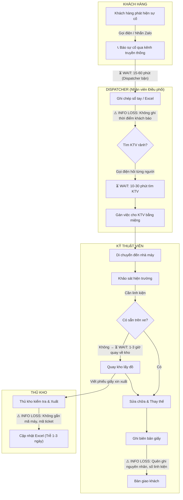
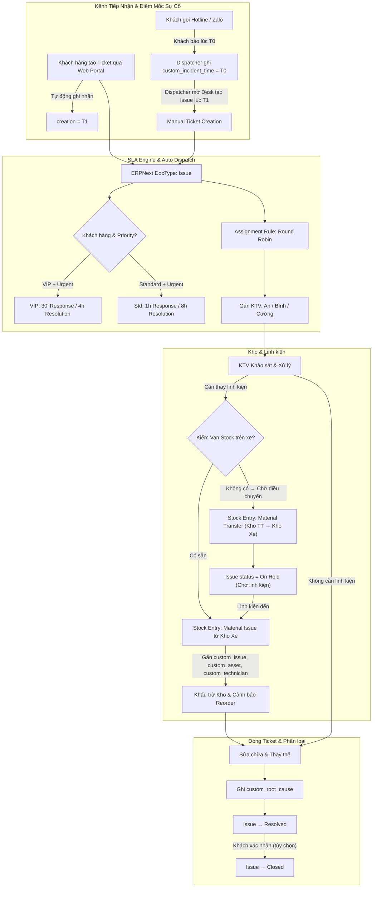
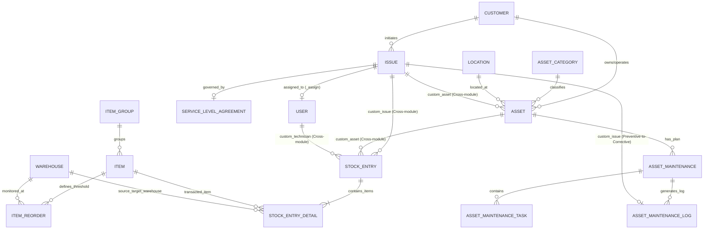
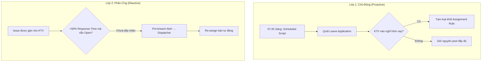
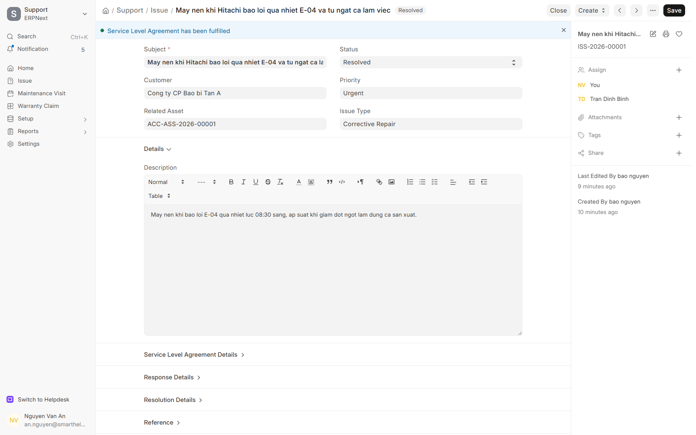
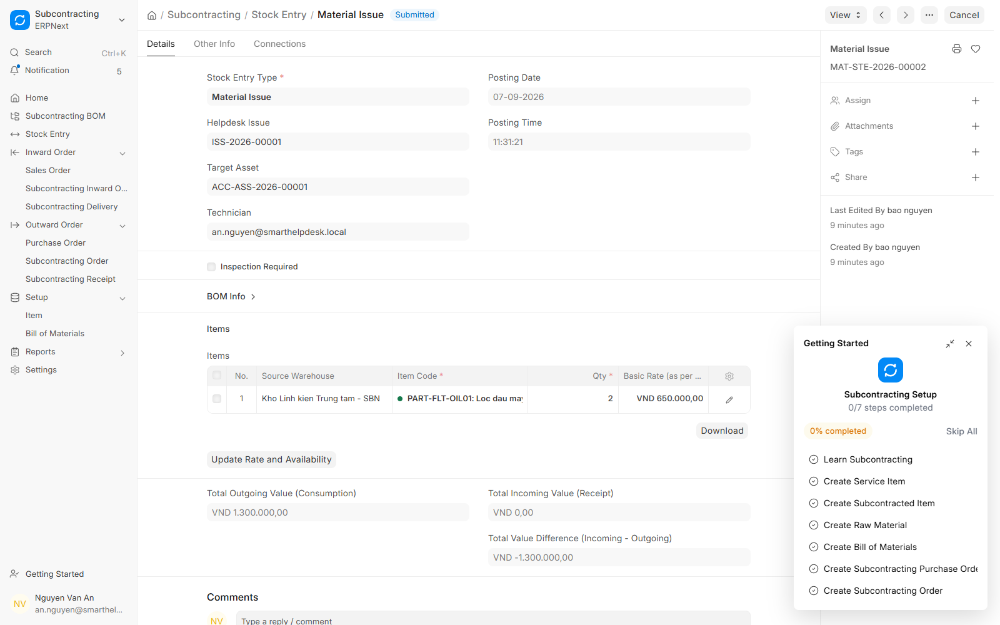
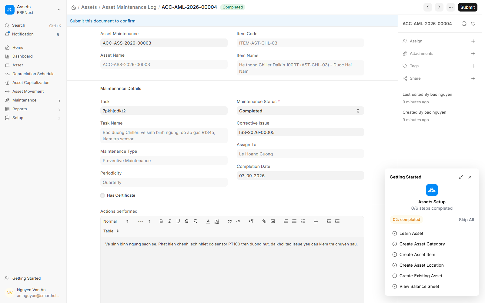
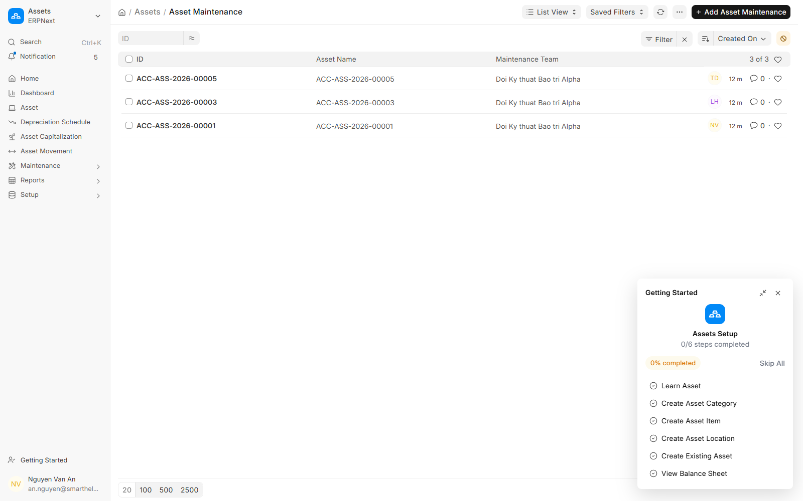
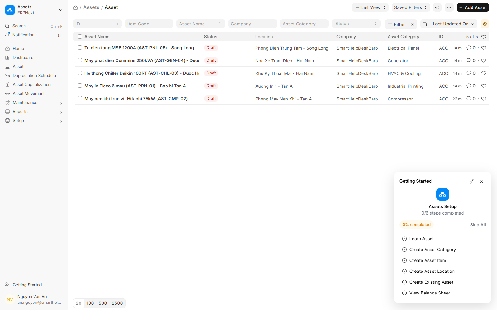
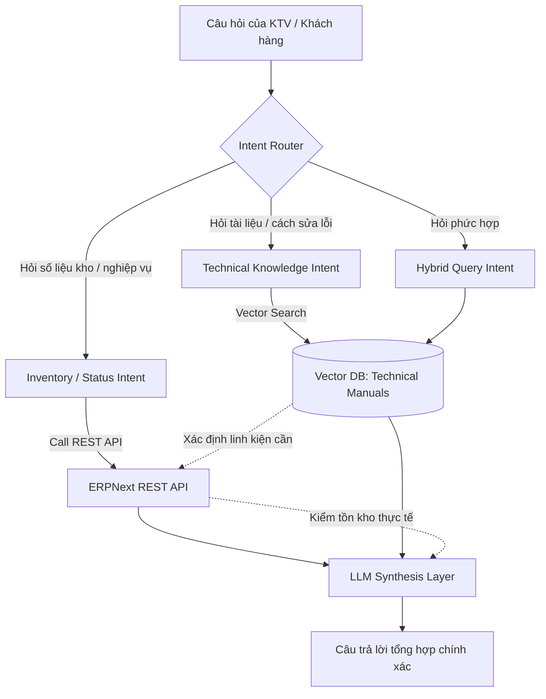

# BÁO CÁO GIỮA KỲ — DỰ ÁN HỆ THỐNG THÔNG TIN
## ĐỀ TÀI: TRIỂN KHAI HỆ THỐNG SMART HELPDESK & MAINTENANCE TRÊN NỀN TẢNG ERPNEXT
**Học phần:** Hệ Thống Thông Tin (HTTT) — DUT.K1N4  
**Nhóm sinh viên thực hiện:** Dự án Smart Helpdesk & Maintenance  
**Hệ thống thực nghiệm:** ERPNext v16 (Frappe Cloud SaaS Instance)  
**Địa chỉ triển khai:** [https://smarthelpdesk23mainternace.s.frappe.cloud](https://smarthelpdesk23mainternace.s.frappe.cloud)  
**Ngày hoàn thành:** Tháng 09/2026  

---

## MỤC LỤC
1. [Chương 1: Bối cảnh Doanh nghiệp & Thu thập Yêu cầu](#chương-1-bối-cảnh-doanh-nghiệp--thu-thập-yêu-cầu)
2. [Chương 2: Mô hình hóa Quy trình Nghiệp vụ](#chương-2-mô-hình-hóa-quy-trình-nghiệp-vụ)
3. [Chương 3: Truy vết Yêu cầu & Hệ thống KPI](#chương-3-truy-vết-yêu-cầu--hệ-thống-kpi)
4. [Chương 4: Hệ thống & Cấu hình Kiến trúc](#chương-4-hệ-thống--cấu-hình-kiến-trúc)
5. [Chương 5: Phân tích Khoảng cách & Lộ trình Triển khai](#chương-5-phân-tích-khoảng-cách--lộ-trình-triển-khai)
6. [Chương 6: Kiểm chứng Thực nghiệm & Evidence](#chương-6-kiểm-chứng-thực-nghiệm--evidence)
7. [Chương 7: Nền tảng Dữ liệu cho Pha AI/RAG Cuối kỳ](#chương-7-nền-tảng-dữ-liệu-cho-pha-airag-cuối-kỳ)

---

## CHƯƠNG 1: BỐI CẢNH DOANH NGHIỆP & THU THẬP YÊU CẦU

### 1.1. Bối cảnh Doanh nghiệp & Giả định Quy mô Vận hành

Dự án được xây dựng dựa trên bối cảnh hoạt động của **Công ty TNHH Dịch vụ Kỹ thuật & Bảo trì Công nghiệp Alpha (Alpha Industrial Services - AIS)**, hoạt động trên hệ thống ERPNext với pháp nhân đăng ký: `SmartHelpDeskBaro` (Mã viết tắt: `SBN`).

AIS là doanh nghiệp B2B chuyên cung cấp dịch vụ bảo hành, bảo trì ngăn ngừa định kỳ và khắc phục sự cố khẩn cấp cho các nhà máy công nghiệp sản xuất bao bì, dược phẩm, nhựa và cơ khí chính xác tại khu vực miền Trung (Đà Nẵng, Quảng Nam).

#### Bảng Giả định Quy mô Vận hành

| Thông số | Giá trị Giả định | Nhãn | Cách kiểm chứng / Nguồn tham khảo |
| :--- | :---: | :---: | :--- |
| Số lượng KTV hiện trường | 3 người | [Giả định] | Quy mô SME dịch vụ bảo trì; tham khảo cơ cấu nhân sự Sigma Engineering (sigma-eng.vn) |
| Số khách hàng B2B | 3 công ty | [Giả định] | Đại diện cho 3 phân khúc công nghiệp phổ biến tại miền Trung |
| Số thiết bị quản lý | 5 máy trọng yếu + 1 dụng cụ đo | [Giả định] | Hệ thống nhà máy nhỏ-vừa thường có 5-15 thiết bị cần bảo trì tích cực |
| Số ticket / tháng (ước tính) | ~200-300 tickets | [Có nguồn] | Benchmark ngành: 4-6 jobs/KTV/ngày × 3 KTV × 22 ngày = 264-396 *(Nguồn: SMRP — Society for Maintenance & Reliability Professionals)* |
| Tỷ lệ PM / CM (Preventive / Corrective) | 60% PM / 40% CM | [Có nguồn] | Mục tiêu best-in-class là ≥85% PM *(Nguồn: SMRP Best Practice 5.5.1)*. Con số 60/40 phản ánh doanh nghiệp đang ở giai đoạn chuyển đổi |
| Giờ làm việc | T2-T7, 08:00-17:30 | [Giả định] | Phổ biến tại các DN sản xuất công nghiệp VN; chưa có trực ngoài giờ |
| Trực ngoài giờ (On-call) | Chưa triển khai | [Giả định] | Cần xác nhận: DN bảo trì thực tế thường có hotline 24/7 cho sự cố Urgent |
| Technician Utilization Rate | ~60-65% | [Có nguồn] | Trung bình ngành FSM; top performer đạt 75-85% *(Nguồn: Aberdeen Group, Service Council)* |

### 1.2. Phương pháp Khảo sát & Thu thập Yêu cầu

#### 1.2.1. Tổng quan Phương pháp

| Phương pháp | Mô tả | Trạng thái |
| :--- | :--- | :---: |
| Phân tích tài liệu (Document Analysis) | Nghiên cứu tài liệu ERPNext, mẫu phiếu bảo trì công khai, hợp đồng dịch vụ kỹ thuật mẫu | ✅ Đã thực hiện |
| Phỏng vấn bán cấu trúc (Semi-structured Interview) | Phỏng vấn 2-3 KTV / người phụ trách thiết bị | 🔲 Đã lên kế hoạch |
| Walkthrough kịch bản với Mentor | Trình diễn luồng As-Is → To-Be với giảng viên để thu thập phản hồi | 🔲 Đã lên kế hoạch |
| Benchmarking sản phẩm CMMS | So sánh ERPNext với Fiix, UpKeep, MaintainX | ✅ Đã thực hiện |

#### 1.2.2. Kịch bản Phỏng vấn KTV Bảo trì (Phụ lục)

**Đối tượng mục tiêu:** KTV bảo trì thiết bị / Quản lý kỹ thuật tại xưởng, phòng máy, hoặc tòa nhà.

| # | Câu hỏi | Mục đích thu thập |
| :--- | :--- | :--- |
| Q1 | *"Kể cho tôi lần máy hỏng gần nhất, từ lúc phát hiện đến lúc xong."* | Luồng As-Is thực tế, xác định điểm nghẽn |
| Q2 | *"Anh/chị ghi nhận thông tin sự cố bằng cách nào? Có sổ sách, Excel, app gì không?"* | Xác định mức độ số hóa hiện tại |
| Q3 | *"Khi cần linh kiện thay thế, anh/chị lấy ở đâu? Có bao giờ đến nơi mà hết đồ không?"* | Pain point về tồn kho & Van Stock |
| Q4 | *"Ai quyết định giao việc sửa cho anh/chị? Có bao giờ nhận việc không đúng chuyên môn không?"* | Pain point về phân công & Skill-based routing |
| Q5 | *"Sau khi sửa xong, nếu máy lại hỏng trong vài ngày thì xử lý thế nào?"* | Luồng Callback / Recall |

> **Lưu ý phương pháp luận:** Dự án chưa thực hiện khảo sát khách hàng thật. Các yêu cầu nghiệp vụ hiện tại được tổng hợp từ kiến thức domain và tài liệu công khai. Kịch bản phỏng vấn trên đã được thiết kế sẵn và sẽ được triển khai trong pha cuối kỳ để kiểm chứng giả thuyết.

### 1.3. Phân tích Nỗi đau (Pain Points) & Xếp hạng

Bảng Pain Points được xếp hạng theo **Tần suất × Tác động** (Impact Matrix), mỗi yếu tố cho điểm từ 1-5:

| Mã | Nỗi đau (Pain Point) | Tần suất | Tác động | Điểm | Nguồn / Độ chắc chắn |
| :--- | :--- | :---: | :---: | :---: | :--- |
| **PP-01** | **Trễ hạn phản hồi SLA** do phân công thủ công bằng điện thoại, không biết KTV nào rảnh/đang ở đâu | 5 | 5 | **25** | [Giả thuyết domain] Phổ biến tại các DN bảo trì chưa số hóa |
| **PP-02** | **Thất thoát vật tư** do không ghi nhận linh kiện xuất cho máy nào, ticket nào. Thủ kho cập nhật sổ Excel chậm trễ | 4 | 5 | **20** | [Giả thuyết domain] Trích từ phân tích luồng As-Is |
| **PP-03** | **KTV đến hiện trường thiếu linh kiện** phải quay về kho lấy thêm, gây lãng phí thời gian di chuyển (Truck-roll cost) | 4 | 4 | **16** | [Có nguồn] Chi phí truck-roll chiếm 23% ngân sách FSM *(Nguồn: Aberdeen Group — The Service Resolution Strategies Report)* |
| **PP-04** | **Lịch bảo trì PM bị quên** hoặc KTV phát hiện lỗi khi bảo dưỡng nhưng quên tạo phiếu sửa chữa | 3 | 4 | **12** | [Giả thuyết domain] Rủi ro khi PM chưa số hóa |
| **PP-05** | **Không truy xuất được lịch sử sửa chữa** theo từng máy, không tính được chi phí bảo trì tổng (TCO) | 3 | 3 | **9** | [Giả thuyết domain] Cần kiểm chứng với mẫu phiếu thực tế |
| **PP-06** | **Sự cố tái phát (Callback)** không được theo dõi, lần nào cũng như lần mới, không quy trách nhiệm KTV | 2 | 4 | **8** | [Giả thuyết domain] |

### 1.4. Đánh giá Benchmark Giải pháp (Solution Benchmarking)

Nhóm so sánh 4 giải pháp thị trường để xác định vị trí của ERPNext Custom trong bản đồ công cụ:

| Tiêu chí | Frappe Helpdesk (Open Source) | Fiix CMMS (by Rockwell Automation) | MaintainX | ERPNext Custom (Nhóm) |
| :--- | :--- | :--- | :--- | :--- |
| **Triết lý thiết kế** | Ticket & Customer-centric (IT Helpdesk) | Asset & Work Order-centric (Industrial) | Technician adoption & frontline simplicity | **Hybrid: SLA Helpdesk + Asset/Stock ERP** |
| **Quản lý Ticket & SLA** | ✅ Mạnh | ⚠️ Có nhưng không chuyên sâu | ✅ Tốt | ✅ Ma trận SLA 2 chiều |
| **Quản lý Asset & Bảo trì PM** | ❌ Không có | ✅ Rất mạnh (AI-driven) | ✅ Work Order tích hợp | ✅ Asset Maintenance native |
| **Quản lý Kho / Linh kiện** | ❌ Không có | ⚠️ Cần tích hợp ERP | ⚠️ Cơ bản | ✅ Stock Entry + Van Stock |
| **Phân công Kỹ thuật viên** | ✅ Round Robin | ✅ Skill-based | ✅ Map/GPS dispatch | ⚠️ Round Robin (Skill-based là Gap) |
| **Mobile App** | ⚠️ Responsive web | ✅ Native app | ✅ WhatsApp-like UX | ⚠️ Responsive web |
| **Tích hợp IoT** | ❌ | ✅ PLC/SCADA | ⚠️ Giới hạn | ❌ (Định hướng cuối kỳ) |
| **Chi phí** | Miễn phí | Enterprise license | Free tier có | Miễn phí (Frappe Cloud Trial) |
| **Phù hợp cho** | IT Support desk | Nhà máy lớn, multi-site | SME, chuyển đổi từ giấy | **SME bảo trì B2B có nhu cầu ERP tổng hợp** |

*Nguồn: Fiix.io, MaintainX.com, frappedesk.frappe.cloud — truy cập 09/2026.*

> **Kết luận Benchmark:** ERPNext Custom của nhóm chiếm vị trí duy nhất là **giải pháp lai (Hybrid)** kết hợp SLA Helpdesk với Asset/Stock Management trong cùng một nền tảng ERP. Ưu điểm lớn nhất là **truy xuất nguồn gốc liên module** (Issue ↔ Asset ↔ Stock Entry). Nhược điểm lớn nhất là thiếu mobile app native và chưa có Skill-based routing.

### 1.5. Danh mục Quản lý Nghiệp vụ Trọng tâm (Master Data Ecosystem)

Để đảm bảo tính liên kết xuyên suốt (End-to-End Traceability), hệ thống quy chuẩn thành một hệ sinh thái Master Data khép kín:
* **03 Khách hàng B2B:**
  1. *Công ty CP Bao bì Tân Á:* Khách hàng VIP sở hữu dây chuyền in công nghiệp và máy nén khí áp lực cao.
  2. *Xí nghiệp Dược Hải Nam:* Khách hàng Standard yêu cầu nghiêm ngặt về nhiệt độ phòng sạch và nguồn điện dự phòng.
  3. *Công ty Nhựa & Cơ khí Song Long:* Khách hàng Standard với hệ thống tủ điện hạ thế và máy ép thủy lực.
* **03 Nhà cung cấp linh kiện kỹ thuật:**
  1. *Công ty TNHH Thiết bị Khí nén Kim Long* (Lọc dầu, lọc gió, dầu máy nén).
  2. *Công ty TNHH Thiết bị Điện Minh Phát* (Contactor, rơ-le, cầu chì hạ thế).
  3. *Nhà phân phối Vật tư Kỹ thuật Tiến Đạt* (Bơm, van tiết lưu, đầu phun in).
* **03 Kỹ thuật viên hiện trường (Technicians / Support Users):**
  1. *Nguyễn Văn An (`an.nguyen@smarthelpdesk.local` - HR-EMP-00001):* Chuyên viên Cơ khí & Khí nén.
  2. *Trần Đình Bình (`binh.tran@smarthelpdesk.local` - HR-EMP-00002):* Chuyên viên Điện công nghiệp & Tự động hóa.
  3. *Lê Hoàng Cường (`cuong.le@smarthelpdesk.local` - HR-EMP-00003):* Chuyên viên Nhiệt - Lạnh (HVAC) & Máy phát điện.
* **05 Thiết bị công nghiệp trọng yếu (Assets):**
  * `ACC-ASS-2026-00001`: Máy nén khí trục vít Hitachi 75kW (`AST-CMP-02`).
  * `ACC-ASS-2026-00002`: Máy in công nghiệp Flexo 6 màu (`AST-PRN-01`).
  * `ACC-ASS-2026-00003`: Hệ thống Chiller Daikin 100RT (`AST-CHL-03`).
  * `ACC-ASS-2026-00004`: Máy phát điện dự phòng Cummins 250kVA (`AST-GEN-04`).
  * `ACC-ASS-2026-00005`: Tủ điện tổng MSB 1200A (`AST-PNL-05`).
* **12 Danh mục Vật tư - Linh kiện thay thế (Maintainable Spare Parts):** Quản lý tồn kho chặt chẽ, thiết lập mức đặt hàng lại an toàn (Reorder Level) cho các vật tư tiêu hao phổ biến.

### 1.6. Phạm vi Ngoài Dự án (Out-of-Scope / Exclusion Scope)

Để đảm bảo tính khả thi trong khuôn khổ đồ án môn học, các nghiệp vụ sau **không nằm trong phạm vi cấu hình**:
1. Quản lý giá trị Hợp đồng bảo trì & Hóa đơn thanh toán (Billing/Invoicing & Maintenance Contracts).
2. Quy trình nghiệm thu chất lượng sau sửa chữa (Acceptance Testing / Sign-off).
3. Đánh giá an toàn lao động (Safety/HSE) và giấy phép làm việc (Work Permit).
4. Quản lý nhà thầu phụ (Subcontractors) và điều phối liên công ty.
5. Tích hợp IoT / SCADA thời gian thực (định hướng trong AI/RAG cuối kỳ).
6. Multi-site / Multi-company (hệ thống chỉ quản lý 1 pháp nhân AIS).

---

## CHƯƠNG 2: MÔ HÌNH HÓA QUY TRÌNH NGHIỆP VỤ

### 2.1. Quy trình Hiện trạng (As-Is Swimlane)

Swimlane dưới đây phân vai rõ ràng theo 4 actor, đánh dấu **⏳ Điểm chờ (Wait Point)** và **⚠️ Mất mát thông tin (Information Loss)**:



**Tổng kết Quy trình As-Is:**
* **Tổng thời gian chờ ước tính:** 1.5 - 4.5 giờ (chưa tính thời gian sửa chữa thực tế).
* **3 điểm mất mát thông tin:** Thời điểm khách báo ($T_0$), nguyên nhân gốc, và truy xuất nguồn gốc linh kiện.
* **Hậu quả:** Không tính được MTTR, FTFR, chi phí bảo trì theo tài sản. Không có dữ liệu để ra quyết định quản lý.

### 2.2. Quy trình Mục tiêu (To-Be Process trên ERPNext)

Hệ thống To-Be số hóa toàn diện quy trình, tích hợp Helpdesk ↔ Asset Maintenance ↔ Inventory Management, bổ sung nhánh **chờ linh kiện** và **nghiệm thu**:



### 2.3. Phân Tích Kiến Trúc FSM: SLA Clock & Edge Cases

#### 2.3.1. Tách Biệt Kênh Tiếp nhận và SLA Clock
Trong môi trường dịch vụ kỹ thuật và bảo trì công nghiệp (FSM), khoảng cách giữa lý thuyết IT Helpdesk và thực tế nhà xưởng bộc lộ điểm khác biệt căn bản:
* **Mô hình IT Helpdesk:** Thời điểm phát sinh sự cố trùng với thời điểm tạo ticket (`creation`).
* **Mô hình FSM:** Có **Logging Latency** ($\Delta T = T1 - T0$) do KTV hoặc Dispatcher ghi nhận trễ.

**Giải pháp:** Custom Field `custom_incident_time` lưu $T_0$ thực tế. Báo cáo SLA thực chất (True SLA) so khớp với `custom_incident_time` thay vì `creation`.

#### 2.3.2. Edge Case: Preventive → Corrective Transition (Quy tắc 3 Trục)
Khi bảo dưỡng định kỳ phát hiện hư hỏng, hệ thống bắt buộc tạo Issue độc lập tuân thủ:
1. **Trục SLA Clock:** Tính từ `custom_incident_time` khi KTV xác nhận lỗi.
2. **Trục Điều phối:** Ưu tiên First-time Fix nếu KTV đang có mặt và có linh kiện, tránh truck-roll cost.
3. **Trục SLA Khách hàng:** Issue kế thừa SLA từ Customer sở hữu Asset.

#### 2.3.3. Edge Case: Callback / Recall
Nếu sự cố tái phát trong **Cửa sổ Bảo hành (72h – 7 ngày)**: Issue mới tạo với Type = `Callback / Recall`, gắn `custom_related_issue` trỏ về gốc, và tự động set `custom_has_callback = 1` trên Issue gốc.

#### 2.3.4. Edge Case: Telemetry Snapshot
Khi bảo dưỡng không phát hiện hỏng hóc, KTV ghi thông số đo (nhiệt độ, áp suất, độ rung) vào trường mô tả của Log. *(Lưu ý: chưa có Custom Field riêng cho telemetry — nhập tay vào trường Description).*

### 2.4. Ma trận Phân quyền & Vai trò (CRUD Role Matrix)

| DocType | Khách hàng (Portal) | Dispatcher | KTV (Technician) | Thủ kho (Store Mgr) | Admin |
| :--- | :---: | :---: | :---: | :---: | :---: |
| **Issue** | C/R (tạo & xem của mình) | C/R/U | R/U (cập nhật trạng thái) | R | C/R/U/D |
| **Stock Entry** | — | R | C/R (tạo Material Issue) | C/R/U/Submit | C/R/U/D |
| **Asset** | — | R | R | R | C/R/U |
| **Asset Maintenance** | — | R | R/U (ghi Log) | — | C/R/U |
| **Asset Maintenance Log** | — | R | C/R/U | — | C/R/U |
| **Item** | — | R | R | R/U | C/R/U |
| **Service Level Agreement** | — | R | — | — | C/R/U |

*C = Create, R = Read, U = Update, D = Delete*

### 2.5. Danh mục Thông báo Tự động (Automated Notifications)

| Trigger | Sự kiện | Người nhận | Kênh | Trạng thái |
| :--- | :--- | :--- | :--- | :---: |
| Ticket mới tạo | Issue.status = Open | KTV được gán | Email + System Notification | ✅ Cấu hình |
| Sắp vi phạm SLA | 50% Response Time trôi qua | Dispatcher | Email Alert | 🔲 Cần Server Script |
| Vi phạm SLA | `first_responded_on` > `response_by` | Dispatcher + Manager | Email Escalation | 🔲 Cần Server Script |
| Tồn kho thấp | `actual_qty` < `reorder_level` | Thủ kho | Auto Material Request | ⚠️ Workaround |
| PM đến hạn | Asset Maintenance Task due | KTV phụ trách | Email Reminder | 🔲 Cần Scheduled Script |

---

## CHƯƠNG 3: TRUY VẾT YÊU CẦU & HỆ THỐNG KPI

### 3.1. Ma trận Truy vết Yêu cầu (Requirements Traceability Matrix — RTM)

| Pain Point | Yêu cầu (REQ) | Tính năng / Custom Field | Test ID | KPI đo lường | Rủi ro nếu bỏ |
| :--- | :--- | :--- | :--- | :--- | :--- |
| **PP-01** Trễ phản hồi SLA | REQ-01: Phân bổ tự động & cảnh báo SLA | Assignment Rule (Round Robin) + SLA 2D Matrix | HD-01, HD-02, HD-03 | SLA Compliance Rate | KH mất kiên nhẫn, hủy hợp đồng |
| **PP-02** Thất thoát vật tư | REQ-02: Truy xuất linh kiện per ticket | `Stock Entry.custom_issue`, `custom_asset`, `custom_technician` | INV-01 | Cost per Asset (TCO) | Không bóc tách được chi phí, lỗ ngầm |
| **PP-03** KTV thiếu linh kiện | REQ-03: Quản lý Van Stock & kiểm tồn trước khi đi | Van Stock Warehouse + Material Transfer | INV-02 | FTFR (First-Time Fix Rate) | Truck-roll cost tăng 2x |
| **PP-04** Quên lịch PM | REQ-04: Tự động PM & liên kết PM→CM | Asset Maintenance + `Log.custom_issue` | MT-01 | PM Compliance Rate | Máy hỏng bất ngờ, downtime tăng |
| **PP-05** Không có lịch sử | REQ-05: Truy xuất đa chiều Issue↔Asset↔Stock | 09 Custom Fields liên module | INV-01 | MTTR, MTBF (gián tiếp) | Không ra quyết định thay máy vs sửa |
| **PP-06** Callback mất dấu | REQ-06: Theo dõi chuỗi sự cố tái phát | `custom_related_issue`, `custom_has_callback` | *(Chưa test)* | FTFR | Không quy trách nhiệm KTV |

### 3.2. Hệ thống Chỉ số Hiệu suất (KPI Dictionary)

| KPI | Định nghĩa | Công thức | Nguồn dữ liệu ERPNext | Trạng thái | Benchmark Ngành |
| :--- | :--- | :--- | :--- | :---: | :--- |
| **SLA Compliance Rate** | Tỷ lệ Issue xử lý đúng hạn SLA | $\frac{\text{Issue có resolution\_date} \leq \text{resolution\_by}}{\text{Tổng Issue đã Resolved}} \times 100\%$ | `tabIssue` | ✅ Đo được | ≥ 95% *(SMRP)* |
| **MTTR** | Thời gian trung bình từ tạo Issue đến Resolved | $\text{AVG}(resolution\_date - creation)$ | `tabIssue` | ✅ Đo được | < 4 giờ cho thiết bị critical *(SMRP)* |
| **FTFR** | Tỷ lệ sửa dứt điểm lần đầu | $\frac{\text{Issue Closed không có callback}}{\text{Tổng Issue Corrective Closed}} \times 100\%$ | `tabIssue.custom_has_callback` | ✅ Đo được | 70-80% trung bình; 85%+ best-in-class *(Aberdeen)* |
| **PM Compliance** | Tỷ lệ PM hoàn thành đúng hạn | $\frac{\text{PM Log completed} \leq \text{due\_date}}{\text{Tổng PM Log}} \times 100\%$ | `tabAsset Maintenance Log` | ✅ Đo được | ≥ 90% *(SMRP Best Practice 5.5.1)* |
| **Cost per Asset** | Chi phí linh kiện bảo trì theo tài sản | $\text{SUM}(\text{Stock Entry.total\_amount}) \text{ GROUP BY custom\_asset}$ | `tabStock Entry` | ✅ Đo được | Tùy ngành |
| **Logging Latency** | Độ trễ ghi nhận tác nghiệp | $\Delta T = creation - custom\_incident\_time$ | `tabIssue` | ⚠️ Cần custom_incident_time được nhập | Benchmark nội bộ |
| **MTBF** | Thời gian trung bình giữa 2 lần hỏng | $\frac{\text{Tổng giờ vận hành}}{\text{Số lần hỏng}}$ | `tabIssue` + Asset runtime | ❌ Cần dữ liệu giờ vận hành | Phụ thuộc loại máy |
| **PM/CM Ratio** | Tỷ lệ bảo trì chủ động vs phản ứng | $\frac{\text{Số PM Logs}}{\text{Tổng PM + CM Issues}}$ | `tabAsset Maintenance Log` + `tabIssue` | ✅ Đo được | ≥ 85% PM *(SMRP best-in-class)* |

> **Baseline & Target:** Với dữ liệu thực nghiệm hiện tại (6 Issues, 1 Stock Entry, 4 PM Logs), các KPI đang ở mức mẫu thử. Giá trị baseline sẽ được xác lập chính thức sau khi chạy hệ thống với ≥ 30 tickets.

---

## CHƯƠNG 4: HỆ THỐNG & CẤU HÌNH KIẾN TRÚC

### 4.1. Đặc tả Môi trường Hệ thống

| Thuộc tính | Giá trị Kiểm chứng | Ghi chú |
| :--- | :--- | :--- |
| **Instance URL** | `https://smarthelpdesk23mainternace.s.frappe.cloud` | Frappe Cloud Managed SaaS |
| **Frappe Framework** | **v16.33.0** | Framework lõi DocType, ORM, Automation |
| **ERPNext** | **v16.34.1** | Module Stock, Asset, Support |
| **Database** | MariaDB 10.6+ | RDBMS chuẩn Frappe Cloud |
| **Timezone** | `Asia/Ho_Chi_Minh` (GMT+7) | Quan trọng cho SLA Clock |
| **Currency** | `VND` (Precision: 0) | Tiền tệ Việt Nam |
| **Auth** | REST API Token (đã ẩn) | Tự động hóa & kiểm chứng |

### 4.2. Sơ đồ Quan hệ DocType (DocType Relationship Diagram)



### 4.3. Quyết định Kiến trúc: Mô hình Asset cho Thiết bị Khách hàng

> **Quyết định:** Nhóm sử dụng DocType `Asset` native để quản lý thiết bị của khách hàng (không phải tài sản nội bộ AIS).
> 
> **Lý do:** Asset native cung cấp sẵn tích hợp với Asset Maintenance, Asset Category, Location — đúng nhu cầu quản lý thiết bị bảo trì.
> 
> **Rủi ro & Biện pháp giảm thiểu:**
> * *Rủi ro:* DocType `Asset` trong ERPNext được thiết kế cho tài sản nội bộ có khấu hao. Nếu bật tính năng kế toán (depreciation), sẽ gây sai lệch sổ cái tài chính.
> * *Biện pháp:* **Tắt hoàn toàn Calculate Depreciation**, set `is_existing_asset = 1` và `gross_purchase_amount = 0` để Asset không tạo bất kỳ Journal Entry kế toán nào.
> * *Hệ quả SLA:* Issue kế thừa SLA dựa trên trường `customer` của Issue (không phải từ Asset). Asset chỉ đóng vai trò liên kết thiết bị, không ảnh hưởng logic SLA.

### 4.4. Cấu hình Custom Fields (09 trường tùy biến)

Để khắc phục hạn chế native của ERPNext, nhóm triển khai **09 Custom Fields**:

1. **`Issue.custom_asset`:** Link → Asset. Gắn máy móc đang sự cố.
2. **`Issue.custom_incident_time`:** Datetime. Thời điểm thực tế ($T_0$).
3. **`Issue.custom_related_issue`:** Link → Issue. Tham chiếu Callback.
4. **`Issue.custom_root_cause`:** Select (5 giá trị). Phân loại nguyên nhân gốc.
5. **`Issue.custom_has_callback`:** Check. Cờ đánh dấu ca Callback trên Issue gốc.
6. **`Stock Entry.custom_issue`:** Link → Issue.
7. **`Stock Entry.custom_asset`:** Link → Asset. Tính TCO.
8. **`Stock Entry.custom_technician`:** Link → User.
9. **`Asset Maintenance Log.custom_issue`:** Link → Issue. Đóng kín PM→CM.

### 4.5. Cấu hình Ma Trận SLA 2 Chiều

| Priority | VIP (Tân Á) | Standard (Hải Nam, Song Long) |
| :--- | :---: | :---: |
| **Urgent** | 30' Response / 4h Resolution | 1h Response / 8h Resolution |
| **High** | 1h / 8h | 4h / 24h |
| **Medium** | 4h / 24h | 8h / 48h |
| **Low** | 8h / 48h | 24h / 72h |

*Support Hours:* T2-T7, 08:00–17:30.

### 4.6. Cấu hình Phân Công & Quản trị Đội ngũ

#### Assignment Rule: Round Robin
* Xoay vòng 3 KTV: `an.nguyen`, `binh.tran`, `cuong.le`.
* Điều kiện: `status == "Open"` (mọi ngày trong tuần).

> **⚠️ Gap đã xác định:** Assignment Rule hiện chạy 7/7, mâu thuẫn với Support Hours SLA (T2-T7). Cần Server Script để đồng bộ.

#### Định hướng Skill-based Routing (To-Be)
DocType `Assignment Rule` native không hỗ trợ join động sang `Asset.asset_category`. Cần Server Script `before_insert` trên Issue để:
1. Bóc tách Asset Category từ `custom_asset`.
2. Lọc KTV theo Skill Matrix.
3. Round Robin nội bộ nhóm chuyên môn.

#### Giải pháp 2 Lớp cho KTV Nghỉ phép



### 4.7. Kiến Trúc Kho Đa Tầng FSM

| Nguyên lý Kho | Mức triển khai | Chi tiết |
| :--- | :---: | :--- |
| **Van Stock (Kho Xe KTV)** | ✅ Verified | 3 Kho Xe con đã tạo. Material Transfer Kho TT → Kho Xe |
| **Calibrated Tools as Asset** | ✅ Verified | Asset `May do rung SKF` + PM hiệu chuẩn thường niên |
| **Core Return / Tái chế** | ⚠️ Partial | Kho `Kho Thu hoi Linh kien Hong - SBN` đã tạo |
| **Reserved Stock cho PM** | 📋 Proposal | Đề xuất Material Request giữ chỗ ở pha cuối kỳ |

---

## CHƯƠNG 5: PHÂN TÍCH KHOẢNG CÁCH & LỘ TRÌNH TRIỂN KHAI

### 5.1. Ma trận Fit-Gap theo MoSCoW & Mức Bằng chứng

| Nghiệp vụ | ERPNext Native | Mức độ | MoSCoW | Trạng thái | Mức bằng chứng | Giải pháp |
| :--- | :--- | :---: | :---: | :---: | :---: | :--- |
| Ticket & SLA 2D | Module Support | **Fit** | **Must** | ✅ Đã làm | Verified (Test) | 2 SLA Policies đã cấu hình |
| Van Stock Transfer | Stock Entry | **Fit** | **Must** | ✅ Đã làm | Verified (Test) | Material Transfer native 100% |
| Round Robin KTV | Assignment Rule | **Fit** | **Must** | ✅ Đã làm | Verified (Test) | Xoay vòng 3 KTV |
| PM & Calibration | Asset Maintenance | **Fit** | **Must** | ✅ Đã làm | Verified (Test) | 5 Asset + 1 Calibration |
| Auto Reorder | Item Reorder | **Workaround** | **Should** | ⚠️ Manual check | Fit theo tài liệu | Cần Auto Material Request + Scheduler + Projected Qty |
| SLA Clock FSM | `creation` only | **Gap** | **Must** | ✅ Custom Field | Verified (Config) | `custom_incident_time` đã tạo, chưa test True SLA report |
| Skill-based Routing | Assignment Rule | **Gap** | **Should** | 📋 Đề xuất | Report only | Cần Server Script `before_insert` |
| KTV Nghỉ phép | HR ≠ Automation | **Gap** | **Should** | 📋 Đề xuất | Report only | Scheduled Script 07:45 |
| Callback / Recall | Issue rời rạc | **Gap** | **Should** | ✅ Custom Field | Verified (Config) | `custom_related_issue` + `custom_has_callback` tạo, chưa test tự động |
| Reserved Stock PM | Reactive Reorder | **Gap** | **Could** | 📋 Đề xuất | Report only | Material Request giữ chỗ |
| Cross-module Link | Không có sẵn | **Gap** | **Must** | ✅ Custom Field | Verified (Config) | 09 Custom Fields |
| Vue Helpdesk (HD Ticket) | App riêng biệt | **Gap** | **Won't** | ❌ Không làm | N/A | Dùng Issue native |

### 5.2. Kế hoạch Chuyển đổi Dữ liệu & UAT (Data Migration & User Acceptance Testing)

#### Trình tự Nhập dữ liệu Chuẩn (Data Load Sequence)

| Bước | DocType | Phụ thuộc vào | Phương thức | Trạng thái |
| :--- | :--- | :--- | :--- | :---: |
| 1 | Company | — | Setup Wizard | ✅ |
| 2 | Customer | Company | Script `01_setup_company.py` | ✅ |
| 3 | Location | — | Script | ✅ |
| 4 | Asset Category | — | Script | ✅ |
| 5 | Item (Asset Type) | Asset Category | Script `02_setup_items.py` | ✅ |
| 6 | Asset | Item, Customer, Location | Script `03_setup_assets.py` | ✅ |
| 7 | Item (Spare Parts) | Item Group | Script `02_setup_items.py` | ✅ |
| 8 | Warehouse | Company | Script `01_setup_company.py` | ✅ |
| 9 | Opening Stock | Item, Warehouse | Script `04_setup_stock.py` | ✅ |
| 10 | Service Level Agreement | Customer | Script `01_setup_company.py` | ✅ |
| 11 | Assignment Rule | User | Script `01_setup_company.py` | ✅ |
| 12 | Asset Maintenance | Asset | Script `03_setup_assets.py` | ✅ |

#### Checklist UAT (User Acceptance Testing)

- [x] Tạo Issue → SLA tự động áp dụng đúng theo Customer tier
- [x] Round Robin gán KTV đúng thứ tự xoay vòng
- [x] Material Issue trừ tồn kho tức thời
- [x] Asset Maintenance Log ghi nhận PM đúng lịch
- [ ] True SLA Report so sánh `custom_incident_time` vs `response_by`
- [ ] Callback chain: Issue mới → `custom_related_issue` → cờ `custom_has_callback`
- [ ] Auto Reorder sinh Material Request khi `projected_qty` < `reorder_level`
- [ ] KPI Dashboard: SLA Compliance, MTTR, Cost per Asset

### 5.3. Phạm vi Loại trừ (Out-of-Scope)

*(Xem Mục 1.6)*

---

## CHƯƠNG 6: KIỂM CHỨNG THỰC NGHIỆM & EVIDENCE

### 6.1. Ma trận Kiểm chứng Kịch bản (Test Cases)

```
+---------+-------------------------------------------+----------+---------------------------+
| Test ID | Kịch bản kiểm chứng                        | Kết quả  | Document ID thực tế       |
+---------+-------------------------------------------+----------+---------------------------+
| HD-01   | Tiếp nhận & Route SLA theo KH               | PASS     | ISS-2026-00001, 00002     |
| HD-02   | Phân biệt thời hạn phản hồi SLA VIP vs Std | PASS     | Response By: 30' vs 4h    |
| HD-03   | Tự động gán KTV Round Robin (chu kỳ 4 vé)  | PASS *   | ISS-2026-00001 → 00004   |
| MT-01   | PM phát hiện bất thường → Sinh Issue        | PASS     | ACC-AML-2026-00004        |
| INV-01  | Xuất kho gắn định danh sự cố (3 trục)      | PASS     | MAT-STE-2026-00002        |
| INV-02  | Kiểm chứng ngưỡng Reorder Level            | PASS **  | PART-FLT-OIL01 (2 < 3)   |
+---------+-------------------------------------------+----------+---------------------------+
```

**Ghi chú:**
* `*` HD-03: Assignment Rule chạy tất cả ngày trong tuần, mâu thuẫn với Support Hours SLA (T2-T7). Đây là Gap cần khắc phục.
* `**` INV-02: Hiện chỉ là **kiểm tra thủ công** ($2.0 < 3.0$). Auto Reorder thực sự cần: (1) Bật "Auto Material Request", (2) Scheduler (Cron) đang chạy, (3) ERPNext tính dựa trên **Projected Quantity**, không phải Actual Quantity. Phân loại: **Workaround**.

### 6.2. Chi tiết Minh chứng

1. **HD-01 & HD-02 (SLA Routing):**
   * `ISS-2026-00001` (VIP Tân Á, Urgent): Response By = `11:58:48` (đúng 30 phút).
   * `ISS-2026-00002` (Standard Hải Nam, Medium): Response By = `15:30:25` (đúng 4 giờ).
2. **HD-03 (Round Robin):** Chu kỳ hoàn chỉnh: An → Bình → Cường → An.
3. **MT-01 (PM→CM):** Bảo dưỡng Chiller phát hiện lệch cảm biến → Issue `ISS-2026-00005`.
4. **INV-01 & INV-02 (Xuất kho):**
   * `MAT-STE-2026-00002`: Xuất 2 cái lọc dầu từ **Kho Trung Tâm** (chưa điều chuyển Van Stock).
   * Gắn đầy đủ: `custom_issue`, `custom_asset`, `custom_technician`.

### 6.3. Báo cáo KPI Thực tế (Script Evidence)

Nhóm phát triển 3 script Python tự động truy vấn ERPNext REST API để tính KPI:

| Script | KPI tính được | Output |
| :--- | :--- | :--- |
| `scripts/reports/kpi_sla_compliance.py` | SLA Compliance Rate, Logging Latency, FTFR | `data/evidence/kpi_sla_compliance.json` |
| `scripts/reports/kpi_cost_per_asset.py` | Cost per Asset, Traceability Chain | `data/evidence/kpi_cost_per_asset.json` |
| `scripts/reports/kpi_maintenance_metrics.py` | MTTR, PM Compliance, Root Cause Distribution | `data/evidence/kpi_maintenance_metrics.json` |

Kết quả tổng hợp được sinh tự động bởi `scripts/reports/generate_evidence_report.py` vào file `docs/reports/evidence/kpi_evidence_report.md`.

> **Lưu ý:** Kết quả KPI hiện tại dựa trên tập dữ liệu mẫu nhỏ (6 Issues, 1 Stock Entry). Giá trị sẽ có ý nghĩa thống kê khi hệ thống vận hành với ≥ 30 tickets.

### 6.4. Album Ảnh chụp Minh chứng (Evidence Gallery)

* **Hình 6.1:** Danh sách 6 Issue, đa dạng trạng thái & Round Robin:
  

* **Hình 6.2:** Issue 1 đáp ứng SLA VIP 30 phút, liên kết Asset:
  

* **Hình 6.3:** Cấu hình SLA Khách hàng VIP:
  

* **Hình 6.4:** Phiếu xuất kho gắn Issue, Asset, KTV:
  

* **Hình 6.5:** Log bảo dưỡng Chiller gắn Issue phát sinh:
  

* **Hình 6.6:** Kế hoạch bảo trì 3 nhóm tài sản:
  

* **Hình 6.7:** Danh mục 5 Tài sản trên ERPNext:
  

* **Hình 6.8:** Cấu hình Reorder Level:
  

---

## CHƯƠNG 7: NỀN TẢNG DỮ LIỆU CHO PHA AI/RAG CUỐI KỲ

### 7.1. Phân loại Dữ liệu

| Loại | Nguồn | Thực thể | Ứng dụng AI/RAG |
| :--- | :--- | :--- | :--- |
| **Structured** | ERPNext DB (MariaDB) | Customer, Asset, Item, Stock, SLA | Truy vấn trực tiếp qua REST API — Single Source of Truth cho số liệu |
| **Semi-structured** | Giao dịch ERPNext | Issue, PM Log, Incident Chain | Phân tích xu hướng suy thoái, Historical Case Retrieval |
| **Unstructured** | Knowledge Base ngoài | Manuals, Sơ đồ mạch, Mã lỗi | Chunking → Embeddings → Vector DB (ChromaDB / FAISS) |

### 7.2. Kiến trúc Hybrid Retrieval với Intent Router



### 7.3. Kịch bản Minh họa
* **Truy vấn:** *"Máy nén khí Hitachi AST-CMP-02 báo lỗi E-04, cần thay gì, kho còn không?"*
* **Luồng:** Intent Router → Hybrid → Vector DB (tra cứu lỗi E-04 = nghẹt lọc dầu) → ERPNext API (kiểm `PART-FLT-OIL01` = 2 cái, dưới ngưỡng reorder) → LLM tổng hợp câu trả lời kèm cảnh báo tồn kho.

---

## KẾT LUẬN

Giai đoạn giữa kỳ đã hoàn thành việc thiết lập cơ sở dữ liệu, cấu hình luồng quy trình, và xây dựng khung phân tích nghiệp vụ trên nền tảng ERPNext v16. 

**Những thành tựu đạt được:**
* Xây dựng hệ sinh thái Master Data khép kín (3 KH, 3 KTV, 5 Assets, 12 Items).
* Cấu hình SLA 2 chiều, Assignment Rule, và 09 Custom Fields liên module.
* Thiết kế hệ thống KPI đo lường được (SLA Compliance, MTTR, FTFR, PM Compliance, Cost per Asset) kèm script tự động.
* Benchmark giải pháp so sánh với Fiix CMMS, MaintainX.

**Những hạn chế cần khắc phục:**
* `custom_incident_time`, `custom_root_cause`, Callback flow chỉ ở mức Custom Field, chưa test tự động hóa.
* Assignment Rule (HD-03) chạy 7/7 ngày, mâu thuẫn Support Hours SLA.
* Auto Reorder (INV-02) mới là kiểm tra thủ công, chưa phải tính năng tự động thực sự.
* Chưa có phỏng vấn thực tế — pain points dựa trên giả thuyết domain.

**Định hướng cuối kỳ:** Khắc phục các Gap bằng Server Scripts, hoàn thiện báo cáo KPI dashboard, tích hợp AI/RAG Agent.

---

## PHỤ LỤC

### A. Danh mục Nguồn Tham khảo

| # | Nguồn | Nội dung tham khảo | URL |
| :--- | :--- | :--- | :--- |
| 1 | SMRP (Society for Maintenance & Reliability Professionals) | KPI Benchmarks: MTTR, FTFR, PM Compliance, PM/CM Ratio | smrp.org |
| 2 | Aberdeen Group | First-Time Fix Rate benchmarks, Truck-roll cost analysis | aberdeen.com |
| 3 | Service Council / Field Service News | Technician utilization rates, Jobs per day | fieldservicenews.com |
| 4 | Fiix by Rockwell Automation | CMMS feature comparison | fiix.io |
| 5 | MaintainX | CMMS feature comparison | maintainx.com |
| 6 | Frappe Framework Documentation | DocType, API, Script Report | frappeframework.com |
| 7 | ERPNext Documentation | Module Stock, Asset, Support | docs.erpnext.com |
