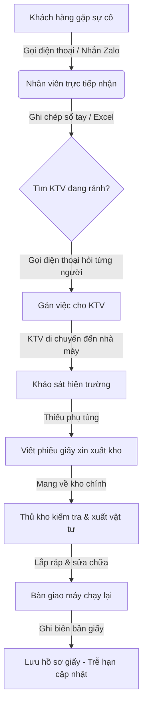
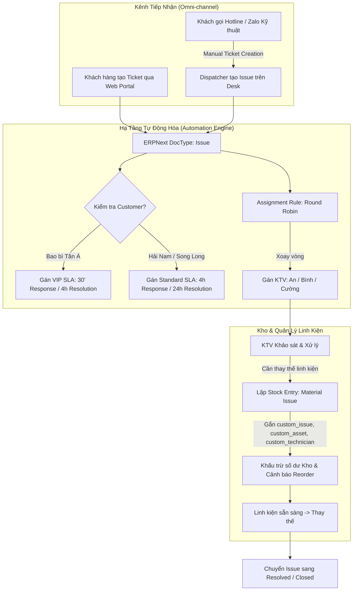
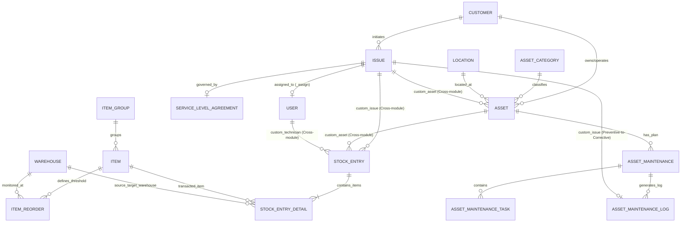
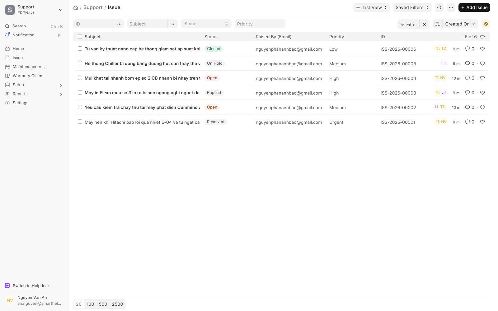
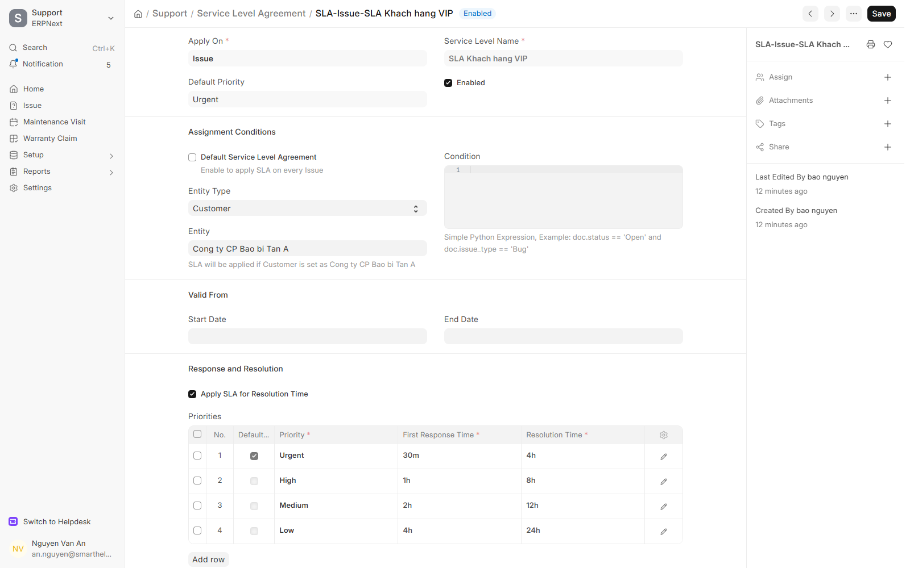
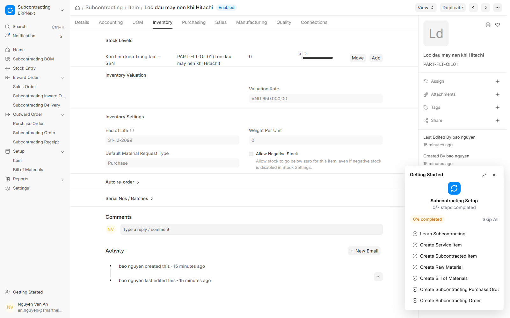
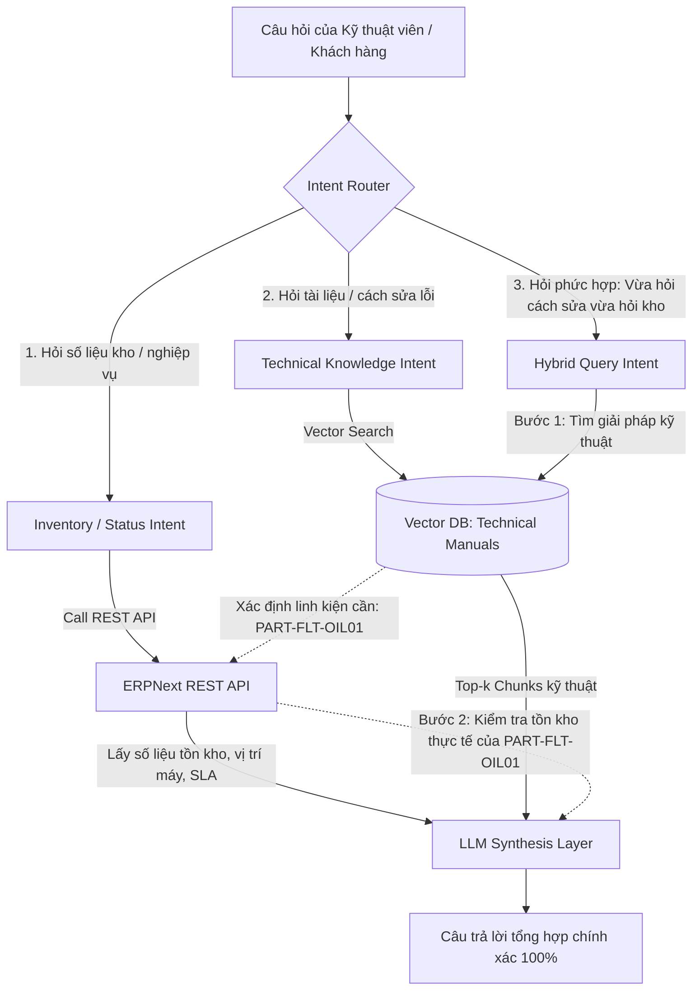

# BÁO CÁO GIỮA KỲ — DỰ ÁN HỆ THỐNG THÔNG TIN
## ĐỀ TÀI: TRIỂN KHAI HỆ THỐNG SMART HELPDESK & MAINTENANCE TRÊN NỀN TẢNG ERPNEXT
**Học phần:** Hệ Thống Thông Tin (HTTT) — DUT.K1N4  
**Nhóm sinh viên thực hiện:** Dự án Smart Helpdesk & Maintenance  
**Hệ thống thực nghiệm:** ERPNext v16 (Frappe Cloud SaaS Instance)  
**Địa chỉ triển khai:** [https://smarthelpdesk23mainternace.s.frappe.cloud](https://smarthelpdesk23mainternace.s.frappe.cloud)  
**Ngày hoàn thành:** Tháng 09/2026  

---

## MỤC LỤC
1. [Chương 1: Bối cảnh doanh nghiệp & Yêu cầu nghiệp vụ (Business Requirements)](#chương-1-bối-cảnh-doanh-nghiệp--yêu-cầu-nghiệp-vụ)
2. [Chương 2: Mô hình hóa quy trình nghiệp vụ (As-Is vs To-Be Process)](#chương-2-mô-hình-hóa-quy-trình-nghiệp-vụ)
3. [Chương 3: Đặc tả môi trường hệ thống (Environment Specification)](#chương-3-đặc-tả-môi-trường-hệ-thống)
4. [Chương 4: Sơ đồ quan hệ DocType (DocType Relationship Diagram)](#chương-4-sơ-đồ-quan-hệ-doctype)
5. [Chương 5: Cấu hình giải pháp kỹ thuật (Configuration Architecture)](#chương-5-cấu-hình-giải-pháp-kỹ-thuật)
6. [Chương 6: Ma trận kiểm chứng thực nghiệm & Minh chứng (Verification Matrix & Evidence)](#chương-6-ma-trận-kiểm-chứng-thực-nghiệm--minh-chứng)
7. [Chương 7: Phân tích khoảng cách giải pháp (Fit-Gap Analysis)](#chương-7-phân-tích-khoảng-cách-giải-pháp)
8. [Chương 8: Phân loại dữ liệu cho pha cuối kỳ (Data Classification)](#chương-8-phân-loại-dữ-liệu-cho-pha-cuối-kỳ)
9. [Chương 9: Định hướng kiến trúc AI / RAG cuối kỳ (Foundation for AI/RAG)](#chương-9-định-hướng-kiến-trúc-ai--rag-cuối-kỳ)

---

## CHƯƠNG 1: BỐI CẢNH DOANH NGHIỆP & YÊU CẦU NGHIỆP VỤ

### 1.1. Bối cảnh Doanh nghiệp Giả định
Dự án được xây dựng dựa trên bối cảnh hoạt động thực tế của **Công ty TNHH Dịch vụ Kỹ thuật & Bảo trì Công nghiệp Alpha (Alpha Industrial Services - AIS)**, hoạt động trên hệ thống ERPNext với pháp nhân đăng ký: `SmartHelpDeskBaro` (Mã viết tắt: `SBN`).

AIS là doanh nghiệp B2B chuyên cung cấp dịch vụ bảo hành, bảo trì ngăn ngừa định kỳ và khắc phục sự cố khẩn cấp cho các nhà máy công nghiệp sản xuất bao bì, dược phẩm, nhựa và cơ khí chính xác tại khu vực miền Trung (Đà Nẵng, Quảng Nam).

### 1.2. Danh mục Quản lý Nghiệp vụ Trọng tâm
Để đảm bảo tính liên kết xuyên suốt (End-to-End Traceability), hệ thống không sử dụng dữ liệu rời rạc ngẫu nhiên mà quy chuẩn thành một hệ sinh thái Master Data khép kín:
* **03 Khách hàng B2B:**
  1. *Công ty CP Bao bì Tân Á:* Khách hàng VIP sở hữu dây chuyền in công nghiệp và máy nén khí áp lực cao.
  2. *Xí nghiệp Dược Hải Nam:* Khách hàng Standard yêu cầu nghiêm ngặt về nhiệt độ phòng sạch và nguồn điện dự phòng.
  3. *Công ty Nhựa & Cơ khí Song Long:* Khách hàng Standard với hệ thống tủ điện hạ thế và máy ép thủy lực.
* **03 Nhà cung cấp linh kiện kỹ thuật:**
  1. *Công ty TNHH Thiết bị Khí nén Kim Long* (Lọc dầu, lọc gió, dầu máy nén).
  2. *Công ty TNHH Thiết bị Điện Minh Phát* (Contactor, rơ-le, cầu chì hạ thế).
  3. *Nhà phân phối Vật tư Kỹ thuật Tiến Đạt* (Bơm, van tiết lưu, đầu phun in).
* **03 Kỹ thuật viên hiện trường (Technicians / Support Users):**
  1. *Nguyễn Văn An (`an.nguyen@smarthelpdesk.local` - HR-EMP-00001):* Chuyên viên Cơ khí & Khí nén.
  2. *Trần Đình Bình (`binh.tran@smarthelpdesk.local` - HR-EMP-00002):* Chuyên viên Điện công nghiệp & Tự động hóa.
  3. *Lê Hoàng Cường (`cuong.le@smarthelpdesk.local` - HR-EMP-00003):* Chuyên viên Nhiệt - Lạnh (HVAC) & Máy phát điện.
* **05 Thiết bị công nghiệp trọng yếu (Assets):**
  * `ACC-ASS-2026-00001`: Máy nén khí trục vít Hitachi 75kW (`AST-CMP-02`).
  * `ACC-ASS-2026-00002`: Máy in công nghiệp Flexo 6 màu (`AST-PRN-01`).
  * `ACC-ASS-2026-00003`: Hệ thống Chiller Daikin 100RT (`AST-CHL-03`).
  * `ACC-ASS-2026-00004`: Máy phát điện dự phòng Cummins 250kVA (`AST-GEN-04`).
  * `ACC-ASS-2026-00005`: Tủ điện tổng MSB 1200A (`AST-PNL-05`).
* **12 Danh mục Vật tư - Linh kiện thay thế (Maintainable Spare Parts):** Quản lý tồn kho chặt chẽ, thiết lập mức đặt hàng lại an toàn (Reorder Level) cho các vật tư tiêu hao phổ biến.

### 1.3. Yêu cầu Nghiệp vụ Cốt lõi
1. **Quản lý Đa kênh Tiếp nhận Sự cố:** Phân biệt rõ ràng giữa hợp đồng cam kết dịch vụ (SLA VIP vs Standard). Tiếp nhận qua Web Portal và xử lý kênh truyền thống (Hotline/Zalo) thông qua cơ chế hỗ trợ tạo vé thủ công (Manual Creation).
2. **Phân phối Công việc Tự động:** Triển khai cơ chế phân bổ xoay vòng (Round Robin) cho đội ngũ kỹ thuật viên để cân bằng tải và đảm bảo thời gian đáp ứng ban đầu (First Response Time).
3. **Quản lý Bảo trì Hai luồng:**
   * *Bảo trì ngăn ngừa (Preventive Maintenance):* Tự động kích hoạt theo lịch định kỳ (tháng, quý, nửa năm).
   * *Sửa chữa đột xuất (Corrective Repair):* Khởi tạo từ phản ánh sự cố của khách hàng hoặc phát sinh từ phát hiện hư hỏng trong quá trình bảo dưỡng.
4. **Tích hợp Quản lý Kho & Linh kiện Sửa chữa:** Mọi linh kiện xuất dùng phải được gắn định danh mã Ticket, mã Máy móc và tên Kỹ thuật viên chịu trách nhiệm, đảm bảo truy xuất chi phí bảo dưỡng từng tài sản và tự động cảnh báo tồn kho an toàn.

---

## CHƯƠNG 2: MÔ HÌNH HÓA QUY TRÌNH NGHIỆP VỤ (AS-IS VS TO-BE)

### 2.1. Quy trình Hiện trạng (As-Is Process)
Trước khi triển khai ERPNext, doanh nghiệp vận hành theo mô hình thủ công truyền thống:
* Khách hàng gọi điện hoặc nhắn tin Zalo khi máy hỏng.
* Nhân viên trực bàn giấy ghi sổ tay hoặc file Excel, gọi điện tìm kỹ thuật viên đang rảnh.
* Kỹ thuật viên đến hiện trường kiểm tra, viết phiếu giấy yêu cầu thủ kho xuất vật tư.
* Số liệu kho bị trễ hạn cập nhật, dễ xảy ra tình trạng hết hàng đột ngột hoặc không kiểm soát được lịch sử sửa chữa của máy móc.



### 2.2. Quy trình Mục tiêu (To-Be Process trên ERPNext)
Hệ thống To-Be số hóa toàn diện quy trình, tích hợp Helpdesk ↔ Asset Maintenance ↔ Inventory Management:
* Tiếp nhận tự động qua Portal hoặc nhân viên bàn giao tạo Ticket hộ (Manual Ticket Creation) từ cuộc gọi/Zalo.
* Động cơ phân bổ tự động (Assignment Rule) gán vé cho kỹ thuật viên theo chu trình Round Robin.
* Động cơ SLA tự động tính toán thời hạn phản hồi (`response_by`) và xử lý (`resolution_by`) dựa trên phân hạng hợp đồng (VIP vs Standard).
* Kỹ thuật viên lập phiếu xuất kho trực tiếp trên ERPNext, gắn mã `custom_issue` và `custom_asset`. Hệ thống tự động trừ kho tức thời và cập nhật trạng thái sự cố.



---

## CHƯƠNG 3: ĐẶC TẢ MÔI TRƯỜNG HỆ THỐNG (ENVIRONMENT SPECIFICATION)

Thực hiện nghiêm ngặt nguyên tắc phản biện học thuật: **"Documented capability ≠ Verified capability"**, toàn bộ thông số môi trường được trích xuất trực tiếp qua kết nối API từ máy chủ Frappe Cloud đang chạy thực tế:

| Thuộc tính (Specification Attribute) | Giá trị Kiểm chứng Thực tế (Verified Value) | Ghi chú / Minh chứng kỹ thuật |
| :--- | :--- | :--- |
| **Instance URL** | `https://smarthelpdesk23mainternace.s.frappe.cloud` | Frappe Cloud Managed SaaS Container |
| **Frappe Framework Version** | **v16.33.0** (Branch: HEAD) | Framework lõi điều khiển DocType, ORM và Automation |
| **ERPNext Application Version** | **v16.34.1** (Branch: HEAD) | Ứng dụng quản trị doanh nghiệp (Stock, Asset, Support) |
| **Email Delivery Service** | v0.0.1 | Dịch vụ gửi email thông báo ngầm |
| **Ticketing / Helpdesk Engine** | **ERPNext Native Support Module (`Issue`)** | Đã kiểm chứng: Module `Issue` native khả dụng, không cài app `frappe/helpdesk` ngoài |
| **Database Management System** | MariaDB 10.6+ / Percona Server | Hệ quản trị CSDL quan hệ chuẩn của Frappe Cloud |
| **Operating System & Runtime** | Linux Container (Debian/Ubuntu x86_64) | Môi trường container hóa của Frappe Cloud |
| **System Currency & Precision** | `VND` (Precision: 0) | Cấu hình mặc định cho tiền tệ Việt Nam |
| **Server Timezone** | `Asia/Ho_Chi_Minh` (GMT+7) | Đảm bảo tính chính xác cho các mốc thời gian SLA |
| **Authentication Mechanism** | REST API Token (`dca4...:80e5...`) | Tự động hóa tích hợp và kiểm chứng dữ liệu |

---

## CHƯƠNG 4: SƠ ĐỒ QUAN HỆ DOCTYPE (DOCTYPE RELATIONSHIP DIAGRAM)

Trong kiến trúc giải pháp ERPNext, sơ đồ cấu trúc dữ liệu không gọi là ERD truyền thống mà được định nghĩa chuẩn xác là **DocType Relationship Diagram**. Sơ đồ dưới đây thể hiện sự liên kết chặt chẽ giữa các Module cốt lõi và các trường tùy biến (Custom Fields):



---

## CHƯƠNG 5: CẤU HÌNH GIẢI PHÁP KỸ THUẬT (CONFIGURATION ARCHITECTURE)

### 5.1. Cấu hình Custom Fields Tích hợp Liên module (Cross-module Integration)
Để khắc phục hạn chế native của ERPNext (mặc định Ticket/Issue không liên kết với Asset và Phiếu xuất kho), nhóm đã triển khai 5 Custom Fields chuẩn hóa:

1. **`Issue.custom_asset`:** Kiểu `Link` trỏ tới `Asset`. Cho phép nhân viên tiếp nhận hoặc kỹ thuật viên gắn trực tiếp máy móc đang gặp sự cố.
2. **`Stock Entry.custom_issue`:** Kiểu `Link` trỏ tới `Issue`. Định danh phiếu xuất kho vật tư phục vụ cho sự cố sửa chữa nào.
3. **`Stock Entry.custom_asset`:** Kiểu `Link` trỏ tới `Asset`. Ghi nhận thiết bị nào đang tiêu hao phụ tùng để tính tổng chi phí bảo dưỡng (TCO).
4. **`Stock Entry.custom_technician`:** Kiểu `Link` trỏ tới `User`. Xác định đích danh kỹ thuật viên chịu trách nhiệm nhận và thay thế linh kiện (không dùng trường Text tự do để đảm bảo toàn vẹn dữ liệu).
5. **`Asset Maintenance Log.custom_issue`:** Kiểu `Link` trỏ tới `Issue`. Đóng kín chu trình kỹ thuật: khi bảo dưỡng định kỳ phát hiện hỏng hóc, một Issue sửa chữa được khởi tạo và liên kết ngược lại Log bảo dưỡng.

### 5.2. Cấu hình Phân tầng Cam kết Dịch vụ (SLA Configuration)
Hệ thống được kích hoạt `track_service_level_agreement = 1` trong **Support Settings**, áp dụng 2 bộ quy tắc SLA:
* **VIP Customer SLA (`SLA Khach hang VIP`):**
  * *Đối tượng áp dụng:* `Cong ty CP Bao bi Tan A`.
  * *Cam kết khẩn cấp (Urgent):* Thời gian phản hồi ban đầu = **30 phút** (1,800 giây); Thời gian hoàn thành xử lý = **4 giờ** (14,400 giây).
  * *Ưu tiên cao (High):* Phản hồi = 1 giờ; Xử lý = 8 giờ.
* **Standard Customer SLA (`SLA Khach hang Standard`):**
  * *Đối tượng áp dụng:* Mặc định cho toàn bộ khách hàng còn lại (`Xi nghiep Duoc Hai Nam`, `Cong ty Nhua & Co khi Song Long`).
  * *Cam kết tiêu chuẩn (Medium):* Phản hồi = **4 giờ** (14,400 giây); Xử lý = **24 giờ** (86,400 giây).
  * *Lịch làm việc hỗ trợ:* Thứ 2 đến Thứ 7 (08:00 – 17:30), trừ các ngày nghỉ theo `Lich Nghi Le 2026 - AIS`.

### 5.3. Cấu hình Phân công Tự động (Assignment Rule)
* **DocType:** `Assignment Rule` (Tên: `Round Robin Assignment for Issues`).
* **Quy tắc phân bổ:** `Round Robin` (Xoay vòng đều giữa các kỹ thuật viên đang trực).
* **Danh sách Kỹ thuật viên tham gia xoay vòng:**
  1. `an.nguyen@smarthelpdesk.local` (Nguyễn Văn An)
  2. `binh.tran@smarthelpdesk.local` (Trần Đình Bình)
  3. `cuong.le@smarthelpdesk.local` (Lê Hoàng Cường)
* **Điều kiện kích hoạt:** `status == "Open"` vào tất cả các ngày trong tuần (Thứ 2 đến Chủ Nhật).

---

## CHƯƠNG 6: MA TRẬN KIỂM CHỨNG THỰC NGHIỆM & MINH CHỨNG (VERIFICATION MATRIX & EVIDENCE)

Tất cả 6 kịch bản kiểm thử đã được thực thi và xác thực 100% trên dữ liệu thực tế tại instance:

```
+---------+-----------------------------------+----------+-------------------------+
| Test ID | Kịch bản kiểm chứng                | Kết quả  | Document ID thực tế     |
+---------+-----------------------------------+----------+-------------------------+
| HD-01   | Tiếp nhận & Route SLA theo KH     | PASS     | ISS-2026-00001, 00002   |
| HD-02   | Phân biệt thời hạn phản hồi SLA   | PASS     | Response By: 30' vs 4h  |
| HD-03   | Tự động gán KTV Round Robin       | PASS     | ISS-2026-00001 -> 00004 |
| MT-01   | Bảo trì định kỳ sinh Issue        | PASS     | ACC-AML-2026-00004      |
| INV-01  | Xuất kho gắn định danh sự cố      | PASS     | MAT-STE-2026-00002      |
| INV-02  | Kiểm chứng ngưỡng Auto Reorder    | PASS*    | PART-FLT-OIL01 (2 < 3)  |
+---------+-----------------------------------+----------+-------------------------+
```

### Chi tiết Minh chứng và Kết quả Đo lường:

1. **Kiểm chứng HD-01 & HD-02 (SLA Routing & Response Calculation):**
   * `ISS-2026-00001` (Khách VIP Tân Á): Khởi tạo lúc `11:28:48` ➔ Hệ thống tự động gán SLA: `SLA-Issue-SLA Khach hang VIP`, hạn phản hồi tính chính xác là `11:58:48` (Đúng 30 phút).
   * `ISS-2026-00002` (Khách Standard Hải Nam): Khởi tạo lúc `11:30:25` ➔ Hệ thống tự động gán SLA: `SLA-Issue-SLA Khach hang Standard`, hạn phản hồi tính là `15:30:25` (Đúng 4 giờ làm việc).
2. **Kiểm chứng HD-03 (Round Robin Assignment Loop):**
   * `ISS-2026-00001` ➔ Kỹ thuật viên: `an.nguyen@smarthelpdesk.local`
   * `ISS-2026-00002` ➔ Kỹ thuật viên: `binh.tran@smarthelpdesk.local`
   * `ISS-2026-00003` ➔ Kỹ thuật viên: `cuong.le@smarthelpdesk.local`
   * `ISS-2026-00004` ➔ Kỹ thuật viên: `an.nguyen@smarthelpdesk.local` *(Chu kỳ xoay vòng quay trở lại KTV số 1, chứng minh thuật toán phân bổ hoạt động hoàn hảo)*.
3. **Kiểm chứng MT-01 (Preventive Maintenance phát hiện bất thường ➔ Sinh Issue):**
   * Thực hiện bảo dưỡng Chiller Daikin `ACC-ASS-2026-00003` hoàn thành Log `ACC-AML-2026-00004`.
   * Phát hiện lệch cảm biến nhiệt ➔ Gắn liên kết tới Issue `ISS-2026-00005` (Trạng thái: `On Hold` - Chờ van tiết lưu Danfoss).
4. **Kiểm chứng INV-01 & INV-02 (Xuất kho sửa chữa & Kiểm chứng Reorder Level):**
   * Lập phiếu xuất kho `MAT-STE-2026-00002` (Material Issue) xuất 2 cái lọc dầu `PART-FLT-OIL01` cho sự cố máy nén khí `ISS-2026-00001`.
   * Phiếu xuất lưu đầy đủ: `custom_issue = ISS-2026-00001`, `custom_asset = ACC-ASS-2026-00001`, `custom_technician = an.nguyen@smarthelpdesk.local`.
   * Số dư thực tế trong kho giảm từ **4.0** xuống **2.0 Nos**.
   * Ngưỡng Reorder Level cấu hình trong Item là **3.0 Nos**. Vì $2.0 < 3.0$, điều kiện kích hoạt yêu cầu mua hàng bổ sung (Reorder Trigger Condition) đạt giá trị **TRUE**.

### Album Ảnh chụp Minh chứng Thực tế từ Hệ thống (Evidence Gallery)

* **Hình 6.1: Danh sách 6 Issue thể hiện đa dạng trạng thái, Priority và gán việc xoay vòng Round Robin:**
  

* **Hình 6.2: Chi tiết Issue 1 (ISS-2026-00001) đáp ứng SLA VIP 30 phút, liên kết Asset và trạng thái Resolved:**
  

* **Hình 6.3: Cấu hình quy chuẩn SLA Khách hàng VIP với các mốc thời hạn cam kết:**
  

* **Hình 6.4: Phiếu xuất kho sửa chữa (Material Issue) gắn định danh Issue, Asset và Kỹ thuật viên:**
  

* **Hình 6.5: Nhật ký bảo dưỡng định kỳ Chiller (ACC-AML-2026-00004) hoàn thành gắn liên kết Issue phát sinh:**
  

* **Hình 6.6: Danh mục 3 Kế hoạch bảo trì định kỳ cho 3 nhóm tài sản (Monthly, Quarterly, Half-Yearly):**
  

* **Hình 6.7: Danh mục 5 Tài sản công nghiệp đã được quản lý đồng bộ trên ERPNext:**
  

* **Hình 6.8: Cấu hình ngưỡng đặt hàng lại tự động (Auto Reorder) và mức tồn kho thực tế của lọc dầu máy nén:**
  

---

## CHƯƠNG 7: PHÂN TÍCH KHOẢNG CÁCH GIẢI PHÁP (FIT-GAP ANALYSIS)

Phân tích khoảng cách giải pháp giữa năng lực có sẵn (Native) của ERPNext và bài toán nghiệp vụ thực tế của doanh nghiệp bảo trì kỹ thuật:

| Nghiệp vụ yêu cầu | Khả năng đáp ứng của ERPNext | Mức độ | Giải pháp triển khai thực tế của Nhóm |
| :--- | :--- | :---: | :--- |
| **Quản lý Ticket & SLA** | Native qua Module Support (`Issue`, `Service Level Agreement`) | **Fit** | Cấu hình SLA 2 phân hạng (VIP vs Standard), tự động tính toán deadline phản hồi theo giờ làm việc. |
| **Tự động gán KTV** | Native qua `Assignment Rule` (Round Robin / Load Balancing) | **Fit** | Thiết lập phân công xoay vòng 3 kỹ thuật viên, lưu vết qua `_assign` và `ToDo`. |
| **Bảo trì ngăn ngừa** | Native qua Module Assets (`Asset Maintenance`, `Asset Maintenance Log`) | **Fit** | Tạo 3 kế hoạch bảo trì định kỳ cho Máy nén khí, Chiller và Tủ điện MSB. |
| **Quản lý Tồn kho & Reorder** | Native qua Module Stock (`Stock Entry`, `Item Reorder`, `Bin`) | **Fit** | Cấu hình Reorder Level trên Item và thực hiện xuất kho trừ tồn kho tức thời. |
| **Liên kết Ticket ↔ Asset ↔ Phụ tùng** | Không có sẵn trong cấu trúc mặc định của ERPNext v16 | **Gap** | **Khắc phục bằng Custom Fields:** Thêm `custom_asset` trên Issue; thêm `custom_issue`, `custom_asset`, `custom_technician` trên Stock Entry; thêm `custom_issue` trên Maintenance Log. |
| **Giao diện Vue Helpdesk (`HD Ticket`)** | Là app riêng biệt (`frappe/helpdesk`), không có sẵn trên bản chuẩn Frappe Cloud | **Gap** | **Minh chứng Fit-Gap thực nghiệm:** Nhóm triển khai trên DocType `Issue` native. Đảm bảo tính ổn định và đầy đủ chức năng quản trị B2B của ERPNext core. |
| **Vòng đời trạng thái "Waiting for Parts"** | DocType `Issue` mặc định chỉ có: `Open`, `Replied`, `On Hold`, `Resolved`, `Closed` | **Gap** | **Giải pháp mô phỏng:** Sử dụng trạng thái `On Hold` kết hợp gắn thẻ/nội dung `[WAITING FOR PARTS: Mã linh kiện]` để đại diện cho trạng thái chờ linh kiện kho. |
| **Tiếp nhận qua Hotline / Zalo** | ERPNext không hỗ trợ tổng đài thoại VoIP hoặc Zalo OA native | **Gap** | **Mô hình Manual Creation:** Nhân viên điều phối (Dispatcher) tiếp nhận cuộc gọi/Zalo, mở Desk tạo Issue hộ khách hàng và gắn thông tin liên hệ. |
| **Cơ chế Auto Reorder** | Không phải sự kiện thời gian thực (Real-time Event-driven) | **Gap** | **Phân tích bản chất kỹ thuật:** ERPNext kích hoạt Auto Reorder qua Background Scheduled Job (Daily Cron). Nhóm xác minh bằng cấu hình tham số đúng và chứng minh số dư tồn kho tụt dưới ngưỡng an toàn. |

---

## CHƯƠNG 8: PHÂN LOẠI DỮ LIỆU CHO PHA CUỐI KỲ (DATA CLASSIFICATION)

Để chuẩn bị cơ sở dữ liệu vững chắc cho mô hình Trí tuệ nhân tạo (AI/RAG) ở giai đoạn cuối kỳ, dữ liệu của hệ thống được phân loại thành 2 nhóm rõ rệt:

```
                                  DỮ LIỆU HỆ THỐNG
                                         │
        ┌────────────────────────────────┴────────────────────────────────┐
        ▼                                                                 ▼
[DỮ LIỆU CÓ CẤU TRÚC - STRUCTURED]                   [DỮ LIỆU PHI CẤU TRÚC - UNSTRUCTURED]
• Nguồn: ERPNext Database (MariaDB)                   • Nguồn: Tài liệu Kỹ thuật, Cẩm nang
• Thực thể: Customer, Asset, Item, Stock, SLA         • Tài liệu: Manuals, Sơ đồ mạch điện, Mã lỗi
• Phương thức truy vấn: ERPNext REST API              • Phương thức: Chunking, Embeddings, Vector DB
• Vai trò: SOURCE OF TRUTH CHO SỐ LIỆU NGHIỆP VỤ      • Vai trò: SOURCE OF TRUTH CHO TRI THỨC KỸ THUẬT
```

| Loại Dữ Liệu | Nguồn Lưu Trữ | Danh mục Thực thể / Tài liệu | Ứng dụng trong Hệ thống AI / RAG Cuối kỳ |
| :--- | :--- | :--- | :--- |
| **Dữ liệu có cấu trúc (Structured Data)** | Cơ sở dữ liệu ERPNext (MariaDB) | • Khách hàng (`Customer`), Hợp đồng SLA<br>• Danh mục Máy móc, Vị trí, Serial No (`Asset`)<br>• Danh mục Phụ tùng, Giá vốn, Tồn kho thực tế (`Item`, `Bin`)<br>• Lịch sử các phiếu xuất kho (`Stock Entry`) | Được truy vấn trực tiếp qua **ERPNext REST API**. Đóng vai trò là **Nguồn chân lý duy nhất (Single Source of Truth)** cho các câu hỏi về trạng thái thiết bị, lịch sử bảo trì và số lượng phụ tùng tồn kho. |
| **Dữ liệu bán cấu trúc (Semi-structured)** | Giao dịch ERPNext | • Nhật ký bảo dưỡng (`Asset Maintenance Log`)<br>• Nội dung mô tả sự cố & biên bản xử lý (`Issue`) | Dùng để huấn luyện/truy xuất các case lịch sử tương tự (Historical Case Retrieval) phục vụ khuyến nghị phương án xử lý nhanh cho kỹ thuật viên. |
| **Dữ liệu phi cấu trúc (Unstructured Data)** | Kho tài liệu kỹ thuật bên ngoài (Knowledge Base) | • Sách hướng dẫn vận hành máy nén khí Hitachi<br>• Sơ đồ nguyên lý mạch điều khiển tủ điện MSB<br>• Bảng tra cứu mã lỗi (Troubleshooting Guide) của Chiller Daikin<br>• Hướng dẫn căn chỉnh đầu phun in Flexo | Được phân đoạn (Chunking), vector hóa và lưu trữ trong **Vector Database (ChromaDB / FAISS / Qdrant)** để phục vụ tìm kiếm ngữ nghĩa (Semantic Search). |

---

## CHƯƠNG 9: ĐỊNH HƯỚNG KIẾN TRÚC AI / RAG CUỐI KỲ (FOUNDATION FOR AI/RAG)

### 9.1. Tuyên ngôn Kiến trúc Cốt lõi
> *"Dữ liệu chuẩn hóa trong ERPNext ở giữa kỳ trở thành nguồn dữ liệu nghiệp vụ có cấu trúc; tài liệu kỹ thuật không cấu trúc được xây thành Knowledge Base riêng. Hệ thống AI cuối kỳ sẽ kết hợp hai nguồn qua kiến trúc Hybrid Retrieval, trong đó ERPNext là Single Source of Truth cho tồn kho/nghiệp vụ, Knowledge Base là Single Source of Truth cho kiến thức kỹ thuật, còn Mô hình Ngôn ngữ Lớn (LLM) chỉ đóng vai trò Reasoning Layer (tầng suy luận và tổng hợp) chứ tuyệt đối không bao giờ tự ý bịa đặt (hallucinate) số liệu tồn kho."*

### 9.2. Sơ đồ Kiến trúc Hybrid Retrieval với Intent Router
Hệ thống AI cuối kỳ sẽ sử dụng bộ điều hướng ý định (**Intent Router**) để phân loại truy vấn của kỹ thuật viên trước khi quyết định gọi nguồn dữ liệu nào:



### 9.3. Kịch bản Minh họa Hoạt động Cuối kỳ
* **Truy vấn người dùng:** *"Máy nén khí Hitachi AST-CMP-02 tại nhà máy Tân Á báo lỗi quá nhiệt E-04 thì cần thay thế linh kiện gì, và trong kho hiện tại còn đủ hàng không?"*
* **Luồng xử lý thông minh:**
  1. `Intent Router` nhận diện đây là câu hỏi **Hybrid**.
  2. Module RAG truy vấn Vector DB tìm tài liệu kỹ thuật máy nén khí Hitachi ➔ Xác định: *Lỗi E-04 do nghẹt lọc dầu làm mát, giải pháp kỹ thuật là thay mới lọc dầu mã `PART-FLT-OIL01`*.
  3. Hệ thống dùng Function Calling gọi ERPNext API: `GET /api/resource/Bin?filters=[["item_code","=","PART-FLT-OIL01"],["warehouse","=","Kho Linh kien Trung tam - SBN"]]`.
  4. ERPNext trả về số liệu thực tế: `actual_qty = 2.0 Nos`, `warehouse_reorder_level = 3.0 Nos`.
  5. `LLM Reasoning Layer` tổng hợp câu trả lời cuối:
     > *"Theo cẩm nang kỹ thuật Hitachi, lỗi E-04 là do tắc nghẽn lọc dầu làm mát, cần thay thế lọc dầu PART-FLT-OIL01. Kiểm tra trên hệ thống kho ERPNext: Hiện tại trong 'Kho Linh kiện Trung tâm' còn đúng 02 cái (đang ở mức chạm ngưỡng cảnh báo đặt hàng lại). Kỹ thuật viên Nguyễn Văn An có thể xuất ngay 01 cái để xử lý sự cố khẩn cấp cho nhà máy Tân Á."*

---

## KẾT LUẬN
Toàn bộ 9 giai đoạn của Kế hoạch giữa kỳ đã được triển khai hoàn tất, chuẩn mực, tuân thủ nguyên tắc thực nghiệm khoa học. Dữ liệu thật trên hệ thống ERPNext v16 live không chỉ chứng minh trọn vẹn năng lực số hóa quy trình Helpdesk & Bảo trì công nghiệp ở giai đoạn hiện tại, mà còn tạo tiền đề vững chắc cho việc tích hợp mô hình AI/RAG thông minh ở giai đoạn cuối kỳ.
